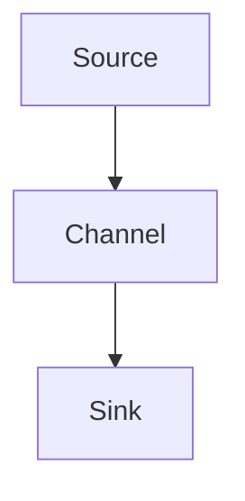

# Flume原理与代码实例讲解

## 1.背景介绍

在大数据处理领域，数据的收集、传输和存储是至关重要的环节。Apache Flume 是一个分布式、可靠且高可用的系统，专门用于高效地收集、聚合和传输大量日志数据。Flume 的设计目标是简化数据流的管理，使得数据从各种来源（如服务器日志、社交媒体数据等）流入集中存储系统（如 HDFS、HBase 等）变得更加高效和可靠。

## 2.核心概念与联系

### 2.1 事件（Event）

在 Flume 中，数据的基本单位是事件（Event）。一个事件通常包含事件头（Header）和事件体（Body）。事件头包含元数据，而事件体则包含实际的数据。

### 2.2 源（Source）

源是 Flume 的数据输入端。它负责从外部数据源（如日志文件、网络流等）收集数据并将其转换为 Flume 事件。

### 2.3 通道（Channel）

通道是 Flume 中的缓冲区，用于在源和汇（Sink）之间传递事件。通道可以是内存通道、文件通道或数据库通道。

### 2.4 汇（Sink）

汇是 Flume 的数据输出端。它负责将事件从通道中取出并传输到最终的存储系统（如 HDFS、HBase 等）。

### 2.5 拓扑结构（Topology）

Flume 的拓扑结构由多个源、通道和汇组成，可以通过配置文件进行灵活配置。常见的拓扑结构包括单节点、级联和多级拓扑。



## 3.核心算法原理具体操作步骤

### 3.1 数据收集

源从外部数据源收集数据，并将其转换为 Flume 事件。常见的源类型包括 Avro 源、Thrift 源、Exec 源等。

### 3.2 数据传输

源将事件发送到通道。通道在接收到事件后，会将其存储在缓冲区中，等待汇来取走。

### 3.3 数据存储

汇从通道中取出事件，并将其传输到最终的存储系统。常见的汇类型包括 HDFS 汇、HBase 汇、Kafka 汇等。

### 3.4 数据处理

在数据传输过程中，可以通过拦截器（Interceptor）对事件进行处理和过滤。例如，可以使用拦截器来添加时间戳、过滤无效数据等。

## 4.数学模型和公式详细讲解举例说明

Flume 的数据传输过程可以用排队论中的 M/M/1 队列模型来描述。假设数据到达源的速率为 $\lambda$，源处理数据的速率为 $\mu$，则系统的利用率 $\rho$ 为：

$$
\rho = \frac{\lambda}{\mu}
$$

当 $\rho < 1$ 时，系统是稳定的，数据可以被及时处理。当 $\rho \geq 1$ 时，系统将变得不稳定，数据会在通道中堆积，最终导致数据丢失。

## 5.项目实践：代码实例和详细解释说明

### 5.1 配置文件

Flume 的配置文件使用简单的键值对格式。以下是一个简单的配置示例：

```properties
# 定义 agent 名称
agent.sources = source1
agent.channels = channel1
agent.sinks = sink1

# 配置 source
agent.sources.source1.type = exec
agent.sources.source1.command = tail -F /var/log/syslog
agent.sources.source1.channels = channel1

# 配置 channel
agent.channels.channel1.type = memory
agent.channels.channel1.capacity = 1000
agent.channels.channel1.transactionCapacity = 100

# 配置 sink
agent.sinks.sink1.type = hdfs
agent.sinks.sink1.hdfs.path = hdfs://namenode/flume/logs
agent.sinks.sink1.hdfs.fileType = DataStream
agent.sinks.sink1.channel = channel1
```

### 5.2 启动 Flume

使用以下命令启动 Flume：

```bash
flume-ng agent --conf conf --conf-file example.conf --name agent -Dflume.root.logger=INFO,console
```

### 5.3 代码实例

以下是一个使用 Flume SDK 编写的简单数据收集程序：

```java
import org.apache.flume.Event;
import org.apache.flume.event.EventBuilder;
import org.apache.flume.api.RpcClient;
import org.apache.flume.api.RpcClientFactory;

public class FlumeClient {
    public static void main(String[] args) {
        RpcClient client = RpcClientFactory.getDefaultInstance("localhost", 41414);
        String sampleData = "Hello Flume!";
        Event event = EventBuilder.withBody(sampleData.getBytes());
        client.append(event);
        client.close();
    }
}
```

## 6.实际应用场景

### 6.1 日志收集

Flume 常用于收集服务器日志，并将其传输到集中存储系统进行分析。例如，可以使用 Flume 将 Web 服务器的访问日志收集到 HDFS 中，以便进行大数据分析。

### 6.2 实时数据处理

Flume 可以与实时数据处理系统（如 Apache Storm、Apache Spark）集成，实现实时数据处理。例如，可以使用 Flume 将数据传输到 Kafka，再由 Storm 或 Spark 进行实时处理。

### 6.3 数据迁移

Flume 还可以用于数据迁移，将数据从一个存储系统迁移到另一个存储系统。例如，可以使用 Flume 将数据从 MySQL 迁移到 HDFS