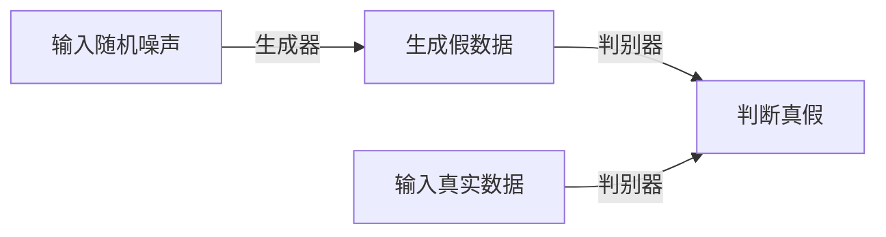

## 1.背景介绍

在过去的几年中，音频合成领域经历了一场革命。传统的音频合成方法，如语音合成和音乐生成，通常依赖于大量的手工特征工程和复杂的信号处理技术。然而，这些方法的效果往往受限于其无法模拟人类声音的复杂性和丰富性。近年来，深度学习技术的发展，尤其是生成对抗网络（GAN）的出现，为音频合成带来了新的可能性。GAN已经在图像生成、超分辨率等领域取得了显著的成果，现在我们将探讨它在音频合成中的应用。

## 2.核心概念与联系

### 2.1 生成对抗网络（GAN）

生成对抗网络（GAN）由两部分组成：生成器和判别器。生成器的目标是生成与真实数据尽可能相似的假数据，而判别器的目标是尽可能准确地区分出真实数据和假数据。两者之间的竞争推动了生成器生成越来越逼真的假数据。

### 2.2 音频合成

音频合成是一种技术，它可以生成具有特定属性（如音调、节奏和音色）的音频。音频合成的方法有很多，包括物理建模、采样合成、频谱建模等。在这篇文章中，我们将重点关注基于GAN的音频合成。

## 3.核心算法原理具体操作步骤

### 3.1 网络结构设计

在音频合成的应用中，我们通常需要设计一个能够处理一维音频信号的GAN。这种类型的GAN通常由一维卷积层构成，可以有效地捕捉音频信号的局部结构。

### 3.2 训练过程

GAN的训练过程是一个动态的过程，生成器和判别器在训练过程中不断地互相学习和适应。在每次训练迭代中，我们首先更新判别器的参数，使其更好地区分真实数据和假数据，然后更新生成器的参数，使其生成的假数据更接近真实数据。

## 4.数学模型和公式详细讲解举例说明

GAN的训练过程可以被视为一个二人零和博弈，其目标函数可以表示为：

$$
\min_G \max_D V(D, G) = \mathbb{E}_{x\sim p_{data}(x)}[\log D(x)] + \mathbb{E}_{z\sim p_z(z)}[\log(1 - D(G(z)))]
$$

其中，$D(x)$是判别器对真实数据$x$的输出，$G(z)$是生成器对噪声$z$的输出。第一项是判别器尽可能将真实数据判定为真，第二项是生成器尽可能让判别器误判其生成的假数据为真。

## 5.项目实践：代码实例和详细解释说明

对于一个简单的GAN音频合成项目，我们可以使用Python和PyTorch进行实现。首先，我们需要定义生成器和判别器的网络结构。然后，我们需要定义损失函数和优化器，以及训练过程中的一些参数。最后，我们在训练循环中交替训练生成器和判别器。

## 6.实际应用场景

GAN在音频合成中的应用场景非常广泛，包括：

- 音乐生成：GAN可以生成具有特定风格和情感的音乐。
- 语音合成：GAN可以生成特定人物的语音，用于语音助手或语音换人技术。
- 声音效果生成：GAN可以生成各种声音效果，如回声、混响等。

## 7.工具和资源推荐

- PyTorch：一个强大的深度学习框架，支持动态计算图和自动微分。
- Librosa：一个用于音频和音乐分析的Python库。
- TensorBoard：一个可视化训练过程的工具，可以显示损失函数、生成的音频等信息。

## 8.总结：未来发展趋势与挑战

随着深度学习技术的发展，我们可以期待GAN在音频合成领域的应用会越来越广泛。然而，同时也存在一些挑战，如如何生成更长的音频、如何控制生成音频的属性等。

## 9.附录：常见问题与解答

Q: GAN训练过程中经常出现的问题有哪些？

A: GAN的训练过程中经常会出现模式崩溃（mode collapse）、梯度消失和梯度爆炸等问题。

Q: 如何解决GAN训练过程中的模式崩溃问题？

A: 可以尝试使用一些改进的GAN结构，如WGAN、LSGAN等，或者使用一些正则化技术，如谱归一化、梯度惩罚等。

作者：禅与计算机程序设计艺术 / Zen and the Art of Computer Programming