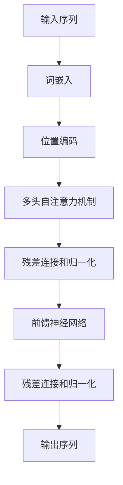

# GPT-4：点亮人工通用智能的火花

## 1.背景介绍

### 1.1 人工智能的发展历程

人工智能（AI）自20世纪50年代诞生以来，经历了多次起伏。从最初的符号主义AI到后来的连接主义AI，再到如今的深度学习，AI技术不断演进。近年来，随着计算能力的提升和大数据的普及，深度学习成为AI研究的主流方向。特别是自2012年AlexNet在ImageNet竞赛中取得突破性成果以来，深度学习在图像识别、语音识别、自然语言处理等领域取得了显著进展。

### 1.2 GPT系列模型的演变

GPT（Generative Pre-trained Transformer）系列模型是由OpenAI开发的一系列自然语言处理模型。自2018年发布的GPT-1以来，GPT系列模型在生成文本、回答问题、翻译语言等任务上表现出色。GPT-2和GPT-3进一步提升了模型的规模和性能，尤其是GPT-3，其1750亿参数的规模使其在多种任务上表现出色，接近人类水平。

### 1.3 GPT-4的诞生

GPT-4作为GPT系列的最新成员，进一步提升了模型的规模和性能。它不仅在参数规模上远超前代，还在模型架构、训练方法和应用场景上进行了多方面的创新。GPT-4的诞生标志着人工通用智能（AGI）迈出了重要一步。

## 2.核心概念与联系

### 2.1 人工通用智能（AGI）

人工通用智能（AGI）是指能够理解、学习和应用广泛知识和技能的智能系统。与专用人工智能（ANI）不同，AGI具有跨领域的学习和推理能力，能够像人类一样解决多种复杂问题。

### 2.2 生成式预训练模型

生成式预训练模型（GPT）是一种基于Transformer架构的自然语言处理模型。其核心思想是通过大规模预训练获取语言模型，然后在特定任务上进行微调。GPT模型通过自回归方式生成文本，即根据前面的词预测下一个词。

### 2.3 Transformer架构

Transformer是一种基于注意力机制的神经网络架构，最早由Vaswani等人在2017年提出。与传统的循环神经网络（RNN）不同，Transformer能够并行处理序列数据，大大提高了训练效率。其核心组件是多头自注意力机制和前馈神经网络。

### 2.4 GPT-4的创新点

GPT-4在前代模型的基础上进行了多方面的创新，包括更大的参数规模、更高效的训练方法、更强的跨领域学习能力等。这些创新使得GPT-4在多个任务上表现出色，进一步接近AGI的目标。

## 3.核心算法原理具体操作步骤

### 3.1 数据预处理

数据预处理是训练GPT-4的第一步。包括数据清洗、去重、分词等步骤。数据预处理的质量直接影响模型的性能。

### 3.2 模型架构设计

GPT-4采用了改进的Transformer架构。其核心组件包括多头自注意力机制、前馈神经网络和残差连接。以下是GPT-4的模型架构图：



### 3.3 预训练

预训练是GPT-4的关键步骤。通过在大规模文本数据上进行自监督学习，模型能够学习到丰富的语言知识。预训练的目标是最小化语言模型的损失函数，即预测下一个词的概率。

### 3.4 微调

在特定任务上进行微调是提升模型性能的重要步骤。通过在特定任务的数据上进行监督学习，模型能够适应特定任务的需求。微调的目标是最小化任务的损失函数。

### 3.5 模型评估

模型评估是验证模型性能的重要步骤。常用的评估指标包括准确率、精确率、召回率、F1值等。通过在验证集和测试集上进行评估，可以了解模型的泛化能力。

## 4.数学模型和公式详细讲解举例说明

### 4.1 语言模型的数学定义

语言模型的目标是估计一个给定序列的概率分布。对于一个序列 $X = (x_1, x_2, ..., x_T)$，语言模型的目标是最大化序列的联合概率：

$$
P(X) = P(x_1, x_2, ..., x_T) = \prod_{t=1}^{T} P(x_t | x_1, x_2, ..., x_{t-1})
$$

### 4.2 自注意力机制

自注意力机制是Transformer的核心组件。其目标是根据输入序列中的所有词计算每个词的表示。自注意力机制的计算公式如下：

$$
\text{Attention}(Q, K, V) = \text{softmax}\left(\frac{QK^T}{\sqrt{d_k}}\right)V
$$

其中，$Q$、$K$、$V$分别表示查询矩阵、键矩阵和值矩阵，$d_k$表示键的维度。

### 4.3 多头自注意力机制

多头自注意力机制通过并行计算多个自注意力机制来捕捉不同的语义信息。其计算公式如下：

$$
\text{MultiHead}(Q, K, V) = \text{Concat}(\text{head}_1, \text{head}_2, ..., \text{head}_h)W^O
$$

其中，$\text{head}_i = \text{Attention}(QW_i^Q, KW_i^K, VW_i^V)$，$W_i^Q$、$W_i^K$、$W_i^V$和$W^O$是可训练的权重矩阵。

### 4.4 前馈神经网络

前馈神经网络是Transformer的另一个重要组件。其计算公式如下：

$$
\text{FFN}(x) = \text{ReLU}(xW_1 + b_1)W_2 + b_2
$$

其中，$W_1$、$W_2$、$b_1$和$b_2$是可训练的权重和偏置。

## 5.项目实践：代码实例和详细解释说明

### 5.1 数据预处理代码示例

以下是一个简单的数据预处理代码示例，使用Python和NLTK库进行分词和去停用词：

```python
import nltk
from nltk.corpus import stopwords
from nltk.tokenize import word_tokenize

# 下载停用词表
nltk.download('stopwords')
nltk.download('punkt')

# 示例文本
text = "GPT-4 is a powerful language model developed by OpenAI."

# 分词
tokens = word_tokenize(text)

# 去停用词
filtered_tokens = [word for word in tokens if word.lower() not in stopwords.words('