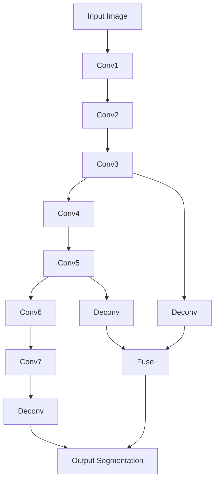
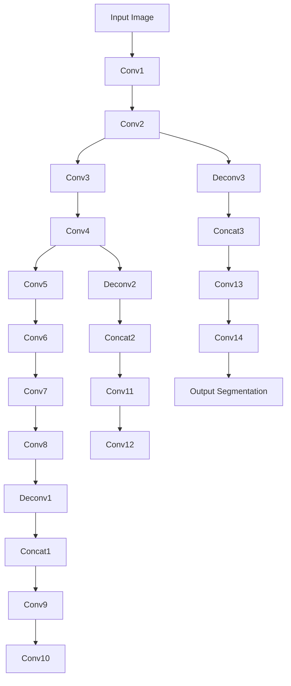
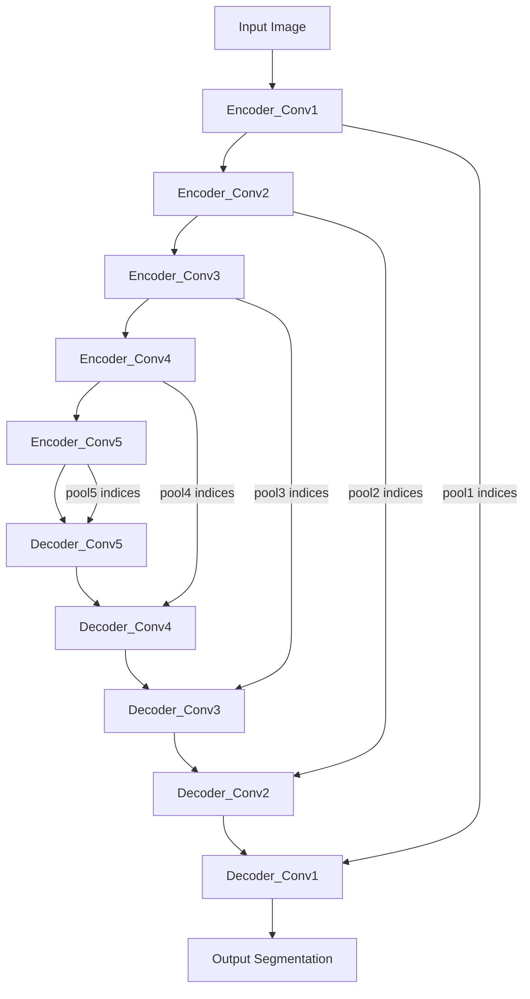

# Image Segmentation 原理与代码实战案例讲解

## 1. 背景介绍

图像分割(Image Segmentation)是计算机视觉和图像处理领域的一个基础性问题,在医学影像分析、无人驾驶、遥感图像分析等诸多领域有着广泛的应用。图像分割的目标是将图像划分成若干个感兴趣的区域,每个区域内部具有一致的特性,如纹理、颜色、亮度等,而不同区域之间在某些特性上存在显著差异。通过图像分割,可以实现对图像中目标物体的定位、提取与分析。

近年来,随着深度学习技术的飞速发展,特别是卷积神经网络(CNN)在计算机视觉任务上取得的巨大成功,基于深度学习的语义分割方法逐渐成为图像分割任务的主流。相比传统的基于阈值、边缘、区域、图论等方法,深度学习语义分割具有更强的特征表达能力和更高的分割精度。

本文将全面介绍图像分割的相关背景知识,重点阐述几种经典的基于深度学习的语义分割算法的原理,并通过代码实战案例讲解如何使用PyTorch实现这些算法。

### 1.1 图像分割的应用场景

图像分割技术在许多领域有着重要的应用,主要包括:

- 医学影像分析:将医学图像(如CT、MRI)中的器官、病变区域分割出来,辅助疾病诊断与治疗。
- 无人驾驶:对道路场景图像进行分割,识别出道路、车辆、行人等关键目标。  
- 遥感图像分析:对卫星或航拍遥感影像进行分割,提取出建筑、道路、植被等地物信息。
- 工业视觉检测:分割出工业产品图像中的缺陷区域,实现缺陷检测。
- 虚拟/增强现实:从真实场景的图像视频中分割出前景物体,与虚拟信息叠加,构建沉浸式体验。

### 1.2 图像分割的难点和挑战

尽管图像分割取得了长足的进展,但仍然面临着诸多难点和挑战:

- 分割对象的多样性:现实世界的目标千差万别,存在尺度、形状、纹理等方面的巨大差异。
- 图像的复杂性:图像受到光照、视角、遮挡、背景干扰等因素影响,存在较大变化。 
- 标注数据的缺乏:深度学习方法通常需要大量的标注数据进行训练,但图像分割任务的标注成本很高。
- 实时性的要求:在无人驾驶等实时系统中,要求分割算法能够快速高效地处理每一帧图像。
- 评价指标的局限性:传统的评价指标如像素准确率、平均交并比等无法很好地衡量分割结果的质量。

## 2. 核心概念与联系

在介绍图像分割算法之前,我们先来了解一些核心概念:

### 2.1 语义分割与实例分割

按照分割粒度的不同,图像分割主要分为两类:语义分割和实例分割。

语义分割(Semantic Segmentation)的目标是对图像中的每个像素赋予一个类别标签,标识该像素所属的类别(如人、车、树等)。但它并不区分同一类别的不同个体实例。

实例分割(Instance Segmentation)在语义分割的基础上更进一步,不仅要标识每个像素的类别,还要区分出同一类别下不同的个体实例(如图像中的多个人、多辆车)。

语义分割可以看作是一个像素级别的多分类问题,而实例分割则需要同时完成检测和分割两个任务。一般来说,实例分割的难度和复杂度要高于语义分割。

### 2.2 全卷积网络

全卷积网络(Fully Convolutional Network, FCN)是一种广泛应用于图像分割的网络结构。FCN将传统CNN中的全连接层替换为卷积层,使得网络可以接受任意大小的输入图像,并输出与输入尺寸相同的分割结果。

FCN的核心思想包括:

- 卷积化:将全连接层转化为卷积层,提高网络的空间位置信息的表达能力。
- 反卷积/上采样:通过反卷积或上采样操作,将高层特征图的尺寸还原到与输入图像相同。
- 跳跃连接:将编码器部分的浅层特征与解码器部分的深层特征进行融合,兼顾分割的精度和细节。

许多经典的分割网络如U-Net、SegNet、DeepLab系列等都是基于FCN结构演变而来。

### 2.3 编码器-解码器结构

编码器-解码器(Encoder-Decoder)结构是一种广泛采用的用于图像分割的网络框架。编码器负责提取图像的多尺度特征,将图像信息压缩到一个低维的特征空间;解码器则逐步恢复特征图的空间分辨率,生成与输入分辨率相同的分割预测图。

U-Net就是一个典型的编码器-解码器结构网络。编码器部分由多个卷积+下采样块组成,解码器部分由多个上采样+卷积块组成。此外,编码器和解码器之间通过跳跃连接传递浅层的位置信息,以提高分割的精度。

### 2.4 空洞卷积

空洞卷积(Dilated/Atrous Convolution)通过在标准卷积中注入空洞(holes),扩大卷积核的感受野,同时不增加参数量和计算量。在图像分割任务中,空洞卷积可以有效捕获多尺度的上下文信息,对提高分割精度很有帮助。

DeepLab系列网络中广泛使用了空洞卷积,通过串联多个不同空洞率的空洞卷积,构建ASPP(Atrous Spatial Pyramid Pooling)模块,进一步增强多尺度特征的提取能力。

### 2.5 条件随机场

条件随机场(Conditional Random Field, CRF)是一种概率图模型,可以建模像素之间的空间相关性,平滑并优化分割结果。通常采用基于能量函数的推断方法求解CRF,如平均场近似(Mean Field Approximation)。

将CRF引入深度学习分割网络有两种主要方式:

- 后处理CRF:将分割网络的输出作为CRF的初始化,通过迭代推断优化分割结果。
- CRF作为可学习层:将CRF推断步骤嵌入到分割网络中,与其他层一起端到端训练。

DeepLab系列网络集成了CRF作为后处理步骤,取得了很好的分割效果。

## 3. 核心算法原理具体操作步骤

下面我们重点介绍几种经典的基于深度学习的图像分割算法:FCN、U-Net、SegNet和DeepLab系列。

### 3.1 FCN

FCN是第一个端到端的语义分割网络,开创了深度学习用于图像分割的先河。FCN的主要贡献在于将传统CNN中的全连接层转化为卷积层,使得网络可以接受任意大小的输入,并生成与输入尺寸相同的分割结果。

FCN的网络结构如下图所示:



FCN的主要操作步骤如下:

1. 使用预训练的分类网络(如VGG)作为编码器,提取图像特征。
2. 将全连接层转化为卷积层,得到一个特征图。
3. 通过反卷积层对特征图进行上采样,恢复空间分辨率。
4. 将不同层的特征图进行融合,得到最终的分割结果。
5. 计算分割结果与真值标签的损失,反向传播优化网络参数。

FCN的一个问题是上采样过程中存在信息损失,导致分割结果不够精细。后续的许多工作都是针对这一问题进行改进。

### 3.2 U-Net

U-Net是一种U型编码器-解码器结构的语义分割网络,广泛应用于医学图像分割领域。U-Net的创新点在于引入了跨层连接,将编码器部分的浅层特征与解码器部分的深层特征进行拼接,兼顾分割的精度和细节。

U-Net的网络结构如下图所示:



U-Net的主要操作步骤如下:

1. 编码器部分采用卷积+下采样的结构,提取图像的多尺度特征。
2. 解码器部分采用上采样+卷积的结构,恢复特征图的空间分辨率。
3. 在编码器和解码器之间引入跳跃连接,将编码器的浅层特征与解码器的深层特征进行拼接。
4. 最后通过卷积层得到与输入分辨率相同的分割预测图。
5. 计算分割预测图与真值标签的损失,反向传播优化网络参数。

U-Net能够有效地恢复分割图的细节信息,在医学图像等任务上取得了很好的效果。但其网络结构比较复杂,计算量和内存消耗较大。

### 3.3 SegNet

SegNet是一种对称的编码器-解码器结构的语义分割网络。其编码器部分使用VGG16的前13个卷积层,解码器部分采用反卷积层逐步恢复空间分辨率。SegNet的创新点在于解码器使用了池化层的索引信息,避免了反卷积参数过多的问题。

SegNet的网络结构如下图所示:



SegNet的主要操作步骤如下:

1. 编码器部分使用VGG16的前13个卷积层提取特征,并记录每个池化层的索引。
2. 解码器部分采用反卷积层恢复特征图的空间分辨率,并使用对应池化层的索引进行非线性上采样。
3. 最后通过Softmax层得到每个像素的类别概率。
4. 计算分割结果与真值标签的交叉熵损失,反向传播优化网络参数。

SegNet的优点是解码器部分不需要学习上采样参数,减少了网络的参数量和计算量。但其分割精度相比其他方法略有不足。

### 3.4 DeepLab系列

DeepLab是一系列用于语义分割的先进网络,包括DeepLabv1到DeepLabv3+。DeepLab网络的主要特点是采用了空洞卷积、ASPP模块和CRF后处理,极大地提高了分割精度。

以DeepLabv3+为例,其网络结构如下图所示:

```mermaid
graph TD
    A[Input Image] --> B[ResNet]
    B --> C[ASPP]
    C --> D[Decoder]
    B --> E[Low-level Features]
    E --> D
    