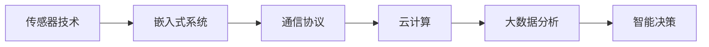

# Internet of Things 原理与代码实战案例讲解

## 1. 背景介绍
物联网（Internet of Things，IoT）是指通过各种信息传感设备与网络相结合，实现人、机、物的全面互联。随着传感器、无线通信技术的发展，物联网已经渗透到智能家居、工业自动化、智慧城市等多个领域，极大地推动了信息化社会的发展。

## 2. 核心概念与联系
物联网的核心在于“智能感知”与“网络互联”。智能感知依赖于传感器和执行器，而网络互联则依赖于通信协议和网络架构。物联网的实现需要以下几个关键技术的支持：

- 传感器技术：用于收集环境或对象的信息。
- 嵌入式系统：处理传感器数据并执行控制命令。
- 通信协议：确保数据的有效传输。
- 云计算：提供数据存储、处理和分析的平台。
- 大数据分析：从海量数据中提取有价值的信息。



## 3. 核心算法原理具体操作步骤
物联网系统中的核心算法包括数据采集算法、数据传输优化算法、数据处理算法等。具体操作步骤如下：

1. 数据采集：通过传感器收集数据，并通过嵌入式系统进行初步处理。
2. 数据传输：利用通信协议将数据发送到云平台或本地服务器。
3. 数据处理：在云平台上应用大数据分析技术，提取有用信息。
4. 决策执行：根据分析结果，通过执行器进行相应的操作。

## 4. 数学模型和公式详细讲解举例说明
以温度监控系统为例，我们可以建立一个简单的数学模型来描述温度与时间的关系：

$$ T(t) = T_0 + \alpha t + \beta \sin(\omega t + \phi) $$

其中，$T(t)$ 是时间 $t$ 时刻的温度，$T_0$ 是初始温度，$\alpha$ 是温度变化率，$\beta$ 和 $\omega$ 是温度周期性波动的幅度和频率，$\phi$ 是相位差。

## 5. 项目实践：代码实例和详细解释说明
以下是一个简单的温度数据采集和上传到云平台的Python代码示例：

```python
import time
import requests

# 假设这是一个连接到温度传感器的函数
def read_temperature_sensor():
    # 这里返回一个模拟的温度值
    return 25.0 + random.uniform(-5, 5)

def upload_to_cloud(temperature):
    # 这里是云平台的API地址
    cloud_api_url = 'https://api.example.com/upload'
    # 发送POST请求到云平台
    response = requests.post(cloud_api_url, data={'temperature': temperature})
    return response.status_code

while True:
    # 读取温度值
    temperature = read_temperature_sensor()
    # 上传到云平台
    status_code = upload_to_cloud(temperature)
    if status_code == 200:
        print('Temperature uploaded successfully.')
    else:
        print('Failed to upload temperature.')
    # 每隔一分钟读取一次温度
    time.sleep(60)
```

## 6. 实际应用场景
物联网的应用场景广泛，包括但不限于：

- 智能家居：通过物联网技术实现家居设备的远程控制和自动化管理。
- 精准农业：利用传感器监测土壤湿度、温度等，实现农作物的精准灌溉。
- 工业监控：在工厂中部署传感器和执行器，实现设备的实时监控和维护。

## 7. 工具和资源推荐
- 开发平台：Arduino, Raspberry Pi
- 通信协议：MQTT, CoAP
- 云平台：AWS IoT, Microsoft Azure IoT, Google Cloud IoT
- 数据分析：Apache Hadoop, Apache Spark

## 8. 总结：未来发展趋势与挑战
物联网的未来发展趋势将更加注重安全性、隐私保护、数据分析能力和跨平台的互操作性。同时，随着设备数量的增加，如何有效管理和维护这些设备，以及如何处理和分析海量数据，将是物联网面临的主要挑战。

## 9. 附录：常见问题与解答
Q1: 物联网设备如何保证安全性？
A1: 通过加密通信、设备身份认证、定期更新固件等措施来提高安全性。

Q2: 物联网和云计算有什么关系？
A2: 物联网产生的数据通常需要云计算平台来存储和处理，二者相辅相成。

Q3: 如何选择合适的通信协议？
A3: 根据应用场景的具体需求，考虑传输距离、数据量、功耗等因素来选择。

作者：禅与计算机程序设计艺术 / Zen and the Art of Computer Programming