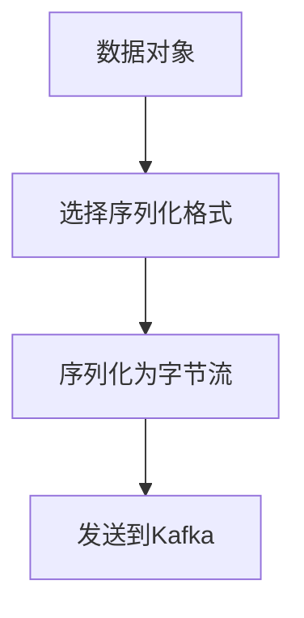
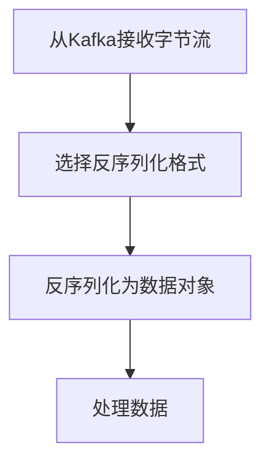

# Kafka序列化与反序列化：数据格式的转换

## 1.背景介绍

在现代分布式系统中，数据的高效传输和处理是至关重要的。Apache Kafka作为一个高吞吐量、低延迟的分布式消息系统，已经成为许多企业数据流处理的核心组件。Kafka的高效性不仅依赖于其强大的分布式架构，还依赖于其数据序列化与反序列化机制。本文将深入探讨Kafka的序列化与反序列化，帮助读者理解其核心概念、算法原理、实际应用以及未来发展趋势。

## 2.核心概念与联系

### 2.1 序列化与反序列化的定义

**序列化**是将对象转换为字节流的过程，以便在网络上传输或在磁盘上存储。**反序列化**则是将字节流重新转换为对象的过程。

### 2.2 Kafka中的序列化与反序列化

在Kafka中，生产者将数据发送到Kafka集群时，需要将数据序列化为字节流；消费者从Kafka集群读取数据时，需要将字节流反序列化为对象。因此，序列化与反序列化是Kafka数据传输的关键环节。

### 2.3 序列化与反序列化的联系

序列化与反序列化是相互依存的过程。生产者和消费者必须使用相同的序列化格式，以确保数据能够正确地传输和解析。

## 3.核心算法原理具体操作步骤

### 3.1 序列化算法原理

序列化算法的核心是将复杂的数据结构转换为字节流。常见的序列化格式包括JSON、Avro、Protobuf等。以下是一个简单的序列化流程图：



### 3.2 反序列化算法原理

反序列化算法的核心是将字节流转换为复杂的数据结构。以下是一个简单的反序列化流程图：



### 3.3 操作步骤

1. **选择序列化格式**：根据数据类型和应用场景选择合适的序列化格式。
2. **实现序列化器和反序列化器**：在Kafka生产者和消费者中实现对应的序列化器和反序列化器。
3. **配置Kafka生产者和消费者**：在Kafka配置文件中指定序列化器和反序列化器。
4. **测试与优化**：通过测试验证序列化与反序列化的正确性和性能，并进行优化。

## 4.数学模型和公式详细讲解举例说明

### 4.1 序列化的数学模型

序列化可以看作是一个函数 $S$，将数据对象 $O$ 转换为字节流 $B$：

$$
S: O \rightarrow B
$$

### 4.2 反序列化的数学模型

反序列化可以看作是一个函数 $D$，将字节流 $B$ 转换为数据对象 $O$：

$$
D: B \rightarrow O
$$

### 4.3 举例说明

假设我们有一个简单的用户对象：

```json
{
  "name": "Alice",
  "age": 30
}
```

使用JSON序列化，该对象将被转换为以下字节流：

```json
{
  "name": "Alice",
  "age": 30
}
```

反序列化时，该字节流将被重新转换为用户对象。

## 5.项目实践：代码实例和详细解释说明

### 5.1 序列化器和反序列化器的实现

以下是一个使用JSON格式的序列化器和反序列化器的示例代码：

```java
import com.fasterxml.jackson.databind.ObjectMapper;
import org.apache.kafka.common.serialization.Deserializer;
import org.apache.kafka.common.serialization.Serializer;

public class JsonSerializer<T> implements Serializer<T> {
    private final ObjectMapper objectMapper = new ObjectMapper();

    @Override
    public byte[] serialize(String topic, T data) {
        try {
            return objectMapper.writeValueAsBytes(data);
        } catch (Exception e) {
            throw new RuntimeException("Error serializing JSON message", e);
        }
    }
}

public class JsonDeserializer<T> implements Deserializer<T> {
    private final ObjectMapper objectMapper = new ObjectMapper();
    private final Class<T> targetType;

    public JsonDeserializer(Class<T> targetType) {
        this.targetType = targetType;
    }

    @Override
    public T deserialize(String topic, byte[] data) {
        try {
            return objectMapper.readValue(data, targetType);
        } catch (Exception e) {
            throw new RuntimeException("Error deserializing JSON message", e);
        }
    }
}
```

### 5.2 Kafka生产者和消费者的配置

在Kafka生产者和消费者的配置文件中，指定自定义的序列化器和反序列化器：

```properties
# Producer configuration
key.serializer=org.apache.kafka.common.serialization.StringSerializer
value.serializer=com.example.JsonSerializer

# Consumer configuration
key.deserializer=org.apache.kafka.common.serialization.StringDeserializer
value.deserializer=com.example.JsonDeserializer
```

### 5.3 代码实例

以下是一个简单的Kafka生产者和消费者的代码示例：

```java
import org.apache.kafka.clients.producer.KafkaProducer;
import org.apache.kafka.clients.producer.ProducerRecord;
import org.apache.kafka.clients.consumer.KafkaConsumer;
import org.apache.kafka.clients.consumer.ConsumerRecords;
import org.apache.kafka.clients.consumer.ConsumerRecord;

import java.util.Properties;
import java.util.Collections;

public class KafkaExample {
    public static void main(String[] args) {
        // Producer
        Properties producerProps = new Properties();
        producerProps.put("bootstrap.servers", "localhost:9092");
        producerProps.put("key.serializer", "org.apache.kafka.common.serialization.StringSerializer");
        producerProps.put("value.serializer", "com.example.JsonSerializer");

        KafkaProducer<String, User> producer = new KafkaProducer<>(producerProps);
        User user = new User("Alice", 30);
        producer.send(new ProducerRecord<>("test-topic", "key1", user));
        producer.close();

        // Consumer
        Properties consumerProps = new Properties();
        consumerProps.put("bootstrap.servers", "localhost:9092");
        consumerProps.put("group.id", "test-group");
        consumerProps.put("key.deserializer", "org.apache.kafka.common.serialization.StringDeserializer");
        consumerProps.put("value.deserializer", "com.example.JsonDeserializer");

        KafkaConsumer<String, User> consumer = new KafkaConsumer<>(consumerProps);
        consumer.subscribe(Collections.singletonList("test-topic"));

        ConsumerRecords<String, User> records = consumer.poll(1000);
        for (ConsumerRecord<String, User> record : records) {
            System.out.printf("Consumed record with key %s and value %s%n", record.key(), record.value());
        }
        consumer.close();
    }
}
```

## 6.实际应用场景

### 6.1 实时数据处理

Kafka常用于实时数据处理场景，如日志收集、监控数据分析等。序列化与反序列化在这些场景中起到了关键作用，确保数据能够高效地传输和处理。

### 6.2 微服务通信

在微服务架构中，各个服务之间需要进行数据通信。Kafka作为消息中间件，利用序列化与反序列化机制，实现了不同服务之间的数据传输和解析。

### 6.3 数据流处理

Kafka与流处理框架（如Apache Flink、Apache Spark）结合使用，能够实现复杂的数据流处理任务。序列化与反序列化确保了数据在不同系统之间的无缝传输。

## 7.工具和资源推荐

### 7.1 序列化工具

- **Jackson**：一个高性能的JSON处理库，支持序列化和反序列化。
- **Avro**：一个数据序列化系统，支持丰富的数据结构和模式演化。
- **Protobuf**：Google开发的高效二进制序列化格式，适用于高性能场景。

### 7.2 Kafka相关资源

- **Kafka官方文档**：提供了Kafka的详细使用指南和API文档。
- **Kafka社区**：活跃的社区提供了丰富的资源和支持。
- **Kafka相关书籍**：如《Kafka: The Definitive Guide》，深入讲解了Kafka的原理和应用。

## 8.总结：未来发展趋势与挑战

### 8.1 未来发展趋势

随着数据量的不断增长和分布式系统的普及，Kafka的序列化