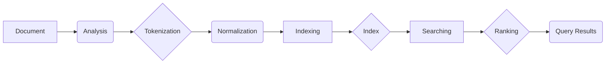

# Lucene原理与代码实例讲解

## 1. 背景介绍
### 1.1 全文检索概述
#### 1.1.1 全文检索的定义
#### 1.1.2 全文检索的应用场景
#### 1.1.3 全文检索的技术挑战
### 1.2 Lucene简介 
#### 1.2.1 Lucene的起源与发展
#### 1.2.2 Lucene的主要特性
#### 1.2.3 Lucene在全文检索领域的地位

## 2. 核心概念与联系
### 2.1 文档(Document)
#### 2.1.1 文档的定义
#### 2.1.2 文档的结构与字段
#### 2.1.3 文档的分析与索引
### 2.2 索引(Index)
#### 2.2.1 索引的定义与作用  
#### 2.2.2 索引的结构与组成
#### 2.2.3 索引的构建与更新
### 2.3 分词器(Analyzer)
#### 2.3.1 分词器的作用
#### 2.3.2 Lucene内置分词器
#### 2.3.3 自定义分词器
### 2.4 查询(Query)
#### 2.4.1 查询的分类
#### 2.4.2 查询的语法与表达式
#### 2.4.3 查询的执行过程

## 3. 核心算法原理具体操作步骤
### 3.1 文档索引算法
#### 3.1.1 文档分析
#### 3.1.2 词项化与归一化
#### 3.1.3 索引写入
### 3.2 查询算法 
#### 3.2.1 查询解析
#### 3.2.2 查询重写
#### 3.2.3 查询执行
### 3.3 相关度排序算法
#### 3.3.1 向量空间模型(VSM)
#### 3.3.2 布尔模型(BM)
#### 3.3.3 概率模型(PM)

## 4. 数学模型和公式详细讲解举例说明
### 4.1 布尔模型(Boolean Model) 
#### 4.1.1 布尔模型的定义
#### 4.1.2 布尔查询的表示
#### 4.1.3 布尔查询的计算
### 4.2 向量空间模型(Vector Space Model)
#### 4.2.1 向量空间模型的定义
#### 4.2.2 词项权重的计算(TF-IDF)
#### 4.2.3 文档相似度的计算(Cosine)
### 4.3 概率模型(Probabilistic Model)
#### 4.3.1 概率模型的定义 
#### 4.3.2 概率检索的原理
#### 4.3.3 BM25相关度算法

## 5. 项目实践：代码实例和详细解释说明
### 5.1 环境准备
#### 5.1.1 Lucene库的下载与配置
#### 5.1.2 开发工具与依赖管理
#### 5.1.3 测试数据准备
### 5.2 索引构建
#### 5.2.1 创建索引写入器
#### 5.2.2 文档对象的创建
#### 5.2.3 文档的分析与索引  
### 5.3 查询检索
#### 5.3.1 创建查询解析器
#### 5.3.2 构造查询对象
#### 5.3.3 执行查询并解析结果
### 5.4 相关度优化
#### 5.4.1 自定义相似度
#### 5.4.2 查询结果排序
#### 5.4.3 查询性能优化

## 6. 实际应用场景
### 6.1 站内搜索
#### 6.1.1 网站内容的索引
#### 6.1.2 关键词查询与高亮显示
#### 6.1.3 多维度搜索与过滤
### 6.2 日志分析
#### 6.2.1 日志数据的收集与预处理
#### 6.2.2 日志信息的提取与索引
#### 6.2.3 日志检索与统计分析
### 6.3 推荐系统
#### 6.3.1 用户画像的构建 
#### 6.3.2 物品特征的提取
#### 6.3.3 基于内容的推荐

## 7. 工具和资源推荐
### 7.1 Lucene生态圈
#### 7.1.1 Solr
#### 7.1.2 Elasticsearch
#### 7.1.3 Nutch
### 7.2 集成开发工具
#### 7.2.1 Luke
#### 7.2.2 Kibana
#### 7.2.3 Dejavu
### 7.3 学习资源
#### 7.3.1 官方文档
#### 7.3.2 经典图书
#### 7.3.3 视频教程

## 8. 总结：未来发展趋势与挑战
### 8.1 Lucene的发展现状
#### 8.1.1 最新版本与特性
#### 8.1.2 社区活跃度
#### 8.1.3 与其他技术的融合
### 8.2 全文检索技术的未来趋势
#### 8.2.1 语义理解与检索
#### 8.2.2 个性化搜索
#### 8.2.3 知识图谱与智能问答
### 8.3 面临的挑战
#### 8.3.1 数据量的爆炸增长
#### 8.3.2 实时索引与检索
#### 8.3.3 非结构化数据的处理

## 9. 附录：常见问题与解答
### 9.1 Lucene与Solr、Elasticsearch的区别？
### 9.2 Lucene能否实现分布式索引和搜索？
### 9.3 Lucene的索引结构是如何组织的？
### 9.4 如何使用Lucene实现中文分词？
### 9.5 Lucene的索引文件可以跨平台使用吗？

Lucene是一个功能强大、高效灵活的全文检索引擎库，为各种需要搜索功能的应用提供了底层支持。本文深入探讨了Lucene的原理和核心概念，从文档建模、索引构建到查询检索等各个环节，揭示了Lucene在全文搜索领域的实现机制。

通过对布尔模型、向量空间模型、概率模型等经典检索模型的数学原理的讲解，让读者对全文检索的理论基础有了清晰的认识。结合Lucene的具体实现，文中给出了索引和查询的代码实例，演示了如何使用Lucene API进行全文检索应用的开发。

在实际应用方面，文章展示了Lucene在站内搜索、日志分析、推荐系统等场景下的应用案例，体现了Lucene的实用价值。同时推荐了Lucene生态圈的重要组件和工具，方便读者进一步学习和实践。

展望未来，全文检索技术仍然面临着数据量急剧增长、语义理解、知识图谱等方面的挑战，需要与机器学习、自然语言处理等技术深度融合。Lucene作为全文检索领域的中流砥柱，在推动搜索引擎技术发展和应用创新方面，仍将扮演着不可或缺的重要角色。

作者：禅与计算机程序设计艺术 / Zen and the Art of Computer Programming