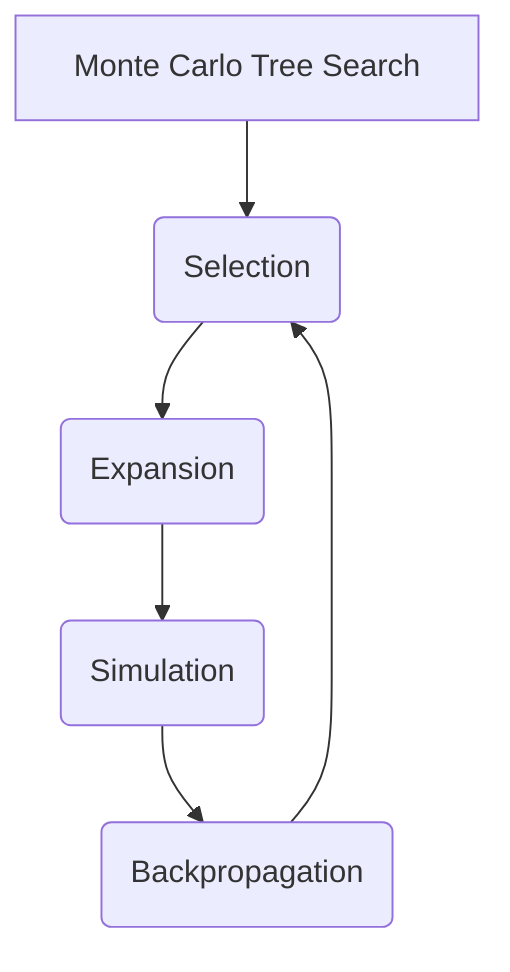

# Monte Carlo Tree Search (MCTS)原理与代码实例讲解

## 1.背景介绍

Monte Carlo Tree Search (MCTS)是一种高效的决策树搜索算法,广泛应用于游戏AI、规划优化、机器人控制等领域。它结合了经典的树搜索策略和蒙特卡罗随机采样的优点,能够在有限的计算资源下快速找到近似最优解。

MCTS算法的诞生源于对经典算法的反思。传统的博弈树搜索算法如Minimax、Alpha-Beta剪枝虽然能获得最优解,但在游戏复杂度增加时搜索树会呈现爆炸式增长,计算代价极高。而基于评估函数的算法如深度神经网络则需要大量人工设计和标注训练数据,泛化性差。

相比之下,MCTS算法通过有策略的随机采样和自我迭代更新,在不依赖评估函数的情况下逐步收敛于最优策略,克服了以上两类算法的缺陷。自2006年被DeepMind团队提出并应用于圍棋程序后,MCTS算法迅速在多个领域展现出优异表现。

## 2.核心概念与联系

MCTS算法的核心思想是通过构建一个根植于游戏状态的最小化树,并通过有策略的随机模拟对该树进行拓展和评估,最终收敛于一个近似最优的策略。算法主要包含四个步骤:Selection、Expansion、Simulation和Backpropagation。

1. **Selection(选择)**: 从根节点出发,按照一定策略选择路径,直到遇到一个未拓展的节点。常用策略包括UCB(Upper Confidence Bounds)和渐进知识利用策略。

2. **Expansion(拓展)**: 对选中的未拓展节点进行拓展,生成其子节点。

3. **Simulation(模拟)**: 从新拓展的节点出发,采用随机或者简单的策略对剩余步骤进行模拟,直至终止状态,得到一个模拟分数。

4. **Backpropagation(反向传播)**: 将模拟分数沿着选择路径向上传播,更新每个节点的统计值,为下一次选择提供依据。

上述步骤反复执行,直至达到计算资源上限。最终,根节点的子节点对应的访问次数即为对应动作的最优策略。



MCTS算法的优点在于:

- 无需事先定义评估函数,通过模拟自主学习策略
- 可以在线性时间内高效搜索
- 可以通过并行化大幅提高效率
- 具有较强的泛化能力,适用于多种问题

## 3.核心算法原理具体操作步骤

### 3.1 Selection(选择)

Selection阶段的目标是从根节点出发,选择一条路径到达一个未拓展的节点。常用的选择策略有UCB(Upper Confidence Bounds)和渐进知识利用策略。

**UCB策略**利用置信区间上界来平衡exploitation(利用)和exploration(探索)。对于节点i,其UCB值定义为:

$$UCB_i = \overline{X_i} + C\sqrt{\frac{2\ln n_p}{n_i}}$$

其中:
- $\overline{X_i}$是节点i的平均模拟分数
- $n_i$是节点i的访问次数
- $n_p$是父节点的访问次数
- C是一个调节exploitation和exploration权重的常数

在选择子节点时,UCB值最大的节点会被选中。这样可以在利用历史模拟结果的同时,仍有机会探索未充分探索的节点。

**渐进知识利用策略**是在UCB策略的基础上,利用一个RAVE(Rapidly Exploring Random Tree)值来加速新节点的价值评估。具体而言,对于一个节点i:

- 如果节点i的访问次数小于阈值,使用RAVE值作为UCB的$\overline{X_i}$部分
- 如果节点i的访问次数大于阈值,使用节点本身的模拟分数均值

RAVE值是基于所有通过节点i的模拟路径的结果计算得到的,因此可以更快地评估一个新节点的潜在价值。

### 3.2 Expansion(拓展)

Expansion阶段的目标是对选中的未拓展节点生成子节点。通常有两种策略:

1. **全拓展**: 对当前节点的所有可能后继状态进行拓展,生成全部子节点。

2. **部分拓展**: 只拓展部分子节点,剩余部分延迟到下次拓展时生成。

全拓展的优点是可以加速收敛,但需要消耗更多计算资源。部分拓展则更节省计算开销,但收敛速度较慢。在实际应用中,可以根据问题的规模和复杂度在两种策略间权衡。

### 3.3 Simulation(模拟)

Simulation阶段的目标是从新拓展的节点出发,对剩余步骤进行模拟直至终止状态,得到一个模拟分数。模拟策略有多种选择:

1. **随机模拟**: 完全随机地选择后续动作,直至终止。
2. **启发式模拟**: 根据简单的评估函数或规则选择后续动作。
3. **快速模拟**: 对剩余步骤进行简化模拟,以加速计算。

不同的模拟策略在效率和准确性之间需要权衡。随机模拟最为简单高效,但结果方差较大。启发式模拟和快速模拟则可以提高模拟的质量,但代价是增加了计算开销。

### 3.4 Backpropagation(反向传播)

Backpropagation阶段的目标是将模拟得到的分数沿着选择路径向上传播,更新每个节点的统计值。对于一次模拟,我们需要更新两个统计量:

1. **节点访问次数N(s,a)**: 表示状态s下执行动作a的次数
2. **动作价值Q(s,a)**: 表示状态s下执行动作a获得的平均分数

更新规则如下:

- 对于模拟路径上的每个节点(s,a),将N(s,a)加1
- 对于模拟路径的叶子节点,将其模拟分数作为Q(s,a)
- 对于其他节点,将子节点的Q(s,a)值传播到父节点

通过不断的模拟和反向传播,每个节点的统计值会逐渐收敛,为下一次选择提供依据。

## 4.数学模型和公式详细讲解举例说明

MCTS算法的数学模型主要体现在Selection阶段的UCB公式:

$$UCB_i = \overline{X_i} + C\sqrt{\frac{2\ln n_p}{n_i}}$$

其中:
- $\overline{X_i}$是节点i的平均模拟分数
- $n_i$是节点i的访问次数 
- $n_p$是父节点的访问次数
- C是一个调节exploitation和exploration权重的常数

UCB公式的目标是在exploitation(利用历史模拟结果)和exploration(探索新的潜在优良节点)之间寻求平衡。

具体来说,公式由两部分组成:

1. **exploitation部分 $\overline{X_i}$**: 这部分表示节点i的历史平均模拟分数,代表了利用当前已知信息的程度。如果一个节点的$\overline{X_i}$值较高,意味着根据历史模拟,该节点是一个较优的选择。

2. **exploration部分 $C\sqrt{\frac{2\ln n_p}{n_i}}$**: 这部分是一个置信区间,与节点i的访问次数$n_i$成反比。当一个节点的访问次数较少时,该项的值会较大,从而增加了被选中的概率,体现了对未充分探索节点的偏好。

通过将这两部分相加,UCB公式平衡了当前最优解的利用和对潜在更优解的探索,从而达到最终收敛于最优策略的目的。

常数C控制了exploitation和exploration之间的权重。C值较大时,更注重探索;C值较小时,更注重利用已知节点。在实践中,C通常取一个经验值,如$\sqrt{2}$。

让我们用一个简单的例子来解释UCB公式:

```python
# 节点状态
n1 = {"visit_count": 10, "reward": 4.5}  # 平均奖励为4.5,访问计数为10
n2 = {"visit_count": 15, "reward": 4.2}  # 平均奖励为4.2,访问计数为15
n3 = {"visit_count": 3, "reward": 5.0}   # 平均奖励为5.0,访问计数为3

# 父节点访问次数
parent_visit_count = 30

# 计算UCB值
import math

C = math.sqrt(2)  # 常数C,控制exploration权重

def ucb(node, parent_visit_count):
    exploration = C * math.sqrt(2 * math.log(parent_visit_count) / node["visit_count"])
    return node["reward"] + exploration

# 计算各节点的UCB值
ucb_n1 = ucb(n1, parent_visit_count)  # 5.18
ucb_n2 = ucb(n2, parent_visit_count)  # 4.77
ucb_n3 = ucb(n3, parent_visit_count)  # 6.67

# 由于n3的UCB值最大,因此被选中
```

在上例中,尽管n3的访问次数最少,但由于其奖励值较高且exploration项的值较大,因此综合的UCB值最高,被选中用于拓展和模拟。这体现了UCB在exploitation和exploration之间的平衡。

## 5.项目实践:代码实例和详细解释说明

为了更好地理解MCTS算法,我们将通过一个简单的Python实现来演示其工作原理。我们将构建一个用于玩"连接四子棋"游戏的AI程序。

### 5.1 游戏规则

"连接四子棋"是一种两人对战游戏,在一个6行7列的棋盘上轮流落子。玩家获胜的目标是在横、竖或斜方向上先连成4子。如果棋盘满了仍无人获胜,则作和局。

```python
# 定义棋盘大小
ROWS = 6
COLS = 7

# 定义玩家
PLAYER_1 = 1
PLAYER_2 = 2

# 判断是否获胜的函数
def check_win(board, player):
    # 检查横向是否有四子相连
    for row in range(ROWS):
        for col in range(COLS - 3):
            if board[row][col] == board[row][col + 1] == board[row][col + 2] == board[row][col + 3] == player:
                return True

    # 检查竖向是否有四子相连
    for row in range(ROWS - 3):
        for col in range(COLS):
            if board[row][col] == board[row + 1][col] == board[row + 2][col] == board[row + 3][col] == player:
                return True

    # 检查正斜方向是否有四子相连
    for row in range(ROWS - 3):
        for col in range(COLS - 3):
            if board[row][col] == board[row + 1][col + 1] == board[row + 2][col + 2] == board[row + 3][col + 3] == player:
                return True

    # 检查反斜方向是否有四子相连
    for row in range(3, ROWS):
        for col in range(COLS - 3):
            if board[row][col] == board[row - 1][col + 1] == board[row - 2][col + 2] == board[row - 3][col + 3] == player:
                return True

    # 没有四子相连
    return False
```

### 5.2 MCTS算法实现

我们将按照MCTS的四个核心步骤(Selection、Expansion、Simulation、Backpropagation)来实现算法。

#### 5.2.1 Node类

首先,我们定义一个Node类来表示MCTS树中的节点。每个节点包含以下属性:

- `state`: 当前棋盘状态
- `player`: 当前玩家
- `children`: 子节点列表
- `n`: 访问次数
- `q`: 动作价值(平均分数)
- `p`: 先验概率(由神经网络计算,这里暂时忽略)

```python
class Node:
    def __init__(self, state, player):
        self.state = state
        self.player = player
        self.children = []
        self.n = 0
        self.q = 0
        self.p = 0

    def add_child(self, child_state, child_player):
        child = Node(child_state, child_player)
        self.children.append(child)
        return child
```