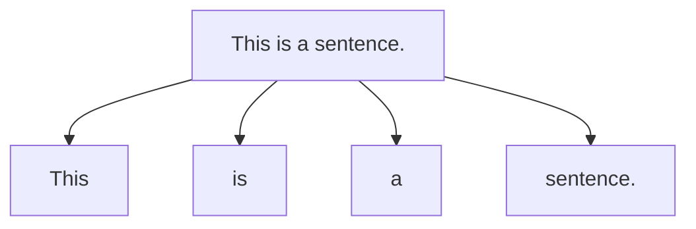
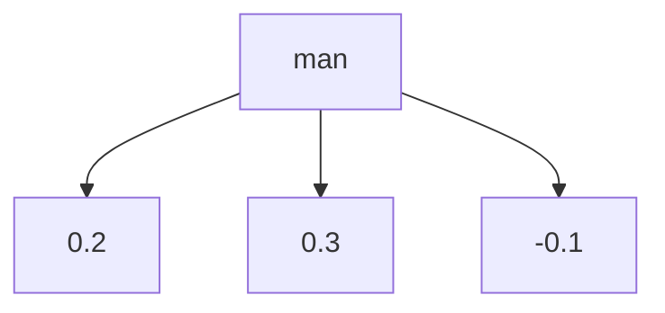

## 1.背景介绍

自然语言处理（Natural Language Processing，NLP）是人工智能领域的一个重要分支，它致力于让计算机能够理解、处理和生成自然语言。NLP技术的应用非常广泛，例如机器翻译、语音识别、情感分析、文本分类等等。然而，NLP技术的复杂性和多样性也给开发者带来了很大的挑战。为了解决这些挑战，NLTK和SpaCy成为了自然语言处理领域的两个重要工具。

## 2.核心概念与联系

NLTK（Natural Language Toolkit）是一个Python库，它提供了丰富的自然语言处理工具和数据集。NLTK包含了各种自然语言处理算法和模型，例如分词、词性标注、命名实体识别、句法分析、语义分析等等。NLTK还提供了大量的语料库和数据集，例如布朗语料库、Gutenberg语料库、WordNet等等。这些语料库和数据集可以帮助开发者进行自然语言处理的实验和研究。

SpaCy是另一个流行的自然语言处理工具，它也是一个Python库。SpaCy的设计目标是提供高效、准确、易用的自然语言处理工具。SpaCy包含了各种自然语言处理算法和模型，例如分词、词性标注、命名实体识别、句法分析、语义分析等等。与NLTK不同的是，SpaCy的算法和模型都是使用Cython编写的，因此它的性能非常高。

虽然NLTK和SpaCy都是自然语言处理工具，但它们的设计目标和使用方式有所不同。NLTK更加注重提供丰富的算法和数据集，适合用于自然语言处理的研究和教学。而SpaCy更加注重提供高效、准确、易用的自然语言处理工具，适合用于实际的自然语言处理应用。

## 3.核心算法原理具体操作步骤

### 3.1 分词

分词是自然语言处理的基础任务之一，它将一段文本分割成若干个词语。NLTK和SpaCy都提供了分词算法。下面是NLTK和SpaCy分词的示例代码：

```python
import nltk
import spacy

# NLTK分词
text = "This is a sentence."
tokens = nltk.word_tokenize(text)
print(tokens)

# SpaCy分词
nlp = spacy.load("en_core_web_sm")
doc = nlp(text)
tokens = [token.text for token in doc]
print(tokens)
```

### 3.2 词性标注

词性标注是将每个词语标注为它的词性，例如名词、动词、形容词等等。NLTK和SpaCy都提供了词性标注算法。下面是NLTK和SpaCy词性标注的示例代码：

```python
import nltk
import spacy

# NLTK词性标注
text = "This is a sentence."
tokens = nltk.word_tokenize(text)
tags = nltk.pos_tag(tokens)
print(tags)

# SpaCy词性标注
nlp = spacy.load("en_core_web_sm")
doc = nlp(text)
tags = [(token.text, token.pos_) for token in doc]
print(tags)
```

### 3.3 命名实体识别

命名实体识别是将文本中的命名实体（例如人名、地名、组织机构名等等）识别出来。NLTK和SpaCy都提供了命名实体识别算法。下面是NLTK和SpaCy命名实体识别的示例代码：

```python
import nltk
import spacy

# NLTK命名实体识别
text = "Barack Obama was born in Hawaii."
tokens = nltk.word_tokenize(text)
tags = nltk.pos_tag(tokens)
entities = nltk.chunk.ne_chunk(tags)
print(entities)

# SpaCy命名实体识别
nlp = spacy.load("en_core_web_sm")
doc = nlp(text)
entities = [(entity.text, entity.label_) for entity in doc.ents]
print(entities)
```

### 3.4 句法分析

句法分析是将一段文本分析成句子和词语之间的语法关系。NLTK和SpaCy都提供了句法分析算法。下面是NLTK和SpaCy句法分析的示例代码：

```python
import nltk
import spacy

# NLTK句法分析
text = "This is a sentence. That is another sentence."
sentences = nltk.sent_tokenize(text)
for sentence in sentences:
    tokens = nltk.word_tokenize(sentence)
    tags = nltk.pos_tag(tokens)
    tree = nltk.chunk.ne_chunk(tags)
    print(tree)

# SpaCy句法分析
nlp = spacy.load("en_core_web_sm")
doc = nlp(text)
for sentence in doc.sents:
    for token in sentence:
        print(token.text, token.dep_, token.head.text, token.head.pos_,
              [child for child in token.children])
```

### 3.5 语义分析

语义分析是将文本的意思进行分析和理解。NLTK和SpaCy都提供了一些语义分析算法，例如词向量表示、情感分析等等。下面是NLTK和SpaCy词向量表示的示例代码：

```python
import nltk
import spacy

# NLTK词向量表示
from nltk.corpus import brown
from gensim.models import Word2Vec

sentences = brown.sents()
model = Word2Vec(sentences, min_count=1)
vector = model.wv["man"]
print(vector)

# SpaCy词向量表示
nlp = spacy.load("en_core_web_sm")
doc = nlp("man")
vector = doc.vector
print(vector)
```

## 4.数学模型和公式详细讲解举例说明

NLTK和SpaCy使用的算法和模型非常多，这里只介绍其中一些常用的数学模型和公式。

### 4.1 词袋模型

词袋模型是自然语言处理中常用的一种模型，它将一段文本表示为一个词语的集合，忽略词语出现的顺序和语法关系。词袋模型可以用于文本分类、情感分析等任务。下面是词袋模型的示意图：



### 4.2 朴素贝叶斯算法

朴素贝叶斯算法是一种常用的文本分类算法，它基于贝叶斯定理和特征独立性假设。朴素贝叶斯算法可以用于垃圾邮件过滤、情感分析等任务。下面是朴素贝叶斯算法的公式：

$$P(c|d) = \frac{P(d|c)P(c)}{P(d)}$$

其中，$c$表示类别，$d$表示文档，$P(c|d)$表示文档$d$属于类别$c$的概率，$P(d|c)$表示类别$c$中文档$d$的概率，$P(c)$表示类别$c$的概率，$P(d)$表示文档$d$的概率。

### 4.3 词嵌入模型

词嵌入模型是一种将词语映射到低维向量空间的模型，它可以捕捉词语之间的语义和语法关系。词嵌入模型可以用于文本分类、情感分析等任务。下面是词嵌入模型的示意图：



## 5.项目实践：代码实例和详细解释说明

NLTK和SpaCy都提供了丰富的自然语言处理工具和数据集，下面是一个使用NLTK和SpaCy进行情感分析的示例代码：

```python
import nltk
import spacy

# 加载数据集
from nltk.corpus import movie_reviews

# 加载模型
nlp = spacy.load("en_core_web_sm")

# 特征提取
def extract_features(text):
    doc = nlp(text)
    features = {}
    for token in doc:
        if token.is_alpha:
            features[token.lower_] = True
    return features

# 构建数据集
documents = [(list(movie_reviews.words(fileid)), category)
             for category in movie_reviews.categories()
             for fileid in movie_reviews.fileids(category)]
featuresets = [(extract_features(document), category) for (document, category) in documents]

# 分割数据集
train_set, test_set = featuresets[100:], featuresets[:100]

# 训练模型
classifier = nltk.NaiveBayesClassifier.train(train_set)

# 测试模型
accuracy = nltk.classify.accuracy(classifier, test_set)
print("Accuracy:", accuracy)

# 预测情感
text = "This movie is great!"
features = extract_features(text)
sentiment = classifier.classify(features)
print("Sentiment:", sentiment)
```

## 6.实际应用场景

NLTK和SpaCy可以应用于各种自然语言处理任务，例如：

- 机器翻译：将一种语言的文本翻译成另一种语言的文本。
- 语音识别：将语音转换成文本。
- 情感分析：分析文本的情感倾向，例如积极、消极、中性等。
- 文本分类：将文本分为不同的类别，例如新闻、评论、广告等。
- 命名实体识别：识别文本中的命名实体，例如人名、地名、组织机构名等。
- 句法分析：分析文本中句子和词语之间的语法关系。
- 语义分析：分析文本的意思和语义关系。

## 7.工具和资源推荐

NLTK和SpaCy是自然语言处理领域的两个重要工具，它们都提供了丰富的自然语言处理工具和数据集。除此之外，还有一些其他的自然语言处理工具和资源，例如：

- Stanford CoreNLP：一个Java库，提供了各种自然语言处理工具和数据集。
- Gensim：一个Python库，提供了各种文本处理和自然语言处理工具。
- WordNet：一个英语词汇数据库，包含了大量的词语和它们的语义关系。

## 8.总结：未来发展趋势与挑战

自然语言处理技术的发展非常迅速，未来的发展趋势和挑战包括：

- 深度学习：深度学习技术在自然语言处理领域的应用越来越广泛，例如使用循环神经网络进行语言建模、使用卷积神经网络进行文本分类等等。
- 多语言处理：随着全球化的发展，多语言处理成为了一个重要的问题。如何处理多语言文本、如何进行跨语言翻译等等都是需要解决的问题。
- 隐私保护：自然语言处理技术可以用于分析用户的文本数据，但是如何保护用户的隐私成为了一个重要的问题。

## 9.附录：常见问题与解答

Q: NLTK和SpaCy有什么区别？

A: NLTK更加注重提供丰富的算法和数据集，适合用于自然语言处理的研究和教学。而SpaCy更加注重提供高效、准确、易用的自然语言处理工具，适合用于实际的自然语言处理应用。

Q: 自然语言处理有哪些应用场景？

A: 自然语言处理可以应用于各种任务，例如机器翻译、语音识别、情感分析、文本分类等等。

Q: 自然语言处理技术的未来发展趋势和挑战是什么？

A: 自然语言处理技术的未来发展趋势和挑战包括深度学习、多语言处理、隐私保护等等。