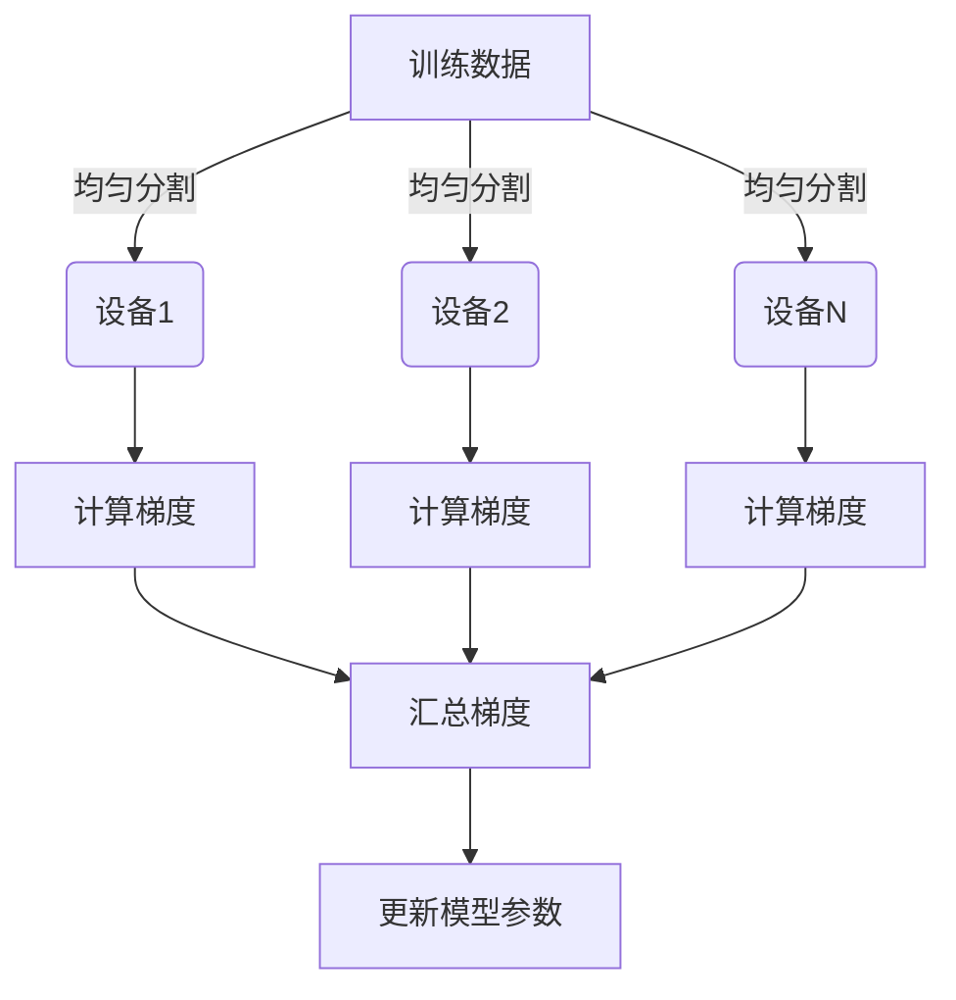
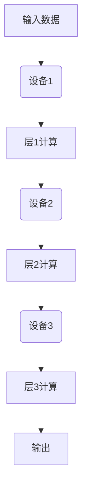

# Python深度学习实践：分布式训练大型模型的策略

## 1.背景介绍

随着深度学习模型的规模不断扩大,单机训练资源已无法满足训练需求。大型模型如GPT-3、DALL-E等需要数百上千个GPU并行训练数周,才能获得令人满意的结果。因此,分布式训练架构应运而生,通过多机器协同并行训练,极大缩短了训练时间,提高了训练效率。

分布式训练架构主要包括数据并行(Data Parallelism)、模型并行(Model Parallelism)和流水线并行(Pipeline Parallelism)三种策略。数据并行将训练数据分散到多个设备,每个设备单独计算梯度,再汇总梯度更新模型参数。模型并行则是将模型分割到多个设备,每个设备只计算一部分层。流水线并行将不同层分配到不同设备,通过流水线的方式传递激活值。

## 2.核心概念与联系

### 2.1 数据并行(Data Parallelism)

数据并行是最常见和直接的分布式训练方式。其核心思想是将训练数据均匀分割到多个设备,每个设备单独计算梯度,然后将各设备梯度汇总,最后更新模型参数。



数据并行的优点是实现简单,可扩展性强。但当模型越来越大时,单机内存将无法容纳整个模型,这时需要使用模型并行或流水线并行。

### 2.2 模型并行(Model Parallelism)

模型并行将模型各层分割到不同设备,每个设备只计算自己负责的那部分层。这种方式可以训练超大型模型,但同时也带来了更多的通信开销。



模型并行需要在层与层之间传递激活值,因此存在大量的通信开销。为了降低开销,常采用紧密耦合的方式,即将相邻的几层分配到同一设备。

### 2.3 流水线并行(Pipeline Parallelism)

流水线并行也是将模型各层分割到不同设备,但与模型并行不同的是,它采用流水线的方式传递激活值,从而重叠计算和通信,提高效率。


可以看到,当设备1完成层1计算后,立即将激活值传递给设备2,设备2计算层2的同时,设备1开始计算下一个batch的层1。通过这种流水线方式,可以最大化硬件利用率。

## 3.核心算法原理具体操作步骤

### 3.1 数据并行算法步骤

1. 将训练数据均匀分割到N个进程
2. 每个进程单独计算自己的数据batch对应的梯度
3. 使用All-Reduce算法将N个进程的梯度求和汇总
4. 每个进程更新模型参数

All-Reduce算法是数据并行的关键,它能高效地在N个进程间进行梯度求和。主要分两步:

1) Reduce-Scatter: 将各进程的梯度分散求和,每个进程得到部分和
2) All-Gather: 将各进程的部分和聚合,每个进程得到最终的完整梯度和

### 3.2 模型并行算法步骤

1. 将模型各层分割到N个进程
2. 输入数据传入第1个进程,计算第1部分层
3. 将激活值传递给第2个进程,计算第2部分层
4. 重复第3步,直至最后一个进程完成计算
5. 反向传播时,从最后一个进程开始,逐层回传梯度

模型并行的关键是高效传递激活值,通常采用NCCL等通信库。同时需要注意计算和通信的并行以及负载均衡。

### 3.3 流水线并行算法步骤  

1. 将模型各层分割到N个进程 
2. 输入数据传入第1个进程,计算第1部分层
3. 将激活值传递给第2个进程,同时第1个进程开始计算下一个batch的第1部分层
4. 重复第3步,直至最后一个进程完成计算
5. 反向传播时,从最后一个进程开始,逐层回传梯度

流水线并行的关键是高效并行计算和通信,最大化硬件利用率。需要合理调度各进程的计算和通信,避免出现空闲等待。

## 4.数学模型和公式详细讲解举例说明

### 4.1 All-Reduce算法

All-Reduce是数据并行中用于梯度求和的关键算法。设有N个进程,每个进程持有一个向量$\vec{x}_i$,需要计算所有进程向量之和:

$$\vec{y} = \sum_{i=1}^N \vec{x}_i$$

All-Reduce算法分两步进行:

1) Reduce-Scatter

$$\vec{y}_i = \sum_{j=1}^N \vec{x}_{(i+j) \% N}$$

每个进程计算部分和,其中进程i计算$\vec{y}_i$

2) All-Gather

$$\vec{y} = \sum_{i=1}^N \vec{y}_i$$

将各进程的部分和聚合,每个进程得到最终的完整和$\vec{y}$

通过上述两步,All-Reduce可以高效地在N个进程间进行向量求和操作。

### 4.2 ByteScheduler调度算法

ByteScheduler是微软提出的一种流水线并行调度算法,用于最大化GPU利用率。其核心思想是根据每层的计算时间和通信时间,动态调整各层在不同进程的执行顺序。

假设有N层,每层在进程i上的计算时间为$t_i^c$,通信时间为$t_i^n$。令$s_i$为层i开始的时间,则有:

$$s_{i+1} = \max(s_i + t_i^c, s_{i-1}+t_{i-1}^n)$$

也就是说,层i+1开始的时间取决于层i的计算完成时间和层i-1的通信完成时间的最大值。

通过动态调整各层在不同进程的执行顺序,ByteScheduler可以最大化GPU利用率,提高训练效率。

### 4.3 ZeRO优化器

ZeRO(ZeroRedundancyOptimizer)是微软提出的一种大模型优化器,可以在有限内存下训练任意大小的模型。其核心思想是利用数据并行和模型并行的优势,将模型状态分散存储在多个GPU中。

具体来说,ZeRO将模型参数、优化器状态和梯度分别分散存储在不同的GPU中,避免了重复存储。在前向传播时,根据需要在GPU间传递参数;在反向传播时,根据需要在GPU间传递梯度,并更新优化器状态。

通过分散存储和按需传递,ZeRO可以突破单GPU内存限制,支持训练任意大小的模型。

## 5.项目实践:代码实例和详细解释说明

以下是使用PyTorch实现数据并行的简单示例:

```python
import torch
import torch.nn as nn
import torch.optim as optim
from torch.nn.parallel import DistributedDataParallel as DDP

# 定义模型
model = nn.Sequential(
    nn.Linear(10, 20),
    nn.ReLU(),
    nn.Linear(20, 1)
)

# 准备训练数据
train_data = torch.randn(64, 10)
train_labels = torch.randn(64, 1)

# 分布式初始化
torch.distributed.init_process_group(backend='nccl')
local_rank = torch.distributed.get_rank()
torch.cuda.set_device(local_rank)

# 封装为DDP模型
model = DDP(model.cuda(), device_ids=[local_rank])

# 定义损失函数和优化器
criterion = nn.MSELoss()
optimizer = optim.SGD(model.parameters(), lr=0.001)

# 训练循环
for epoch in range(10):
    outputs = model(train_data.cuda())
    loss = criterion(outputs, train_labels.cuda())
    
    optimizer.zero_grad()
    loss.backward()
    optimizer.step()
    
    print(f'Epoch {epoch}, Loss: {loss.item()}')
```

上述代码使用PyTorch内置的DistributedDataParallel(DDP)模块实现了数据并行。主要步骤:

1. 初始化分布式环境,指定通信后端(nccl)
2. 获取当前进程的rank,并设置对应的GPU设备
3. 使用DDP封装模型,指定当前GPU设备
4. 正常训练,DDP会自动处理梯度求和和模型参数更新

对于模型并行和流水线并行,PyTorch目前还没有内置模块支持,需要使用第三方库如FairScale、DeepSpeed等。以下是一个使用FairScale实现模型并行的示例:

```python
import torch
import fairscale

# 定义模型
model = nn.Sequential(
    fairscale.nn.ModelParallel(nn.Linear(10, 20)),
    nn.ReLU(),
    fairscale.nn.ModelParallel(nn.Linear(20, 1))
)

# 其他代码...
```

可以看到,只需要使用fairscale.nn.ModelParallel封装各层,FairScale就会自动处理模型并行的通信和计算。

## 6.实际应用场景

分布式训练架构在工业界和学术界都有广泛应用,以下列举一些典型场景:

- **大语言模型训练**: GPT-3、BERT、PALM等大型语言模型都采用了分布式训练策略。例如GPT-3使用了模型并行,将模型分割到多个节点;BERT使用了数据并行和模型并行的混合策略。

- **大视觉模型训练**: DALL-E、Stable Diffusion等大型视觉模型也需要分布式训练。Stable Diffusion使用了DeepSpeed库实现了高效的数据并行和模型并行。

- **科学计算和模拟**:分子动力学模拟、天体物理模拟等科学计算任务往往需要大量计算资源,可以使用分布式训练加速计算。

- **推理加速**:除了训练加速,分布式部署也可以加速大模型的推理过程,如微软的DeepSpeed Inference等。

总的来说,无论是工业界还是学术界,只要遇到计算量大、内存占用高的任务,分布式训练架构都可以发挥重要作用。

## 7.工具和资源推荐

- **PyTorch DDP**: PyTorch内置的分布式数据并行模块,使用简单。
- **FairScale**: Meta AI开源的分布式训练库,支持数据并行、模型并行等策略。
- **DeepSpeed**: 微软开源的深度学习优化库,提供ZeRO优化器、流水线并行等功能。
- **ByteScheduler**: 微软提出的流水线并行调度算法,可显著提高GPU利用率。
- **Megatron-LM**: NVIDIA开源的大语言模型训练框架,支持高效的模型并行。
- **Lingvo**: Google开源的序列模型训练框架,支持分布式训练。

此外,一些云服务商如AWS、GCP、Azure等也提供了分布式训练的解决方案,可以快速部署分布式集群。

## 8.总结:未来发展趋势与挑战

分布式训练架构为训练大规模深度学习模型提供了可能,但同时也面临着一些挑战:

**通信开销**:随着集群规模扩大,节点间的通信开销将成为训练效率的瓶颈。需要优化通信算法和硬件互连,降低开销。

**负载均衡**:在模型并行和流水线并行中,合理的负载均衡对提高效率至关重要。需要更智能的调度算法动态平衡负载。

**内存利用率**:如何在有限内存下高效训练大模型,需要更优化的内存管理和重构算法。

**