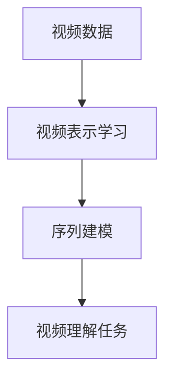

# Python深度学习实践：基于深度学习的视频理解方法

## 1.背景介绍

视频理解是计算机视觉和人工智能领域的一个重要研究方向。随着视频数据的快速增长,对视频内容进行自动理解和分析的需求也日益迫切。视频理解技术可以广泛应用于视频监控、人机交互、内容审核、自动驾驶等诸多领域。

传统的视频理解方法主要依赖于手工设计的特征提取和模式识别算法,这些方法需要大量的领域知识和人工参与,并且难以处理复杂场景。近年来,深度学习技术在计算机视觉领域取得了巨大成功,为视频理解任务提供了新的解决方案。

深度学习模型能够自动从大量数据中学习特征表示,并对复杂的视频数据建模,从而实现高精度的视频理解。本文将介绍基于深度学习的视频理解方法,包括视频分类、行为识别、视频描述等任务,并分享相关的核心概念、算法原理、项目实践和应用场景。

## 2.核心概念与联系 

### 2.1 视频理解任务

视频理解是一个广义的概念,包含多种具体任务,主要有:

1. **视频分类(Video Classification)**: 将整个视频片段归类到预定义的类别中,如体育类、新闻类等。

2. **行为识别(Action Recognition)**: 识别视频中发生的动作行为,如跳舞、打球等。

3. **视频描述(Video Captioning)**: 根据视频内容自动生成文本描述。

4. **视频问答(Video Question Answering)**: 根据视频内容回答相关问题。

5. **视频摘要(Video Summarization)**: 从视频中自动提取关键帧或片段,生成视频摘要。

这些任务虽然目标不同,但都需要对视频进行理解和建模,因此在算法和模型方面存在一定的联系。

### 2.2 视频表示学习

视频理解的核心是学习视频的特征表示,即将原始视频数据映射到一个紧凑的特征空间,使得这些特征能够很好地表达视频内容的语义信息。常用的视频表示学习方法包括:

1. **双流卷积网络(Two-Stream ConvNets)**: 将RGB帧和光流特征分别输入两个卷积网络,并在最后一层融合两个流的特征。

2. **三维卷积网络(3D ConvNets)**: 直接对视频的三维体数据(时间、高度、宽度)进行三维卷积和池化操作,学习时空特征表示。

3. **注意力机制(Attention Mechanism)**: 通过注意力模型自适应地聚焦视频的关键区域和时间片段,提高表示的质量。

4. **自编码器(AutoEncoders)**: 使用自编码器对视频进行无监督特征学习,获得高质量的视频嵌入表示。

### 2.3 序列建模

由于视频是一种时序数据,因此需要使用序列建模算法来捕捉视频中的动态信息。常用的序列建模方法包括:

1. **循环神经网络(RNNs)**: 利用内部状态来记忆序列的历史信息,适用于处理变长序列数据。

2. **长短期记忆网络(LSTMs)**: 改进版的RNN,通过门控机制解决了长期依赖问题。

3. **时间卷积网络(TCNs)**: 使用一维卷积和因果卷积,捕捉长期时序依赖关系。

4. **自注意力机制(Self-Attention)**: 通过计算序列元素之间的相关性,直接建模长期依赖关系。

这些序列建模算法通常与视频表示学习方法结合使用,构建端到端的视频理解模型。

## 3.核心算法原理具体操作步骤

### 3.1 双流卷积网络

双流卷积网络是视频理解领域的经典模型,它将RGB帧和光流特征分别输入两个卷积网络,并在最后一层融合两个流的特征。具体操作步骤如下:

1. **预处理**: 将视频解码为RGB帧序列,并计算相邻帧之间的光流特征。

2. **空间流网络**: 将RGB帧输入到一个卷积神经网络中(如VGGNet或ResNet),提取空间特征。

3. **时间流网络**: 将光流特征输入到另一个卷积神经网络中,提取时间特征。

4. **特征融合**: 将两个流的特征在最后一层进行融合,通常使用元素级相加或向量级拼接的方式。

5. **分类或回归**: 将融合后的特征输入全连接层,对视频进行分类或回归。

6. **模型训练**: 使用标注的视频数据集,通过反向传播算法优化网络参数。

双流网络的优点是能够同时利用RGB帧和光流特征,提高了视频理解的性能。但是它也存在一些缺点,如两个流网络的参数无法共享,计算量较大等。

### 3.2 三维卷积网络

三维卷积网络直接对视频的三维体数据(时间、高度、宽度)进行三维卷积和池化操作,学习时空特征表示。具体操作步骤如下:

1. **预处理**: 将视频解码为RGB帧序列,并将其堆叠为三维体数据。

2. **三维卷积**: 使用三维卷积核对三维体数据进行卷积操作,提取时空特征。

3. **三维池化**: 使用三维池化层对特征图进行下采样,减少计算量和提高鲁棒性。

4. **全连接层**: 将最后一层的特征图展平,输入全连接层进行分类或回归。

5. **模型训练**: 使用标注的视频数据集,通过反向传播算法优化网络参数。

三维卷积网络的优点是能够直接对视频数据进行建模,捕捉时空特征,避免了手工设计光流特征的步骤。但是它也存在一些缺点,如参数量较大,计算量较高,对内存要求较高等。

### 3.3 注意力机制

注意力机制是一种有效的方法,可以自适应地聚焦视频的关键区域和时间片段,提高表示的质量。具体操作步骤如下:

1. **特征提取**: 使用卷积神经网络或其他方法提取视频的特征表示。

2. **注意力计算**: 对每个时间步或空间位置,计算其与其他位置的相关性得分(注意力分数)。

3. **加权求和**: 根据注意力分数,对特征进行加权求和,得到最终的视频表示。

4. **分类或回归**: 将加权求和后的视频表示输入全连接层,对视频进行分类或回归。

5. **模型训练**: 使用标注的视频数据集,通过反向传播算法优化网络参数。

注意力机制可以应用于不同的视频理解模型中,如双流网络、三维卷积网络等。它能够自动学习视频中的关键信息,提高模型的性能和解释性。

### 3.4 自编码器

自编码器是一种无监督特征学习方法,可以用于对视频进行预训练,获得高质量的视频嵌入表示。具体操作步骤如下:

1. **预处理**: 将视频解码为RGB帧序列,并将其堆叠为三维体数据。

2. **编码器**: 使用三维卷积网络或其他网络结构作为编码器,将三维体数据映射到一个低维的潜在空间。

3. **解码器**: 使用解码器网络(如三维反卷积网络)将潜在表示重构回原始视频数据。

4. **重构损失**: 计算重构视频与原始视频之间的差异,作为无监督训练的损失函数。

5. **模型训练**: 使用大量未标注的视频数据,通过优化重构损失函数训练自编码器模型。

6. **特征提取**: 使用训练好的编码器网络提取视频的潜在表示,作为下游任务的输入特征。

自编码器的优点是能够利用大量未标注数据进行预训练,学习到高质量的视频表示。这种无监督预训练方法可以提高下游任务的性能,并减少对大量标注数据的依赖。

## 4.数学模型和公式详细讲解举例说明

### 4.1 双流卷积网络

双流卷积网络的核心思想是将RGB帧和光流特征分别输入两个卷积网络,并在最后一层融合两个流的特征。具体来说,给定一个视频片段 $V$,我们可以将其表示为RGB帧序列 $\{I_t\}_{t=1}^T$ 和光流序列 $\{F_t\}_{t=1}^{T-1}$,其中 $T$ 是帧数。

空间流网络的输入是RGB帧序列 $\{I_t\}_{t=1}^T$,通过卷积神经网络提取空间特征:

$$
f_s(V) = \phi_s(\{I_t\}_{t=1}^T; \theta_s)
$$

其中 $\phi_s$ 表示空间流网络的映射函数,如VGGNet或ResNet, $\theta_s$ 是网络参数。

时间流网络的输入是光流序列 $\{F_t\}_{t=1}^{T-1}$,通过另一个卷积神经网络提取时间特征:

$$
f_t(V) = \phi_t(\{F_t\}_{t=1}^{T-1}; \theta_t)
$$

其中 $\phi_t$ 表示时间流网络的映射函数, $\theta_t$ 是网络参数。

最后,将两个流的特征进行融合,通常使用元素级相加或向量级拼接的方式:

$$
f(V) = \psi(f_s(V), f_t(V))
$$

其中 $\psi$ 是特征融合函数,如相加或拼接操作。

融合后的特征 $f(V)$ 可以输入全连接层进行分类或回归,从而实现视频理解任务。双流网络的损失函数可以定义为:

$$
\mathcal{L}(\theta_s, \theta_t) = \sum_{i=1}^N \ell(y_i, f(V_i; \theta_s, \theta_t))
$$

其中 $\ell$ 是损失函数,如交叉熵损失或均方误差, $y_i$ 是第 $i$ 个视频样本的标签, $N$ 是训练集大小。通过优化损失函数,可以学习到最优的网络参数 $\theta_s$ 和 $\theta_t$。

### 4.2 三维卷积网络

三维卷积网络直接对视频的三维体数据进行三维卷积和池化操作,学习时空特征表示。给定一个视频片段 $V$,我们可以将其表示为三维体数据 $X \in \mathbb{R}^{T \times H \times W \times C}$,其中 $T$ 是帧数, $H$ 和 $W$ 分别是高度和宽度, $C$ 是通道数(如RGB则为3)。

三维卷积操作可以表示为:

$$
X_j^{l+1} = \sum_{i=1}^{N_l} X_i^l \ast W_{ij}^{l+1} + b_j^{l+1}
$$

其中 $X_j^{l+1}$ 是第 $l+1$ 层的第 $j$ 个特征图, $X_i^l$ 是第 $l$ 层的第 $i$ 个特征图, $W_{ij}^{l+1}$ 是第 $l+1$ 层的第 $j$ 个三维卷积核, $b_j^{l+1}$ 是偏置项, $\ast$ 表示三维卷积操作。

三维池化操作可以表示为:

$$
X_j^{l+1} = \operatorname{pool}(X_i^l)
$$

其中 $\operatorname{pool}$ 是三维池化函数,如最大池化或平均池化。

通过交替使用三维卷积层和池化层,可以逐层提取视频的时空特征。最后一层的特征图可以展平为一维向量,输入全连接层进行分类或回归。

与双流网络类似,三维卷积网络的损失函数也可以定义为:

$$
\mathcal{L}(\theta) = \sum_{i=1}^N \ell(y_i, f(V_i; \theta))
$$

其中