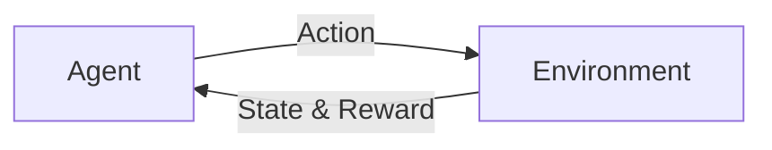

# Reinforcement Learning原理与代码实例讲解

## 1. 背景介绍
### 1.1 强化学习的起源与发展
### 1.2 强化学习的定义与特点
### 1.3 强化学习在人工智能领域的重要性

## 2. 核心概念与联系
### 2.1 Agent、Environment、State、Action、Reward
### 2.2 Policy、Value Function、Model
### 2.3 Exploration与Exploitation
### 2.4 Markov Decision Process (MDP)
### 2.5 Bellman Equation

## 3. 核心算法原理具体操作步骤
### 3.1 Q-Learning
#### 3.1.1 Q-Table的更新
#### 3.1.2 ε-greedy策略
#### 3.1.3 Q-Learning算法流程
### 3.2 SARSA
#### 3.2.1 SARSA与Q-Learning的区别
#### 3.2.2 SARSA算法流程
### 3.3 Deep Q-Network (DQN)
#### 3.3.1 神经网络近似Q函数
#### 3.3.2 Experience Replay
#### 3.3.3 Target Network
#### 3.3.4 DQN算法流程

## 4. 数学模型和公式详细讲解举例说明
### 4.1 Markov Decision Process (MDP)
#### 4.1.1 MDP的定义与组成
#### 4.1.2 MDP的转移概率与奖励函数
### 4.2 Bellman Equation
#### 4.2.1 Bellman Expectation Equation
$V(s)=\sum_{a \in A} \pi(a|s) \sum_{s',r}p(s',r|s,a)[r+\gamma V(s')]$
#### 4.2.2 Bellman Optimality Equation
$V_*(s)=\max_{a \in A} \sum_{s',r}p(s',r|s,a)[r+\gamma V_*(s')]$
### 4.3 Q-Learning的数学推导
$$Q(s_t,a_t) \leftarrow Q(s_t,a_t)+\alpha[r_{t+1}+\gamma \max_{a}Q(s_{t+1},a)-Q(s_t,a_t)]$$

## 5. 项目实践：代码实例和详细解释说明
### 5.1 Q-Learning解决FrozenLake环境
#### 5.1.1 FrozenLake环境介绍
#### 5.1.2 Q-Table的初始化
#### 5.1.3 Q-Learning主循环
#### 5.1.4 训练结果可视化
### 5.2 DQN玩Atari游戏
#### 5.2.1 Atari游戏环境介绍
#### 5.2.2 DQN网络结构
#### 5.2.3 Experience Replay与Target Network
#### 5.2.4 DQN训练过程
#### 5.2.5 训练结果展示

## 6. 实际应用场景
### 6.1 智能体游戏AI
### 6.2 自动驾驶
### 6.3 智能推荐系统
### 6.4 智能交易系统
### 6.5 机器人控制

## 7. 工具和资源推荐
### 7.1 OpenAI Gym
### 7.2 Tensorflow与Keras
### 7.3 PyTorch
### 7.4 Stable Baselines
### 7.5 RLlib

## 8. 总结：未来发展趋势与挑战
### 8.1 强化学习的发展历程回顾
### 8.2 强化学习当前面临的挑战
#### 8.2.1 样本效率
#### 8.2.2 奖励稀疏
#### 8.2.3 探索与利用的平衡
#### 8.2.4 泛化能力
### 8.3 强化学习的未来研究方向
#### 8.3.1 多智能体强化学习
#### 8.3.2 分层强化学习
#### 8.3.3 元强化学习
#### 8.3.4 迁移强化学习
#### 8.3.5 安全强化学习

## 9. 附录：常见问题与解答
### 9.1 强化学习与监督学习、非监督学习的区别？
### 9.2 强化学习能否用于连续动作空间？
### 9.3 如何处理强化学习中的延迟奖励问题？
### 9.4 强化学习如何实现探索与利用的平衡？
### 9.5 强化学习的收敛性如何保证？

作者：禅与计算机程序设计艺术 / Zen and the Art of Computer Programming