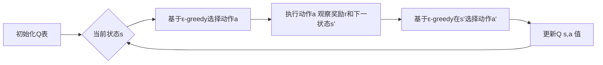

# SARSA - 原理与代码实例讲解

## 1. 背景介绍
### 1.1 强化学习概述
#### 1.1.1 强化学习的定义与特点
#### 1.1.2 强化学习的主要分类
#### 1.1.3 强化学习的应用领域

### 1.2 时序差分学习
#### 1.2.1 时序差分学习的基本思想  
#### 1.2.2 时序差分学习与蒙特卡洛方法的比较
#### 1.2.3 时序差分学习的优缺点

### 1.3 SARSA算法概述
#### 1.3.1 SARSA算法的起源与发展
#### 1.3.2 SARSA算法的基本思想
#### 1.3.3 SARSA算法与Q-learning的异同

## 2. 核心概念与联系
### 2.1 马尔可夫决策过程(MDP)
#### 2.1.1 状态、动作与转移概率
#### 2.1.2 奖励函数与折扣因子  
#### 2.1.3 最优策略与值函数

### 2.2 时序差分学习中的关键概念
#### 2.2.1 状态-动作值函数Q(s,a)
#### 2.2.2 时序差分误差与学习率
#### 2.2.3 探索与利用的平衡(ε-greedy策略)

### 2.3 SARSA算法中的核心概念
#### 2.3.1 五元组(s, a, r, s', a')的含义
#### 2.3.2 Q表与状态-动作值的更新
#### 2.3.3 同策略与异策略学习的区别

## 3. 核心算法原理与具体操作步骤
### 3.1 SARSA算法的伪代码描述
#### 3.1.1 初始化Q表
#### 3.1.2 循环迭代过程
#### 3.1.3 状态-动作值的更新规则

### 3.2 SARSA算法的关键步骤解析
#### 3.2.1 选择动作(ε-greedy策略) 
#### 3.2.2 执行动作并观察奖励与下一状态
#### 3.2.3 更新Q表中的状态-动作值
#### 3.2.4 状态转移与循环终止条件

### 3.3 SARSA算法的收敛性分析
#### 3.3.1 收敛性的数学证明
#### 3.3.2 影响收敛速度的因素
#### 3.3.3 改进算法以加快收敛

## 4. 数学模型和公式详细讲解举例说明
### 4.1 马尔可夫决策过程的数学表示
#### 4.1.1 状态转移概率矩阵与奖励函数
#### 4.1.2 贝尔曼方程与最优值函数
#### 4.1.3 策略迭代与值迭代算法

### 4.2 SARSA算法的数学推导
#### 4.2.1 时序差分误差的计算公式
#### 4.2.2 状态-动作值更新公式的推导
#### 4.2.3 收敛性证明中的关键不等式

### 4.3 数值例子演示SARSA算法的运作
#### 4.3.1 简单的网格世界环境设置
#### 4.3.2 手工计算状态-动作值的更新过程
#### 4.3.3 算法收敛后的最优策略与值函数

## 5. 项目实践：代码实例和详细解释说明
### 5.1 使用Python实现SARSA算法
#### 5.1.1 定义环境类与Q表
#### 5.1.2 实现ε-greedy策略与状态-动作值更新
#### 5.1.3 主循环与训练过程

### 5.2 在经典强化学习环境中测试SARSA算法
#### 5.2.1 Cliff Walking环境介绍
#### 5.2.2 运行SARSA算法并可视化结果
#### 5.2.3 与其他算法(如Q-learning)的性能比较

### 5.3 代码优化与改进
#### 5.3.1 使用Numpy加速矩阵运算 
#### 5.3.2 引入函数近似以处理大状态空间
#### 5.3.3 实现并行化以加速训练过程

## 6. 实际应用场景
### 6.1 智能体寻路问题
#### 6.1.1 机器人路径规划
#### 6.1.2 自动驾驶中的决策控制
#### 6.1.3 游戏AI中的寻路算法

### 6.2 推荐系统中的序列决策
#### 6.2.1 新闻推荐中的用户交互建模
#### 6.2.2 视频网站的自动连播策略
#### 6.2.3 电商平台的商品推荐策略

### 6.3 自然语言处理中的对话管理
#### 6.3.1 任务型对话系统的动作选择
#### 6.3.2 开放域对话中的话题管理
#### 6.3.3 基于强化学习的对话生成模型

## 7. 工具和资源推荐 
### 7.1 强化学习框架
#### 7.1.1 OpenAI Gym
#### 7.1.2 Google Dopamine
#### 7.1.3 RLlib

### 7.2 相关书籍与教程
#### 7.2.1 《强化学习导论》(Sutton & Barto)
#### 7.2.2 《深度强化学习实战》(张伟楠)
#### 7.2.3 David Silver的强化学习课程

### 7.3 研究论文与学习资源
#### 7.3.1 SARSA算法的原始论文
#### 7.3.2 时序差分学习的综述文章
#### 7.3.3 强化学习领域的顶会与期刊

## 8. 总结：未来发展趋势与挑战
### 8.1 基于深度学习的SARSA算法改进
#### 8.1.1 Deep SARSA与DQN的结合
#### 8.1.2 基于策略梯度的Actor-Critic算法
#### 8.1.3 分层强化学习中的SARSA应用

### 8.2 多智能体强化学习中的SARSA拓展
#### 8.2.1 分布式SARSA算法
#### 8.2.2 基于博弈论的多智能体学习
#### 8.2.3 群体智能中的SARSA应用

### 8.3 SARSA算法的理论研究方向
#### 8.3.1 收敛性与样本复杂度分析
#### 8.3.2 探索策略的理论研究
#### 8.3.3 泛化能力与迁移学习

## 9. 附录：常见问题与解答
### 9.1 SARSA算法的参数调优
#### 9.1.1 学习率的选择
#### 9.1.2 折扣因子的设置
#### 9.1.3 ε-greedy策略中的ε值调节

### 9.2 SARSA算法的局限性
#### 9.2.1 探索-利用困境
#### 9.2.2 维数灾难与函数近似
#### 9.2.3 非平稳环境下的学习难题

### 9.3 SARSA算法的变体与改进
#### 9.3.1 Expected SARSA
#### 9.3.2 Double SARSA
#### 9.3.3 基于模型的SARSA算法



以上是使用Mermaid绘制的SARSA算法核心流程图。SARSA是一种时序差分(TD)算法,属于单步更新的同策略学习方法。与Q-learning不同,SARSA在更新状态-动作值函数Q(s,a)时,不仅考虑了当前状态s和动作a,还考虑了下一状态s'和在s'处选择的动作a'。这使得SARSA能够更好地适应实际执行的策略,并在一定程度上减少了过度估计(overestimation)问题。

SARSA算法的核心更新公式为:

$$Q(s,a) \leftarrow Q(s,a) + \alpha [r + \gamma Q(s',a') - Q(s,a)]$$

其中,$\alpha$是学习率,$\gamma$是折扣因子,r是执行动作a后获得的即时奖励。这个公式表明,Q(s,a)的更新依赖于TD误差$\delta_t = r + \gamma Q(s',a') - Q(s,a)$。当TD误差为正时,表示当前的Q(s,a)被低估了,需要增大其值;反之,当TD误差为负时,表示Q(s,a)被高估了,需要减小其值。学习率$\alpha$控制了每次更新的步长,较大的$\alpha$会加快学习速度但可能导致振荡,较小的$\alpha$会减慢学习速度但能保证收敛。

下面是一个使用Python实现SARSA算法的简单示例:

```python
import numpy as np

class SARSA:
    def __init__(self, n_states, n_actions, alpha, gamma, epsilon):
        self.Q = np.zeros((n_states, n_actions))
        self.alpha = alpha
        self.gamma = gamma
        self.epsilon = epsilon
        
    def choose_action(self, state):
        if np.random.uniform() < self.epsilon:
            return np.random.choice(n_actions)
        else:
            return np.argmax(self.Q[state])
        
    def update(self, s, a, r, s_, a_):
        td_error = r + self.gamma * self.Q[s_, a_] - self.Q[s, a]
        self.Q[s, a] += self.alpha * td_error

# 初始化环境和SARSA智能体        
n_states = 10
n_actions = 4
alpha = 0.1
gamma = 0.9
epsilon = 0.1
agent = SARSA(n_states, n_actions, alpha, gamma, epsilon)

# 训练循环
for episode in range(1000):
    s = env.reset()
    a = agent.choose_action(s)
    done = False
    
    while not done:
        s_, r, done, _ = env.step(a)
        a_ = agent.choose_action(s_)
        agent.update(s, a, r, s_, a_)
        s, a = s_, a_
```

以上代码展示了SARSA算法的基本实现。首先定义了一个SARSA类,包含了Q表以及各种超参数。choose_action方法根据ε-greedy策略选择动作,update方法根据SARSA的更新公式更新Q表。在训练循环中,每个episode都从初始状态开始,然后不断与环境交互并更新Q表,直到达到终止状态。

总的来说,SARSA是一种简单而有效的时序差分学习算法。它能够在与环境交互的过程中不断更新状态-动作值函数,最终收敛到最优策略。但是,SARSA也存在一些局限性,例如探索-利用困境、维数灾难等。为了克服这些问题,研究者们提出了许多SARSA的变体和改进,如Expected SARSA、Double SARSA等。此外,将SARSA与深度学习相结合也是一个重要的研究方向,能够扩大SARSA的适用范围并提高其性能。

未来,SARSA及其变体在智能体寻路、推荐系统、自然语言处理等领域都有广阔的应用前景。同时,SARSA算法本身的理论研究,如收敛性分析、探索策略的改进等,也是值得关注的问题。总之,作为强化学习领域的经典算法之一,SARSA仍然有许多值得探索的空间,相信通过研究者们的不断努力,它能够在更多实际问题中发挥重要作用。

作者：禅与计算机程序设计艺术 / Zen and the Art of Computer Programming