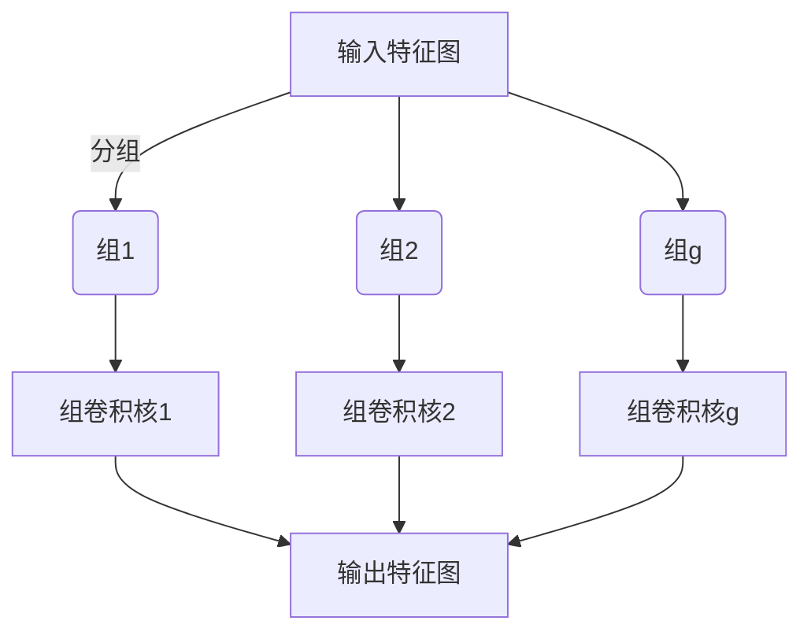
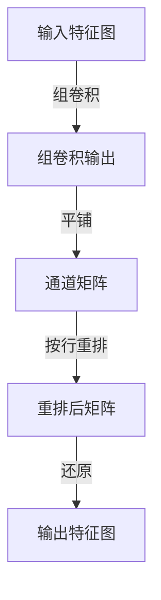
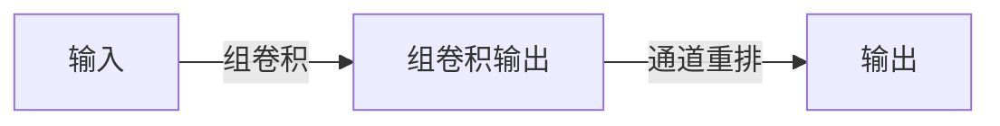
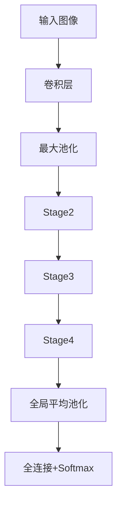

# ShuffleNet原理与代码实例讲解

## 1.背景介绍

### 1.1 移动端深度学习的挑战

随着深度学习在计算机视觉、自然语言处理等领域的广泛应用,人工智能技术逐渐从云端走向移动端。移动端深度学习面临着诸多挑战,主要包括以下几个方面:

1. **计算能力有限**:与服务器相比,移动设备的CPU和GPU计算能力有限,无法支持大型深度神经网络模型的高效推理。
2. **内存资源紧缺**:移动设备通常只有几GB的内存,而大型神经网络模型往往需要占用数GB的内存空间。
3. **功耗和发热**:移动设备的电池容量有限,复杂的深度学习模型会导致高功耗和发热问题。
4. **实时响应要求**:很多移动端应用场景需要实时的推理响应,对延迟要求较高。

为了在移动端平滑运行深度学习模型,需要在模型设计时平衡计算量、内存占用和精度之间的矛盾,设计出高效、紧凑的神经网络架构。

### 1.2 高效神经网络架构的发展

为解决上述挑战,研究人员提出了多种高效的神经网络架构,主要分为以下几类:

1. **基于卷积核分解的架构**:如Xception、MobileNet等,通过分解卷积核降低计算量。
2. **基于深度可分离卷积的架构**:如MobileNetV2等,将标准卷积分解为深度卷积和逐点卷积。
3. **基于核扩张的架构**:如ShuffleNet、ShuffleNetV2等,通过通道重排和组卷积实现高效计算。
4. **基于自动模型搜索的架构**:如MNASNet、FBNet等,利用神经架构搜索算法自动设计高效网络。

其中,ShuffleNet家族因其高效、紧凑而备受关注,被广泛应用于移动端视觉任务。下面将重点介绍ShuffleNet的核心原理及实现细节。

## 2.核心概念与联系

### 2.1 组卷积(Group Convolution)

组卷积是ShuffleNet的核心操作之一。标准卷积的计算量与输入通道数和卷积核尺寸成正比,当输入通道数较大时,计算量会急剧增加。组卷积将输入特征图的通道分成若干组,每组内的通道只与对应的卷积核组连接,从而降低了计算量。

具体来说,假设输入特征图的通道数为$c_i$,卷积核尺寸为$k \times k$,将输入通道等分为$g$组,则每组通道数为$\frac{c_i}{g}$。组卷积的计算量为:

$$
\frac{c_i}{g} \times c_o \times k^2 \times h \times w
$$

其中,$c_o$为输出通道数,$h$和$w$分别为输出特征图的高度和宽度。当$g=1$时,组卷积就等价于标准卷积。可以看出,组卷积的计算量约为标准卷积的$\frac{1}{g}$倍。



### 2.2 通道重排(Channel Shuffle)

组卷积虽然降低了计算量,但也带来了"信息孤岛"的问题。由于不同组之间的通道没有交叉连接,因此组与组之间的信息无法充分流通。为解决这个问题,ShuffleNet提出了通道重排(Channel Shuffle)操作。

通道重排将组卷积的输出特征图的通道按组重新排列,使得每个输出组都包含来自所有输入组的部分通道。具体做法是,首先将输出特征图的通道平铺成一个矩阵,然后将矩阵按行重排,最后再还原为特征图。这样就实现了不同组之间的信息交换。



通过组卷积和通道重排的交替使用,ShuffleNet在降低计算量的同时,也保证了信息的充分流通。

### 2.3 ShuffleNet单元(Unit)

ShuffleNet的基本单元由上述两个核心操作构成,即"组卷积 - 通道重排"。单元的输入输出通道数相等,以保证堆叠时的通道一致性。



ShuffleNet通过堆叠多个这样的单元来构建整个网络。在不同阶段,单元的组卷积核尺寸和组数会有所不同,以权衡计算量和精度。

### 2.4 ShuffleNet架构

ShuffleNet的整体架构如下所示:



1. 输入经过一个标准卷积层和最大池化层;
2. 然后是三个Stage,每个Stage重复堆叠多个ShuffleNet单元;
3. 最后是全局平均池化层和全连接分类层。

不同的Stage通过改变组数和卷积核尺寸,来平衡计算量和精度。具体参数设置将在后面介绍。

## 3.核心算法原理具体操作步骤

### 3.1 ShuffleNet单元实现

ShuffleNet单元的实现可分为以下几个步骤:

1. **组卷积**:将输入特征图的通道平均分成$g$组,对每组进行$k \times k$的分组卷积,得到$g$个组卷积输出。
2. **通道重排**:将组卷积输出平铺成一个二维矩阵,沿矩阵的行维度重排通道,然后还原为特征图。
3. **残差连接**:将重排后的特征图与单元输入相加,作为最终输出。

以下是单元的伪代码实现:

```python
def shuffle_unit(x, groups, group_conv_kernel, shuffle=True):
    get_slice = lambda x, idx: x[:, :, :, idx * x.shape[-1] // groups: (idx + 1) * x.shape[-1] // groups]
    
    # 组卷积
    conv_groups = []
    for i in range(groups):
        xi = get_slice(x, i)
        xi = group_conv(xi)
        conv_groups.append(xi)
    conv_output = tf.concat(conv_groups, axis=-1)
    
    # 通道重排
    if shuffle:
        conv_output = channel_shuffle(conv_output, groups)
    
    # 残差连接
    return tf.add(conv_output, x)
```

其中`channel_shuffle`函数实现了通道重排操作:

```python
def channel_shuffle(x, groups):
    batchsize, height, width, channels = x.shape
    channels_per_group = channels // groups
    
    # 重排通道
    x = K.reshape(x, [-1, height, width, groups, channels_per_group])
    x = K.permute_dimensions(x, (0, 1, 2, 4, 3))  # 转置最后两个维度
    x = K.reshape(x, [-1, height, width, channels])
    
    return x
```

### 3.2 ShuffleNet网络构建

ShuffleNet网络由多个Stage构成,每个Stage重复堆叠多个ShuffleNet单元。不同Stage的单元参数不同,以权衡计算量和精度。

以ShuffleNetV2为例,网络构建过程如下:

```python
def ShuffleNetV2(input_shape, n_classes=1000, load_weights=False):
    
    # Stage2 参数
    stage2_repeat = 3
    stage2_out_channels = 24
    stage2_groups = 3
    
    # Stage3 参数
    stage3_repeat = 7
    stage3_out_channels = 48
    stage3_groups = 4
    
    # Stage4 参数 
    stage4_repeat = 3
    stage4_out_channels = 96
    stage4_groups = 8
    
    inputs = Input(shape=input_shape)
    
    # 第一层卷积
    x = conv2d_bn(inputs, 24, (3, 3), strides=(2, 2), padding='same')
    x = MaxPooling2D(pool_size=3, strides=2, padding='same')(x)
    
    # Stage2
    x = stage(x, stage2_repeat, stage2_out_channels, stage2_groups, 2)
    
    # Stage3 
    x = stage(x, stage3_repeat, stage3_out_channels, stage3_groups, 2)
    
    # Stage4
    x = stage(x, stage4_repeat, stage4_out_channels, stage4_groups, 2)
    
    # 全局平均池化和全连接层
    x = GlobalAveragePooling2D()(x)
    x = Dense(n_classes, activation='softmax')(x)
    
    model = Model(inputs, x)
    
    # 加载预训练权重
    if load_weights:
        model.load_weights(...)
        
    return model
    
def stage(x, num_units, out_channels, groups, stride):
    x = shuffle_unit(x, groups, (3, 3), stride=stride, out_channels=out_channels)
    
    for j in range(num_units - 1):
        x = shuffle_unit(x, groups, (3, 3), stride=1, out_channels=out_channels)
        
    return x
```

可以看到,网络的构建过程主要包括:

1. 第一层标准卷积和最大池化;
2. 三个Stage,每个Stage重复堆叠ShuffleNet单元;
3. 全局平均池化和全连接分类层。

不同Stage的单元参数(通道数、组数等)不同,以平衡计算量和精度。

## 4.数学模型和公式详细讲解举例说明

### 4.1 组卷积计算量分析

组卷积的计算量可以表示为:

$$
G_{conv} = \frac{c_i}{g} \times c_o \times k^2 \times h \times w
$$

其中:

- $c_i$是输入特征图的通道数
- $c_o$是输出特征图的通道数
- $g$是组数,满足$c_i = g \times \frac{c_i}{g}$
- $k$是卷积核尺寸
- $h$和$w$分别是输出特征图的高度和宽度

当$g=1$时,组卷积就等价于标准卷积,计算量为:

$$
G_{standard} = c_i \times c_o \times k^2 \times h \times w
$$

组卷积的计算量约为标准卷积的$\frac{1}{g}$倍,因此可以通过增大$g$来显著降低计算量。

例如,假设输入通道数$c_i=192$,输出通道数$c_o=192$,卷积核尺寸$k=3$,输出特征图尺寸$h=w=56$。如果使用标准卷积,计算量为:

$$
G_{standard} = 192 \times 192 \times 3^2 \times 56 \times 56 \approx 92.3M
$$

如果使用8组组卷积,计算量为:

$$
G_{group} = \frac{192}{8} \times 192 \times 3^2 \times 56 \times 56 \approx 11.5M
$$

可见,组卷积大大降低了计算量。

### 4.2 通道重排操作分析

通道重排操作的作用是打乱组卷积输出的通道顺序,使得每个输出组都包含来自所有输入组的部分通道,从而实现组与组之间的信息交换。

假设输入特征图的通道数为$c_i$,分为$g$组。组卷积后,输出特征图也有$c_i$个通道,分为$g$组。通道重排的具体操作如下:

1. 将输出特征图的通道平铺成一个$g \times \frac{c_i}{g}$的矩阵$M$;
2. 沿矩阵的行维度重排通道,得到重排后的矩阵$M'$;
3. 将$M'$还原为特征图。

例如,假设$c_i=12$,分为$g=3$组,则输出特征图也有12个通道,分为3组。通道重排操作如下:

输入特征图的通道顺序为:$[0,1,2,3,4,5,6,7,8,9,10,11]$

组卷积后