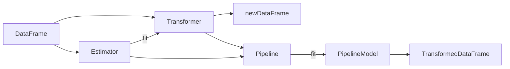

# Spark MLlib机器学习库原理与代码实例讲解

## 1.背景介绍

### 1.1 大数据时代的机器学习需求

在当今大数据时代,海量数据的产生和积累为机器学习的发展提供了前所未有的机遇。传统的机器学习算法和框架在处理大规模数据时往往力不从心,无法满足实时性、高可用性的需求。因此,迫切需要一种能够高效处理海量数据的分布式机器学习平台。

### 1.2 Spark的崛起

Apache Spark作为新一代大数据处理引擎,凭借其快速、通用、易用等特点迅速成为业界的宠儿。Spark基于内存计算,避免了不必要的I/O操作,处理速度较Hadoop MapReduce有了数量级的提升。同时Spark提供了丰富的API和类库,使得用户能够方便地在其上开发复杂的数据处理应用。

### 1.3 MLlib的诞生

机器学习是Spark的重要应用场景之一。为了让Spark更好地服务于机器学习,Spark团队开发了MLlib。MLlib是构建于Spark之上的分布式机器学习库,提供了常用的机器学习算法和工具,如分类、回归、聚类、协同过滤等,帮助用户快速构建大规模机器学习应用。

## 2.核心概念与联系

### 2.1 DataFrame

DataFrame是Spark SQL的核心数据结构,本质上是一个分布式的Row对象集合。它与关系型数据库中的二维表格类似,具有schema(即列名和类型)。DataFrame支持多种数据源,提供了类SQL的操作接口,可以方便地与MLlib进行集成。

### 2.2 Transformer

Transformer是一种可以将一个DataFrame转换为另一个DataFrame的算法。比如分类模型,它接收特征DataFrame,预测标签列,输出带有预测标签的新DataFrame。Transformer是MLlib的基本组成单元。

### 2.3 Estimator

Estimator是一种学习算法,它接收一个DataFrame,经过训练,生成一个Transformer。常见的Estimator包括LogisticRegression、DecisionTreeClassifier等。每个Estimator都有其对应的参数,如迭代次数、正则化系数等。

### 2.4 Pipeline

Pipeline可以将多个Transformer和Estimator串联成一个工作流,只需调用一次fit()方法即可训练整个Pipeline,生成一个PipelineModel。PipelineModel也是一个Transformer,可以用于数据转换。Pipeline简化了机器学习的工作流程,提高了代码的复用性和可维护性。

### 2.5 核心概念之间的关系

下面用一个Mermaid流程图来展示MLlib的核心概念之间的关系:



从上图可以看出,DataFrame是MLlib的数据基础,Transformer和Estimator是算法的实现,而Pipeline将它们有机地组织在一起,最终输出转换后的DataFrame。

## 3.核心算法原理具体操作步骤

下面以MLlib中的逻辑回归为例,介绍其原理和使用步骤。

### 3.1 逻辑回归原理

逻辑回归是一种常用的二分类算法,它利用Sigmoid函数将样本特征映射到0~1之间,作为样本属于正类的概率。给定样本特征向量$x$和权重向量$w$,逻辑回归的预测函数为:

$$
P(y=1|x) = \frac{1}{1+e^{-w^Tx}}
$$

逻辑回归的目标是找到最优的权重向量$w$,使得正样本的概率最大化,负样本的概率最小化。常用的优化方法有梯度下降法和牛顿法。

### 3.2 逻辑回归的具体步骤

1. 准备数据集,包括特征列和标签列。可以使用MLlib内置的数据集,如libsvm格式的文本文件。

2. 将数据集转换为DataFrame。使用spark.read.format("libsvm").load()方法可以直接读取libsvm格式的数据。

3. 创建逻辑回归的Estimator,设置参数。主要参数包括:
   - maxIter:最大迭代次数
   - regParam:L2正则化系数
   - elasticNetParam:L1正则化系数
   - threshold:阈值,预测概率大于它的为正样本

4. 调用Estimator的fit()方法,训练逻辑回归模型。fit()方法返回一个LogisticRegressionModel。

5. 在测试集上调用LogisticRegressionModel的transform()方法,生成预测结果。transform()返回一个新的DataFrame,多了预测标签列和概率列。

6. 评估模型性能。可以使用MulticlassClassificationEvaluator计算准确率、召回率、F1值等指标。

## 4.数学模型和公式详细讲解举例说明

这里对逻辑回归的损失函数和优化过程做进一步说明。

逻辑回归采用对数似然函数作为损失函数。对于二分类问题,样本$i$的标签$y_i \in \{0,1\}$,特征向量为$x_i$,逻辑回归的对数似然函数为:

$$
\ell(w) = \sum_{i=1}^n y_i \log(P(y_i=1|x_i)) + (1-y_i) \log(1-P(y_i=1|x_i))
$$

考虑L2正则化,目标函数可以写为:

$$
\min_w \frac{1}{n} \sum_{i=1}^n \log(1+e^{-y_i w^T x_i}) + \frac{\lambda}{2} \|w\|_2^2
$$

其中$\lambda$为正则化系数。

求解上述优化问题,需要计算目标函数对$w$的梯度:

$$
\nabla_w \ell(w) = \frac{1}{n} \sum_{i=1}^n (P(y_i=1|x_i) - y_i) x_i + \lambda w
$$

有了梯度表达式,就可以用梯度下降法迭代更新$w$:

$$
w := w - \alpha \nabla_w \ell(w)
$$

其中$\alpha$为学习率。

迭代多次直至收敛,就得到了逻辑回归的最优参数$w^*$。将$w^*$代入Sigmoid函数,就得到了新样本的预测概率。

## 5.项目实践：代码实例和详细解释说明

下面用Scala代码演示如何使用MLlib训练和评估一个逻辑回归模型。

```scala
import org.apache.spark.ml.classification.LogisticRegression
import org.apache.spark.ml.evaluation.MulticlassClassificationEvaluator
import org.apache.spark.sql.SparkSession

object LogisticRegressionExample {
  def main(args: Array[String]): Unit = {
    val spark = SparkSession.builder.appName("LogisticRegressionExample").getOrCreate()
    
    // 加载数据集
    val data = spark.read.format("libsvm").load("data/mllib/sample_libsvm_data.txt")
    
    // 划分训练集和测试集
    val Array(trainingData, testData) = data.randomSplit(Array(0.7, 0.3))
    
    // 创建逻辑回归estimator
    val lr = new LogisticRegression()
      .setMaxIter(10)
      .setRegParam(0.3)
      .setElasticNetParam(0.8)
      
    // 训练模型
    val lrModel = lr.fit(trainingData)
    
    // 在测试集上预测
    val predictions = lrModel.transform(testData)
    
    // 评估准确率
    val evaluator = new MulticlassClassificationEvaluator()
      .setLabelCol("label")
      .setPredictionCol("prediction")
      .setMetricName("accuracy")
    val accuracy = evaluator.evaluate(predictions)
    
    println(s"Test set accuracy = $accuracy")
    
    spark.stop()
  }
}
```

代码解释:

1. 导入需要的类。
2. 创建SparkSession对象spark。
3. 使用spark.read.format("libsvm").load()读取libsvm格式的数据集。
4. 使用randomSplit()方法将数据集随机划分为训练集(70%)和测试集(30%)。
5. 创建LogisticRegression的estimator,设置最大迭代次数、正则化参数等。
6. 调用LogisticRegression的fit()方法训练模型,得到LogisticRegressionModel。
7. 调用LogisticRegressionModel的transform()方法,在测试集上进行预测。
8. 创建MulticlassClassificationEvaluator,设置标签列名、预测结果列名、评估指标为"accuracy"。
9. 调用evaluator的evaluate()方法计算准确率。
10. 打印准确率,关闭spark。

可以看到,使用MLlib进行机器学习的过程非常简洁,代码也很容易理解。MLlib帮我们屏蔽了底层的分布式计算细节,使我们可以专注于算法本身的选择和调优。

## 6.实际应用场景

MLlib在各个领域都有广泛的应用,下面列举几个典型场景。

### 6.1 用户行为预测

在电商、社交网络等场景,MLlib可以用于预测用户的购买意向、流失概率等。比如根据用户的历史浏览、购买记录,训练一个逻辑回归模型,判断用户最感兴趣的商品类别。

### 6.2 金融风控

MLlib的分类算法可以用于贷款违约预测、信用卡欺诈检测等金融风控任务。比如根据用户的收入、负债、信用记录等特征,训练一个决策树模型,判断用户的违约风险等级。

### 6.3 推荐系统

MLlib提供了多种协同过滤算法,可以根据用户的历史评分数据,预测用户对新物品的偏好,实现个性化推荐。比如使用ALS算法,分解用户-物品评分矩阵,得到用户和物品的隐向量,再根据向量相似度生成推荐列表。

### 6.4 文本分类

MLlib可以处理大规模的文本数据,实现新闻分类、情感分析等功能。比如使用Word2Vec将文本转换为词向量,再用朴素贝叶斯算法训练分类模型,判断一篇文章的类别或情感倾向。

## 7.工具和资源推荐

除了MLlib,Spark生态系统中还有其他一些有用的机器学习工具和资源。

- **spark.ml包**:它是MLlib的高层API,提供了更加统一的Pipeline、Transformer、Estimator等抽象。spark.ml包正在逐步取代原有的mllib包。
- **TensorFrames**:它是一个将Spark DataFrame与TensorFlow无缝集成的库,可以在DataFrame上定义和训练TensorFlow模型。
- **BigDL**:它是一个分布式深度学习框架,可以直接在Spark上构建神经网络和深度学习管道。
- **Analytics Zoo**:它是一个面向大数据的统一AI平台,支持TensorFlow、Keras、PyTorch等多种深度学习框架,实现了端到端的深度学习应用开发。
- **MLSQL**:它是一个开源的SQL加AI平台,可以使用SQL语句完成数据预处理、模型训练、预测等全流程机器学习任务。

## 8.总结：未来发展趋势与挑战

MLlib作为Spark的机器学习子项目,经过多年的发展已经日趋成熟,成为了工业界广泛使用的分布式机器学习库。未来MLlib还将在以下几个方面持续演进。

### 8.1 API的进一步统一

目前MLlib同时存在RDD-based API(mllib包)和DataFrame-based API(spark.ml包)。从Spark 2.0开始,mllib包已经进入维护模式,新的开发主要集中在spark.ml包。未来mllib包可能会被彻底废弃,MLlib将以spark.ml包为主体,提供统一的基于DataFrame的API。

### 8.2 更多算法的加入

MLlib已经包含了数十种常用的机器学习算法,但是相比scikit-learn等单机算法库,MLlib在算法数量上还有一定差距。未来MLlib将引入更多的算法实现,如隐狄利克雷分布(LDA)、梯度提升树(GBT)、高斯混合模型(GMM)等,满足更多的应用场景。

### 8.3 深度学习的进一步集成

目前MLlib对深度学习的支持还比较有限,只有基础的多层感知机(MLP)。为了跟上深度学习的发展步伐,MLlib需要加强与主流深度学习框架的集成,提供分布式的深度学习算法。一种可能的方式是通过TensorFrames、BigDL等项目,打通Spark和TensorFlow、PyTorch的通道。

### 8.4 