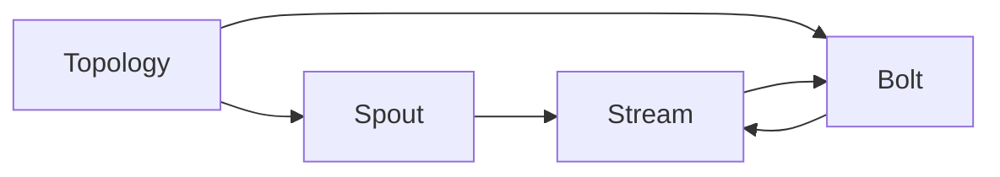

# Storm原理与代码实例讲解专栏文章标题：深入理解Storm实时流处理框架的原理、应用与实践

## 1.背景介绍
在当今大数据时代,海量数据的实时处理已成为许多企业和组织的迫切需求。Storm作为一个开源的分布式实时计算系统,为实时流数据处理提供了高效、可靠的解决方案。本文将深入探讨Storm的原理、应用场景以及实践操作,帮助读者全面了解这一强大的流处理框架。

### 1.1 大数据时代对实时流处理的需求
#### 1.1.1 海量数据的爆发式增长
#### 1.1.2 传统批处理模式的局限性
#### 1.1.3 实时流处理的优势与应用前景

### 1.2 Storm的诞生与发展
#### 1.2.1 Storm的起源与发展历程  
#### 1.2.2 Storm在业界的应用现状
#### 1.2.3 Storm与其他流处理框架的比较

## 2.核心概念与联系
要深入理解Storm,首先需要掌握其核心概念以及它们之间的关系。本章将详细阐述Storm的基本组件、数据模型以及并行处理机制。

### 2.1 Topology（拓扑）
#### 2.1.1 Topology的定义与结构
#### 2.1.2 Topology的构建与提交
#### 2.1.3 Topology的生命周期管理

### 2.2 Spout（数据源）
#### 2.2.1 Spout的功能与作用
#### 2.2.2 Spout的可靠性与容错机制  
#### 2.2.3 常见的Spout类型与实现

### 2.3 Bolt（处理单元）
#### 2.3.1 Bolt的功能与作用
#### 2.3.2 Bolt的执行模型与并行度
#### 2.3.3 常见的Bolt类型与实现

### 2.4 Stream（数据流）  
#### 2.4.1 Stream的定义与特性
#### 2.4.2 Stream的分组与分区策略
#### 2.4.3 Stream的可靠性与容错机制

### 2.5 并行处理与任务调度
#### 2.5.1 Storm的并行处理模型  
#### 2.5.2 任务的分配与执行
#### 2.5.3 任务调度策略与优化

### 2.6 Storm核心概念关系图


## 3.核心算法原理具体操作步骤
Storm的核心算法包括数据分组、流式窗口、事务性拓扑等,本章将详细讲解这些算法的原理与具体实现步骤。

### 3.1 数据分组算法
#### 3.1.1 Fields Grouping
#### 3.1.2 Shuffle Grouping 
#### 3.1.3 All Grouping
#### 3.1.4 Custom Grouping

### 3.2 流式窗口算法
#### 3.2.1 滑动窗口
#### 3.2.2 滚动窗口  
#### 3.2.3 会话窗口
#### 3.2.4 窗口的触发与计算

### 3.3 事务性拓扑算法
#### 3.3.1 事务性拓扑的概念与原理
#### 3.3.2 事务性Spout与Bolt的实现
#### 3.3.3 事务性消息的处理与确认
#### 3.3.4 事务性拓扑的容错机制

## 4.数学模型和公式详细讲解举例说明
Storm的很多核心功能都基于严谨的数学模型和公式,本章将通过具体的例子来讲解这些数学原理。

### 4.1 数据流模型
#### 4.1.1 数据流的形式化定义
数据流可以表示为一个三元组 $S=(D,T,F)$,其中:
- $D$ 表示数据元素的集合
- $T$ 表示时间戳的集合
- $F$ 表示数据流中元素的顺序关系,即 $F \subseteq D \times T$

#### 4.1.2 数据流的运算与变换
对数据流可以进行各种运算,例如:
- 映射(Map):将函数应用于数据流中的每个元素,得到新的数据流。形式化定义为:
$$\text{Map}(S,f)=\{(f(d),t)|(d,t) \in S\}$$
- 过滤(Filter):根据指定条件选择数据流中的元素,得到子数据流。形式化定义为:
$$\text{Filter}(S,p)=\{(d,t)|(d,t) \in S \wedge p(d)=\text{true}\}$$

### 4.2 流式窗口模型
#### 4.2.1 时间窗口
时间窗口根据时间戳划分数据流,常见的时间窗口包括:
- 滚动窗口:将时间轴分割为固定长度的时间片,每个时间片对应一个窗口。
- 滑动窗口:在滚动窗口的基础上,允许窗口有重叠。滑动窗口用二元组 $(w,s)$ 表示,其中 $w$ 为窗口长度,$s$ 为滑动步长。

#### 4.2.2 计数窗口
计数窗口根据数据元素的数量划分数据流,常见的计数窗口包括:
- 滚动计数窗口:每 $n$ 个元素划分为一个窗口。
- 滑动计数窗口:在滚动计数窗口的基础上,允许窗口有重叠。用二元组 $(w,s)$ 表示,其中 $w$ 为窗口大小,$s$ 为滑动步长。

### 4.3 数据分组与调度模型
#### 4.3.1 数据分组策略
Storm支持多种数据分组策略,常用的有:  
- Fields Grouping:按指定字段的值进行分组。假设数据元素有 $k$ 个字段,第 $i$ 个字段的值为 $v_i$,则哈希值为:
$$\text{hash}(v_1,\ldots,v_k) \bmod n$$
其中 $n$ 为下游Bolt的任务数。
- Shuffle Grouping:随机均匀分配到下游Bolt的任务。假设有 $m$ 个数据元素,下游有 $n$ 个任务,则第 $i$ 个元素分配给第 $j$ 个任务的概率为:
$$P(i,j)=\frac{1}{n}, \quad i=1,\ldots,m; \; j=1,\ldots,n$$

#### 4.3.2 任务调度策略
Storm的任务调度主要涉及Executor与Worker之间的分配问题。假设Topology有 $n$ 个组件,第 $i$ 个组件并行度为 $p_i$,则Executor总数为:
$$\sum_{i=1}^n p_i$$
Storm会根据用户配置的Worker数量,尽量均匀地将Executor分配到Worker上,同时考虑负载均衡、资源约束等因素。  

## 5.项目实践：代码实例和详细解释说明
本章将通过一个实际的项目案例,演示如何使用Storm进行实时流数据处理。我们将构建一个实时日志分析系统,对服务器产生的日志进行实时解析、过滤、聚合与统计。

### 5.1 项目需求与架构设计
#### 5.1.1 项目背景与需求分析
#### 5.1.2 系统架构设计
#### 5.1.3 Storm拓扑结构设计

### 5.2 开发环境搭建
#### 5.2.1 JDK与Maven配置
#### 5.2.2 Storm集群搭建
#### 5.2.3 IDE工具选择与配置

### 5.3 核心代码实现
#### 5.3.1 日志输入Spout实现
```java
public class LogSpout extends BaseRichSpout {
    // 省略其他代码
    public void nextTuple() {
        // 从日志源读取数据并发射
        String log = readLog();
        collector.emit(new Values(log));
    }
    // 省略其他代码
}
```

#### 5.3.2 日志解析Bolt实现
```java
public class LogParseBolt extends BaseBasicBolt {
    // 省略其他代码  
    public void execute(Tuple tuple, BasicOutputCollector collector) {
        String log = tuple.getString(0);
        // 解析日志字段
        String[] fields = parseLog(log); 
        collector.emit(new Values(fields));
    }
    // 省略其他代码
}
```

#### 5.3.3 字段过滤Bolt实现
```java
public class FieldFilterBolt extends BaseBasicBolt {
    // 省略其他代码
    public void execute(Tuple tuple, BasicOutputCollector collector) {
        // 根据指定字段过滤
        if (tuple.getStringByField("level").equals("ERROR")) {
            collector.emit(tuple.getValues());  
        }
    }
    // 省略其他代码
}
```

#### 5.3.4 统计汇总Bolt实现  
```java
public class CountAggBolt extends BaseWindowedBolt {
    // 省略其他代码
    public void execute(TupleWindow inputWindow) {
        // 对窗口内的数据进行统计
        long count = inputWindow.get().size();
        collector.emit(new Values(count));
    }
    // 省略其他代码  
}
```

### 5.4 拓扑构建与提交
```java
public class LogAnalysisTopology {
    public static void main(String[] args) {
        // 创建拓扑
        TopologyBuilder builder = new TopologyBuilder();
        builder.setSpout("logSpout", new LogSpout());
        builder.setBolt("parseBolt", new LogParseBolt()).shuffleGrouping("logSpout");
        builder.setBolt("filterBolt", new FieldFilterBolt()).fieldsGrouping("parseBolt", new Fields("level"));
        builder.setBolt("countBolt", new CountAggBolt().withWindow(new Duration(10, TimeUnit.SECONDS), new Duration(5, TimeUnit.SECONDS))).globalGrouping("filterBolt");

        // 提交拓扑
        Config conf = new Config(); 
        conf.setNumWorkers(2);
        StormSubmitter.submitTopology("LogAnalysis", conf, builder.createTopology());
    }
}
```

### 5.5 测试与运行结果分析
#### 5.5.1 拓扑运行与测试
#### 5.5.2 结果验证与分析
#### 5.5.3 性能优化与改进

## 6.实际应用场景
Storm凭借其强大的实时处理能力,在多个领域得到了广泛应用。本章将介绍几个典型的Storm应用场景。

### 6.1 实时金融风控
#### 6.1.1 实时欺诈检测
#### 6.1.2 实时风险评估
#### 6.1.3 反洗钱监控

### 6.2 实时推荐系统
#### 6.2.1 用户行为实时分析
#### 6.2.2 实时个性化推荐
#### 6.2.3 推荐效果实时反馈

### 6.3 实时舆情监控
#### 6.3.1 社交媒体数据实时采集  
#### 6.3.2 实时情感分析
#### 6.3.3 热点话题发现与跟踪

### 6.4 物联网实时数据处理
#### 6.4.1 传感器数据实时分析
#### 6.4.2 设备状态实时监控
#### 6.4.3 异常情况实时预警

## 7.工具和资源推荐
### 7.1 Storm官方文档与资源
#### 7.1.1 Storm官网与文档
#### 7.1.2 Storm Github社区
#### 7.1.3 Storm邮件列表

### 7.2 第三方工具与框架  
#### 7.2.1 Flux：Storm拓扑的声明式定义工具
#### 7.2.2 StreamFlow：Storm的Web管理界面
#### 7.2.3 Apache Kafka：常用的Storm数据源  

### 7.3 学习资源推荐
#### 7.3.1 官方示例与Demo
#### 7.3.2 网络课程与教程
#### 7.3.3 经典书籍推荐
- 《Storm分布式实时计算模式》
- 《Storm技术内幕与大数据实践》
- 《Storm Blueprints: Patterns for Distributed Real-time Computation》

## 8.总结：未来发展趋势与挑战
### 8.1 流计算技术的发展趋势
#### 8.1.1 流批一体化处理
#### 8.1.2 SQL化与标准化
#### 8.1.3 与机器学习、人工智能的结合

### 8.2 Storm面临的机遇与挑战
#### 8.2.1 与Flink、Spark Streaming等的竞争
#### 8.2.2 社区生态建设
#### 8.2.3 应用场景拓展  

### 8.3 总结与展望
Storm作为流式计算领域的先驱,以其简洁的编程模型、灵活的部署方式以及可靠的容错机制,赢得了广泛的用户群