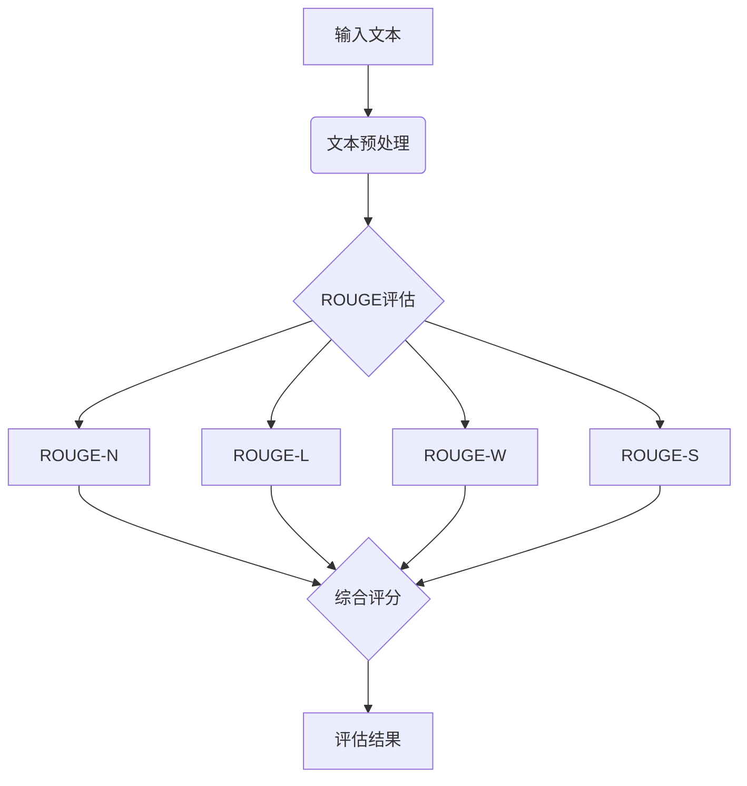

# Transformer大模型实战 理解ROUGE 评估指标

## 1. 背景介绍

随着自然语言处理(NLP)技术的飞速发展,以Transformer为代表的大语言模型(LLM)在文本生成、机器翻译、文本摘要等任务中取得了令人瞩目的成果。而评估生成文本的质量一直是NLP领域的一大挑战。ROUGE(Recall-Oriented Understudy for Gisting Evaluation)作为一种经典的自动评估指标,在文本摘要、机器翻译等任务中被广泛应用。本文将深入探讨ROUGE评估指标的原理,并结合Transformer模型在文本摘要任务中的实战,帮助读者全面理解ROUGE指标的应用。

### 1.1 NLP的发展历程
#### 1.1.1 早期的统计语言模型
#### 1.1.2 深度学习时代的神经网络语言模型  
#### 1.1.3 Transformer的革命性突破

### 1.2 文本摘要任务简介
#### 1.2.1 摘要的定义与分类
#### 1.2.2 摘要的应用场景
#### 1.2.3 摘要任务面临的挑战

### 1.3 自动评估指标概述
#### 1.3.1 人工评估的局限性
#### 1.3.2 自动评估指标的优势 
#### 1.3.3 常见的自动评估指标

## 2. 核心概念与联系

### 2.1 ROUGE家族
#### 2.1.1 ROUGE-N
#### 2.1.2 ROUGE-L
#### 2.1.3 ROUGE-W
#### 2.1.4 ROUGE-S

### 2.2 ROUGE与BLEU的异同
#### 2.2.1 基本原理对比
#### 2.2.2 适用场景差异
#### 2.2.3 评估角度比较

### 2.3 ROUGE与人工评估的关系
#### 2.3.1 ROUGE与人工评分的相关性
#### 2.3.2 ROUGE的局限性
#### 2.3.3 人机结合评估的必要性



## 3. 核心算法原理具体操作步骤

### 3.1 ROUGE-N的计算步骤
#### 3.1.1 生成摘要与参考摘要的n-gram集合
#### 3.1.2 计算n-gram的重叠数量
#### 3.1.3 计算精确率、召回率和F1值

### 3.2 ROUGE-L的计算步骤 
#### 3.2.1 构建最长公共子序列(LCS)
#### 3.2.2 计算LCS的长度
#### 3.2.3 计算精确率、召回率和F1值

### 3.3 ROUGE-W的计算步骤
#### 3.3.1 引入权重因子
#### 3.3.2 计算加权的LCS长度
#### 3.3.3 计算加权的精确率、召回率和F1值

### 3.4 ROUGE-S的计算步骤
#### 3.4.1 提取skip-bigram 
#### 3.4.2 计算skip-bigram的重叠数量
#### 3.4.3 计算精确率、召回率和F1值

## 4. 数学模型和公式详细讲解举例说明

### 4.1 ROUGE-N的数学模型
- N-gram重叠数量:
$Count_{overlap}(gram_n) = \sum_{gram_n \in S}Count_{match}(gram_n)$

- 精确率:  
$P_n = \frac{\sum_{S\in\{ReferenceSummaries\}}Count_{overlap}(gram_n)}{\sum_{S\in\{ReferenceSummaries\}}Count(gram_n)}$

- 召回率:
$R_n = \frac{\sum_{S\in\{ReferenceSummaries\}}Count_{overlap}(gram_n)}{\sum_{S'\in\{GeneratedSummary\}}Count(gram_n)}$

- F1值:
$F_n = \frac{2P_nR_n}{P_n+R_n}$

### 4.2 ROUGE-L的数学模型
- 最长公共子序列长度:
$LCS(X,Y)=\left\{
\begin{array}{ll}
0 & \text{if } i=0 \text{ or } j=0\\
LCS(X_{i-1},Y_{j-1})+1 & \text{if } x_i=y_j\\  
max(LCS(X_i,Y_{j-1}),LCS(X_{i-1},Y_j)) & \text{if } x_i \neq y_j
\end{array} \right.$

- 精确率:
$P_{lcs} = \frac{LCS(X,Y)}{m}$

- 召回率: 
$R_{lcs} = \frac{LCS(X,Y)}{n}$  

- F1值:
$F_{lcs} = \frac{2P_{lcs}R_{lcs}}{P_{lcs}+R_{lcs}}$

### 4.3 ROUGE-W的数学模型
- 加权的LCS长度:
$WLCS(X,Y) = \frac{LCS(X,Y)}{LCS(X,X)}f^*(|X|+|Y|-LCS(X,Y))$

- 加权的精确率、召回率和F1值:
$$P_w = f(P_{lcs},\frac{LCS(X,Y)}{LCS(X,X)})$$
$$R_w = f(R_{lcs},\frac{LCS(X,Y)}{LCS(Y,Y)})$$  
$$F_w = \frac{2P_wR_w}{P_w+R_w}$$

### 4.4 ROUGE-S的数学模型
- Skip-bigram重叠数量:
$Count_{skip2}(X,Y)=\sum_{s\in S_{skip2}(X)}\sum_{s'\in S_{skip2}(Y)} I(s,s')$

- 精确率:
$P_{skip2}=\frac{Count_{skip2}(X,Y)}{C(m,2)}$

- 召回率:
$R_{skip2}=\frac{Count_{skip2}(X,Y)}{C(n,2)}$

- F1值:  
$F_{skip2} = \frac{2P_{skip2}R_{skip2}}{P_{skip2}+R_{skip2}}$

## 5. 项目实践：代码实例和详细解释说明

### 5.1 使用Python实现ROUGE评估
```python
from rouge import Rouge

def evaluate_rouge(generated_summary, reference_summary):
    rouge = Rouge()
    scores = rouge.get_scores(generated_summary, reference_summary)
    print("ROUGE Scores:", scores)

# 示例用法
generated_summary = "This is a generated summary."
reference_summary = "This is the reference summary."
evaluate_rouge(generated_summary, reference_summary)
```

### 5.2 在Transformer模型中应用ROUGE评估
```python
import torch
from transformers import T5Tokenizer, T5ForConditionalGeneration
from rouge import Rouge 

def summarize_and_evaluate(text):
    # 加载预训练的T5模型和分词器
    model = T5ForConditionalGeneration.from_pretrained('t5-base')
    tokenizer = T5Tokenizer.from_pretrained('t5-base')

    # 对输入文本进行编码
    input_ids = tokenizer.encode(text, return_tensors='pt')

    # 生成摘要
    summary_ids = model.generate(input_ids)
    generated_summary = tokenizer.decode(summary_ids[0], skip_special_tokens=True)

    # 使用ROUGE评估生成的摘要
    rouge = Rouge()
    scores = rouge.get_scores(generated_summary, text)
    
    return generated_summary, scores

# 示例用法  
text = "This is a long article that needs to be summarized..."
summary, scores = summarize_and_evaluate(text)
print("Generated Summary:", summary)
print("ROUGE Scores:", scores)
```

## 6. 实际应用场景

### 6.1 新闻摘要生成与评估
#### 6.1.1 新闻文章自动摘要
#### 6.1.2 不同模型生成摘要的质量比较

### 6.2 学术论文摘要生成与评估
#### 6.2.1 论文摘要自动生成
#### 6.2.2 不同领域论文摘要质量评估

### 6.3 会议记录摘要生成与评估
#### 6.3.1 会议记录关键信息提取
#### 6.3.2 不同会议记录摘要质量对比

## 7. 工具和资源推荐

### 7.1 ROUGE评估工具
- Python ROUGE实现: [https://github.com/pltrdy/rouge](https://github.com/pltrdy/rouge)
- Java ROUGE实现: [https://github.com/kavgan/ROUGE-2.0](https://github.com/kavgan/ROUGE-2.0)

### 7.2 文本摘要数据集
- CNN/Daily Mail数据集: [https://github.com/abisee/cnn-dailymail](https://github.com/abisee/cnn-dailymail) 
- Gigaword语料库: [https://catalog.ldc.upenn.edu/LDC2012T21](https://catalog.ldc.upenn.edu/LDC2012T21)

### 7.3 预训练的文本摘要模型
- BERT-based Summarization模型: [https://github.com/nlpyang/PreSumm](https://github.com/nlpyang/PreSumm)
- T5 for Summarization模型: [https://huggingface.co/t5-base](https://huggingface.co/t5-base)

## 8. 总结：未来发展趋势与挑战

### 8.1 更加贴近人类判断的评估指标
#### 8.1.1 语义相似度的考量
#### 8.1.2 可读性与连贯性的评估

### 8.2 多样性与新颖性的评估
#### 8.2.1 生成摘要的多样性评估
#### 8.2.2 摘要的新颖性与原创性评估

### 8.3 跨语言摘要评估的挑战
#### 8.3.1 不同语言的语法差异
#### 8.3.2 语义对齐与评估的困难

## 9. 附录：常见问题与解答

### 9.1 ROUGE评估是否可以完全取代人工评估？
- ROUGE评估有其局限性,无法完全取代人工评估,但可作为人工评估的重要补充。

### 9.2 如何选择合适的ROUGE指标？
- 根据任务类型和关注重点选择合适的ROUGE指标,如生成式摘要常用ROUGE-N,提取式摘要常用ROUGE-L。

### 9.3 ROUGE评估对摘要长度是否敏感？
- ROUGE评估对摘要长度较为敏感,过短或过长的摘要可能导致ROUGE值偏低。

作者：禅与计算机程序设计艺术 / Zen and the Art of Computer Programming