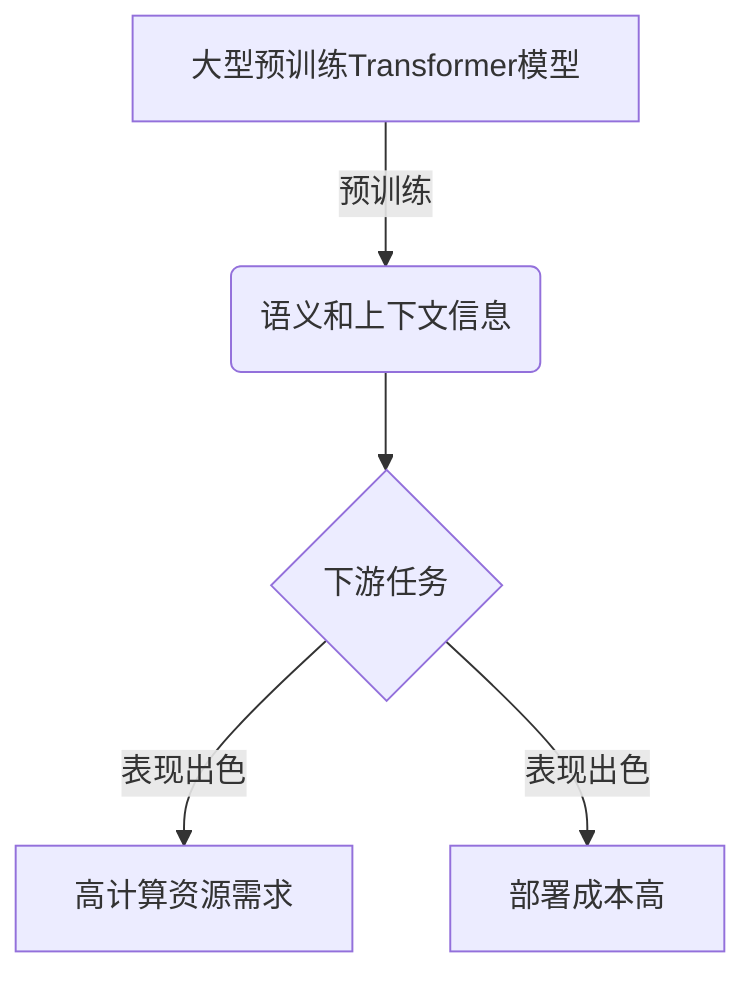
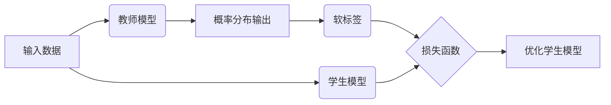

# Transformer大模型实战 通过知识蒸馏迁移多语言嵌入

## 1.背景介绍

随着人工智能技术的快速发展,大型预训练语言模型(如BERT、GPT等)已经在自然语言处理(NLP)领域取得了巨大的成功。然而,这些模型通常需要大量的计算资源和海量的训练数据,导致了训练和部署的高昂成本。为了解决这一问题,知识蒸馏(Knowledge Distillation)技术应运而生。

知识蒸馏是一种模型压缩技术,旨在将一个大型复杂模型(教师模型)中蕴含的知识迁移到一个小型高效的模型(学生模型)中。通过这种方式,我们可以在保持学生模型性能的同时,大幅度降低计算资源的需求,从而实现更高效、更便携的模型部署。

在多语言场景下,知识蒸馏技术可以帮助我们将大型多语言预训练模型中的知识有效迁移到小型的多语言嵌入模型中。这不仅可以减少模型的计算开销,还能提高跨语言应用的性能和可扩展性。

## 2.核心概念与联系

### 2.1 Transformer大模型

Transformer是一种全新的基于注意力机制(Attention Mechanism)的神经网络架构,被广泛应用于自然语言处理、计算机视觉等领域。与传统的循环神经网络(RNN)相比,Transformer具有并行计算能力更强、捕获长距离依赖关系更好等优势。

大型预训练Transformer模型(如BERT、GPT等)通过在大规模语料库上进行预训练,学习到了丰富的语义和上下文信息。这些模型在下游任务上表现出色,但同时也存在计算资源需求高、部署成本昂贵等问题。



### 2.2 知识蒸馏

知识蒸馏的核心思想是利用一个大型复杂的教师模型(Teacher Model)来指导一个小型高效的学生模型(Student Model)的训练过程。具体来说,我们首先使用教师模型对输入数据进行预测,并记录下教师模型的输出(通常是一个概率分布)。然后,我们将这个概率分布作为"软标签"(Soft Label),与学生模型的输出进行比较,并最小化它们之间的差异。通过这种方式,学生模型可以学习到教师模型中蕴含的知识,从而在保持较高性能的同时大幅降低计算开销。



### 2.3 多语言嵌入

在自然语言处理领域,将单词或短语映射到一个固定长度的密集向量空间中,称为词嵌入(Word Embedding)。多语言嵌入(Multilingual Embedding)则是将多种语言的单词或短语映射到同一个共享的向量空间中,从而捕获不同语言之间的语义相似性。

多语言嵌入模型通常基于大型多语言语料库进行预训练,能够有效地处理跨语言的自然语言处理任务,如机器翻译、跨语言文本分类等。然而,这些模型往往体积庞大,计算资源需求高,因此将知识蒸馏技术应用于多语言嵌入模型压缩就显得尤为重要。

## 3.核心算法原理具体操作步骤

知识蒸馏技术在多语言嵌入模型压缩中的核心步骤如下:

1. **选择教师模型和学生模型**

   首先,我们需要选择一个大型的多语言预训练模型作为教师模型,以及一个小型的多语言嵌入模型作为学生模型。教师模型应具有出色的性能表现,而学生模型则需要具有较小的模型尺寸和较低的计算复杂度。

2. **生成教师模型的软标签**

   我们将训练数据输入到教师模型中,获取教师模型对于每个输入样本的输出概率分布,即软标签。这些软标签包含了教师模型对于输入数据的理解和判断。

3. **构建知识蒸馏损失函数**

   我们需要定义一个损失函数,用于衡量学生模型的输出与教师模型的软标签之间的差异。常见的损失函数包括交叉熵损失(Cross-Entropy Loss)、均方误差损失(Mean Squared Error Loss)等。

4. **训练学生模型**

   在训练过程中,我们将输入数据同时输入到学生模型和教师模型中。然后,我们计算学生模型的输出与教师模型的软标签之间的损失,并通过反向传播算法优化学生模型的参数,使其逐步逼近教师模型的行为。

5. **模型评估和微调**

   在训练过程中,我们需要定期评估学生模型在验证集或测试集上的性能表现。根据评估结果,我们可以对学生模型进行进一步的微调,如调整超参数、增加训练轮次等,以达到更好的性能。

6. **模型部署**

   最后,我们可以将训练好的小型高效的学生模型部署到实际的应用场景中,如移动设备、边缘计算设备等,从而实现低成本、高效率的多语言自然语言处理任务。

## 4.数学模型和公式详细讲解举例说明

在知识蒸馏过程中,我们需要定义一个损失函数来衡量学生模型的输出与教师模型的软标签之间的差异。常见的损失函数包括交叉熵损失和均方误差损失。

### 4.1 交叉熵损失

交叉熵损失(Cross-Entropy Loss)是一种常用的衡量两个概率分布之间差异的指标。在知识蒸馏中,我们将教师模型的软标签视为"真实"的概率分布,而学生模型的输出则视为"预测"的概率分布。交叉熵损失函数可以表示如下:

$$
\mathcal{L}_{CE}(y, \hat{y}) = -\sum_{i=1}^{C} y_i \log(\hat{y}_i)
$$

其中,$$y$$表示教师模型的软标签概率分布,$$\hat{y}$$表示学生模型的输出概率分布,$$C$$是输出类别的数量。

例如,假设我们有一个三分类问题,教师模型的软标签为$$y = [0.1, 0.6, 0.3]$$,学生模型的输出为$$\hat{y} = [0.2, 0.5, 0.3]$$,则交叉熵损失为:

$$
\begin{aligned}
\mathcal{L}_{CE}([0.1, 0.6, 0.3], [0.2, 0.5, 0.3]) &= -0.1 \log(0.2) - 0.6 \log(0.5) - 0.3 \log(0.3) \\
&= -0.1 \times (-1.609) - 0.6 \times (-0.693) - 0.3 \times (-1.204) \\
&= 0.161 + 0.416 + 0.361 \\
&= 0.938
\end{aligned}
$$

我们的目标是最小化这个损失函数,使学生模型的输出尽可能接近教师模型的软标签。

### 4.2 均方误差损失

均方误差损失(Mean Squared Error Loss)是另一种常用的衡量两个向量之间差异的指标。在知识蒸馏中,我们可以将教师模型的软标签和学生模型的输出都视为向量,并计算它们之间的均方误差损失。均方误差损失函数可以表示如下:

$$
\mathcal{L}_{MSE}(y, \hat{y}) = \frac{1}{n} \sum_{i=1}^{n} (y_i - \hat{y}_i)^2
$$

其中,$$y$$表示教师模型的软标签向量,$$\hat{y}$$表示学生模型的输出向量,$$n$$是向量的长度。

例如,假设我们有一个三分类问题,教师模型的软标签为$$y = [0.1, 0.6, 0.3]$$,学生模型的输出为$$\hat{y} = [0.2, 0.5, 0.3]$$,则均方误差损失为:

$$
\begin{aligned}
\mathcal{L}_{MSE}([0.1, 0.6, 0.3], [0.2, 0.5, 0.3]) &= \frac{1}{3} \left( (0.1 - 0.2)^2 + (0.6 - 0.5)^2 + (0.3 - 0.3)^2 \right) \\
&= \frac{1}{3} \left( 0.01 + 0.01 + 0 \right) \\
&= 0.0067
\end{aligned}
$$

同样,我们的目标是最小化这个损失函数,使学生模型的输出尽可能接近教师模型的软标签。

在实际应用中,我们可以根据具体的任务和数据特征选择合适的损失函数,或者组合多种损失函数,以获得更好的知识蒸馏效果。

## 5.项目实践:代码实例和详细解释说明

在这一部分,我们将提供一个基于PyTorch框架的知识蒸馏示例代码,用于将一个大型的多语言BERT模型(教师模型)中的知识迁移到一个小型的FastText模型(学生模型)中。我们将使用一个跨语言文本分类任务作为示例。

### 5.1 导入所需库

```python
import torch
import torch.nn as nn
import torch.optim as optim
from transformers import BertModel, BertTokenizer
from fasttext import load_model
```

我们将使用PyTorch作为深度学习框架,并从Hugging Face的Transformers库中导入BERT模型和tokenizer。同时,我们还将使用FastText库来加载预训练的多语言FastText模型。

### 5.2 定义教师模型和学生模型

```python
# 教师模型: BERT
teacher_model = BertModel.from_pretrained('bert-base-multilingual-cased')
teacher_model.eval()  # 设置为评估模式

# 学生模型: FastText
student_model = load_model('path/to/fasttext.bin')
student_model = nn.Sequential(
    student_model,
    nn.Linear(student_model.get_dimension(), num_classes)
)
```

我们从预训练的BERT多语言模型中加载教师模型,并将其设置为评估模式。对于学生模型,我们首先加载预训练的FastText多语言模型,然后添加一个全连接层作为分类器头。

### 5.3 定义知识蒸馏损失函数

```python
def knowledge_distillation_loss(student_logits, teacher_logits, temp=2.0):
    """
    计算知识蒸馏损失函数
    """
    student_log_probs = nn.functional.log_softmax(student_logits / temp, dim=-1)
    teacher_probs = nn.functional.softmax(teacher_logits / temp, dim=-1)
    loss = nn.KLDivLoss(reduction='batchmean')(student_log_probs, teacher_probs) * temp * temp
    return loss
```

在这个示例中,我们使用了KL散度(Kullback-Leibler Divergence)作为知识蒸馏损失函数。我们首先对教师模型和学生模型的logits进行温度缩放(Temperature Scaling),然后计算学生模型的log_probs与教师模型的probs之间的KL散度。最后,我们对损失函数进行了温度缩放的反操作。

### 5.4 训练循环

```python
optimizer = optim.Adam(student_model.parameters(), lr=0.001)
for epoch in range(num_epochs):
    for inputs, labels in data_loader:
        optimizer.zero_grad()

        # 前向传播
        teacher_outputs = teacher_model(inputs)[0]  # BERT输出
        student_outputs = student_model(inputs)

        # 计算损失
        loss = knowledge_distillation_loss(student_outputs, teacher_outputs)

        # 反向传播和优化
        loss.backward()
        optimizer.step()

    # 评估模型性能
    evaluate(student_model, val_loader)
```

在训练循环中,我们首先将输入数据传递给教师模型和学生模型,分别获取它们的输出。然后,我们计算知识蒸馏损失函数,并通过反向传播算法优化学生模型的参数。在每个epoch结束