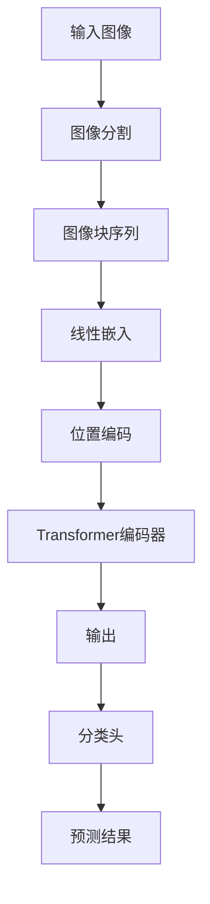

# ViT原理与代码实例讲解

## 1.背景介绍

随着深度学习的不断发展,卷积神经网络(CNN)在计算机视觉任务中取得了巨大的成功。然而,CNN存在一些固有的局限性,例如对长程依赖建模能力较差、缺乏位置信息等。为了解决这些问题,2020年谷歌的研究人员提出了Vision Transformer(ViT),这是第一个将Transformer应用于计算机视觉任务的模型。

ViT的提出打破了CNN在计算机视觉领域的垄断地位,为视觉任务的建模开辟了新的思路。它利用Transformer的自注意力机制,能够有效地捕捉图像中的长程依赖关系,同时通过位置编码注入位置信息。ViT在多个视觉基准测试中表现出色,证明了Transformer在计算机视觉领域的巨大潜力。

## 2.核心概念与联系

### 2.1 Transformer模型

Transformer最初是为自然语言处理(NLP)任务而设计的,它完全基于注意力机制,不依赖于循环神经网络(RNN)或卷积操作。Transformer的核心组件是多头自注意力机制和前馈神经网络,通过这两个组件的交替堆叠,可以有效地捕捉输入序列中的长程依赖关系。

### 2.2 Vision Transformer

Vision Transformer(ViT)是将Transformer应用于计算机视觉任务的尝试。与NLP任务不同,图像是二维的,因此需要对图像进行特殊的处理。ViT首先将图像分割为多个patch(图像块),然后将这些patch展平并投射到一个线性嵌入空间中。接着,ViT在这些嵌入上应用标准的Transformer编码器,以捕捉patch之间的关系。

### 2.3 位置编码

由于Transformer缺乏对输入序列位置信息的建模能力,因此需要引入位置编码来提供位置信息。在ViT中,位置编码是通过将可学习的位置嵌入与patch嵌入相加的方式注入的。这种方法保留了Transformer的平移不变性,同时为模型提供了位置信息。

## 3.核心算法原理具体操作步骤

ViT的核心算法原理可以分为以下几个步骤:

1. **图像分割**: 将输入图像分割为多个固定大小的patch(图像块)。
2. **线性嵌入**: 将每个patch展平,并通过一个可学习的线性投影层映射到一个嵌入空间中,得到patch嵌入。
3. **位置编码**: 为每个patch嵌入添加可学习的位置编码,以提供位置信息。
4. **Transformer编码器**: 将包含位置信息的patch嵌入输入到标准的Transformer编码器中,进行自注意力计算和前馈神经网络操作。
5. **分类头**: 在Transformer编码器的输出上应用一个分类头(例如多层感知机),对输出进行分类或回归任务。

下面是ViT算法的详细步骤:

1. **图像分割**:
   - 将输入图像$X \in \mathbb{R}^{H \times W \times C}$分割为$N$个patch,其中$N = HW/P^2$,P是patch的大小。
   - 每个patch的大小为$P \times P \times C$。

2. **线性嵌入**:
   - 将每个patch展平为一个向量$x_p \in \mathbb{R}^{P^2 \cdot C}$。
   - 通过一个可学习的线性投影层$E$,将每个patch向量映射到嵌入空间中,得到patch嵌入$z_p = Ex_p + b_p$,其中$b_p$是可学习的位置偏置项。

3. **位置编码**:
   - 为每个patch嵌入添加可学习的位置编码$\text{pos}_p \in \mathbb{R}^D$,其中$D$是嵌入维度。
   - 得到包含位置信息的patch嵌入$\tilde{z}_p = z_p + \text{pos}_p$。

4. **Transformer编码器**:
   - 将包含位置信息的patch嵌入$\{\tilde{z}_p\}_{p=1}^N$输入到标准的Transformer编码器中。
   - Transformer编码器由多个编码器层组成,每个编码器层包含一个多头自注意力子层和一个前馈神经网络子层。
   - 编码器的输出为$\{y_p\}_{p=1}^N$,其中$y_p \in \mathbb{R}^D$。

5. **分类头**:
   - 对于图像分类任务,将编码器的输出$\{y_p\}_{p=1}^N$平均池化为一个向量$y \in \mathbb{R}^D$。
   - 通过一个多层感知机(MLP)分类头,对$y$进行分类:$\hat{y} = \text{MLP}(y)$,其中$\hat{y}$是预测的类别概率分布。

ViT算法的核心在于利用Transformer的自注意力机制来捕捉patch之间的长程依赖关系,同时通过可学习的位置编码注入位置信息。这种设计使ViT能够有效地处理图像数据,并在多个视觉基准测试中取得了出色的表现。

## 4.数学模型和公式详细讲解举例说明

### 4.1 多头自注意力机制

多头自注意力机制是Transformer的核心组件之一,它允许模型同时关注输入序列中的不同位置。具体来说,给定一个输入序列$X = \{x_1, x_2, \dots, x_n\}$,其中$x_i \in \mathbb{R}^{d_\text{model}}$是$d_\text{model}$维的向量表示,多头自注意力机制的计算过程如下:

1. 将输入序列$X$线性投影到查询(Query)、键(Key)和值(Value)空间中,得到$Q$、$K$和$V$:

   $$Q = XW^Q, K = XW^K, V = XW^V$$

   其中$W^Q \in \mathbb{R}^{d_\text{model} \times d_k}$、$W^K \in \mathbb{R}^{d_\text{model} \times d_k}$和$W^V \in \mathbb{R}^{d_\text{model} \times d_v}$是可学习的线性投影矩阵,分别用于计算查询、键和值。

2. 计算注意力分数矩阵$A$:

   $$A = \text{softmax}\left(\frac{QK^\top}{\sqrt{d_k}}\right)$$

   其中$\sqrt{d_k}$是用于缩放的因子,以防止过大或过小的注意力分数。

3. 计算注意力加权值$Z$:

   $$Z = AV$$

   $Z$是对值$V$进行注意力加权的结果,它捕捉了输入序列中不同位置之间的依赖关系。

4. 多头注意力机制通过并行运行多个注意力头,每个头对输入序列进行不同的线性投影,然后将所有头的输出进行拼接,得到最终的多头注意力输出:

   $$\text{MultiHead}(X) = \text{Concat}(Z_1, Z_2, \dots, Z_h)W^O$$

   其中$h$是注意力头的数量,每个$Z_i$是一个注意力头的输出,而$W^O \in \mathbb{R}^{hd_v \times d_\text{model}}$是一个可学习的线性投影矩阵,用于将多头注意力输出映射回$d_\text{model}$维空间。

多头自注意力机制允许模型同时关注输入序列中的不同位置,并捕捉它们之间的依赖关系。在ViT中,这种机制被应用于patch嵌入序列,以捕捉不同patch之间的长程依赖关系。

### 4.2 位置编码

由于Transformer缺乏对输入序列位置信息的建模能力,因此需要引入位置编码来提供位置信息。在ViT中,位置编码是通过将可学习的位置嵌入与patch嵌入相加的方式注入的。

具体来说,对于每个patch嵌入$z_p \in \mathbb{R}^D$,ViT会为其添加一个可学习的位置编码$\text{pos}_p \in \mathbb{R}^D$,得到包含位置信息的patch嵌入$\tilde{z}_p$:

$$\tilde{z}_p = z_p + \text{pos}_p$$

这种方法保留了Transformer的平移不变性,同时为模型提供了位置信息。在训练过程中,位置编码$\text{pos}_p$是可学习的参数,它们会被优化以捕捉输入图像中不同位置的语义信息。

### 4.3 ViT模型架构

ViT模型的整体架构如下所示:



具体来说:

1. 输入图像被分割为多个patch(图像块)。
2. 每个patch被展平并通过一个线性层映射到嵌入空间中,得到patch嵌入。
3. 为每个patch嵌入添加可学习的位置编码,以提供位置信息。
4. 包含位置信息的patch嵌入被输入到标准的Transformer编码器中,进行自注意力计算和前馈神经网络操作。
5. Transformer编码器的输出被输入到分类头(例如多层感知机)中,进行分类或回归任务。

ViT模型的核心在于利用Transformer的自注意力机制来捕捉patch之间的长程依赖关系,同时通过可学习的位置编码注入位置信息。这种设计使ViT能够有效地处理图像数据,并在多个视觉基准测试中取得了出色的表现。

## 5.项目实践:代码实例和详细解释说明

为了更好地理解ViT的原理和实现,我们将通过一个简单的代码示例来演示ViT模型的构建过程。这个示例使用PyTorch框架,并基于一个简化版本的ViT模型进行图像分类任务。

### 5.1 导入必要的库

```python
import torch
import torch.nn as nn
import torch.nn.functional as F
from einops import rearrange
```

我们将使用PyTorch作为深度学习框架,并导入`einops`库来方便地对张量进行reshape操作。

### 5.2 实现多头自注意力机制

```python
class MultiHeadAttention(nn.Module):
    def __init__(self, embed_dim, num_heads):
        super().__init__()
        self.embed_dim = embed_dim
        self.num_heads = num_heads
        self.head_dim = embed_dim // num_heads

        self.qkv_proj = nn.Linear(embed_dim, 3 * embed_dim)
        self.out_proj = nn.Linear(embed_dim, embed_dim)

    def forward(self, x):
        batch_size, seq_len, _ = x.size()

        qkv = self.qkv_proj(x)
        q, k, v = rearrange(qkv, 'b s (qkv h d) -> qkv b s h d', qkv=3, h=self.num_heads)

        attn_scores = q @ k.transpose(-2, -1) / self.head_dim ** 0.5
        attn_scores = attn_scores.softmax(dim=-1)

        out = (attn_scores @ v).transpose(1, 2)
        out = rearrange(out, 'b h s d -> b s (h d)')

        return self.out_proj(out)
```

这个代码实现了多头自注意力机制。主要步骤如下:

1. 通过线性层`qkv_proj`将输入`x`投影到查询(Query)、键(Key)和值(Value)空间中。
2. 使用`einops`库将投影后的张量重新排列,以便进行多头注意力计算。
3. 计算注意力分数矩阵`attn_scores`。
4. 对注意力分数矩阵进行softmax操作,得到归一化的注意力权重。
5. 使用注意力权重对值(Value)进行加权求和,得到注意力输出。
6. 将注意力输出通过线性层`out_proj`进行投影,得到最终的多头自注意力输出。

### 5.3 实现Transformer编码器层

```python
class TransformerEncoderLayer(nn.Module):
    def __init__(self, embed_dim, num_heads, feedforward_dim, dropout=0.1):
        super().__init__()
        self.attn = MultiHeadAttention(embed_dim, num