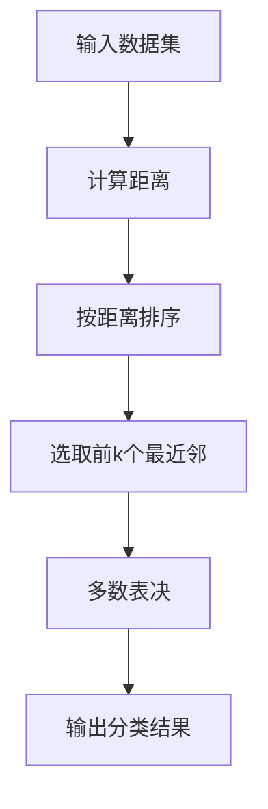

# k近邻算法 原理与代码实例讲解

## 1.背景介绍

k近邻算法(k-Nearest Neighbor, kNN)是一种基础且简单有效的机器学习算法。它属于监督学习算法中的非参数算法,可用于分类和回归任务。kNN算法的工作原理是基于实例之间的相似度来进行预测,即给定一个新的实例,通过计算它与训练集中其他实例的距离或相似度,选择最近的k个邻居,然后根据这k个邻居的类别决定新实例的类别。

kNN算法最早可以追溯到20世纪60年代,当时被用于基于实例的学习中。它在统计估计理论中有着坚实的理论基础,在模式识别领域得到了广泛应用。kNN算法简单直观、无需建立复杂的模型、对异常值不太敏感等优点使其成为数据挖掘的常用算法。

## 2.核心概念与联系

kNN算法的核心思想是给定一个未知实例,基于其最近邻居的多数表决原则进行分类。具体来说:

1. **k值的选择**: k是算法中需要确定的一个参数,它表示选择最近邻居的数目。k值的选择对算法结果有很大影响,k值太小容易受噪声影响,k值太大会使邻居点包含其他类别的点。通常k取一个较小的整数值。

2. **距离度量**: 需要确定一种距离度量方式来计算未知实例与训练集中其他实例的距离或相似度。常用的距离度量方法有欧氏距离、曼哈顿距离、切比雪夫距离等。

3. **分类决策规则**: 对于新的实例,根据其k个最近邻居的类别,通过如下两种决策规则之一进行分类:
    - 直接多数表决: 由k个最近邻居中所属类别最多的类别作为新实例的类别
    - 加权投票: 对每个邻居按其距离的倒数作为权重,累加这些权重并选择权重最大的类别

kNN算法的优缺点:

- 优点: 简单有效、无需训练、无需建立显式模型、对异常值不太敏感
- 缺点: 计算量大、空间复杂度高、对数据的质量要求高

## 3.核心算法原理具体操作步骤

kNN算法的核心步骤如下:

1. 收集数据: 可以使用任何方法收集数据
2. 准备数据: 距离计算需要数值型数据,对于标称型数据,需要使用二值化将其转换为数值型
3. 分析数据: 可以使用任何方法对数据进行探索性分析,以便理解数据的各种特征
4. 训练数据: 可以使用任何工具对数据进行预处理
5. 测试数据: 使用测试数据对模型进行评估
6. 使用算法: 构建kNN分类器,作出预测
7. 分析错误: 在可能的情况下,可以对错误原因进行分析以提高其他机器学习算法的效果

kNN算法的具体步骤:



1. 收集数据集,可以是文本、数值、图像等各种数据类型
2. 计算测试数据与每个训练数据实例的距离,常用的距离度量有欧氏距离、曼哈顿距离等
3. 按照距离从小到大对训练数据进行排序
4. 选取前k个最近的训练数据
5. 对这k个最近邻居的类别标签进行统计,选择出现次数最多的类别作为测试数据的预测类别

## 4.数学模型和公式详细讲解举例说明

kNN算法的核心是计算未知实例与训练集中其他实例之间的距离或相似度。常用的距离度量方法有:

1. **欧氏距离(Euclidean Distance)**

对于两个n维向量$\vec{x}=(x_1, x_2, ..., x_n)$和$\vec{y}=(y_1, y_2, ..., y_n)$,它们的欧氏距离定义为:

$$\begin{equation}
d(\vec{x},\vec{y})=\sqrt{\sum_{i=1}^{n}(x_i-y_i)^2}
\end{equation}$$

例如,对于两个二维向量$(1,1)$和$(4,5)$,它们的欧氏距离为:

$$\begin{equation}
d((1,1),(4,5))=\sqrt{(1-4)^2+(1-5)^2}=\sqrt{9+16}=5
\end{equation}$$

2. **曼哈顿距离(Manhattan Distance)**

曼哈顿距离也称为城市街区距离,对于两个n维向量$\vec{x}=(x_1, x_2, ..., x_n)$和$\vec{y}=(y_1, y_2, ..., y_n)$,它们的曼哈顿距离定义为:

$$\begin{equation}
d(\vec{x},\vec{y})=\sum_{i=1}^{n}|x_i-y_i|
\end{equation}$$

例如,对于两个二维向量$(1,1)$和$(4,5)$,它们的曼哈顿距离为:

$$\begin{equation}
d((1,1),(4,5))=|1-4|+|1-5|=3+4=7
\end{equation}$$

3. **切比雪夫距离(Chebyshev Distance)**

切比雪夫距离也称为棋盘距离,对于两个n维向量$\vec{x}=(x_1, x_2, ..., x_n)$和$\vec{y}=(y_1, y_2, ..., y_n)$,它们的切比雪夫距离定义为:

$$\begin{equation}
d(\vec{x},\vec{y})=\max_{1\leq i \leq n}|x_i-y_i|
\end{equation}$$

例如,对于两个二维向量$(1,1)$和$(4,5)$,它们的切比雪夫距离为:

$$\begin{equation}
d((1,1),(4,5))=\max(|1-4|,|1-5|)=\max(3,4)=4
\end{equation}$$

除了上述距离度量外,还可以使用其他距离度量方法,如闵可夫斯基距离、相关系数距离等。距离度量的选择需要根据具体的数据特征和应用场景进行权衡。

## 5.项目实践: 代码实例和详细解释说明

下面是使用Python实现kNN算法的示例代码,并对关键步骤进行了详细解释:

```python
import numpy as np
from collections import Counter

# 计算欧氏距离
def euclidean_distance(x1, x2):
    return np.sqrt(np.sum((x1 - x2)**2))

class KNNClassifier:
    def __init__(self, k):
        self.k = k
        self.X_train = None
        self.y_train = None

    # 训练模型
    def fit(self, X_train, y_train):
        self.X_train = X_train
        self.y_train = y_train

    # 预测单个样本
    def _predict(self, x):
        # 计算测试样本与训练集中每个样本的距离
        distances = [euclidean_distance(x, x_train) for x_train in self.X_train]
        
        # 获取距离最小的k个样本的索引
        k_indices = np.argsort(distances)[:self.k]
        
        # 获取这k个样本的标签
        k_nearest_labels = [self.y_train[i] for i in k_indices]
        
        # 统计k个最近邻中每个标签出现的次数
        most_common = Counter(k_nearest_labels).most_common(1)
        
        # 返回出现次数最多的标签作为预测结果
        return most_common[0][0]

    # 预测样本集
    def predict(self, X_test):
        return np.array([self._predict(x) for x in X_test])
```

代码解释:

1. 导入所需的Python库,包括NumPy用于数值计算,collections.Counter用于统计计数。

2. 定义`euclidean_distance`函数,用于计算两个向量之间的欧氏距离。

3. 定义`KNNClassifier`类,包含以下方法:
   - `__init__`方法初始化分类器,设置k值。
   - `fit`方法用于训练模型,将训练数据保存到实例变量中。
   - `_predict`方法用于预测单个样本的标签。它首先计算测试样本与训练集中每个样本的距离,然后选取距离最小的k个样本,统计这k个样本中每个标签出现的次数,返回出现次数最多的标签作为预测结果。
   - `predict`方法用于预测样本集合,它遍历每个测试样本,调用`_predict`方法获取预测标签,最终返回一个包含所有预测标签的NumPy数组。

使用示例:

```python
# 训练数据
X_train = np.array([[3,3], [6,6], [8,1], [1,8], [7,7]])
y_train = np.array([0, 0, 1, 1, 0])

# 测试数据
X_test = np.array([[2,5], [5,8], [9,3]])

# 创建kNN分类器
knn = KNNClassifier(k=3)

# 训练模型
knn.fit(X_train, y_train)

# 预测测试数据
y_pred = knn.predict(X_test)
print(y_pred)  # 输出: [0 1 1]
```

在这个示例中,我们首先创建了一个简单的二维训练数据集和测试数据集。然后,我们实例化了一个`KNNClassifier`对象,设置`k=3`。接着,我们使用`fit`方法训练模型,并使用`predict`方法对测试数据进行预测。最终,我们得到了预测标签`[0, 1, 1]`。

## 6.实际应用场景

kNN算法由于其简单性和有效性,在许多领域都有广泛的应用,包括:

1. **图像识别**: 在图像识别领域,可以将图像表示为高维向量,并使用kNN算法进行分类或识别。例如,手写数字识别、人脸识别等。

2. **文本分类**: 在自然语言处理中,可以将文本表示为词袋模型或TF-IDF向量,然后使用kNN算法对文本进行分类,如垃圾邮件过滤、新闻分类等。

3. **推荐系统**: 在推荐系统中,可以根据用户的历史行为数据计算用户之间的相似度,并使用kNN算法为目标用户推荐与其相似的其他用户喜欢的物品。

4. **金融领域**: 在金融领域,可以使用kNN算法进行信用评分、欺诈检测等。

5. **医疗诊断**: 在医疗领域,可以将病人的症状、检查结果等表示为特征向量,并使用kNN算法进行疾病诊断或预测。

6. **天气预报**: 在气象领域,可以将历史天气数据表示为多维向量,并使用kNN算法预测未来的天气情况。

总的来说,kNN算法适用于各种需要进行分类或回归的场景,尤其是当训练数据集较小、特征空间维数不太高时,kNN算法可以提供较好的性能。

## 7.工具和资源推荐

对于kNN算法的实现和应用,有许多优秀的工具和资源可供参考:

1. **Python库**:
   - scikit-learn: 一个流行的机器学习库,提供了kNN算法的实现。
   - pandas: 用于数据预处理和特征工程。
   - NumPy: 用于数值计算和矩阵操作。
   - Matplotlib: 用于数据可视化。

2. **在线课程**:
   - Coursera机器学习课程(Andrew Ng): 介绍了kNN算法的原理和应用。
   - Udacity机器学习纳米学位: 包含了kNN算法的实现和案例分析。

3. **书籍资源**:
   - 《机器学习实战》(Peter Harrington): 通过实例详细介绍了kNN算法。
   - 《模式分类》(Richard O. Duda等): 深入探讨了kNN算法的理论基础。

4. **开源项目**:
   - scikit-learn examples: 提供了kNN算法在各种场景下的应用示例。
   - Kaggle竞赛: 可以在Kaggle上找到使用kNN算法的各种实践案例。

5. **在线社区**:
   - Stack Overflow: 可以查找和提问kNN算法相关的问题。
   - Kaggle论坛: 与其他数据科学家交流kNN算法的经验和