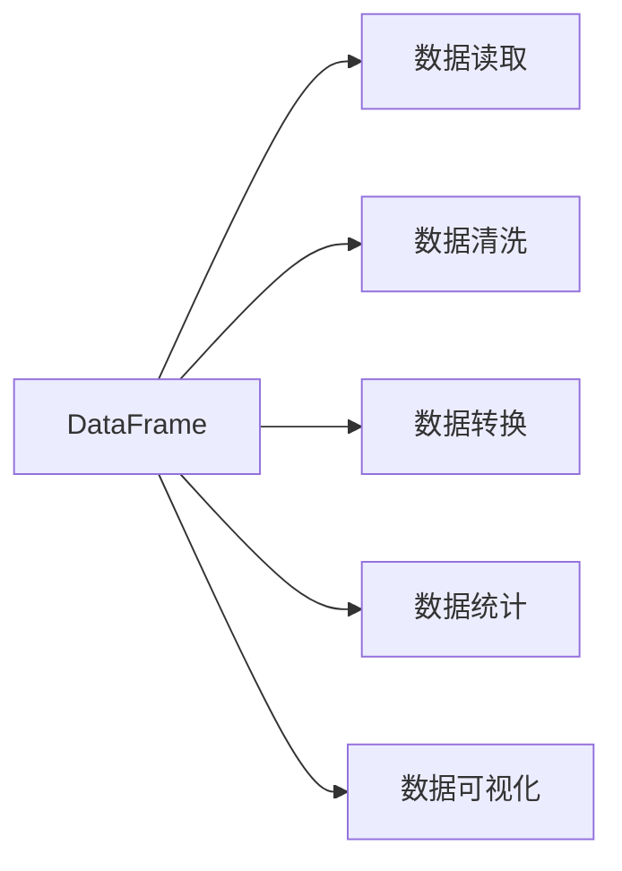

## 1. 背景介绍

在大数据和人工智能的时代，数据成为了新的石油。如何高效地处理和分析海量数据，已经成为了科技领域的核心议题。在这个背景下，DataFrame作为一种数据组织的方式，它的重要性不言而喻。DataFrame不仅仅是一个数据结构，它更是一种面向数据分析的思维工具，能够帮助我们更好地理解数据，从而挖掘数据背后的价值。

## 2. 核心概念与联系

DataFrame是一种表格型的数据结构，它包含有序的列，每列可以是不同的值类型（数值、字符串、布尔值等）。DataFrame既有行索引也有列索引，它可以被看作是由Series组成的字典（共用同一个索引）。主要的操作包括数据的读取、数据清洗、数据转换、数据统计和数据可视化等。



## 3. 核心算法原理具体操作步骤

DataFrame的核心算法原理涉及数据的存储、索引、查询、聚合和优化等方面。具体操作步骤包括：

1. 数据存储：如何在内存中高效地存储和访问DataFrame数据。
2. 索引机制：如何通过索引快速定位数据。
3. 查询操作：如何使用条件表达式筛选数据。
4. 聚合计算：如何对数据进行分组和聚合计算。
5. 性能优化：如何通过算法和技术手段提升数据处理的性能。

## 4. 数学模型和公式详细讲解举例说明

DataFrame的数学模型可以从矩阵和关系模型两个角度来理解。矩阵模型强调数据的二维结构，关系模型则强调数据之间的关联关系。

例如，DataFrame的聚合操作可以用数学公式表示为：

$$
\text{Agg}(D, f) = \{ f(D_i) \mid D_i \subseteq D, \text{按某属性分组} \}
$$

其中，$D$ 表示DataFrame，$f$ 表示聚合函数，$D_i$ 表示分组后的子集。

## 5. 项目实践：代码实例和详细解释说明

以Python的pandas库为例，展示DataFrame的基本操作：

```python
import pandas as pd

# 创建DataFrame
data = {'Name': ['John', 'Anna', 'Peter', 'Linda'],
        'Age': [28, 23, 34, 29],
        'City': ['New York', 'Paris', 'Berlin', 'London']}
df = pd.DataFrame(data)

# 数据查询
young_people = df[df['Age'] < 30]

# 数据聚合
average_age = df['Age'].mean()

print(df)
print(young_people)
print("Average Age:", average_age)
```

## 6. 实际应用场景

DataFrame在多个领域都有广泛的应用，包括金融分析、生物信息学、社会科学研究、网络分析等。在这些领域中，DataFrame帮助研究人员和分析师处理和分析数据，提取有价值的信息。

## 7. 工具和资源推荐

- Pandas：Python数据分析库，提供高性能、易用的数据结构和数据分析工具。
- Apache Spark：大数据处理框架，提供了DataFrame API进行分布式数据处理。
- R语言：统计计算和图形展示的编程语言和软件环境，提供了DataFrame的实现。

## 8. 总结：未来发展趋势与挑战

随着数据量的不断增长，DataFrame的处理和分析能力也在不断提升。未来的发展趋势将更加注重性能优化、分布式计算和实时分析。同时，隐私保护和数据安全也将成为DataFrame技术发展中需要面对的重要挑战。

## 9. 附录：常见问题与解答

Q1: DataFrame和数据库有什么区别？
A1: DataFrame是内存中的数据结构，便于快速处理和分析数据；而数据库是磁盘上的数据存储系统，侧重于数据的持久化和事务管理。

Q2: 如何处理大规模的DataFrame？
A2: 可以使用分布式计算框架如Apache Spark，将数据分片处理，或者使用优化的存储格式如Parquet减少内存占用。

作者：禅与计算机程序设计艺术 / Zen and the Art of Computer Programming