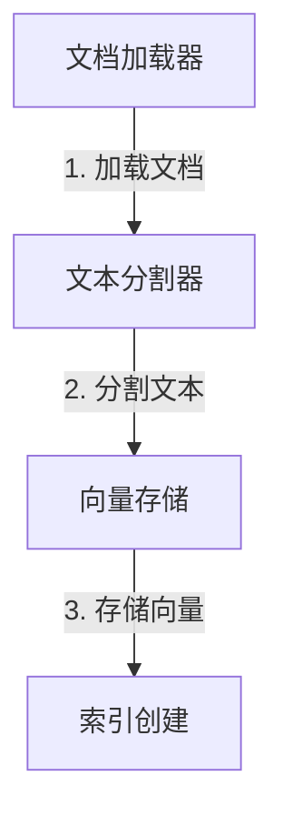

# 【LangChain编程：从入门到实践】文档检索过程

## 1. 背景介绍

在当今信息时代,我们面临着海量的非结构化数据,例如文档、文本、PDF 文件等。这些数据中蕴含着宝贵的知识和见解,但要高效地从中提取出有价值的信息并非易事。传统的搜索方式往往效率低下,无法满足我们对知识发现和利用的需求。

为了解决这一挑战,LangChain 这一强大的框架应运而生。它利用大语言模型(LLM)的能力,为我们提供了一种全新的文档检索方式,帮助我们快速、准确地从海量非结构化数据中获取所需信息。

## 2. 核心概念与联系

### 2.1 LangChain 概述

LangChain 是一个用于构建应用程序的框架,这些应用程序可以利用大型语言模型(LLM)来与数据、文档和文件进行交互。它提供了一系列模块化的组件,使开发人员能够轻松地构建基于 LLM 的应用程序,如问答系统、文本摘要和数据分析等。

### 2.2 文档加载器(Document Loaders)

文档加载器是 LangChain 的核心组件之一,它负责从各种来源(如文件、网页、数据库等)加载非结构化数据,并将其转换为 LangChain 可以处理的格式。LangChain 支持多种文档格式,包括 PDF、Word、CSV、Markdown 等。

### 2.3 文本分割器(Text Splitters)

由于大型语言模型对输入文本长度有限制,因此需要将长文本分割成多个较短的文本块。文本分割器的作用就是将长文本按照预定义的规则(如句子、字符数等)进行分割,生成多个文本块。

### 2.4 向量存储(Vector Stores)

向量存储是 LangChain 中用于存储和检索文本向量的组件。它将文本块转换为向量表示,并将这些向量存储在某种数据库或向量存储中。这样,当需要检索相关文本时,LangChain 可以在向量空间中进行相似性搜索,从而快速找到与查询相关的文本块。

### 2.5 索引创建(Indexing)

索引创建是将文档加载、文本分割和向量存储这些步骤结合在一起的过程。它将非结构化数据转换为可搜索的向量表示,并将其存储在向量存储中,为后续的文档检索做好准备。



## 3. 核心算法原理具体操作步骤

LangChain 的文档检索过程主要包括以下几个步骤:

1. **加载文档**

   使用文档加载器从各种来源(如本地文件、网页、数据库等)加载非结构化数据。LangChain 支持多种文档格式,如 PDF、Word、Markdown 等。

   ```python
   from langchain.document_loaders import UnstructuredFileLoader

   loader = UnstructuredFileLoader("example.pdf")
   documents = loader.load()
   ```

2. **分割文本**

   由于大型语言模型对输入文本长度有限制,因此需要将长文本分割成多个较短的文本块。LangChain 提供了多种文本分割器,如句子分割器、字符分割器等。

   ```python
   from langchain.text_splitter import CharacterTextSplitter

   text_splitter = CharacterTextSplitter(chunk_size=1000, chunk_overlap=200)
   texts = text_splitter.split_documents(documents)
   ```

3. **创建向量表示**

   将文本块转换为向量表示,以便进行相似性搜索。LangChain 支持多种向量化方法,如使用预训练的语义模型(如 Sentence-BERT)或利用大型语言模型生成向量表示。

   ```python
   from langchain.vectorstores import Chroma

   vectorstore = Chroma.from_documents(texts, embedding=embedding_func)
   vectorstore.persist()
   ```

4. **相似性搜索**

   利用向量存储中的向量表示,对查询进行相似性搜索,从而检索与查询相关的文本块。

   ```python
   query = "What is the capital of France?"
   relevant_docs = vectorstore.similarity_search(query, k=3)
   ```

5. **结果处理**

   对检索到的相关文本块进行进一步处理,如摘要、问答等。LangChain 提供了多种处理方式,如使用大型语言模型生成答案或摘要。

   ```python
   from langchain.chains import RetrievalQA

   qa = RetrievalQA.from_chain_type(llm, chain_type="stuff", retriever=vectorstore.as_retriever())
   result = qa.run(query)
   ```

通过上述步骤,LangChain 实现了高效的文档检索,帮助我们从海量非结构化数据中快速获取所需信息。

## 4. 数学模型和公式详细讲解举例说明

在文档检索过程中,向量化和相似性搜索是两个关键步骤。这些步骤通常涉及到一些数学模型和公式,下面我们将详细讲解其中的原理。

### 4.1 文本向量化

文本向量化是将文本转换为向量表示的过程,它是进行相似性搜索的基础。常用的文本向量化方法包括:

1. **词袋模型(Bag-of-Words)**

   词袋模型是一种简单但有效的文本表示方法。它将文本视为一个"词袋",每个单词的出现次数作为该文本的特征。数学上,词袋模型可以表示为:

   $$\vec{x} = (x_1, x_2, \ldots, x_n)$$

   其中 $x_i$ 表示第 $i$ 个单词在文本中出现的次数,而 $n$ 是词汇表的大小。

2. **TF-IDF**

   TF-IDF (Term Frequency-Inverse Document Frequency) 是一种改进的词袋模型,它不仅考虑了单词在文本中的出现次数,还考虑了单词在整个语料库中的重要性。TF-IDF 可以用以下公式表示:

   $$\text{TF-IDF}(t, d) = \text{TF}(t, d) \times \text{IDF}(t)$$

   其中 $\text{TF}(t, d)$ 表示单词 $t$ 在文档 $d$ 中出现的频率,而 $\text{IDF}(t)$ 表示单词 $t$ 在整个语料库中的重要性。

3. **Word Embeddings**

   Word Embeddings 是一种将单词映射到连续向量空间的方法,它能够捕捉单词之间的语义关系。常用的 Word Embeddings 模型包括 Word2Vec 和 GloVe。这些模型通过在大型语料库上进行训练,学习将每个单词映射到一个固定长度的密集向量。

4. **句子/文档向量化**

   除了对单词进行向量化,我们还需要将整个句子或文档转换为向量表示。常用的方法包括:

   - 平均 Word Embeddings
   - 预训练的语言模型(如 BERT、RoBERTa 等)

### 4.2 相似性计算

在获得文本的向量表示后,我们需要计算查询向量与文档向量之间的相似性,以检索与查询相关的文档。常用的相似性计算方法包括:

1. **余弦相似度**

   余弦相似度是计算两个向量夹角余弦值的方法,它常用于衡量向量之间的相似性。余弦相似度的公式为:

   $$\text{cosine\_similarity}(\vec{a}, \vec{b}) = \frac{\vec{a} \cdot \vec{b}}{||\vec{a}|| \times ||\vec{b}||}$$

   其中 $\vec{a}$ 和 $\vec{b}$ 分别表示两个向量,而 $\vec{a} \cdot \vec{b}$ 表示它们的点积。余弦相似度的值域为 $[-1, 1]$,值越接近 1,表示两个向量越相似。

2. **欧几里得距离**

   欧几里得距离是计算两个向量之间的直线距离,它也可以用于衡量向量之间的相似性。欧几里得距离的公式为:

   $$\text{euclidean\_distance}(\vec{a}, \vec{b}) = \sqrt{\sum_{i=1}^{n} (a_i - b_i)^2}$$

   其中 $n$ 表示向量的维度,而 $a_i$ 和 $b_i$ 分别表示向量 $\vec{a}$ 和 $\vec{b}$ 在第 $i$ 个维度上的值。欧几里得距离的值域为 $[0, \infty)$,值越小,表示两个向量越相似。

通过上述数学模型和公式,LangChain 能够有效地将文本转换为向量表示,并计算向量之间的相似性,从而实现高效的文档检索。

## 5. 项目实践: 代码实例和详细解释说明

为了更好地理解 LangChain 的文档检索过程,我们将通过一个实际项目来演示。在这个项目中,我们将从一组 PDF 文件中检索与给定查询相关的文本块。

### 5.1 加载文档

首先,我们需要加载 PDF 文件。在这个例子中,我们将使用 `UnstructuredPDFLoader` 从本地文件系统加载 PDF 文件。

```python
from langchain.document_loaders import UnstructuredPDFLoader

loader = UnstructuredPDFLoader("example_docs/")
documents = loader.load()
```

### 5.2 分割文本

由于大型语言模型对输入文本长度有限制,我们需要将长文本分割成多个较短的文本块。在这个例子中,我们将使用 `CharacterTextSplitter` 按照字符数进行分割。

```python
from langchain.text_splitter import CharacterTextSplitter

text_splitter = CharacterTextSplitter(chunk_size=1000, chunk_overlap=200)
texts = text_splitter.split_documents(documents)
```

### 5.3 创建向量表示

接下来,我们需要将文本块转换为向量表示,以便进行相似性搜索。在这个例子中,我们将使用预训练的 Sentence-BERT 模型来生成文本向量。

```python
from sentence_transformers import SentenceTransformer
import faiss

embeddings = SentenceTransformer('all-MiniLM-L6-v2')

# 创建向量存储
from langchain.vectorstores import FAISS

vectorstore = FAISS.from_texts(texts, embeddings)
```

### 5.4 相似性搜索

现在,我们可以对查询进行相似性搜索,从而检索与查询相关的文本块。

```python
query = "What is the capital of France?"
relevant_docs = vectorstore.similarity_search(query, k=3)

for doc in relevant_docs:
    print(doc.page_content)
```

### 5.5 结果处理

最后,我们可以对检索到的相关文本块进行进一步处理,如问答或摘要。在这个例子中,我们将使用 `RetrievalQA` 链来生成查询的答案。

```python
from langchain.chains import RetrievalQA
from langchain.llms import OpenAI

llm = OpenAI(temperature=0)
qa = RetrievalQA.from_chain_type(llm, chain_type="stuff", retriever=vectorstore.as_retriever())
result = qa.run(query)
print(result)
```

通过上述代码示例,我们演示了如何使用 LangChain 从 PDF 文件中检索与给定查询相关的文本块。这个过程包括加载文档、分割文本、创建向量表示、相似性搜索和结果处理等步骤。您可以根据自己的需求调整参数和配置,以获得更好的检索效果。

## 6. 实际应用场景

LangChain 的文档检索功能在许多实际应用场景中都有广泛的用途,例如:

1. **知识管理系统**

   在企业或组织中,往往会积累大量的文档、报告和知识资料。通过 LangChain,我们可以构建知识管理系统,快速从海量文档中检索相关信息,提高知识利用效率。

2. **智能问答系统**

   利用 LangChain 的文档检索和问答功能,我们可以开发智能问答系统,为用户提供准确、及时的答复。这种系统可以应用于客户服务、技术支持等领域。

3. **法律文档分析**

   在法律领域,往往需要从大量的法律文件、案例和判决书中查找相关信息。LangChain 可以帮助律师和法律从业