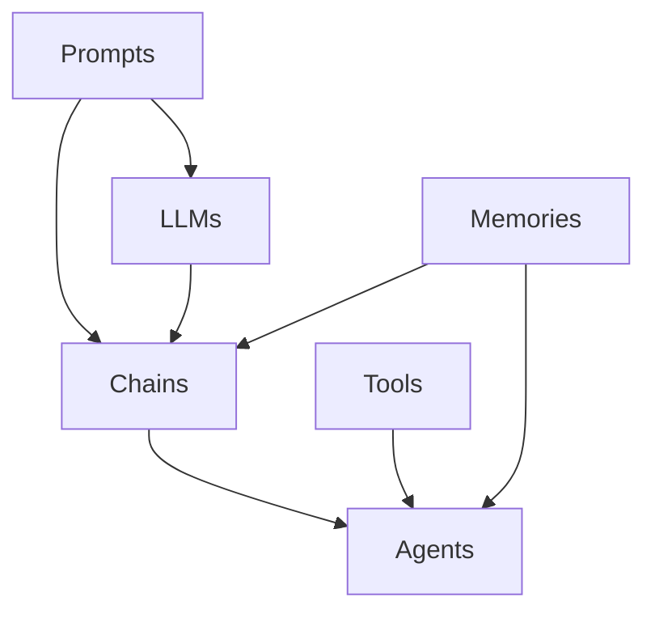

# 【LangChain编程：从入门到实践】模型备选服务

## 1. 背景介绍
### 1.1 LangChain的兴起
近年来，随着大语言模型(LLM)的快速发展，如何更好地利用LLM进行应用开发成为了业界关注的焦点。LangChain作为一个专为LLM应用开发设计的编程框架，为开发者提供了丰富的工具和组件，大大降低了LLM应用开发的门槛。

### 1.2 LangChain的优势
LangChain的一大优势在于其模块化设计理念，开发者可以灵活组合各种组件，如Prompts、Chains、Agents等，快速搭建出强大的LLM应用。此外，LangChain还提供了丰富的文档和示例，新手开发者也能够轻松上手。

### 1.3 LangChain的生态系统
围绕着LangChain，业界已经形成了一个活跃的生态系统。各种基于LangChain的应用层出不穷，如聊天机器人、知识库问答、文本生成等。同时，LangChain背后的社区也在不断壮大，开发者们积极贡献代码、分享经验，共同推动LangChain的发展。

## 2. 核心概念与联系
### 2.1 Prompts
Prompts是LangChain的核心概念之一，它定义了如何与LLM进行交互。一个优秀的Prompt设计可以引导LLM生成我们期望的输出。LangChain提供了一系列的Prompt模板，帮助开发者更轻松地设计Prompt。

### 2.2 Chains
Chains是由多个组件串联而成的执行单元。通过将Prompts、LLMs、工具等组件组合成Chain，我们可以构建出更加复杂的应用逻辑。LangChain提供了丰富的Chain类型，如LLMChain、SequentialChain等。

### 2.3 Agents 
Agent是一种特殊的Chain，它可以基于用户输入自主决策下一步行动。常见的Agent包括ReAct、SelfAsk等。使用Agent，我们可以创建更具智能性的应用，例如能够主动提问、搜索信息的聊天机器人等。

### 2.4 Memories
Memory是指在多轮对话中维护对话历史信息的组件。通过将Memory组件添加到Chain或Agent中，可以实现多轮对话功能，使得LLM能够根据对话上下文生成更加自然、连贯的响应。

### 2.5 各组件间的关系
下面的Mermaid流程图展示了LangChain核心组件之间的关系：



## 3. 核心算法原理与具体操作步骤
### 3.1 LLMChain的工作原理
LLMChain是最基础的Chain类型，它封装了一个LLM和一个Prompt。当调用LLMChain时，输入会被传递给Prompt进行格式化，形成一个指令，然后发送给LLM执行，最后将LLM的输出作为LLMChain的输出返回。

### 3.2 SequentialChain的工作原理
SequentialChain允许我们将多个Chain按顺序串联执行。每个子Chain的输出会作为下一个子Chain的输入，最后一个子Chain的输出即为SequentialChain的最终输出。这种串联执行的方式可以用于实现更复杂的逻辑。

### 3.3 ReAct Agent的工作原理
ReAct Agent是一种基于"思考-行动"范式的智能Agent。给定用户输入后，ReAct Agent会进入一个"思考-行动"的循环:
1. 思考阶段：Agent根据当前的观察（如对话历史、检索到的文档等）生成一个初步的思路。
2. 行动阶段：Agent根据思考的结果，决定下一步的最佳行动，如询问用户更多信息、使用搜索引擎检索、给出最终答案等。
3. 重复步骤1-2，直到Agent认为已经可以给出一个满意的最终答案。

### 3.4 Router Chain的工作原理
Router Chain允许我们根据用户意图将请求动态路由到不同的Chain处理。具体来说：
1. 我们首先定义一个Prompt，用于从用户输入中提取意图。 
2. 然后定义一个路由映射，指定每个意图应该由哪个Chain来处理。
3. 当收到用户输入时，Router Chain首先使用意图提取Prompt判断用户意图，然后根据路由映射选择对应的Chain进行处理。

## 4. 数学模型和公式详细讲解举例说明
### 4.1 文本嵌入模型
在使用LLM进行文本处理时，通常需要将文本转换为数值向量的形式，即文本嵌入。常见的文本嵌入模型有Word2Vec、GloVe、BERT等。以Word2Vec为例，它通过训练一个浅层神经网络来学习单词嵌入，具体来说：

- 输入层：one-hot编码的中心词向量$\mathbf{x} \in \mathbb{R}^{|V|}$
- 隐藏层：嵌入向量$\mathbf{h} = \mathbf{W}^{T}\mathbf{x}$，其中$\mathbf{W} \in \mathbb{R}^{|V| \times d}$为权重矩阵
- 输出层：对每个上下文单词$w_j$，计算其条件概率$p(w_j|w_i) = \text{softmax}(\mathbf{v}_{w_j}^{T}\mathbf{h})$

模型的目标是最大化对数似然函数：

$$
\mathcal{L} = \sum_{i=1}^{|V|} \sum_{j \in \text{Context}(w_i)} \log p(w_j | w_i)
$$

### 4.2 注意力机制
注意力机制是现代NLP模型的重要组件，它允许模型动态地关注输入的不同部分。以Transformer中的自注意力为例：

给定一组输入向量$\mathbf{x}_1, \dots, \mathbf{x}_n$，自注意力首先计算它们的Query、Key、Value向量：

$$
\mathbf{q}_i = \mathbf{W}^Q\mathbf{x}_i, \quad 
\mathbf{k}_i = \mathbf{W}^K\mathbf{x}_i, \quad
\mathbf{v}_i = \mathbf{W}^V\mathbf{x}_i
$$

然后计算注意力权重：

$$
\alpha_{ij} = \frac{\exp(\mathbf{q}_i^T\mathbf{k}_j)}{\sum_{l=1}^n \exp(\mathbf{q}_i^T\mathbf{k}_l)}
$$

最后，每个输出向量为值向量的加权和：

$$
\mathbf{y}_i = \sum_{j=1}^n \alpha_{ij} \mathbf{v}_j
$$

自注意力允许模型在生成每个输出向量时，都能够考虑到输入序列的所有位置，从而捕捉到更多的全局信息。

## 5. 项目实践：代码实例和详细解释说明
下面我们通过一个简单的问答系统来演示LangChain的基本用法。该系统由一个检索器和一个问答Chain组成，可以回答有关特定文档的问题。

```python
from langchain.chains import RetrievalQA
from langchain.llms import OpenAI
from langchain.document_loaders import TextLoader
from langchain.indexes import VectorstoreIndexCreator

# 加载文档
loader = TextLoader("./data/document.txt")
documents = loader.load()

# 创建向量库索引
index = VectorstoreIndexCreator().from_loaders([loader])

# 初始化问答Chain
qa_chain = RetrievalQA.from_chain_type(
    llm=OpenAI(), 
    chain_type="stuff", 
    retriever=index.vectorstore.as_retriever()
)

# 执行问答
query = "What is the capital of France?"
result = qa_chain.run(query)
print(result)
```

代码解释：

1. 首先，我们使用`TextLoader`加载要查询的文档。
2. 然后，使用`VectorstoreIndexCreator`创建一个向量库索引，用于检索与问题相关的文档片段。
3. 接着，我们初始化一个`RetrievalQA` Chain，它封装了一个检索器和一个问答Chain。这里我们选择使用`stuff`类型的问答Chain，它会将所有检索到的文档片段拼接成一个上下文，然后交由LLM生成最终答案。
4. 最后，我们执行问答Chain，传入问题并打印结果。

这个例子展示了如何使用LangChain快速搭建一个基于文档的问答系统。我们只需要提供文档和问题，LangChain就会自动处理文档索引、相关段落检索、问题回答等步骤，大大简化了开发流程。

## 6. 实际应用场景
LangChain在实践中有非常广泛的应用，下面列举几个典型场景：

### 6.1 智能客服
利用LangChain，我们可以打造一个基于LLM的智能客服系统。该系统可以接收用户的自然语言问题，通过知识库检索、多轮对话等技术，给出准确、人性化的回答，大大减轻了人工客服的压力。

### 6.2 文档智能问答
针对说明书、合同、论文等长文档，我们可以使用LangChain搭建一个智能问答系统。用户可以用自然语言提问，系统会自动检索文档中的相关片段，并生成回答，帮助用户快速找到所需信息。

### 6.3 代码智能助手
LangChain也可用于打造智能编程助手。开发者可以用自然语言描述编程意图，如"实现一个快速排序"，助手可以自动生成对应的代码，并给出详细的解释说明，极大提升了开发效率。

### 6.4 智能写作助手
利用LangChain，我们还可以实现智能写作助手。用户只需输入文章主题、大纲等高层信息，写作助手即可自动生成一篇完整的文章初稿。再经过人工的简单润色，就能得到一篇质量不错的文章。

## 7. 工具和资源推荐
### 7.1 LangChain官方文档
LangChain的官方文档是学习和使用LangChain的最佳资源。文档提供了详尽的教程、API参考、最佳实践等，是开发者必读的资料。

官网地址：https://docs.langchain.com/

### 7.2 LangChain Github仓库
LangChain的Github仓库包含了框架的完整源码，以及大量的使用示例。通过学习这些示例代码，我们可以更深入地理解LangChain的各种功能和用法。

仓库地址：https://github.com/hwchase17/langchain

### 7.3 LangChain社区
LangChain拥有一个活跃的开发者社区。加入社区，你可以与其他开发者交流心得、讨论问题、分享项目经验，共同成长。

Discord社区：https://discord.gg/6adMQxSpJS

### 7.4 LangChain模型中心
除了支持OpenAI、Anthropic等主流LLM提供商，LangChain还支持多家LLM模型服务商，如Cohere、AI21等。在LangChain模型中心，你可以找到这些备选模型服务的文档指南。

模型中心地址：https://docs.langchain.com/docs/ecosystem/model_hubs/

选择合适的LLM服务商可以帮助你在成本、性能、合规性等方面达到最佳平衡，因此了解LangChain的模型生态非常重要。

## 8. 总结：未来发展趋势与挑战
LangChain正处在快速发展的阶段，未来可期。以下是我对其发展趋势和挑战的一些思考：

### 8.1 发展趋势
- 更多垂直领域的LLM应用会基于LangChain构建，如金融、法律、医疗等。
- LangChain的组件会更加丰富和成熟，涵盖更多LLM应用开发的场景。
- LangChain将与更多LLM模型服务商建立生态合作，为开发者提供更多选择。
- 围绕LangChain会出现更多周边工具，如可视化开发工具、性能优化工具等。

### 8.2 挑战
- 如何平衡LLM应用的性能和成本，是摆在开发者面前的一大挑战。
- 对于金融、医疗等高stakes领域，如何确保LLM应用的可靠性、公平性和合规性，还需要大量的研究和实