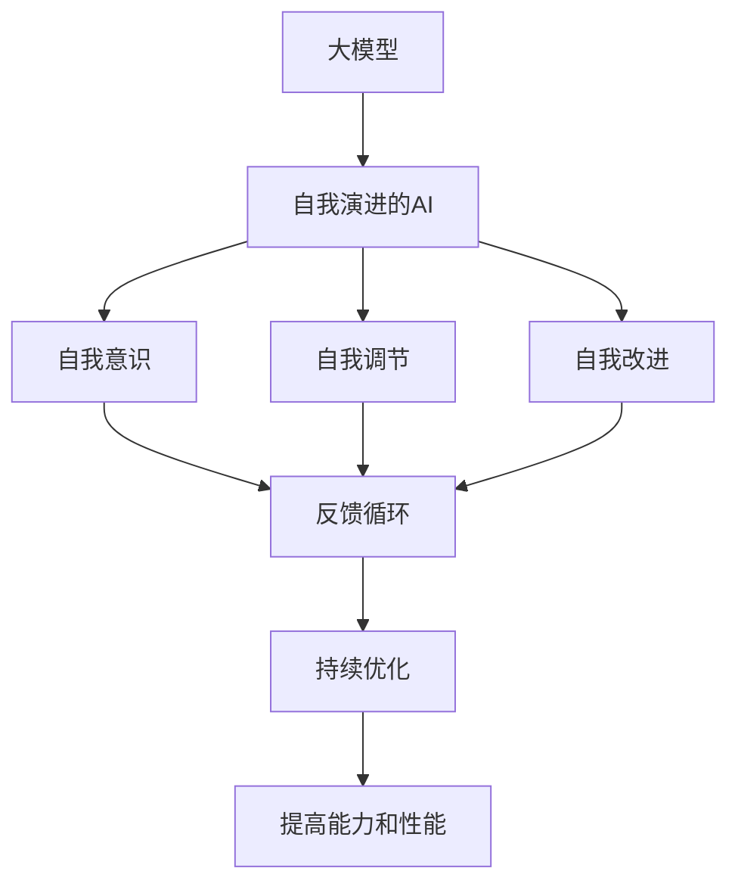
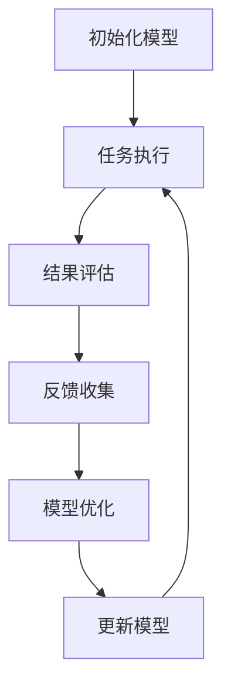

# 【大模型应用开发 动手做AI Agent】自我演进的AI

## 1.背景介绍

在当前的人工智能领域,大型语言模型(Large Language Models, LLMs)的兴起正在推动着一场全新的技术革命。这些基于深度学习的模型能够从海量文本数据中学习,并生成看似人类水平的自然语言输出,展现出令人惊叹的语言理解和生成能力。

随着计算能力的不断提升和训练数据的日益丰富,LLMs的规模也在不断扩大。从GPT-3拥有1750亿个参数,到GPT-4达到惊人的1万亿个参数,这些参数庞大的模型被称为"大模型"(Large Models)。大模型不仅在自然语言处理任务上表现出色,还能够泛化到其他领域,如计算机视觉、决策推理等,展现出通用人工智能(Artificial General Intelligence, AGI)的潜力。

然而,现有的大模型存在一些局限性,例如缺乏持久的记忆和推理能力、难以进行自我修正和持续学习等。为了克服这些限制,研究人员提出了"自我演进的AI"(Self-Evolving AI)的概念,旨在开发能够自主学习、自我修正并持续进化的人工智能系统。

自我演进的AI代理(Self-Evolving AI Agent)是实现这一目标的关键,它是一种具有自我意识、自我调节和自我改进能力的智能系统。通过内在的反馈循环机制,这种AI代理能够不断优化自身的模型和知识库,持续提高自身的能力和性能。

本文将深入探讨自我演进的AI代理的核心概念、算法原理和实现方法,并分析其在各种应用场景中的潜在影响和未来发展趋势。



## 2.核心概念与联系

### 2.1 大型语言模型(LLMs)

大型语言模型是基于深度学习的自然语言处理模型,通过从海量文本数据中学习,能够生成看似人类水平的自然语言输出。LLMs的核心是transformer架构,它利用自注意力机制来捕捉输入序列中的长程依赖关系,从而提高了模型的表现能力。

LLMs的规模越大,其性能通常也越好。GPT-3拥有1750亿个参数,而GPT-4更是达到了惊人的1万亿个参数。这些参数庞大的模型被称为"大模型"。

### 2.2 通用人工智能(AGI)

通用人工智能(Artificial General Intelligence, AGI)是指能够像人类一样具备广泛的智能,可以应对各种任务和环境的人工智能系统。AGI系统不仅能够执行特定的任务,还能够像人类一样学习、推理、规划和解决问题。

大模型展现出了AGI的潜力,它们不仅在自然语言处理任务上表现出色,还能够泛化到其他领域,如计算机视觉、决策推理等。然而,现有的大模型仍然存在一些局限性,如缺乏持久的记忆和推理能力、难以进行自我修正和持续学习等,这阻碍了它们成为真正的AGI系统。

### 2.3 自我演进的AI

自我演进的AI(Self-Evolving AI)是一种能够自主学习、自我修正并持续进化的人工智能系统。它旨在克服现有大模型的局限性,实现真正的AGI。

自我演进的AI系统具有以下关键特征:

1. **自我意识(Self-Awareness)**: 能够对自身的知识、能力和局限性有清晰的认知。
2. **自我调节(Self-Regulation)**: 能够根据环境和任务需求,动态调整自身的学习策略和行为模式。
3. **自我改进(Self-Improvement)**: 能够通过持续学习和自我修正,不断优化自身的模型和知识库,提高性能。

### 2.4 自我演进的AI代理

自我演进的AI代理(Self-Evolving AI Agent)是实现自我演进AI的关键组件。它是一种具有自我意识、自我调节和自我改进能力的智能系统,通过内在的反馈循环机制,能够不断优化自身的模型和知识库,持续提高自身的能力和性能。

自我演进的AI代理可以被视为一种"元智能系统",它不仅能够执行特定的任务,还能够通过自我学习和自我修正,持续提升自身的智能水平。这种代理具有巨大的潜力,有望成为实现AGI的关键一步。

## 3.核心算法原理具体操作步骤

自我演进的AI代理的核心算法原理是基于反馈循环和持续优化的思想。它包括以下几个关键步骤:

1. **初始化**: 首先,需要初始化一个基础的人工智能模型,例如一个大型语言模型(LLM)或其他类型的神经网络模型。这个初始模型将作为自我演进过程的起点。

2. **任务执行**: 代理接收一个特定的任务,并使用当前的模型尝试执行该任务。在执行过程中,代理会生成一个输出结果。

3. **结果评估**: 代理会对自己的输出结果进行评估,判断其是否满足预期目标。评估可以基于人工标注的ground truth数据,也可以基于一些预定义的评估指标或奖励函数。

4. **反馈收集**: 根据评估结果,代理会收集相关的反馈信息,包括任务执行过程中的中间状态、输出结果的评估分数等。这些反馈信息将用于后续的模型优化。

5. **模型优化**: 代理利用收集到的反馈信息,对当前的模型进行优化和调整。这可以通过各种机器学习算法实现,如梯度下降、强化学习等。优化后的模型将替代原有的模型,用于下一轮的任务执行。

6. **持续迭代**: 代理会不断重复上述步骤,在执行任务、收集反馈、优化模型的循环中持续进化。随着时间的推移,代理的模型将变得越来越精确和强大。



上述算法原理的关键在于通过不断的反馈循环和模型优化,实现代理的自我演进。每一轮迭代,代理都会根据任务执行的结果和反馈信息,对自身的模型进行调整和改进,从而不断提高自身的能力和性能。

这种自我演进的机制赋予了代理持续学习和自我修正的能力,使其能够逐步适应不同的任务和环境,并且不断提升自身的智能水平。

## 4.数学模型和公式详细讲解举例说明

在自我演进的AI代理中,模型优化是一个关键环节。常见的优化算法包括梯度下降、强化学习等。下面我们将详细介绍这些算法的数学原理和公式。

### 4.1 梯度下降算法

梯度下降(Gradient Descent)是一种广泛使用的优化算法,它通过沿着目标函数的负梯度方向更新模型参数,从而最小化目标函数的值。

假设我们的目标是最小化一个损失函数 $J(\theta)$,其中 $\theta$ 表示模型的参数向量。梯度下降算法的更新规则如下:

$$\theta_{t+1} = \theta_t - \alpha \nabla J(\theta_t)$$

其中 $\alpha$ 是学习率,决定了每次更新的步长大小; $\nabla J(\theta_t)$ 是损失函数 $J$ 在当前参数 $\theta_t$ 处的梯度向量。

梯度下降算法的关键在于计算梯度向量 $\nabla J(\theta_t)$。对于神经网络模型,我们可以使用反向传播算法(Backpropagation)高效地计算梯度。

例如,对于一个简单的线性回归模型:

$$J(\theta) = \frac{1}{2m} \sum_{i=1}^m (y^{(i)} - \theta^T x^{(i)})^2$$

其中 $m$ 是训练样本的数量, $x^{(i)}$ 是第 $i$ 个样本的特征向量, $y^{(i)}$ 是对应的标签值。

我们可以计算出损失函数 $J$ 关于参数 $\theta$ 的梯度为:

$$\nabla J(\theta) = \frac{1}{m} \sum_{i=1}^m (y^{(i)} - \theta^T x^{(i)})(-x^{(i)})$$

通过不断地沿着梯度的反方向更新参数 $\theta$,我们就可以最小化损失函数 $J$,从而得到最优的模型参数。

### 4.2 强化学习算法

强化学习(Reinforcement Learning)是另一种常用的模型优化算法,它通过与环境的交互来学习一个最优的策略(Policy)。

在强化学习中,我们定义了一个代理(Agent)和一个环境(Environment)。代理根据当前的状态 $s$ 选择一个动作 $a$,环境会根据这个动作转移到下一个状态 $s'$,并返回一个奖励 $r$。目标是学习一个策略 $\pi(a|s)$,使得在环境中采取该策略能够获得最大的累积奖励。

策略梯度(Policy Gradient)是一种常用的强化学习算法,它直接对策略函数 $\pi_\theta(a|s)$ 进行优化,其中 $\theta$ 是策略的参数。策略梯度的目标是最大化期望的累积奖励:

$$J(\theta) = \mathbb{E}_{\pi_\theta} \left[ \sum_{t=0}^{T} \gamma^t r_t \right]$$

其中 $\gamma$ 是折现因子,用于权衡即时奖励和长期奖励的重要性。

我们可以使用策略梯度定理来估计梯度 $\nabla_\theta J(\theta)$:

$$\nabla_\theta J(\theta) = \mathbb{E}_{\pi_\theta} \left[ \sum_{t=0}^{T} \nabla_\theta \log \pi_\theta(a_t|s_t) Q^{\pi_\theta}(s_t, a_t) \right]$$

其中 $Q^{\pi_\theta}(s_t, a_t)$ 是在状态 $s_t$ 采取动作 $a_t$ 后,按照策略 $\pi_\theta$ 行动所能获得的期望累积奖励。

通过采样获得的轨迹数据,我们可以估计出梯度 $\nabla_\theta J(\theta)$,并使用梯度上升法更新策略参数 $\theta$,从而优化策略函数 $\pi_\theta(a|s)$。

强化学习算法在自我演进的AI代理中具有重要应用,它可以帮助代理学习一个最优的策略,以适应不同的任务和环境,从而实现自我调节和自我改进。

## 5.项目实践:代码实例和详细解释说明

为了更好地理解自我演进的AI代理的实现,我们将提供一个基于强化学习的简单示例。在这个示例中,我们将训练一个智能体(Agent)来玩一个简单的游戏。

### 5.1 游戏环境

我们将使用 OpenAI Gym 库中的 `CartPole-v1` 环境。这个环境模拟了一个小车和一根杆,目标是通过向左或向右推动小车来保持杆保持直立。如果杆的角度超过一定范围或小车移动超出一定距离,游戏就会结束。

```python
import gym
env = gym.make('CartPole-v1')
```

### 5.2 智能体(Agent)

我们将使用一个简单的神经网络作为智能体的策略函数。这个神经网络将观测(observation)作为输入,输出每个动作的概率。

```python
import torch
import torch.nn as nn
import torch.optim as optim

class Agent(nn.Module):
    def __init__(self, input_size, output_size):
        super(Agent, self).__init__()
        self.fc1 = nn.Linear(input_size, 128)
        self.fc2 = nn.Linear(128, output_size)

    def forward(self