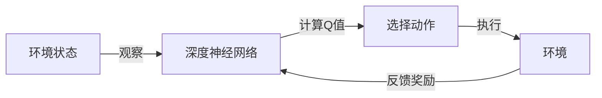

# 一切皆是映射：DQN中潜在代表性学习的研究进展

## 1. 背景介绍

深度强化学习（Deep Reinforcement Learning, DRL）作为一种结合了深度学习和强化学习的技术，近年来在多个领域取得了显著的成就。DQN（Deep Q-Network）作为DRL的代表算法之一，通过使用深度神经网络来近似Q函数，实现了在复杂环境中的决策学习。然而，随着研究的深入，人们发现DQN在处理高维输入和学习有效表征方面存在局限性。潜在代表性学习（Representation Learning）的概念因此被引入，旨在通过学习输入数据的内在结构来获得更好的特征表达，从而提升DQN的性能。

## 2. 核心概念与联系

### 2.1 强化学习与深度学习
- 强化学习：通过与环境的交互来学习最优策略，以最大化累积奖励。
- 深度学习：使用深度神经网络来学习数据的复杂表示，能够自动提取特征。

### 2.2 DQN的基本框架
- DQN将深度学习应用于强化学习，使用深度神经网络来近似Q函数。

### 2.3 潜在代表性学习
- 潜在代表性学习：旨在学习数据的内在结构和特征，以获得更有效的数据表示。

### 2.4 映射的重要性
- 映射：在DQN中，将状态映射到动作值的过程是学习的核心。

## 3. 核心算法原理具体操作步骤

### 3.1 DQN的工作流程


### 3.2 潜在代表性学习的集成
- 在DQN的基础上，引入自编码器或其他生成模型来学习状态的潜在表示。

## 4. 数学模型和公式详细讲解举例说明

### 4.1 Q函数的近似
$$ Q(s, a; \theta) \approx Q^*(s, a) $$
其中，$Q^*(s, a)$ 是最优Q函数，$\theta$ 是神经网络的参数。

### 4.2 损失函数
$$ L(\theta) = \mathbb{E}[(r + \gamma \max_{a'}Q(s', a'; \theta^-) - Q(s, a; \theta))^2] $$
其中，$r$ 是奖励，$\gamma$ 是折扣因子，$\theta^-$ 是目标网络的参数。

### 4.3 潜在表示的学习
$$ z = f_\phi(s) $$
其中，$z$ 是潜在表示，$f_\phi$ 是表示学习模型，$\phi$ 是模型参数。

## 5. 项目实践：代码实例和详细解释说明

### 5.1 DQN的实现
```python
# 伪代码示例
class DQN(nn.Module):
    def __init__(self):
        super(DQN, self).__init__()
        # 神经网络结构定义
    def forward(self, x):
        # 前向传播
        return Q_values
```

### 5.2 潜在代表性学习的集成
```python
# 伪代码示例
class Autoencoder(nn.Module):
    def __init__(self):
        super(Autoencoder, self).__init__()
        # 自编码器结构定义
    def forward(self, x):
        # 编码和解码过程
        return z, x_reconstructed
```

## 6. 实际应用场景

- 游戏AI：DQN最初在Atari游戏上取得突破。
- 机器人控制：使用DQN进行路径规划和决策。
- 金融决策：在投资和交易中应用DQN进行风险评估和策略优化。

## 7. 工具和资源推荐

- TensorFlow和PyTorch：两个流行的深度学习框架，支持DQN的实现。
- OpenAI Gym：提供多种环境，用于测试和比较强化学习算法。
- Stable Baselines：一个强化学习算法库，包含DQN的实现。

## 8. 总结：未来发展趋势与挑战

DQN和潜在代表性学习的结合为强化学习的发展开辟了新的道路。未来的研究将集中在提高算法的稳定性、效率和泛化能力上。同时，如何更好地理解和解释深度强化学习模型的决策过程，也是一个重要的研究方向。

## 9. 附录：常见问题与解答

- Q: DQN如何处理连续动作空间？
- A: DQN通常用于离散动作空间，对于连续动作空间，可以使用其变体如DDPG（Deep Deterministic Policy Gradient）。

- Q: 潜在代表性学习在DQN中的作用是什么？
- A: 它帮助DQN学习到更有效的状态表示，从而提高学习效率和策略性能。

- Q: 如何评估DQN的性能？
- A: 通常通过比较累积奖励和学习曲线来评估DQN的性能。

作者：禅与计算机程序设计艺术 / Zen and the Art of Computer Programming