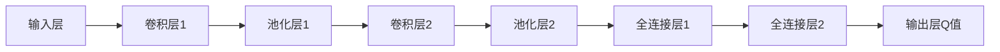

# 一切皆是映射：深入理解DQN的价值函数近似方法

## 1. 背景介绍

### 1.1 强化学习与Q-learning
强化学习(Reinforcement Learning, RL)是一种重要的机器学习范式,它研究如何让智能体(agent)通过与环境的交互来学习最优策略,以获得最大的累积奖励。在强化学习中,一个经典而强大的算法就是Q-learning。Q-learning通过学习状态-动作值函数Q(s,a)来寻找最优策略。

### 1.2 Q-learning的局限性
传统的Q-learning使用表格(tabular)的方式来存储每个状态-动作对的Q值。然而,现实世界中大多数问题的状态和动作空间都非常巨大甚至是连续的,这使得Q表变得难以存储和计算。为了克服这一困难,我们需要使用函数近似(function approximation)的方法来表示Q函数。

### 1.3 深度Q网络的崛起 
2015年,DeepMind公司的Mnih等人提出了深度Q网络(Deep Q-Network, DQN),它使用深度神经网络来近似Q函数,并在Atari游戏上取得了超越人类的成就。DQN的成功掀起了深度强化学习的研究热潮。本文将深入探讨DQN中的核心思想——价值函数近似,揭示其中蕴含的数学原理,并给出详细的算法步骤和代码实现。

## 2. 核心概念与联系

### 2.1 马尔可夫决策过程
强化学习问题通常被建模为马尔可夫决策过程(Markov Decision Process, MDP)。一个MDP由状态空间S、动作空间A、转移概率P、奖励函数R和折扣因子γ组成。在每个时间步t,智能体观察到状态s_t∈S,选择动作a_t∈A,环境根据转移概率P(s_{t+1}|s_t,a_t)转移到下一个状态s_{t+1},并给出奖励r_t=R(s_t,a_t)。智能体的目标是最大化累积奖励的期望值。

### 2.2 值函数与贝尔曼方程
在强化学习中,我们关注两个值函数:状态值函数V(s)和动作值函数Q(s,a)。
- 状态值函数V(s)表示从状态s开始,遵循某个策略π,可以获得的累积奖励的期望。
- 动作值函数Q(s,a)表示在状态s下选择动作a,遵循某个策略π,可以获得的累积奖励的期望。

这两个值函数满足贝尔曼方程(Bellman Equation):

$$
V^\pi(s) = \sum_{a} \pi(a|s) \sum_{s',r} P(s',r|s,a) [r + \gamma V^\pi(s')]
$$

$$
Q^\pi(s,a) = \sum_{s',r} P(s',r|s,a) [r + \gamma \sum_{a'} \pi(a'|s') Q^\pi(s',a')]
$$

贝尔曼方程揭示了值函数的递归性质,为我们学习值函数提供了理论基础。

### 2.3 价值函数近似
当状态空间和动作空间很大时,我们无法用表格的方式来表示值函数。此时,我们引入函数近似的思想,用一个参数化的函数Qθ(s,a)来近似真实的Q函数。DQN使用深度神经网络作为函数近似器,其参数θ为网络的权重。

## 3. 核心算法原理与具体步骤

DQN算法的核心是使用深度神经网络来近似Q函数,并使用经验回放(experience replay)和目标网络(target network)来稳定训练。其主要步骤如下:

1. 初始化Q网络的参数θ,目标网络的参数θ^{-}=θ。
2. 初始化经验回放缓冲区D。
3. for episode = 1 to M do
    1. 初始化初始状态s_1
    2. for t = 1 to T do 
        1. 根据ε-greedy策略,以概率ε选择随机动作a_t,否则选择a_t=argmax_a Qθ(s_t,a)
        2. 执行动作a_t,观察奖励r_t和下一状态s_{t+1}
        3. 将转移(s_t,a_t,r_t,s_{t+1})存入D
        4. 从D中随机采样一个批次的转移(s,a,r,s')
        5. 计算目标值y=r+γ max_{a'} Qθ^{-}(s',a')
        6. 最小化损失L(θ)=E[(y - Qθ(s,a))^2]
        7. 每隔C步,将θ^{-}=θ
    3. end for
4. end for

其中,ε-greedy策略在探索和利用之间进行权衡,以ε的概率选择随机动作进行探索,以1-ε的概率选择当前最优动作进行利用。经验回放缓冲区D用于存储智能体与环境交互得到的转移数据,并在训练时随机采样,打破了数据的相关性。目标网络用于计算目标Q值,其参数θ^{-}每隔一段时间才更新为最新的θ,以提高训练稳定性。

## 4. 数学模型与公式详解

### 4.1 Q网络的架构
DQN使用卷积神经网络(Convolutional Neural Network, CNN)来处理原始的图像输入。其典型的架构如下:


输入层接收游戏画面的原始像素,然后经过若干个卷积层和池化层提取特征,再经过全连接层,最终输出每个动作的Q值。

### 4.2 损失函数与优化
DQN的训练目标是最小化预测Q值与目标Q值之间的均方误差(Mean Squared Error, MSE):

$$
L(\theta) = \mathbb{E}_{(s,a,r,s')\sim D} [(r + \gamma \max_{a'} Q_{\theta^{-}}(s',a') - Q_\theta(s,a))^2]
$$

其中,θ是Q网络的参数,θ^{-}是目标网络的参数。我们使用随机梯度下降(Stochastic Gradient Descent, SGD)及其变体(如Adam)来优化损失函数,更新Q网络的参数θ:

$$
\theta \leftarrow \theta - \alpha \nabla_\theta L(\theta)
$$

其中,α是学习率。

## 5. 项目实践：代码实例与详解

下面给出了使用PyTorch实现DQN玩Atari游戏的核心代码。完整代码请参考我的GitHub仓库。

```python
import torch
import torch.nn as nn
import torch.optim as optim
import numpy as np
import random
from collections import deque

class DQN(nn.Module):
    def __init__(self, state_dim, action_dim):
        super(DQN, self).__init__()
        self.conv1 = nn.Conv2d(state_dim[0], 32, kernel_size=8, stride=4)
        self.conv2 = nn.Conv2d(32, 64, kernel_size=4, stride=2)
        self.conv3 = nn.Conv2d(64, 64, kernel_size=3, stride=1)
        
        conv_out_size = self._get_conv_out(state_dim)
        self.fc1 = nn.Linear(conv_out_size, 512)
        self.fc2 = nn.Linear(512, action_dim)
        
    def _get_conv_out(self, shape):
        o = self.conv1(torch.zeros(1, *shape))
        o = self.conv2(o)
        o = self.conv3(o)
        return int(np.prod(o.size()))
    
    def forward(self, x):
        x = x.float() / 255.
        x = nn.functional.relu(self.conv1(x))
        x = nn.functional.relu(self.conv2(x))
        x = nn.functional.relu(self.conv3(x))
        x = x.view(x.size(0), -1)
        x = nn.functional.relu(self.fc1(x))
        x = self.fc2(x)
        return x
        
class ReplayBuffer:
    def __init__(self, capacity):
        self.buffer = deque(maxlen=capacity)
    
    def push(self, state, action, reward, next_state, done):
        self.buffer.append((state, action, reward, next_state, done))
    
    def sample(self, batch_size):
        state, action, reward, next_state, done = zip(*random.sample(self.buffer, batch_size))
        return np.array(state), action, reward, np.array(next_state), done
    
    def __len__(self):
        return len(self.buffer)

def train(env, agent, num_episodes, batch_size, gamma, tau, epsilon_start, epsilon_end, epsilon_decay):
    replay_buffer = ReplayBuffer(10000)
    epsilon = epsilon_start
    optimizer = optim.Adam(agent.parameters(), lr=1e-4)
    
    for episode in range(num_episodes):
        state = env.reset()
        done = False
        episode_reward = 0
        
        while not done:
            if random.uniform(0,1) < epsilon:
                action = env.action_space.sample()
            else:
                state_tensor = torch.tensor(state, dtype=torch.float32).unsqueeze(0)
                action_values = agent(state_tensor)
                action = torch.argmax(action_values, dim=1).item()
            
            next_state, reward, done, _ = env.step(action)
            replay_buffer.push(state, action, reward, next_state, done)
            state = next_state
            episode_reward += reward
            
            if len(replay_buffer) > batch_size:
                states, actions, rewards, next_states, dones = replay_buffer.sample(batch_size)
                states_tensor = torch.tensor(states, dtype=torch.float32)
                actions_tensor = torch.tensor(actions, dtype=torch.long).unsqueeze(1)
                rewards_tensor = torch.tensor(rewards, dtype=torch.float32).unsqueeze(1)
                next_states_tensor = torch.tensor(next_states, dtype=torch.float32)
                dones_tensor = torch.tensor(dones, dtype=torch.float32).unsqueeze(1)
                
                current_q_values = agent(states_tensor).gather(1, actions_tensor)
                max_next_q_values = agent(next_states_tensor).max(1)[0].unsqueeze(1)
                expected_q_values = rewards_tensor + gamma * max_next_q_values * (1 - dones_tensor)
                loss = nn.functional.mse_loss(current_q_values, expected_q_values.detach())
                
                optimizer.zero_grad()
                loss.backward()
                optimizer.step()
                
                epsilon = max(epsilon_end, epsilon_decay*epsilon)
        
        print(f"Episode {episode}: Reward = {episode_reward}")
        
state_dim = env.observation_space.shape
action_dim = env.action_space.n
agent = DQN(state_dim, action_dim)
train(env, agent, num_episodes=1000, batch_size=32, gamma=0.99, tau=0.01, 
      epsilon_start=1.0, epsilon_end = 0.01, epsilon_decay=0.995)
```

这段代码定义了DQN网络的架构、经验回放缓冲区以及训练函数。在训练过程中,我们使用ε-greedy策略选择动作,并将转移数据存入回放缓冲区。然后从缓冲区中随机采样一个批次的转移数据,计算损失函数并更新Q网络的参数。随着训练的进行,ε的值逐渐衰减,使探索逐渐减少,利用逐渐增多。

## 6. 实际应用场景

DQN及其变体在许多领域得到了成功应用,例如:
- 游戏AI:DQN在Atari游戏、星际争霸II、Dota 2等游戏中取得了超人的表现。
- 推荐系统:DQN可以用于为用户提供个性化的推荐,如京东的个性化商品推荐系统。
- 智能交通:DQN可以用于优化交通信号灯的控制,减少交通拥堵和等待时间。
- 机器人控制:DQN可以用于训练机器人完成复杂的任务,如装配、抓取等。
- 自然语言处理:DQN可以用于对话系统、问答系统等任务。

## 7. 工具和资源推荐

- 编程语言: Python
-深度学习框架: PyTorch, TensorFlow
- 强化学习库: OpenAI Gym, Stable Baselines3
- 论文: 
    - Playing Atari with Deep Reinforcement Learning (Mnih et al., 2013)
    - Human-level control through deep reinforcement learning (Mnih et al., 2015)
    - Rainbow: Combining Improvements in Deep Reinforcement Learning (Hessel et al., 2017)
- 书籍:
    - Reinforcement Learning: An Introduction (Sutton & Barto, 2018)
    - Deep Reinforcement Learning Hands-On (Lapan, 2020)
- 课程:
    - CS285 Deep Reinforcement Learning (UC Berkeley)
    - Reinforcement Learning