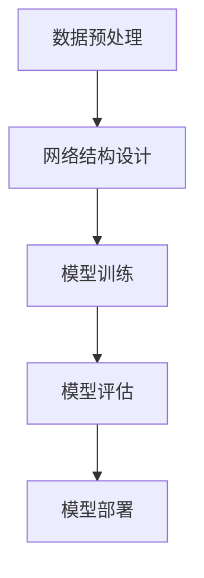

# 一切皆是映射：神经网络在医疗诊断中的应用

## 1.背景介绍

### 1.1 医疗诊断的现状与挑战

医疗诊断是现代医学中至关重要的一环。传统的诊断方法依赖于医生的经验和知识，但这种方法存在主观性强、误诊率高、效率低等问题。随着医疗数据的爆炸性增长，如何有效利用这些数据进行准确、快速的诊断成为一个亟待解决的问题。

### 1.2 人工智能与神经网络的崛起

人工智能（AI）特别是深度学习中的神经网络技术，近年来在各个领域取得了显著的进展。神经网络通过模拟人脑的工作方式，能够从大量数据中自动学习和提取特征，极大地提升了数据处理和分析的能力。这为医疗诊断带来了新的希望。

### 1.3 神经网络在医疗诊断中的潜力

神经网络在医疗诊断中的应用潜力巨大。通过对医疗影像、基因数据、电子病历等多种数据的分析，神经网络可以辅助医生进行更准确的诊断，甚至在某些情况下可以独立完成诊断任务。这不仅可以提高诊断的准确性，还可以大大减少医生的工作负担。

## 2.核心概念与联系

### 2.1 神经网络的基本概念

神经网络是一种模拟人脑神经元结构的计算模型。它由多个层级的神经元组成，每个神经元通过权重连接，形成一个复杂的网络结构。神经网络的基本单元包括输入层、隐藏层和输出层。

### 2.2 映射的概念

在数学中，映射是指将一个集合中的元素按照某种规则对应到另一个集合中的元素。神经网络的核心任务就是通过训练数据学习这种映射关系，从而实现输入到输出的转换。

### 2.3 神经网络与映射的联系

神经网络的训练过程实际上就是寻找输入数据到输出结果的最佳映射关系。通过不断调整网络中的权重和偏置，神经网络能够逐步逼近这种映射，从而实现对新数据的准确预测。

## 3.核心算法原理具体操作步骤

### 3.1 数据预处理

在进行神经网络训练之前，首先需要对数据进行预处理。这包括数据清洗、归一化、特征提取等步骤。数据预处理的质量直接影响到神经网络的训练效果。

### 3.2 网络结构设计

神经网络的结构设计是一个关键步骤。常见的网络结构包括全连接网络、卷积神经网络（CNN）、循环神经网络（RNN）等。不同的网络结构适用于不同类型的数据和任务。

### 3.3 模型训练

模型训练是神经网络学习映射关系的过程。通过反向传播算法，神经网络不断调整权重和偏置，以最小化损失函数。训练过程中需要设置学习率、批量大小、迭代次数等超参数。

### 3.4 模型评估

在模型训练完成后，需要对模型进行评估。常用的评估指标包括准确率、精确率、召回率、F1值等。通过评估可以判断模型的性能，并进行相应的调整和优化。

### 3.5 模型部署

在模型评估通过后，可以将模型部署到实际应用中。部署过程中需要考虑模型的响应速度、资源消耗、可扩展性等因素。



## 4.数学模型和公式详细讲解举例说明

### 4.1 神经网络的数学模型

神经网络的基本数学模型可以表示为：

$$
y = f(Wx + b)
$$

其中，$x$ 是输入向量，$W$ 是权重矩阵，$b$ 是偏置向量，$f$ 是激活函数，$y$ 是输出向量。

### 4.2 反向传播算法

反向传播算法是神经网络训练的核心。其基本思想是通过计算损失函数对权重和偏置的梯度，反向传播这些梯度以更新权重和偏置。损失函数 $L$ 的梯度计算公式为：

$$
\frac{\partial L}{\partial W} = \frac{\partial L}{\partial y} \cdot \frac{\partial y}{\partial W}
$$

### 4.3 激活函数

激活函数是神经网络中引入非线性的关键。常用的激活函数包括Sigmoid、ReLU、Tanh等。以ReLU为例，其数学表达式为：

$$
f(x) = \max(0, x)
$$

### 4.4 优化算法

优化算法用于最小化损失函数。常用的优化算法包括梯度下降、随机梯度下降（SGD）、Adam等。以梯度下降为例，其更新公式为：

$$
W = W - \eta \cdot \frac{\partial L}{\partial W}
$$

其中，$\eta$ 是学习率。

### 4.5 举例说明

假设我们有一个简单的二分类问题，输入数据为 $x = [x_1, x_2]$，输出为 $y \in \{0, 1\}$。我们可以设计一个包含一个隐藏层的神经网络，其结构如下：

$$
\begin{aligned}
    h &= f(W_1 x + b_1) \\
    y &= \sigma(W_2 h + b_2)
\end{aligned}
$$

其中，$W_1$ 和 $W_2$ 分别是输入层到隐藏层、隐藏层到输出层的权重矩阵，$b_1$ 和 $b_2$ 是偏置向量，$f$ 是隐藏层的激活函数，$\sigma$ 是输出层的激活函数（通常为Sigmoid）。

## 5.项目实践：代码实例和详细解释说明

### 5.1 数据集准备

在本项目中，我们将使用Kaggle上的一个公开医疗数据集。数据集包含患者的各种医疗指标和诊断结果。

### 5.2 数据预处理

首先，我们需要对数据进行预处理，包括缺失值处理、数据归一化和特征选择。

```python
import pandas as pd
from sklearn.preprocessing import StandardScaler

# 读取数据
data = pd.read_csv('medical_data.csv')

# 缺失值处理
data = data.dropna()

# 数据归一化
scaler = StandardScaler()
data_scaled = scaler.fit_transform(data.drop('diagnosis', axis=1))

# 特征和标签
X = data_scaled
y = data['diagnosis']
```

### 5.3 构建神经网络模型

接下来，我们使用Keras构建一个简单的神经网络模型。

```python
from keras.models import Sequential
from keras.layers import Dense

# 构建模型
model = Sequential()
model.add(Dense(64, input_dim=X.shape[1], activation='relu'))
model.add(Dense(32, activation='relu'))
model.add(Dense(1, activation='sigmoid'))

# 编译模型
model.compile(loss='binary_crossentropy', optimizer='adam', metrics=['accuracy'])
```

### 5.4 模型训练

使用训练数据对模型进行训练。

```python
from sklearn.model_selection import train_test_split

# 划分训练集和测试集
X_train, X_test, y_train, y_test = train_test_split(X, y, test_size=0.2, random_state=42)

# 训练模型
model.fit(X_train, y_train, epochs=50, batch_size=32, validation_data=(X_test, y_test))
```

### 5.5 模型评估

评估模型在测试集上的表现。

```python
# 评估模型
loss, accuracy = model.evaluate(X_test, y_test)
print(f'Loss: {loss}, Accuracy: {accuracy}')
```

### 5.6 模型部署

将训练好的模型保存并部署到实际应用中。

```python
# 保存模型
model.save('medical_diagnosis_model.h5')
```

## 6.实际应用场景

### 6.1 医疗影像诊断

神经网络在医疗影像诊断中表现出色。通过对大量医疗影像数据的训练，神经网络可以自动识别和分类各种病变，如肺癌、乳腺癌等。

### 6.2 基因数据分析

基因数据分析是另一个重要的应用场景。通过对基因数据的分析，神经网络可以预测疾病风险、个性化治疗方案等。

### 6.3 电子病历分析

电子病历包含了患者的详细医疗记录。神经网络可以通过对电子病历的分析，辅助医生进行诊断、治疗方案推荐等。

### 6.4 远程医疗

在远程医疗中，神经网络可以通过对患者上传的医疗数据进行分析，提供实时的诊断和治疗建议。

## 7.工具和资源推荐

### 7.1 开源框架

- TensorFlow：谷歌开发的开源深度学习框架，支持多种神经网络模型的构建和训练。
- PyTorch：Facebook开发的开源深度学习框架，具有灵活的动态计算图和强大的社区支持。
- Keras：一个高层神经网络API，能够运行在TensorFlow、Theano等后端之上，简化了神经网络的构建和训练。

### 7.2 数据集

- Kaggle：提供了大量公开的医疗数据集，适合进行神经网络的训练和测试。
- UCI Machine Learning Repository：一个著名的机器学习数据集库，包含了多个医疗相关的数据集。

### 7.3 在线课程

- Coursera：提供了多门关于深度学习和神经网络的在线课程，如Andrew Ng的深度学习专项课程。
- edX：提供了多门关于人工智能和机器学习的在线课程，适合不同层次的学习者。

## 8.总结：未来发展趋势与挑战

### 8.1 未来发展趋势

神经网络在医疗诊断中的应用前景广阔。随着数据量的不断增加和计算能力的提升，神经网络将能够处理更加复杂的医疗数据，提供更加准确和个性化的诊断和治疗方案。

### 8.2 挑战与解决方案

尽管神经网络在医疗诊断中展现了巨大的潜力，但仍面临一些挑战。包括数据隐私和安全、模型的可解释性、临床验证等。解决这些挑战需要多方合作，包括技术研发、政策制定和临床实践的结合。

## 9.附录：常见问题与解答

### 9.1 神经网络在医疗诊断中的优势是什么？

神经网络能够自动从大量数据中学习和提取特征，提供高效、准确的诊断结果，减少医生的工作负担。

### 9.2 如何选择合适的神经网络结构？

选择合适的神经网络结构需要根据具体的任务和数据类型进行。常见的网络结构包括全连接网络、卷积神经网络（CNN）、循环神经网络（RNN）等。

### 9.3 如何解决神经网络的过拟合问题？

可以通过增加数据量、使用正则化技术、采用交叉验证等方法来解决神经网络的过拟合问题。

### 9.4 神经网络在医疗诊断中的应用是否安全？

神经网络在医疗诊断中的应用需要经过严格的临床验证和监管，以确保其安全性和可靠性。

### 9.5 如何提高神经网络的可解释性？

可以通过使用可解释性模型、可视化技术、特征重要性分析等方法来提高神经网络的可解释性。

---

作者：禅与计算机程序设计艺术 / Zen and the Art of Computer Programming