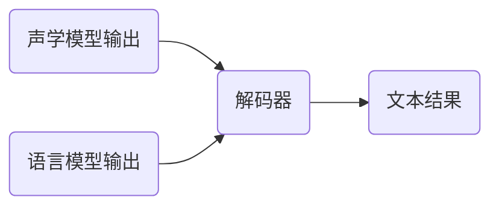

# 一切皆是映射：语音识别技术的AI转型

## 1. 背景介绍

随着人工智能的飞速发展，语音识别技术已经从简单的模式匹配演变为复杂的AI系统。这一转型不仅仅是技术的进步，更是对“映射”概念的深刻理解和应用。在这篇文章中，我们将探讨语音识别技术的AI转型过程，以及这一转型对未来技术发展的深远影响。

## 2. 核心概念与联系

### 2.1 语音识别的基本概念
语音识别是指将语音信号转换为文本信息的技术。它涉及声学模型、语言模型、解码器等多个组件。

### 2.2 AI在语音识别中的角色
AI技术，尤其是深度学习，已经成为提高语音识别准确性的关键。它通过学习大量数据来建立声学模型和语言模型。

### 2.3 映射的重要性
映射是AI中的一个核心概念，它指的是输入和输出之间的转换关系。在语音识别中，映射体现在声音信号到文本的转换上。

## 3. 核心算法原理具体操作步骤

### 3.1 声学模型的构建
声学模型是语音识别中的核心，它负责将声音信号映射到语音单元。


### 3.2 语言模型的构建
语言模型用于预测词序列的概率，它帮助系统理解和预测语句的结构。


### 3.3 解码器的作用
解码器结合声学模型和语言模型的输出，生成最终的文本结果。



## 4. 数学模型和公式详细讲解举例说明

### 4.1 声学模型的数学基础
声学模型通常基于隐马尔可夫模型（HMM）或神经网络。以HMM为例，我们可以用以下公式表示：

$$
P(O|\lambda) = \sum_{所有可能的状态序列} P(O|状态序列, \lambda)P(状态序列|\lambda)
$$

其中，$O$ 是观测序列，$\lambda$ 是模型参数。

### 4.2 语言模型的数学基础
语言模型常用的是N-gram模型，其核心公式为：

$$
P(w_n|w_{n-1}, w_{n-2}, ..., w_{n-N+1}) = \frac{Count(w_{n-N+1}, ..., w_{n-1}, w_n)}{Count(w_{n-N+1}, ..., w_{n-1})}
$$

其中，$w_n$ 是第$n$个词，$Count$ 是在语料库中的计数函数。

### 4.3 解码器的数学模型
解码器的目标是找到最大化后验概率的词序列：

$$
\hat{W} = \arg\max_W P(W|O) = \arg\max_W \frac{P(O|W)P(W)}{P(O)}
$$

其中，$W$ 是词序列，$O$ 是观测序列。

## 5. 项目实践：代码实例和详细解释说明

### 5.1 声学模型实现
以深度神经网络为例，我们可以使用TensorFlow或PyTorch等框架来实现声学模型。

```python
# 伪代码示例
import tensorflow as tf

# 构建模型
model = tf.keras.Sequential([
    tf.keras.layers.Dense(units=256, activation='relu', input_shape=(feature_size,)),
    tf.keras.layers.Dense(units=128, activation='relu'),
    tf.keras.layers.Dense(units=num_phonemes, activation='softmax')
])

# 编译模型
model.compile(optimizer='adam', loss='categorical_crossentropy', metrics=['accuracy'])

# 训练模型
model.fit(train_features, train_labels, epochs=10)
```

### 5.2 语言模型实现
N-gram模型可以使用统计方法简单实现，也可以使用更复杂的神经网络模型。

```python
# 伪代码示例
from collections import Counter

# 统计词频
bigram_counts = Counter(zip(words[:-1], words[1:]))
unigram_counts = Counter(words)

# 计算概率
def calculate_bigram_probability(prev_word, word):
    return bigram_counts[(prev_word, word)] / unigram_counts[prev_word]
```

### 5.3 解码器实现
解码器的实现依赖于搜索算法，如束搜索（Beam Search）。

```python
# 伪代码示例
def beam_search_decoder(predictions, top_k):
    sequences = [[list(), 1.0]]
    # 遍历所有的预测
    for row in predictions:
        all_candidates = list()
        # 展开每个序列
        for seq, score in sequences:
            for i in range(len(row)):
                candidate = [seq + [i], score * -np.log(row[i])]
                all_candidates.append(candidate)
        # 排序所有候选
        ordered = sorted(all_candidates, key=lambda tup:tup[1])
        # 选择得分最高的
        sequences = ordered[:top_k]
    return sequences
```

## 6. 实际应用场景

语音识别技术广泛应用于智能助手、客服系统、语音翻译、辅助听障人士等领域。随着技术的进步，其应用范围还在不断扩大。

## 7. 工具和资源推荐

- TensorFlow和PyTorch：用于构建和训练深度学习模型的框架。
- Kaldi：一个开源的语音识别工具包，适合研究和开发。
- CMU Sphinx：另一个开源的语音识别系统，适合教育和轻量级应用。

## 8. 总结：未来发展趋势与挑战

语音识别技术的未来发展趋势包括更高的准确性、实时性和对多种语言的支持。挑战则包括处理方言、噪声干扰和隐私保护等问题。

## 9. 附录：常见问题与解答

- Q: 语音识别准确性如何提高？
- A: 通过增加训练数据、优化模型结构和参数、使用更先进的算法等方法。

- Q: 如何处理不同的口音和方言？
- A: 通过收集多样化的训练数据和构建专门的声学模型来处理。

- Q: 语音识别系统如何保护用户隐私？
- A: 通过匿名化处理数据、本地化处理语音信息等方式来增强隐私保护。

作者：禅与计算机程序设计艺术 / Zen and the Art of Computer Programming