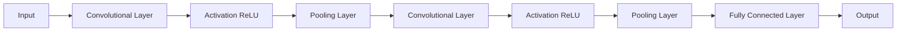

# 从零开始大模型开发与微调：PyTorch中的卷积函数实现详解

## 1. 背景介绍
### 1.1 大模型的崛起
近年来,随着深度学习的蓬勃发展,大规模预训练语言模型(Large Pre-trained Language Models,简称大模型)在自然语言处理领域取得了令人瞩目的成就。从BERT、GPT到ERNIE、PaLM等,大模型不断刷新着各项NLP任务的性能记录,展现出了强大的语言理解和生成能力。这些大模型通过在海量无标注语料上进行自监督预训练,学习到了丰富的语言知识和常识,具备了一定的推理、问答、写作等能力,为NLP应用开启了广阔的想象空间。

### 1.2 大模型开发面临的挑战
尽管大模型取得了瞩目的成就,但开发和训练一个高质量的大模型并非易事。首先,大模型通常包含数十亿甚至上千亿参数,对算力和内存有着极高的要求,需要依赖高性能的分布式训练平台。其次,大模型的训练需要海量的无标注语料作为燃料,如何高效地获取、清洗和组织高质量的预训练语料也是一大挑战。再者,大模型训练完成后,如何有效地将其应用到下游任务中,即模型微调(Fine-tuning)阶段,也需要精心设计和不断调优。

### 1.3 卷积神经网络在大模型中的重要性
在大模型的架构设计中,卷积神经网络(Convolutional Neural Networks, CNN)发挥着至关重要的作用。作为一种强大的特征提取器,CNN能够自动学习输入数据中的局部特征,并通过层级结构逐步提取更加抽象和高级的特征表示。在计算机视觉领域,CNN早已成为图像分类、目标检测、语义分割等任务的主流模型。而在大模型中,CNN则被广泛用于构建上下文编码器,用于提取输入文本的局部和全局特征。

### 1.4 PyTorch深度学习框架
PyTorch是由Facebook开源的深度学习框架,以其简洁灵活的编程接口和强大的动态计算图功能而备受青睐。PyTorch提供了丰富的神经网络层和功能模块,使得研究人员和工程师能够方便地搭建和训练各种深度学习模型。特别地,PyTorch内置了多种卷积函数,为CNN的实现提供了坚实的基础。

本文将以PyTorch为基础,深入探讨卷积函数的原理和实现细节,并结合具体的代码实例,讲解如何利用卷积函数搭建CNN模型,从而为大模型开发打下坚实的基础。通过本文的学习,读者将掌握卷积运算的数学原理、PyTorch中卷积函数的使用方法,并能够灵活运用CNN构建大模型的关键组件。

## 2. 核心概念与联系
### 2.1 卷积运算
卷积运算是CNN的核心操作,其目的是提取输入数据中的局部特征。卷积运算通过一个卷积核(也称为过滤器)在输入数据上滑动,并计算卷积核与输入数据局部区域的点积,从而得到输出特征图。卷积核可以看作是一个权重矩阵,其中每个元素都是待学习的参数。通过训练优化卷积核的权重,CNN能够自动学习到输入数据中的显著特征。

### 2.2 卷积层
卷积层是由若干个卷积核组成的神经网络层,每个卷积核负责提取输入数据中的一种特定模式。卷积层的输出是多个二维特征图的堆叠,每个特征图对应一个卷积核的输出。通过堆叠多个卷积层,CNN能够逐层提取输入数据中的层级特征,从低级的边缘、纹理到高级的语义信息。

### 2.3 池化层
池化层通常紧跟在卷积层之后,用于降低特征图的空间维度,从而减少模型的参数量和计算复杂度。常见的池化操作包括最大池化和平均池化,分别取局部区域内的最大值或平均值作为输出。池化层不仅能够压缩特征表示,还具有一定的平移不变性,使得模型对输入数据的微小扰动更加鲁棒。

### 2.4 激活函数
激活函数用于在卷积层或全连接层之后引入非线性变换,增强模型的表达能力。常见的激活函数包括ReLU、Sigmoid、Tanh等。ReLU(Rectified Linear Unit)是目前最常用的激活函数,其形式为f(x)=max(0,x),能够有效缓解梯度消失问题,加速模型训练。

### 2.5 全连接层
全连接层通常位于CNN的末端,用于将提取到的高级特征映射到输出类别或标签。全连接层的每个神经元与上一层的所有神经元相连,并通过权重矩阵和偏置向量对输入特征进行线性变换。全连接层的输出可以经过Softmax函数归一化,得到各个类别的概率分布。

下图展示了一个典型的CNN架构,包含了卷积层、池化层、激活函数和全连接层:



## 3. 核心算法原理与具体操作步骤
### 3.1 卷积运算的数学定义
给定一个输入张量$\mathbf{X} \in \mathbb{R}^{H \times W \times C}$和一个卷积核$\mathbf{K} \in \mathbb{R}^{k \times k \times C}$,卷积运算的数学定义如下:

$$\mathbf{Y}[i,j] = \sum_{m=0}^{k-1} \sum_{n=0}^{k-1} \sum_{c=0}^{C-1} \mathbf{X}[i+m,j+n,c] \cdot \mathbf{K}[m,n,c]$$

其中,$\mathbf{Y}$为输出特征图,$H$和$W$分别为输入张量的高度和宽度,$C$为输入张量的通道数,$k$为卷积核的大小。

### 3.2 卷积运算的具体步骤
1. 将卷积核$\mathbf{K}$放置在输入张量$\mathbf{X}$的左上角,使其与输入张量的局部区域对齐。
2. 对卷积核与输入张量的对应元素进行逐元素相乘,并将结果相加,得到输出特征图$\mathbf{Y}$的第一个元素。
3. 将卷积核向右滑动一个步长(stride),重复步骤2,得到输出特征图的下一个元素。
4. 当卷积核到达输入张量的最右边时,将其移动到下一行的最左边,重复步骤2-3,直到遍历完整个输入张量。

### 3.3 卷积运算的变体
#### 3.3.1 带填充的卷积(Padding)
为了保持输出特征图的大小与输入张量一致,可以在输入张量的边缘填充零元素。常见的填充方式有VALID(不填充)和SAME(填充到输出大小与输入相同)。

#### 3.3.2 带步长的卷积(Stride)
步长指卷积核在输入张量上滑动的步伐大小。步长大于1时,可以降低输出特征图的空间维度。

#### 3.3.3 空洞卷积(Dilated Convolution)
空洞卷积在卷积核内引入了空洞(dilation),使得卷积核可以覆盖更大的感受野,捕捉更长距离的依赖关系。空洞卷积在语义分割等任务中得到了广泛应用。

#### 3.3.4 转置卷积(Transposed Convolution)
转置卷积又称为反卷积(Deconvolution),其目的是将特征图的空间维度上采样到更高的分辨率。转置卷积在图像生成、分割等任务中扮演重要角色。

## 4. 数学模型和公式详细讲解举例说明
### 4.1 卷积运算的矩阵表示
卷积运算可以用矩阵乘法的形式来表示,使得在硬件上更加高效地实现。将输入张量$\mathbf{X}$和卷积核$\mathbf{K}$展开为矩阵,卷积运算可以表示为:

$$\mathbf{y} = \mathbf{X} \cdot \mathbf{k}$$

其中,$\mathbf{y}$为输出特征图向量,$\mathbf{X}$为输入张量的展开矩阵,$\mathbf{k}$为卷积核的展开向量。

### 4.2 卷积核权重的学习
卷积核的权重是CNN的关键参数,需要通过训练数据和优化算法来学习。给定一组训练样本$\{(\mathbf{X}_i,y_i)\}_{i=1}^N$,其中$\mathbf{X}_i$为输入张量,$y_i$为对应的标签,卷积核权重$\mathbf{K}$的学习目标是最小化损失函数:

$$\mathcal{L}(\mathbf{K}) = \frac{1}{N} \sum_{i=1}^N \ell(f(\mathbf{X}_i;\mathbf{K}),y_i) + \lambda \cdot \Omega(\mathbf{K})$$

其中,$f(\cdot)$为CNN的前向传播函数,$\ell(\cdot)$为损失函数(如交叉熵损失),$\Omega(\cdot)$为正则化项(如L2正则化),$\lambda$为正则化系数。

通过随机梯度下降等优化算法,不断更新卷积核权重$\mathbf{K}$,最小化损失函数,使得CNN能够学习到输入数据中的显著特征。

### 4.3 卷积运算的前向传播和反向传播
在CNN的前向传播过程中,卷积运算负责将输入张量转换为输出特征图。而在反向传播过程中,需要计算损失函数对卷积核权重的梯度,并将其传递到上一层。

给定损失函数$\mathcal{L}$对输出特征图$\mathbf{Y}$的梯度$\frac{\partial \mathcal{L}}{\partial \mathbf{Y}}$,根据链式法则,损失函数对卷积核权重$\mathbf{K}$的梯度为:

$$\frac{\partial \mathcal{L}}{\partial \mathbf{K}} = \frac{\partial \mathcal{L}}{\partial \mathbf{Y}} \cdot \frac{\partial \mathbf{Y}}{\partial \mathbf{K}} = \frac{\partial \mathcal{L}}{\partial \mathbf{Y}} * \mathbf{X}$$

其中,$*$表示卷积运算。

同理,损失函数对输入张量$\mathbf{X}$的梯度为:

$$\frac{\partial \mathcal{L}}{\partial \mathbf{X}} = \frac{\partial \mathcal{L}}{\partial \mathbf{Y}} * \mathbf{K}^{\text{rot180}}$$

其中,$\mathbf{K}^{\text{rot180}}$表示将卷积核旋转180度后的结果。

通过反复执行前向传播和反向传播,并更新卷积核权重,CNN能够不断优化模型参数,提升特征提取和分类性能。

## 5. 项目实践:代码实例和详细解释说明
下面以PyTorch为例,展示如何使用卷积函数搭建一个简单的CNN模型,并应用于手写数字识别任务。

### 5.1 导入所需的库
```python
import torch
import torch.nn as nn
import torch.optim as optim
from torchvision import datasets, transforms
```

### 5.2 定义CNN模型
```python
class Net(nn.Module):
    def __init__(self):
        super(Net, self).__init__()
        self.conv1 = nn.Conv2d(1, 32, 3, 1)
        self.conv2 = nn.Conv2d(32, 64, 3, 1)
        self.dropout1 = nn.Dropout2d(0.25)
        self.dropout2 = nn.Dropout2d(0.5)
        self.fc1 = nn.Linear(9216, 128)
        self.fc2 = nn.Linear(128, 10)

    def forward(self, x):
        x = self.conv1(x)
        x = nn.functional.relu(x)
        x = self.conv2(x)
        x = nn.functional.relu(x)
        