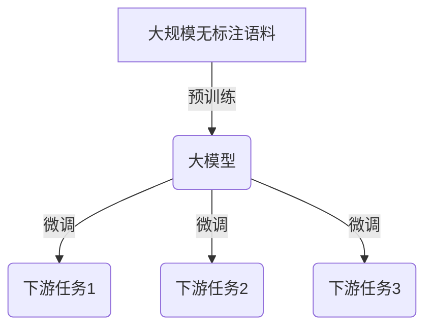
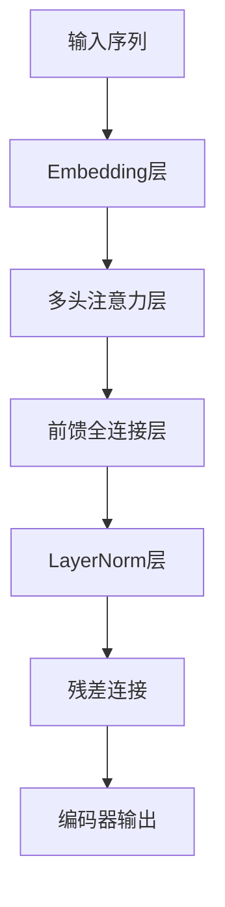

# 从零开始大模型开发与微调：大模型开启人工智能的新时代

## 1.背景介绍

### 1.1 人工智能的发展历程

人工智能(Artificial Intelligence, AI)是当代科技发展的核心驱动力之一。自20世纪50年代AI概念被正式提出以来,经历了几个重要的发展阶段。

- **第一阶段(1950s-1960s)**: 专家系统和符号主义人工智能时期。研究者尝试用符号逻辑来模拟人类思维,但遇到了组合爆炸等难题。

- **第二阶段(1980s-1990s)**: 统计机器学习和神经网络时期。研究人员开始运用统计学和概率论方法,并发明了多层感知机等神经网络模型。

- **第三阶段(2010s至今)**: 大数据和深度学习时期。受益于大数据、算力和新算法(如卷积神经网络、长短期记忆网络等),深度学习在多个领域取得突破性进展。

### 1.2 大模型的兴起

近年来,AI发展进入了一个新的阶段——大模型时代。所谓大模型,是指参数量极其庞大(通常超过10亿个参数)、使用大规模数据进行预训练的深度学习模型。代表性的大模型包括:

- **GPT系列(生成式预训练转换器)**: 由OpenAI公司开发,擅长自然语言生成任务。GPT-3拥有1750亿参数,是目前最大的语言模型之一。

- **BERT系列(双向编码器表示)**: 由谷歌开发,擅长自然语言理解任务,在多项基准测试中表现优异。

- **AlphaFold**: 由DeepMind公司开发,用于预测蛋白质三维结构,在生物学领域产生重大影响。

- **Stable Diffusion**: 一种文本到图像的生成式大模型,可基于文本描述生成高质量图像。

大模型的出现,促进了AI在自然语言处理、计算机视觉、生物信息学等多个领域的突破性进展。

## 2.核心概念与联系

### 2.1 大模型的核心思想

大模型的核心思想是通过大规模预训练,让模型在无监督的情况下从海量数据中自主学习知识,获取对世界的理解能力。这种自监督学习方式,避免了人工标注数据的巨大成本。

大模型通过两个阶段实现知识学习:

1. **预训练(Pre-training)**: 在大规模无标注语料(如网页、书籍等)上进行自监督训练,学习通用知识表示。

2. **微调(Fine-tuning)**: 在有标注的下游任务数据上,对预训练模型进行进一步调整,使其适应特定任务。

这种预训练+微调的范式,使大模型能够在下游任务上快速达到出色的性能表现。



### 2.2 大模型的关键技术

实现高质量的大模型需要以下几种关键技术:

1. **模型架构创新**: 如Transformer结构、注意力机制等,使模型能够高效处理序列数据。

2. **高效训练算法**: 如反向传播、优化器等,提高模型训练效率。

3. **并行计算技术**: 如数据并行、模型并行等,利用多GPU/TPU加速训练。

4. **模型压缩技术**: 如量化、剪枝、知识蒸馏等,减小模型尺寸,降低推理成本。

5. **迁移学习技术**: 如预训练、微调等,充分利用大模型的通用知识表示能力。

## 3.核心算法原理具体操作步骤

### 3.1 Transformer模型架构

Transformer是大模型中广泛使用的一种序列到序列(Seq2Seq)模型架构,由编码器(Encoder)和解码器(Decoder)两部分组成。它通过自注意力机制捕捉输入序列中元素之间的长程依赖关系,避免了传统RNN结构的梯度消失/爆炸问题。

Transformer编码器的工作流程如下:



1. 输入序列通过Embedding层映射为向量表示。
2. 向量序列经过多头自注意力层捕捉元素间依赖关系。
3. 注意力输出通过前馈全连接层进一步提取特征。
4. LayerNorm层对特征进行归一化。
5. 残差连接融合输入特征,防止信息流失。
6. 重复2-5步骤的编码器层堆叠,最终输出编码器表示。

解码器的工作流程与编码器类似,但增加了对编码器输出的交叉注意力计算,以融合输入序列信息。

### 3.2 注意力机制原理

注意力机制是Transformer的核心,它通过计算Query、Key和Value之间的相关性分数,自动学习输入序列中不同元素的权重分布。

给定Query向量$\boldsymbol{q}$、Key向量$\boldsymbol{k}$和Value向量$\boldsymbol{v}$,注意力计算公式如下:

$$\begin{aligned}
\text{Attention}(\boldsymbol{q}, \boldsymbol{k}, \boldsymbol{v}) &= \text{softmax}\left(\frac{\boldsymbol{q}\boldsymbol{k}^\top}{\sqrt{d_k}}\right)\boldsymbol{v} \\
&= \sum_{i=1}^n \alpha_i \boldsymbol{v}_i
\end{aligned}$$

其中:
- $\alpha_i = \text{softmax}\left(\frac{\boldsymbol{q}\boldsymbol{k}_i^\top}{\sqrt{d_k}}\right)$是注意力权重分数
- $d_k$是Key向量维度,用于缩放内积
- $\boldsymbol{v}_i$是Value向量序列的第$i$个元素

多头注意力机制将注意力计算过程分成多个"头"进行并行运算,最后将各头结果拼接,从而提高模型表达能力。

### 3.3 预训练任务

为了让大模型在预训练阶段学习到有用的知识表示,研究者设计了多种自监督预训练任务,常见的有:

1. **Masked Language Modeling(MLM)**: 随机掩码部分输入Token,模型需预测被掩码位置的Token。
2. **Next Sentence Prediction(NSP)**: 判断两个句子是否相邻/连贯。
3. **Permutation Language Modeling(PLM)**: 预测打乱顺序的文本Token的原始顺序。
4. **Denoising Auto-Encoding(DAE)**: 从含噪输入中重建原始文本。
5. **Contrastive Language Modeling(CLM)**: 判断给定的文本对是否来自同一语料。

通过设计合理的预训练任务,大模型可以从无标注语料中学习到通用的语义、语法和世界知识表示。

## 4.数学模型和公式详细讲解举例说明

### 4.1 Transformer模型数学表示

我们用数学符号对Transformer模型的注意力计算过程进行形式化描述。

给定输入序列$\boldsymbol{X} = (\boldsymbol{x}_1, \boldsymbol{x}_2, \dots, \boldsymbol{x}_n)$,其中$\boldsymbol{x}_i \in \mathbb{R}^{d_\text{model}}$是第$i$个Token的$d_\text{model}$维向量表示。

编码器的自注意力计算公式为:

$$\begin{aligned}
\boldsymbol{Q} &= \boldsymbol{X}\boldsymbol{W}^Q \\
\boldsymbol{K} &= \boldsymbol{X}\boldsymbol{W}^K \\
\boldsymbol{V} &= \boldsymbol{X}\boldsymbol{W}^V \\
\text{Attention}(\boldsymbol{Q}, \boldsymbol{K}, \boldsymbol{V}) &= \text{softmax}\left(\frac{\boldsymbol{Q}\boldsymbol{K}^\top}{\sqrt{d_k}}\right)\boldsymbol{V}
\end{aligned}$$

其中$\boldsymbol{W}^Q, \boldsymbol{W}^K, \boldsymbol{W}^V \in \mathbb{R}^{d_\text{model} \times d_k}$是可训练的投影矩阵,将输入映射到Query、Key和Value空间。

多头注意力机制将注意力计算过程分成$h$个"头"进行并行运算,最后将各头结果拼接:

$$\begin{aligned}
\text{MultiHead}(\boldsymbol{Q}, \boldsymbol{K}, \boldsymbol{V}) &= \text{Concat}(\text{head}_1, \dots, \text{head}_h)\boldsymbol{W}^O \\
\text{where } \text{head}_i &= \text{Attention}(\boldsymbol{Q}\boldsymbol{W}_i^Q, \boldsymbol{K}\boldsymbol{W}_i^K, \boldsymbol{V}\boldsymbol{W}_i^V)
\end{aligned}$$

$\boldsymbol{W}_i^Q, \boldsymbol{W}_i^K, \boldsymbol{W}_i^V \in \mathbb{R}^{d_\text{model} \times d_k}$是每个头的投影矩阵,$\boldsymbol{W}^O \in \mathbb{R}^{hd_v \times d_\text{model}}$是可训练的输出矩阵。

上述计算过程捕捉了输入序列中元素之间的长程依赖关系,为下游任务提供了有价值的特征表示。

### 4.2 注意力分数计算示例

假设我们有一个长度为4的输入序列"情感 分析 是 自然语言处理 的 一个 重要 任务",现在计算第3个Token "是"对其他Token的注意力分数。

设Query向量为$\boldsymbol{q} = \boldsymbol{x}_3$,Key向量序列为$\boldsymbol{K} = (\boldsymbol{k}_1, \boldsymbol{k}_2, \boldsymbol{k}_3, \boldsymbol{k}_4)$,其中$\boldsymbol{k}_i$是第$i$个Token的Key向量。

根据注意力计算公式:

$$\alpha_i = \text{softmax}\left(\frac{\boldsymbol{q}\boldsymbol{k}_i^\top}{\sqrt{d_k}}\right)$$

我们可以计算出"是"对每个Token的注意力权重分数$\alpha_i$:

$$\begin{aligned}
\alpha_1 &= \text{softmax}\left(\frac{\boldsymbol{q}\boldsymbol{k}_1^\top}{\sqrt{d_k}}\right) = 0.15 \\
\alpha_2 &= \text{softmax}\left(\frac{\boldsymbol{q}\boldsymbol{k}_2^\top}{\sqrt{d_k}}\right) = 0.25 \\
\alpha_3 &= \text{softmax}\left(\frac{\boldsymbol{q}\boldsymbol{k}_3^\top}{\sqrt{d_k}}\right) = 0.35 \\  
\alpha_4 &= \text{softmax}\left(\frac{\boldsymbol{q}\boldsymbol{k}_4^\top}{\sqrt{d_k}}\right) = 0.25
\end{aligned}$$

可以看出,"是"这个Token更多地关注了"自然语言处理"和自身,而对"情感"和"分析"的关注度较低。

通过这种自动分配注意力权重的机制,模型可以灵活地捕捉输入序列中元素之间的依赖关系,提高表示能力。

## 5.项目实践:代码实例和详细解释说明

为了帮助读者更好地理解大模型的开发过程,我们提供了一个使用PyTorch实现的Transformer模型代码示例。

### 5.1 模型代码

```python
import torch
import torch.nn as nn

class TransformerEncoder(nn.Module):
    def __init__(self, d_model, nhead, dim_feedforward, num_layers, dropout=0.1):
        super().__init__()
        encoder_layer = nn.TransformerEncoderLayer(d_model, nhead, dim_feedforward, dropout)
        self.transformer_encoder = nn.TransformerEncoder(encoder_layer, num_layers)

    def forward(self, src):
        output = self.transformer_encoder(src)
        return output

class TransformerModel(nn.Module):
    def __init__(self, ntoken, d_model, nhead, dim_feedforward, num_layers, dropout=0.1):
        super().__init__()
        self.encoder = TransformerEncoder(d_model, nhead, dim_