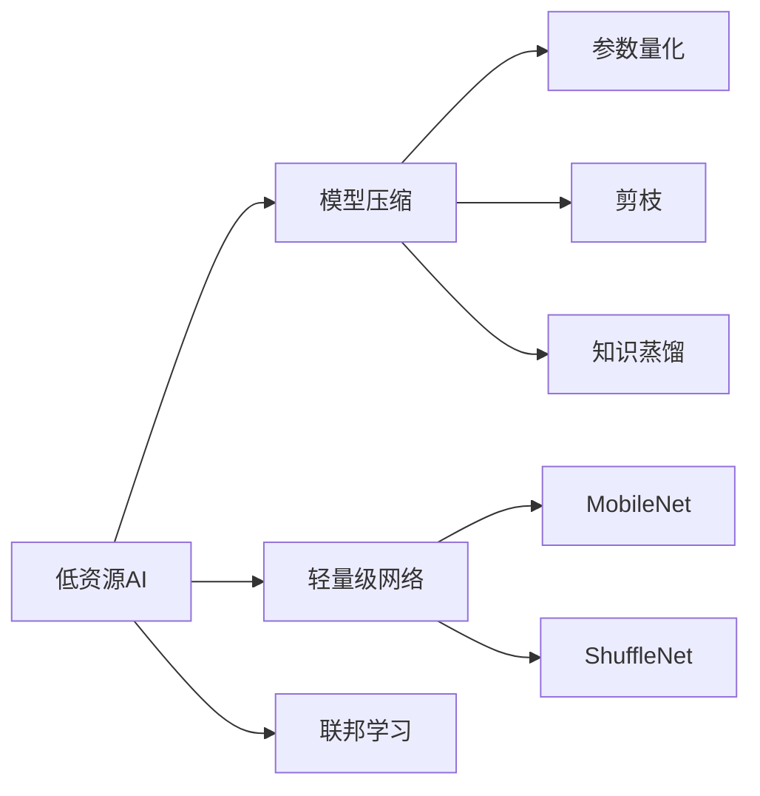

# 低资源AI:在受限环境中实现智能,边缘设备上的AI部署

## 1. 背景介绍
### 1.1 低资源AI的定义与意义
#### 1.1.1 低资源AI的概念
低资源AI(Low-Resource AI)是指在计算资源、存储空间、能耗等方面受限的环境中实现人工智能应用的技术。与传统的云端AI不同,低资源AI面向边缘设备,如智能手机、可穿戴设备、IoT设备等,力求在有限的硬件条件下实现智能化。

#### 1.1.2 低资源AI的重要性
随着AI应用的普及,越来越多的场景要求在终端设备上完成智能任务,低资源AI由此应运而生。它有效解决了云端AI面临的高时延、隐私泄露等问题,使AI无处不在成为可能。低资源AI是AI民主化的关键,让智能触手可及。

### 1.2 低资源AI面临的挑战
#### 1.2.1 计算资源受限
边缘设备的CPU、GPU等计算资源十分有限,无法支撑起庞大的深度学习模型。低资源AI需要在保证模型性能的同时最小化计算开销。

#### 1.2.2 存储空间不足
相比云端,边缘设备的存储空间很小,难以存放体积庞大的模型参数。低资源AI要求模型尽可能小巧,减少对存储的占用。

#### 1.2.3 能耗要求严苛
移动终端往往依靠电池供电,能耗直接影响续航。低资源AI必须控制能耗,延长设备使用时间。同时还要考虑散热等物理限制。

## 2. 核心概念与联系
### 2.1 模型压缩
模型压缩通过参数量化、剪枝、知识蒸馏等手段减小模型体积,是低资源AI的核心技术之一。

### 2.2 轻量级网络结构
精心设计轻量级的网络结构如MobileNet、ShuffleNet,在降低模型复杂度的同时保持较高的性能,是低资源AI的重要手段。

### 2.3 联邦学习
联邦学习允许终端设备协同训练模型,既能利用分散的数据,又无需集中存储,是低资源环境下的分布式学习范式。

### 2.4 概念之间的联系
模型压缩和轻量级网络是低资源AI模型开发的两大支柱,二者相辅相成。联邦学习则从数据和训练的角度,提供了低资源场景下的新思路。三者协同构成了低资源AI的完整技术体系。



## 3. 核心算法原理具体操作步骤
### 3.1 模型量化
#### 3.1.1 原理
模型量化将模型权重从32位浮点数转换为低位宽的定点数如8位整数,从而大幅减小模型体积。量化后的运算更高效,但会引入一定的精度损失。

#### 3.1.2 操作步骤
1. 确定量化位宽,一般选择8位
2. 计算权重的最大最小值,确定量化范围
3. 将浮点权重线性映射到量化范围内的整数
4. 微调量化后的模型,恢复精度

### 3.2 剪枝
#### 3.2.1 原理
剪枝通过移除冗余和不重要的神经元连接,在降低模型复杂度的同时尽量保持性能。剪枝可分为非结构化和结构化两种,前者灵活性高,后者规整利于加速。

#### 3.2.2 操作步骤
1. 训练原始模型
2. 确定剪枝方式和比例
3. 根据某种重要性准则,如权重的绝对值大小,选择要剪枝的连接
4. 移除选中的连接,并微调剩余权重
5. 迭代执行3-4步,直到达到目标剪枝率

### 3.3 知识蒸馏
#### 3.3.1 原理
知识蒸馏利用大型教师模型的知识来指导小型学生模型的训练。学生模型不仅学习教师的预测结果,还学习更加柔软的概率输出,获得泛化能力。

#### 3.3.2 操作步骤
1. 训练大型教师模型
2. 利用教师模型的预测概率作为软目标,蒸馏到学生模型
3. 同时考虑学生模型在真实标签上的硬目标损失
4. 联合训练,让学生模型同时拟合软目标和硬目标

## 4. 数学模型和公式详细讲解举例说明
### 4.1 模型量化中的线性映射
设浮点权重的最大最小值为 $x_{max}$ 和 $x_{min}$,量化位宽为 $B$,则量化后的整数范围为 $[0, 2^B-1]$。浮点权重 $x$ 量化为整数 $q$ 的映射公式为:

$$
q = round(\frac{x - x_{min}}{x_{max} - x_{min}} \times (2^B - 1))
$$

反之,将整数 $q$ 反量化为浮点数 $x$ 的公式为:

$$
x = \frac{q}{2^B - 1} \times (x_{max} - x_{min}) + x_{min}
$$

举例而言,假设某层权重的最大最小值为1和-1,量化位宽为8位,则浮点数0.5量化后的结果为:

$$
q = round(\frac{0.5 - (-1)}{1 - (-1)} \times (2^8 - 1)) = 192
$$

### 4.2 知识蒸馏的损失函数
设教师模型的预测概率分布为 $P_t$,学生模型的预测概率分布为 $P_s$,真实标签的one-hot编码为 $y$,蒸馏温度为 $T$,则知识蒸馏的损失函数可以表示为:

$$
\mathcal{L} = \alpha T^2 \cdot D_{KL}(\frac{P_t}{T} || \frac{P_s}{T}) + \beta \cdot H(y, P_s)
$$

其中 $D_{KL}$ 表示KL散度,用于度量学生模型与教师模型软目标间的差异;$H$ 表示交叉熵,用于度量学生模型与真实标签间的差异。$\alpha$ 和 $\beta$ 为两项损失的权重系数。温度 $T$ 的作用是放大软目标的概率差异。

举例而言,假设教师模型对某样本的预测概率为 $[0.5, 0.3, 0.2]$,学生模型的预测概率为 $[0.6, 0.3, 0.1]$,真实标签为第1类,取 $\alpha=\beta=1, T=3$,则此样本上的蒸馏损失为:

$$
\mathcal{L} = 9 \cdot (0.5 \log \frac{0.5}{0.6} + 0.3 \log \frac{0.3}{0.3} + 0.2 \log \frac{0.2}{0.1}) - \log 0.6 \approx 2.42
$$

## 5. 项目实践：代码实例和详细解释说明
下面以PyTorch为例,展示低资源AI中模型量化的代码实现:

```python
import torch
import torch.nn as nn

# 定义量化函数
def quantize(x, scale, zero_point, dtype=torch.uint8):
    return torch.round(x / scale + zero_point).to(dtype)

def dequantize(q, scale, zero_point):
    return (q.to(torch.float) - zero_point) * scale

# 定义量化卷积层
class QuantConv2d(nn.Conv2d):
    def __init__(self, *args, **kwargs):
        super().__init__(*args, **kwargs)
        self.scale = None
        self.zero_point = None
    
    def forward(self, x):
        if self.scale is None:
            # 首次运行时初始化量化参数
            w = self.weight.detach()
            self.scale = w.abs().max() / 127
            self.zero_point = torch.round(-128 * self.scale)
        # 量化权重
        qw = quantize(self.weight, self.scale, self.zero_point)
        # 反量化权重并做卷积运算
        w = dequantize(qw, self.scale, self.zero_point)
        return nn.functional.conv2d(x, w, self.bias, self.stride, self.padding, self.dilation, self.groups)
        
# 使用量化卷积层替换普通卷积层
def quantize_model(model):
    for name, module in model.named_modules():
        if isinstance(module, nn.Conv2d):
            quant_conv = QuantConv2d(module.in_channels, module.out_channels, 
                                     module.kernel_size, stride=module.stride,
                                     padding=module.padding, dilation=module.dilation,
                                     groups=module.groups, bias=module.bias is not None)
            quant_conv.weight.data.copy_(module.weight)
            if module.bias is not None:
                quant_conv.bias.data.copy_(module.bias)
            setattr(model, name, quant_conv)
    return model
```

代码解释:
1. 首先定义了量化和反量化函数,将浮点张量与定点张量相互映射。
2. 然后定义量化卷积层QuantConv2d,继承自nn.Conv2d。在第一次前向传播时,根据权重的最大绝对值计算量化参数scale和zero_point。之后每次前向传播时,用量化参数对权重做定点量化,然后反量化并做卷积运算。
3. 最后定义quantize_model函数,用于将模型中的普通卷积层替换为量化卷积层。它遍历模型的所有子模块,如果发现nn.Conv2d就将其替换为QuantConv2d,并复制权重。

这样就完成了卷积神经网络的定点量化,可以大幅压缩模型体积。需要注意的是,量化会带来一定的精度损失,可能需要微调或重训练来恢复性能。

## 6. 实际应用场景
低资源AI在众多领域得到应用,如:

- 智能手机上的人脸识别、语音助手等
- 可穿戴设备如智能手表上的健康监测
- 无人机上的目标检测和跟踪
- 工业IoT设备的异常检测和预测性维护
- 智能家居中的语音控制、家电节能优化等

以智能手机的人脸识别为例。传统的云端人脸识别需要将图像上传至服务器,不仅耗时还存在隐私泄露风险。而采用低资源AI,可以直接在手机端完成人脸检测、特征提取、比对等步骤。一方面,本地计算避免了隐私问题;另一方面,低功耗的模型能延长手机待机。这极大提升了用户体验。

## 7. 工具和资源推荐
- PyTorch和TensorFlow等深度学习框架,提供了方便的模型压缩工具如量化感知训练
- TensorFlow Lite、NCNN等移动端推理引擎,针对低资源设备优化,支持量化模型
- 华为HiAI、小米MACE等手机厂商开发的AI加速SDK,提供异构计算、内存优化等
- 谷歌MediaPipe、百度PaddleLite等端侧AI工具包,将检测、分类、分割等任务封装为高可用组件
- 各大平台的模型市场如TensorFlow Hub,提供预训练的轻量级模型如MobileNet

建议从这些成熟的工具和资源入手,在其基础上进行低资源AI的开发和优化,事半功倍。

## 8. 总结：未来发展趋势与挑战
### 8.1 发展趋势
低资源AI正方兴未艾,未来的发展趋势包括:

- 更加轻量化的网络结构,如MobileNetV3、GhostNet等,在更小的计算预算下实现更高的性能
- 联邦学习的进一步普及,实现数据隐私保护下的端到端协同训练
- 端云协同的发展,云端负责大规模预训练,端侧负责小样本微调,发挥两端优势
- AI专用芯片的崛起,从硬件层面为低资源AI提供加速
- 低资源AI向更多垂直行业渗透,结合具体场景做定制优化

### 8.2 挑战
同时,低资源AI也面临诸多挑战:

- 如何在有限资源下进一步提升模型性能,在效果和效率间寻求平衡