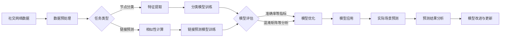

# 准确率在社交网络分析中的应用

## 1. 背景介绍
### 1.1 社交网络分析概述
#### 1.1.1 社交网络的定义与特点
#### 1.1.2 社交网络分析的发展历程
#### 1.1.3 社交网络分析的主要任务与挑战

### 1.2 准确率在数据分析中的重要性
#### 1.2.1 准确率的定义与计算方法  
#### 1.2.2 准确率在数据分析中的应用价值
#### 1.2.3 提高准确率对于数据分析的意义

## 2. 核心概念与联系
### 2.1 社交网络的基本概念
#### 2.1.1 节点与边
#### 2.1.2 度、中心性与聚类系数
#### 2.1.3 社区结构

### 2.2 准确率的核心概念
#### 2.2.1 真阳性、真阴性、假阳性与假阴性
#### 2.2.2 混淆矩阵
#### 2.2.3 准确率、精确率、召回率与F1分数

### 2.3 社交网络分析与准确率的关联
#### 2.3.1 社交网络结构对准确率的影响
#### 2.3.2 准确率在社交网络节点分类中的应用
#### 2.3.3 准确率在社交网络链接预测中的应用

## 3. 核心算法原理具体操作步骤
### 3.1 社交网络节点分类算法
#### 3.1.1 基于节点特征的分类算法
#### 3.1.2 基于网络结构的分类算法
#### 3.1.3 基于随机游走的分类算法

### 3.2 社交网络链接预测算法
#### 3.2.1 基于相似性的链接预测算法
#### 3.2.2 基于概率模型的链接预测算法 
#### 3.2.3 基于矩阵分解的链接预测算法

### 3.3 提高准确率的优化策略
#### 3.3.1 特征工程与特征选择
#### 3.3.2 模型集成与参数调优
#### 3.3.3 数据增强与迁移学习

## 4. 数学模型和公式详细讲解举例说明
### 4.1 准确率的数学定义与计算公式
#### 4.1.1 二分类问题中的准确率计算
#### 4.1.2 多分类问题中的准确率计算
#### 4.1.3 加权准确率与宏平均准确率

### 4.2 混淆矩阵及相关指标的数学表示
#### 4.2.1 混淆矩阵的数学定义
#### 4.2.2 精确率、召回率与F1分数的计算公式
#### 4.2.3 ROC曲线与AUC值的数学原理

### 4.3 社交网络分析中的数学模型 
#### 4.3.1 图论基础及其在社交网络中的应用
#### 4.3.2 随机游走模型在节点分类中的数学推导
#### 4.3.3 矩阵分解模型在链接预测中的数学原理

## 5. 项目实践：代码实例和详细解释说明
### 5.1 数据集准备与预处理
#### 5.1.1 社交网络数据集的获取与格式转换
#### 5.1.2 数据清洗与特征提取
#### 5.1.3 数据集划分与标准化

### 5.2 模型构建与训练
#### 5.2.1 基于sklearn的节点分类模型实现
#### 5.2.2 基于PyTorch的图神经网络链接预测模型实现  
#### 5.2.3 模型训练与超参数调优

### 5.3 模型评估与结果分析
#### 5.3.1 准确率、精确率、召回率等评估指标的计算
#### 5.3.2 混淆矩阵与ROC曲线的绘制与分析
#### 5.3.3 不同模型性能的比较与优劣分析

## 6. 实际应用场景
### 6.1 社交媒体用户属性预测
#### 6.1.1 用户性别、年龄、地域等属性预测
#### 6.1.2 用户兴趣爱好与政治倾向预测
#### 6.1.3 用户购买意向与品牌偏好预测

### 6.2 社交网络异常检测
#### 6.2.1 虚假账号与水军识别
#### 6.2.2 社交网络谣言与虚假信息检测
#### 6.2.3 社交网络欺诈行为检测

### 6.3 社交网络推荐系统
#### 6.3.1 基于用户属性的个性化推荐
#### 6.3.2 基于社交关系的协同过滤推荐
#### 6.3.3 基于知识图谱的混合推荐

## 7. 工具和资源推荐
### 7.1 社交网络分析工具
#### 7.1.1 Gephi：开源的交互式可视化与探索平台
#### 7.1.2 NetworkX：Python社交网络分析包  
#### 7.1.3 Cytoscape：复杂网络数据整合、分析与可视化软件平台

### 7.2 机器学习与数据挖掘工具
#### 7.2.1 scikit-learn：基于Python的机器学习工具包
#### 7.2.2 TensorFlow：端到端开源机器学习平台
#### 7.2.3 PyTorch：基于Python的深度学习框架

### 7.3 数据集与开源资源
#### 7.3.1 Stanford Large Network Dataset Collection
#### 7.3.2 Social Computing Data Repository 
#### 7.3.3 GitHub上的社交网络分析项目资源

## 8. 总结：未来发展趋势与挑战
### 8.1 社交网络分析的研究趋势
#### 8.1.1 动态社交网络分析
#### 8.1.2 异构社交网络分析
#### 8.1.3 社交网络与知识图谱的融合

### 8.2 准确率提升面临的挑战 
#### 8.2.1 数据稀疏性与噪声问题
#### 8.2.2 模型泛化能力与鲁棒性问题
#### 8.2.3 计算复杂度与可扩展性问题

### 8.3 展望与总结
#### 8.3.1 社交网络分析在智慧城市、智慧医疗等领域的应用前景
#### 8.3.2 人工智能技术赋能社交网络分析的无限可能
#### 8.3.3 社交网络分析助力人类社会可持续发展

## 9. 附录：常见问题与解答
### 9.1 如何选择合适的社交网络分析工具和算法？
### 9.2 如何处理社交网络数据中的噪声和缺失值？
### 9.3 如何权衡模型的准确率和计算效率？
### 9.4 如何评估社交网络分析结果的可信度和实用性？
### 9.5 如何将社交网络分析与其他数据分析技术相结合？

准确率作为衡量分类模型性能的重要指标，在社交网络分析的各个环节中扮演着至关重要的角色。从数据预处理到模型训练，再到模型评估与优化，准确率贯穿其中，直接影响着社交网络分析的效果与应用价值。

在数据预处理阶段，我们需要对原始的社交网络数据进行清洗、特征提取等操作，以便为后续的分析任务提供高质量的数据基础。对于节点分类任务，我们需要从社交网络中提取出能够反映节点特征的各种属性，如节点的度、中心性、社区归属等。而对于链接预测任务，我们则需要计算节点之间的相似性，如共同邻居数、Jaccard系数等。数据预处理的质量直接影响着后续模型的准确率。

在模型训练阶段，我们基于提取出的特征，选择合适的机器学习算法进行训练。对于节点分类，常用的算法包括逻辑回归、支持向量机、决策树等。而对于链接预测，则常用基于概率模型的算法，如随机游走、矩阵分解等。模型训练的目标就是学习出一个能够最大化准确率的分类器或预测器。

模型训练完成后，我们需要在测试集上评估其性能，准确率是最直观也是最重要的评估指标。通过分析混淆矩阵，我们可以清晰地看到模型在每一类上的表现，进而分析错误样本，改进特征或模型。同时，我们还可以绘制ROC曲线，计算AUC值，以评价模型的整体性能。

模型评估的结果反过来指导我们对模型进行优化。我们可以通过特征工程、模型集成、参数调优等手段来提高模型的准确率。此外，数据增强、迁移学习等技术也可以在一定程度上缓解数据稀疏性与噪声问题，提升模型性能。

优化后的模型最终应用于实际场景，对新的社交网络数据进行预测。预测结果的准确率决定了社交网络分析的实用价值。我们需要持续地监测模型在实际应用中的表现，收集反馈，并根据新的数据与需求对模型进行更新与改进。

总的来说，准确率作为社交网络分析的核心指标，贯穿于整个分析流程，直接决定着分析的成败。在追求高准确率的同时，我们还需要兼顾模型的泛化能力、鲁棒性、计算效率等因素，以平衡模型的有效性与实用性。未来，随着社交网络数据的爆炸式增长，以及人工智能技术的不断进步，社交网络分析必将迎来更加广阔的应用前景。而准确率作为衡量社交网络分析效果的金标准，也必将受到越来越多的关注与研究。

作者：禅与计算机程序设计艺术 / Zen and the Art of Computer Programming