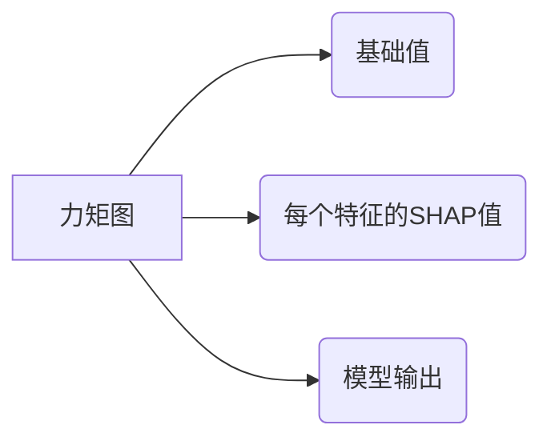

# 可解释性AI原理与代码实战案例讲解

## 1.背景介绍

随着人工智能(AI)系统在各个领域的广泛应用,它们的决策过程变得越来越复杂和不透明。传统的机器学习模型就像一个黑箱,很难解释其内部工作原理和决策依据。这种缺乏透明度和可解释性不仅影响了人们对AI系统的信任和接受度,也可能导致潜在的风险和偏差。

为了解决这一问题,可解释性人工智能(Explainable AI,XAI)应运而生。XAI旨在提供AI系统决策过程的可解释性,使人类能够理解和信任这些系统。通过XAI,我们可以揭示AI模型的内部机理,了解它们是如何得出特定结果的,从而确保AI系统的公平性、安全性和可靠性。

## 2.核心概念与联系

### 2.1 可解释性AI的定义

可解释性AI是一种人工智能范式,旨在创建透明、可解释和可理解的机器学习模型。它涉及开发技术和方法,以解释AI系统的决策过程,使其对人类更加透明和可解释。

### 2.2 可解释性AI的重要性

可解释性AI对于建立人们对AI系统的信任至关重要。通过理解AI系统的决策过程,人们可以更好地评估其公平性、安全性和可靠性。此外,在一些高风险领域,如医疗保健和金融,可解释性AI有助于满足法规要求和道德标准。

### 2.3 可解释性AI与其他AI概念的关系

可解释性AI与其他AI概念有着密切的联系,例如:

- **可信AI(Trustworthy AI)**: 可解释性是建立可信AI的关键因素之一。
- **公平AI(Fair AI)**: 可解释性有助于发现和减少AI系统中的偏差和不公平现象。
- **安全AI(Safe AI)**: 通过理解AI系统的决策过程,我们可以更好地评估其安全性和潜在风险。

## 3.核心算法原理具体操作步骤

### 3.1 模型不可解释性的根源

传统的机器学习模型,如深度神经网络,通常被视为黑箱模型。这种不可解释性主要源于以下几个方面:

1. **模型复杂性**: 深度神经网络等模型通常包含大量参数和隐藏层,使得它们的内部工作机制难以解释。
2. **数据复杂性**: 训练数据的高维度和复杂性也增加了模型的不可解释性。
3. **非线性关系**: 神经网络等模型能够捕捉复杂的非线性关系,但这也使得它们的决策过程变得不透明。

### 3.2 可解释性AI的主要方法

为了提高AI模型的可解释性,研究人员提出了多种方法,包括:

1. **模型本身的可解释性**:
   - 线性模型和决策树等简单模型天生具有较好的可解释性。
   - 通过模型压缩或知识蒸馏等技术,将复杂模型的知识转移到可解释的模型中。

2. **模型解释技术**:
   - **特征重要性**: 通过计算每个特征对模型预测的贡献,了解模型的决策依据。
   - **局部解释**: 使用LIME、SHAP等方法,为单个预测提供局部解释。
   - **全局解释**: 使用层次化聚类等技术,提供模型的全局解释。

3. **模型可视化**:
   - 可视化神经网络的激活图、注意力图等,帮助理解模型的内部工作机制。
   - 使用决策边界图等技术,直观展示模型的决策边界。

### 3.3 可解释性AI的实现步骤

实现可解释性AI通常需要以下步骤:

1. **确定目标**: 明确需要解释的模型、决策和目标受众。
2. **选择合适的方法**: 根据目标和模型类型,选择适当的可解释性技术。
3. **数据预处理**: 对数据进行清理、标准化和特征选择等预处理。
4. **训练模型**: 训练机器学习模型,或者使用现有的预训练模型。
5. **应用可解释性技术**: 使用选定的可解释性技术,生成模型解释。
6. **解释评估**: 评估解释的质量和有效性,必要时进行迭代优化。
7. **结果呈现**: 以适当的形式(文本、可视化等)呈现解释结果。

## 4.数学模型和公式详细讲解举例说明

### 4.1 特征重要性计算

特征重要性是一种常用的模型解释技术,用于量化每个特征对模型预测的贡献。一种常见的计算方法是基于模型的权重系数。

对于线性模型,特征重要性可以直接由模型权重系数 $w_i$ 表示:

$$
\text{Importance}(X_i) = |w_i|
$$

其中 $X_i$ 表示第 $i$ 个特征。

对于树模型(如决策树和随机森林),特征重要性可以通过计算每个特征在树中的使用频率来估计。假设一个特征 $X_i$ 在所有树中被使用的次数为 $N_i$,则其重要性可以定义为:

$$
\text{Importance}(X_i) = \frac{N_i}{\sum_j N_j}
$$

其中 $\sum_j N_j$ 表示所有特征被使用的总次数。

### 4.2 LIME算法

LIME(Local Interpretable Model-Agnostic Explanations)是一种常用的局部解释技术,它通过训练一个可解释的代理模型来近似复杂模型在局部区域的行为。

对于一个给定的实例 $x$,LIME算法的主要步骤如下:

1. 在 $x$ 的邻域内采样一组新的实例 $\{x'\}$。
2. 获取复杂模型对这些实例的预测值 $\{f(x')\}$。
3. 通过加权最小二乘法训练一个简单的代理模型 $g$,使其在邻域内近似复杂模型的行为:

$$
\xi(x) = \arg\min_g \sum_{x'} \pi(x')(g(x') - f(x'))^2
$$

其中 $\pi(x')$ 是一个距离相关的权重函数,用于给予更接近 $x$ 的实例更高的权重。

4. 解释 $g$ 模型的预测,从而近似解释复杂模型在 $x$ 处的预测。

LIME算法的优点是模型无关性,可以应用于任何类型的机器学习模型。但它也有一些局限性,如只能提供局部解释,并且解释的质量依赖于代理模型的选择。

## 5.项目实践:代码实例和详细解释说明

在本节中,我们将使用Python中的SHAP(SHapley Additive exPlanations)库来演示如何对一个简单的机器学习模型进行解释。SHAP是一种基于游戏理论的解释技术,它可以为任何机器学习模型提供一致和准确的解释。

### 5.1 导入所需库

```python
import numpy as np
import pandas as pd
from sklearn.ensemble import RandomForestRegressor
import shap
```

### 5.2 准备数据

我们将使用著名的波士顿房价数据集作为示例。

```python
# 加载数据
boston = pd.read_csv('boston.csv')
X = boston.drop('MEDV', axis=1)
y = boston['MEDV']
```

### 5.3 训练模型

我们将使用随机森林回归模型作为示例。

```python
# 训练随机森林模型
model = RandomForestRegressor()
model.fit(X, y)
```

### 5.4 使用SHAP计算特征重要性

```python
# 计算SHAP值
explainer = shap.TreeExplainer(model)
shap_values = explainer.shap_values(X)
```

`shap_values`是一个与`X`形状相同的矩阵,每一行对应一个实例,每一列对应一个特征。每个元素的值表示该特征对模型预测的贡献。

我们可以使用`shap.summary_plot`函数来可视化特征的重要性:

```python
# 可视化特征重要性
shap.summary_plot(shap_values, X)
```

这将生成一个类似于下图的特征重要性图:


### 5.5 解释单个实例

除了全局解释,SHAP还可以为单个实例提供局部解释。我们可以使用`shap.force_plot`函数来可视化单个实例的解释:

```python
# 选择一个实例
instance = X.iloc[0]

# 计算SHAP值
shap_values = explainer.shap_values(instance)

# 可视化解释
shap.force_plot(explainer.expected_value, shap_values, instance)
```

这将生成一个类似于下图的力矩图:



力矩图直观地展示了每个特征对模型预测的贡献。正值表示该特征推动预测值增加,负值则表示推动预测值减小。

通过这个示例,我们可以看到SHAP库提供了一种直观和有效的方式来解释机器学习模型,从而提高模型的透明度和可解释性。

## 6.实际应用场景

可解释性AI在许多领域都有广泛的应用前景,包括但不限于:

1. **医疗保健**: 解释AI辅助诊断系统的决策过程,确保其公平性和安全性,从而获得医生和患者的信任。

2. **金融服务**: 解释AI模型在贷款审批、投资决策等场景中的决策依据,满足监管要求和提高透明度。

3. **人力资源管理**: 解释AI在招聘、绩效评估等过程中的决策,避免潜在的偏见和歧视。

4. **司法系统**: 解释AI在量刑、风险评估等场景中的决策,确保公平和透明。

5. **自动驾驶**: 解释自动驾驶系统的决策过程,提高安全性和可信度。

6. **推荐系统**: 解释推荐算法的工作原理,提高用户对推荐结果的信任度。

7. **自然语言处理**: 解释语言模型的决策过程,帮助理解模型的偏差和局限性。

总的来说,可解释性AI有助于提高人工智能系统的透明度、公平性和可靠性,从而促进人工智能在各个领域的负责任应用。

## 7.工具和资源推荐

在实现可解释性AI时,有许多优秀的工具和资源可以使用:

1. **Python库**:
   - SHAP: 一个提供统一的模型解释框架的库,支持多种解释技术。
   - LIME: 用于生成局部可解释模型的库。
   - Captum: Facebook开源的模型解释库,支持多种解释技术。
   - Alibi: 由 Seldon 开发的可解释性AI库,专注于安全和可信AI。
   - Skope-rules: 一个用于生成可解释规则集的库。

2. **可视化工具**:
   - Tensorboard: TensorFlow 自带的可视化工具,可用于可视化神经网络的激活图和注意力图。
   - Netron: 一个开源的神经网络可视化工具,支持多种深度学习框架。

3. **在线资源**:
   - 可解释性AI课程和教程,如 Coursera 和 edX 上的相关课程。
   - 可解释性AI相关的研究论文和会议,如 ICML、NeurIPS 等。
   - 可解释性AI社区和论坛,如 Reddit 上的 r/ExplainableAI 等。

4. **书籍**:
   - "Interpretable Machine Learning" by Christoph Molnar
   - "Explanation in Artificial Intelligence" by Alejandro Barredo Arrieta et al.

利用这些工具和资源,我们可以更好地理解和实现可解释性AI,推动人工智能系统的透明度和可信度。

## 8.总结:未来发展趋势与挑战

可解释性AI是一个蓬勃发展的领域,它将对人工智能系统的设计、开发和应用产生深远影响。未来,可解释性AI可能会呈现以下发展趋势:

1. **更强大的解释技术**: 随着研究的深入,我们