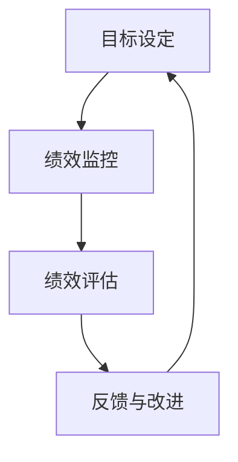

# 员工绩效管理系统详细设计与具体代码实现

## 1.背景介绍

在现代企业管理中，员工绩效管理系统（Employee Performance Management System, EPMS）是一个至关重要的工具。它不仅帮助企业评估员工的工作表现，还能为员工提供反馈，促进其职业发展。随着信息技术的进步，传统的绩效管理方法逐渐被信息化系统所取代。本文将详细介绍一个员工绩效管理系统的设计与实现，旨在为企业提供一个高效、透明、公正的绩效管理工具。

## 2.核心概念与联系

### 2.1 绩效管理的定义

绩效管理是指通过设定目标、监控进展、评估结果和提供反馈等一系列活动，来提升员工和组织整体绩效的过程。

### 2.2 绩效管理系统的组成

一个完整的绩效管理系统通常包括以下几个模块：
- **目标设定**：定义员工的工作目标和关键绩效指标（KPI）。
- **绩效监控**：实时跟踪员工的工作进展。
- **绩效评估**：定期评估员工的工作表现。
- **反馈与改进**：提供反馈并制定改进计划。

### 2.3 各模块之间的联系

各模块之间相互关联，共同构成一个闭环系统。目标设定为绩效监控提供了基准，绩效监控的数据为绩效评估提供了依据，绩效评估的结果则为反馈与改进提供了方向。



## 3.核心算法原理具体操作步骤

### 3.1 目标设定算法

目标设定是绩效管理的起点。常用的方法包括SMART原则（Specific, Measurable, Achievable, Relevant, Time-bound）和OKR（Objectives and Key Results）。

### 3.2 绩效监控算法

绩效监控需要实时收集和分析数据。可以使用时间序列分析、异常检测等算法来监控员工的工作进展。

### 3.3 绩效评估算法

绩效评估通常采用评分模型，如360度评估法、BARS（Behaviorally Anchored Rating Scales）等。可以使用机器学习算法来自动化评估过程。

### 3.4 反馈与改进算法

反馈与改进需要根据评估结果生成个性化的改进建议。可以使用推荐系统算法来实现这一功能。

## 4.数学模型和公式详细讲解举例说明

### 4.1 目标设定模型

假设一个员工的目标是提高销售额，可以设定如下KPI：
$$
KPI = \frac{\text{当前销售额}}{\text{目标销售额}} \times 100\%
$$

### 4.2 绩效监控模型

使用时间序列分析来监控销售额的变化：
$$
y_t = \alpha + \beta t + \epsilon_t
$$
其中，$y_t$ 是时间 $t$ 的销售额，$\alpha$ 和 $\beta$ 是模型参数，$\epsilon_t$ 是误差项。

### 4.3 绩效评估模型

使用360度评估法，假设有 $n$ 个评估者，每个评估者的评分为 $s_i$，则员工的最终评分为：
$$
S = \frac{1}{n} \sum_{i=1}^{n} s_i
$$

### 4.4 反馈与改进模型

使用推荐系统算法生成改进建议，假设有 $m$ 个改进项，每个改进项的评分为 $r_j$，则推荐的改进项为：
$$
R = \text{argmax}_{j} \, r_j
$$

## 5.项目实践：代码实例和详细解释说明

### 5.1 目标设定代码实例

```python
class GoalSetting:
    def __init__(self, current_sales, target_sales):
        self.current_sales = current_sales
        self.target_sales = target_sales

    def calculate_kpi(self):
        return (self.current_sales / self.target_sales) * 100

# 示例
goal = GoalSetting(50000, 100000)
print(f"KPI: {goal.calculate_kpi()}%")
```

### 5.2 绩效监控代码实例

```python
import pandas as pd
import numpy as np
from statsmodels.tsa.arima_model import ARIMA

class PerformanceMonitoring:
    def __init__(self, sales_data):
        self.sales_data = sales_data

    def time_series_analysis(self):
        model = ARIMA(self.sales_data, order=(1, 1, 1))
        model_fit = model.fit(disp=0)
        return model_fit.forecast()[0]

# 示例
sales_data = pd.Series([100, 150, 200, 250, 300])
monitoring = PerformanceMonitoring(sales_data)
print(f"预测销售额: {monitoring.time_series_analysis()}")
```

### 5.3 绩效评估代码实例

```python
class PerformanceEvaluation:
    def __init__(self, scores):
        self.scores = scores

    def calculate_final_score(self):
        return np.mean(self.scores)

# 示例
evaluation = PerformanceEvaluation([4.5, 4.0, 4.8, 4.2])
print(f"最终评分: {evaluation.calculate_final_score()}")
```

### 5.4 反馈与改进代码实例

```python
class FeedbackImprovement:
    def __init__(self, improvement_scores):
        self.improvement_scores = improvement_scores

    def recommend_improvement(self):
        return np.argmax(self.improvement_scores)

# 示例
feedback = FeedbackImprovement([3.5, 4.0, 4.8, 4.2])
print(f"推荐的改进项: {feedback.recommend_improvement()}")
```

## 6.实际应用场景

### 6.1 企业内部绩效管理

企业可以使用绩效管理系统来评估员工的工作表现，制定个性化的职业发展计划，提高员工的工作积极性和满意度。

### 6.2 教育机构的教师评估

教育机构可以使用绩效管理系统来评估教师的教学效果，提供反馈和改进建议，提升教学质量。

### 6.3 公共部门的绩效考核

公共部门可以使用绩效管理系统来评估公务员的工作表现，确保公共服务的质量和效率。

## 7.工具和资源推荐

### 7.1 开源工具

- **JIRA**：一个流行的项目管理和绩效管理工具。
- **Trello**：一个简单易用的任务管理工具，适合小型团队。

### 7.2 资源推荐

- **《绩效管理：从理论到实践》**：一本详细介绍绩效管理理论和实践的书籍。
- **Coursera上的绩效管理课程**：提供系统的绩效管理培训。

## 8.总结：未来发展趋势与挑战

### 8.1 未来发展趋势

随着人工智能和大数据技术的发展，绩效管理系统将变得更加智能化和自动化。未来的绩效管理系统将能够实时分析员工的工作表现，提供个性化的反馈和改进建议。

### 8.2 挑战

尽管绩效管理系统有很多优点，但在实际应用中也面临一些挑战。例如，如何确保评估的公正性和透明性，如何保护员工的隐私等。

## 9.附录：常见问题与解答

### 9.1 如何确保绩效评估的公正性？

可以采用多维度的评估方法，如360度评估法，结合多种数据来源，确保评估的全面性和公正性。

### 9.2 如何保护员工的隐私？

在设计绩效管理系统时，应严格遵守数据隐私保护法规，确保员工数据的安全性和保密性。

### 9.3 如何处理绩效评估中的主观因素？

可以结合定量和定性评估方法，使用数据分析和机器学习算法，减少主