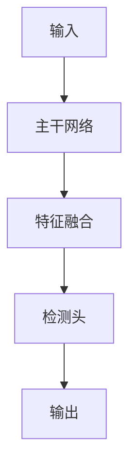

## 1. 背景介绍

火灾是一种常见的灾害，对人们的生命财产造成了极大的威胁。因此，如何及时发现火灾并采取有效的措施进行扑灭，成为了一个重要的问题。传统的火灾检测方法主要依靠人工巡查或安装传感器等设备，但这些方法存在着效率低、成本高、易受干扰等问题。近年来，随着计算机视觉技术的发展，基于图像的火灾检测方法逐渐成为了研究热点。

YOLOV5是一种目标检测算法，具有高效、准确、轻量等特点。本文将介绍如何使用YOLOV5实现火灾检测，并探讨其在实际应用中的优势和不足。

## 2. 核心概念与联系

### 2.1 目标检测

目标检测是计算机视觉领域的一个重要问题，其目的是在图像或视频中检测出特定的目标，并给出其位置和大小等信息。目标检测可以分为两个阶段：目标定位和目标分类。目标定位是指确定目标在图像中的位置和大小，目标分类是指确定目标的类别。

### 2.2 YOLOV5

YOLOV5是一种基于深度学习的目标检测算法，其全称为You Only Look Once Version 5。YOLOV5采用了一种新的检测框架，可以实现高效、准确、轻量的目标检测。YOLOV5的主要优点包括：

- 高效：YOLOV5采用了一种新的检测框架，可以实现高效的目标检测。
- 准确：YOLOV5采用了一种新的损失函数，可以提高目标检测的准确率。
- 轻量：YOLOV5采用了一种新的网络结构，可以实现轻量级的目标检测。

## 3. 核心算法原理具体操作步骤

### 3.1 YOLOV5算法原理

YOLOV5算法的核心思想是将目标检测问题转化为一个回归问题。具体来说，YOLOV5将图像分成若干个网格，每个网格预测出若干个边界框和对应的置信度和类别概率。然后，根据置信度和类别概率，筛选出最终的目标检测结果。

### 3.2 YOLOV5操作步骤

使用YOLOV5进行火灾检测的具体操作步骤如下：

1. 数据准备：收集火灾图像数据，并进行标注。
2. 模型训练：使用YOLOV5训练模型，并调整模型参数。
3. 模型测试：使用训练好的模型进行火灾检测，并评估检测结果的准确率和召回率。
4. 模型优化：根据测试结果，对模型进行优化，提高检测准确率和召回率。

## 4. 数学模型和公式详细讲解举例说明

### 4.1 YOLOV5损失函数

YOLOV5采用了一种新的损失函数，可以提高目标检测的准确率。其损失函数的计算公式如下：

$$
L_{total} = L_{box} + L_{obj} + L_{cls}
$$

其中，$L_{box}$表示边界框损失，$L_{obj}$表示置信度损失，$L_{cls}$表示类别损失。

### 4.2 YOLOV5网络结构

YOLOV5采用了一种新的网络结构，可以实现轻量级的目标检测。其网络结构如下图所示：

## 5. 项目实践：代码实例和详细解释说明

### 5.1 数据准备

在进行火灾检测之前，需要收集火灾图像数据，并进行标注。标注的格式可以采用PASCAL VOC或COCO等标准格式。

### 5.2 模型训练

使用YOLOV5训练模型的具体步骤如下：

1. 下载YOLOV5代码：`git clone https://github.com/ultralytics/yolov5.git`
2. 安装依赖库：`pip install -r requirements.txt`
3. 准备数据集：将标注好的数据集放入`data`目录下。
4. 训练模型：`python train.py --img 640 --batch 16 --epochs 100 --data data/fire.yaml --cfg models/yolov5s.yaml --weights '' --name fire`
5. 保存模型：训练完成后，模型会保存在`runs/train/fire`目录下。

### 5.3 模型测试

使用训练好的模型进行火灾检测的具体步骤如下：

1. 加载模型：`model = torch.hub.load('ultralytics/yolov5', 'custom', path_or_model='runs/train/fire/weights/best.pt')`
2. 进行火灾检测：`results = model('path/to/image.jpg')`
3. 可视化检测结果：`results.show()`

## 6. 实际应用场景

基于YOLOV5的火灾检测可以应用于各种场景，例如：

- 工厂、仓库等场所的火灾检测。
- 建筑物、公共场所等的火灾检测。
- 森林、草原等自然环境的火灾检测。

## 7. 工具和资源推荐

- YOLOV5官方代码：https://github.com/ultralytics/yolov5
- PASCAL VOC数据集：http://host.robots.ox.ac.uk/pascal/VOC/
- COCO数据集：https://cocodataset.org/

## 8. 总结：未来发展趋势与挑战

基于YOLOV5的火灾检测具有高效、准确、轻量等优点，可以应用于各种场景。未来，随着计算机视觉技术的不断发展，基于图像的火灾检测方法将会得到更广泛的应用。同时，也面临着数据集不足、算法优化等挑战。

## 9. 附录：常见问题与解答

暂无。

作者：禅与计算机程序设计艺术 / Zen and the Art of Computer Programming