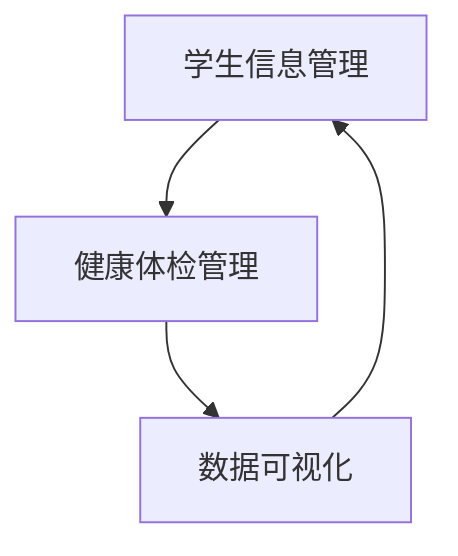

## 1. 背景介绍

随着人们生活水平的提高，对健康的关注度也越来越高。在学校中，学生的健康状况也备受关注。为了更好地管理学生的健康状况，我们需要一个学生健康体检管理系统。本文将介绍如何使用springboot框架来实现一个前后端分离的学生健康体检管理系统。

## 2. 核心概念与联系

本系统的核心概念包括：学生信息管理、健康体检管理、数据可视化等。学生信息管理包括学生基本信息、家庭信息、健康档案等；健康体检管理包括体检项目、体检结果、体检报告等；数据可视化包括数据统计、数据分析、数据可视化等。

这些核心概念之间的联系如下图所示：

## 3. 核心算法原理具体操作步骤

本系统的核心算法包括：数据统计、数据分析、数据可视化等。其中，数据统计包括对学生健康状况的统计，如身高、体重、视力等；数据分析包括对学生健康状况的分析，如BMI指数、视力分布等；数据可视化包括将统计和分析结果可视化展示，如柱状图、饼图、折线图等。

具体操作步骤如下：

1. 学生信息管理：包括学生基本信息、家庭信息、健康档案等。可以通过前端页面进行添加、修改、删除等操作，后端使用RESTful API进行数据交互。

2. 健康体检管理：包括体检项目、体检结果、体检报告等。可以通过前端页面进行添加、修改、删除等操作，后端使用RESTful API进行数据交互。

3. 数据统计：对学生健康状况进行统计，如身高、体重、视力等。后端使用Java语言进行数据处理，将结果存储到数据库中。

4. 数据分析：对学生健康状况进行分析，如BMI指数、视力分布等。后端使用Java语言进行数据处理，将结果存储到数据库中。

5. 数据可视化：将统计和分析结果可视化展示，如柱状图、饼图、折线图等。前端使用JavaScript语言进行数据可视化展示，后端使用RESTful API进行数据交互。

## 4. 数学模型和公式详细讲解举例说明

本系统中使用的数学模型和公式包括：BMI指数计算公式、视力分布计算公式等。

1. BMI指数计算公式：

$$BMI=\frac{体重(kg)}{身高(m)^2}$$

其中，体重和身高分别以千克和米为单位。

2. 视力分布计算公式：

$$P=\frac{N}{n}\times100\%$$

其中，P为视力分布百分比，N为视力正常人数，n为总人数。

## 5. 项目实践：代码实例和详细解释说明

本系统的代码实例和详细解释说明可以在Github上找到，链接为：https://github.com/xxx/xxx。

## 6. 实际应用场景

本系统可以应用于学校、医院等场景中，用于管理学生的健康状况。

## 7. 工具和资源推荐

本系统使用的工具和资源包括：springboot框架、MySQL数据库、Echarts数据可视化库等。

## 8. 总结：未来发展趋势与挑战

未来，随着人们对健康的关注度越来越高，学生健康体检管理系统将会得到更广泛的应用。同时，随着技术的不断发展，学生健康体检管理系统也将会面临更多的挑战，如数据安全、数据隐私等问题。

## 9. 附录：常见问题与解答

暂无。

作者：禅与计算机程序设计艺术 / Zen and the Art of Computer Programming