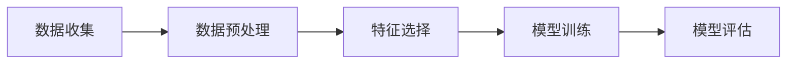

# 基于“京东”用户画像分析和研究

## 1. 背景介绍
随着电子商务的蓬勃发展，个性化推荐系统成为提升用户体验和增加销售额的关键技术。京东作为中国领先的电商平台，拥有庞大的用户基础和丰富的用户行为数据。通过对这些数据的深入分析，构建用户画像，可以更精准地满足用户需求，提高转化率。

## 2. 核心概念与联系
用户画像是指根据用户的基本属性、行为习惯、消费模式等多维度信息，构建的用户模型。它涉及数据挖掘、机器学习、心理学等多个领域的知识。用户画像与推荐系统、广告定向、产品设计等业务紧密相关。

## 3. 核心算法原理具体操作步骤
用户画像构建的核心算法包括聚类分析、分类算法、关联规则等。操作步骤通常包括数据收集、数据预处理、特征选择、模型训练和评估。



## 4. 数学模型和公式详细讲解举例说明
以聚类分析为例，K-means算法是一种常用的聚类方法。其数学模型可以表示为：

$$
\min_{\mathbf{S}} \sum_{i=1}^{k} \sum_{\mathbf{x} \in S_i} \|\mathbf{x} - \mathbf{\mu}_i\|^2
$$

其中，$ \mathbf{S} = \{S_1, S_2, \ldots, S_k\} $ 是划分的簇集合，$ \mathbf{\mu}_i $ 是簇 $ S_i $ 的中心。

## 5. 项目实践：代码实例和详细解释说明
以Python语言为例，使用scikit-learn库进行K-means聚类的代码如下：

```python
from sklearn.cluster import KMeans
import numpy as np

# 假设X为用户特征数据集
X = np.array([[1, 2], [1, 4], [1, 0],
              [10, 2], [10, 4], [10, 0]])

kmeans = KMeans(n_clusters=2, random_state=0).fit(X)
print(kmeans.labels_)
```

## 6. 实际应用场景
用户画像在京东的实际应用场景包括个性化推荐、精准营销、库存管理等。

## 7. 工具和资源推荐
推荐使用Python语言，以及scikit-learn、TensorFlow、PyTorch等机器学习框架。数据可视化工具如Tableau、PowerBI也非常有用。

## 8. 总结：未来发展趋势与挑战
用户画像分析的未来发展趋势将更加注重隐私保护和算法的可解释性。挑战包括如何处理海量数据、提高算法准确性和实时性。

## 9. 附录：常见问题与解答
Q1: 用户画像的更新频率应该是多少？
A1: 根据业务需求和数据变化情况，通常是实时更新或定期更新。

作者：禅与计算机程序设计艺术 / Zen and the Art of Computer Programming