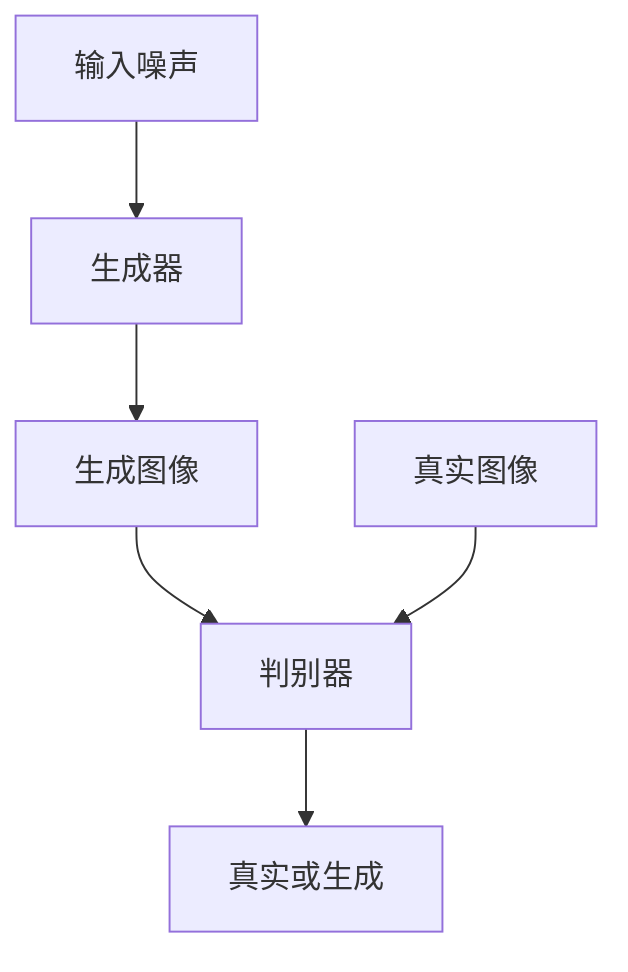

# 基于生成对抗网络的图像风格迁移与超分辨率结合技术

## 1.背景介绍

在计算机视觉领域，图像风格迁移和超分辨率技术是两个重要的研究方向。图像风格迁移旨在将一种图像的风格应用到另一种图像上，而超分辨率技术则致力于提高图像的分辨率，使其更加清晰。生成对抗网络（GAN）作为一种强大的深度学习模型，已经在这两个领域取得了显著的成果。本文将探讨如何将图像风格迁移与超分辨率技术结合起来，利用GAN实现更高质量的图像处理。

## 2.核心概念与联系

### 2.1 生成对抗网络（GAN）

生成对抗网络由两个神经网络组成：生成器（Generator）和判别器（Discriminator）。生成器的目标是生成逼真的图像，而判别器的目标是区分真实图像和生成图像。两者通过对抗训练不断提升各自的能力。

### 2.2 图像风格迁移

图像风格迁移是将一种图像的风格（如绘画风格）应用到另一种图像上。常见的方法是使用卷积神经网络（CNN）提取图像的内容特征和风格特征，然后通过优化过程将风格特征应用到内容图像上。

### 2.3 超分辨率技术

超分辨率技术旨在将低分辨率图像转换为高分辨率图像。常见的方法包括基于插值的方法和基于深度学习的方法。深度学习方法通常使用卷积神经网络（CNN）来学习从低分辨率到高分辨率的映射关系。

### 2.4 图像风格迁移与超分辨率的结合

将图像风格迁移与超分辨率技术结合，可以在提高图像分辨率的同时，保留或增强图像的风格特征。这种结合可以应用于艺术创作、图像修复等多个领域。

## 3.核心算法原理具体操作步骤

### 3.1 GAN的基本结构

GAN的基本结构如下图所示：



### 3.2 图像风格迁移的基本步骤

1. **内容图像和风格图像的选择**：选择一张内容图像和一张风格图像。
2. **特征提取**：使用预训练的卷积神经网络（如VGG19）提取内容图像和风格图像的特征。
3. **损失函数定义**：定义内容损失和风格损失。
4. **优化过程**：通过优化过程，调整生成图像，使其内容特征接近内容图像，风格特征接近风格图像。

### 3.3 超分辨率技术的基本步骤

1. **低分辨率图像输入**：输入一张低分辨率图像。
2. **特征提取**：使用卷积神经网络提取低分辨率图像的特征。
3. **特征映射**：通过多个卷积层将低分辨率特征映射到高分辨率特征。
4. **重建高分辨率图像**：通过反卷积层或上采样层重建高分辨率图像。

### 3.4 结合技术的具体操作步骤

1. **输入图像预处理**：对输入图像进行预处理，包括归一化和尺寸调整。
2. **风格迁移**：使用图像风格迁移技术，将输入图像转换为具有目标风格的图像。
3. **超分辨率处理**：使用超分辨率技术，将风格迁移后的图像转换为高分辨率图像。
4. **后处理**：对生成的高分辨率图像进行后处理，如去噪和锐化。

## 4.数学模型和公式详细讲解举例说明

### 4.1 GAN的数学模型

GAN的目标是通过生成器 $G$ 和判别器 $D$ 的对抗训练，使生成图像尽可能逼真。其损失函数定义如下：

$$
\min_G \max_D V(D, G) = \mathbb{E}_{x \sim p_{data}(x)}[\log D(x)] + \mathbb{E}_{z \sim p_z(z)}[\log(1 - D(G(z)))]
$$

其中，$p_{data}(x)$ 是真实数据的分布，$p_z(z)$ 是噪声的分布。

### 4.2 图像风格迁移的数学模型

图像风格迁移的损失函数包括内容损失和风格损失。内容损失定义为生成图像和内容图像在特定层的特征差异：

$$
L_{content} = \frac{1}{2} \sum_{i,j} (F_{ij}^G - F_{ij}^C)^2
$$

其中，$F_{ij}^G$ 和 $F_{ij}^C$ 分别是生成图像和内容图像在第 $i$ 层第 $j$ 个特征图的特征值。

风格损失定义为生成图像和风格图像的Gram矩阵差异：

$$
L_{style} = \sum_{l} w_l \frac{1}{4N_l^2M_l^2} \sum_{i,j} (G_{ij}^G - G_{ij}^S)^2
$$

其中，$G_{ij}^G$ 和 $G_{ij}^S$ 分别是生成图像和风格图像在第 $l$ 层的Gram矩阵，$N_l$ 和 $M_l$ 分别是第 $l$ 层的特征图数量和特征图大小，$w_l$ 是第 $l$ 层的权重。

### 4.3 超分辨率技术的数学模型

超分辨率技术的目标是通过神经网络将低分辨率图像映射到高分辨率图像。其损失函数通常定义为生成图像和高分辨率图像的像素差异：

$$
L_{SR} = \frac{1}{N} \sum_{i=1}^N (I_{HR}^i - I_{SR}^i)^2
$$

其中，$I_{HR}^i$ 和 $I_{SR}^i$ 分别是第 $i$ 个高分辨率图像和生成图像的像素值，$N$ 是像素数量。

## 5.项目实践：代码实例和详细解释说明

### 5.1 环境准备

首先，确保安装了必要的库：

```bash
pip install tensorflow keras numpy matplotlib
```

### 5.2 数据集准备

使用COCO数据集作为训练数据：

```python
import tensorflow as tf
from tensorflow.keras.preprocessing.image import ImageDataGenerator

datagen = ImageDataGenerator(rescale=1./255)
train_data = datagen.flow_from_directory('path_to_coco_dataset', target_size=(256, 256), batch_size=32, class_mode=None)
```

### 5.3 生成器和判别器的定义

```python
from tensorflow.keras.layers import Input, Conv2D, UpSampling2D, LeakyReLU, BatchNormalization
from tensorflow.keras.models import Model

def build_generator():
    input = Input(shape=(256, 256, 3))
    x = Conv2D(64, (3, 3), padding='same')(input)
    x = LeakyReLU(alpha=0.2)(x)
    x = UpSampling2D(size=(2, 2))(x)
    x = Conv2D(128, (3, 3), padding='same')(x)
    x = LeakyReLU(alpha=0.2)(x)
    x = UpSampling2D(size=(2, 2))(x)
    x = Conv2D(256, (3, 3), padding='same')(x)
    x = LeakyReLU(alpha=0.2)(x)
    x = Conv2D(3, (3, 3), padding='same', activation='tanh')(x)
    return Model(input, x)

def build_discriminator():
    input = Input(shape=(512, 512, 3))
    x = Conv2D(64, (3, 3), padding='same')(input)
    x = LeakyReLU(alpha=0.2)(x)
    x = Conv2D(128, (3, 3), padding='same')(x)
    x = LeakyReLU(alpha=0.2)(x)
    x = Conv2D(256, (3, 3), padding='same')(x)
    x = LeakyReLU(alpha=0.2)(x)
    x = Conv2D(1, (3, 3), padding='same', activation='sigmoid')(x)
    return Model(input, x)
```

### 5.4 损失函数和优化器

```python
from tensorflow.keras.optimizers import Adam

def gan_loss(y_true, y_pred):
    return tf.keras.losses.binary_crossentropy(y_true, y_pred)

generator = build_generator()
discriminator = build_discriminator()

discriminator.compile(optimizer=Adam(0.0002, 0.5), loss=gan_loss, metrics=['accuracy'])
discriminator.trainable = False

gan_input = Input(shape=(256, 256, 3))
generated_image = generator(gan_input)
gan_output = discriminator(generated_image)

gan = Model(gan_input, gan_output)
gan.compile(optimizer=Adam(0.0002, 0.5), loss=gan_loss)
```

### 5.5 训练过程

```python
import numpy as np

epochs = 10000
batch_size = 32

for epoch in range(epochs):
    for _ in range(batch_size):
        real_images = next(train_data)
        noise = np.random.normal(0, 1, (batch_size, 256, 256, 3))
        generated_images = generator.predict(noise)
        
        real_labels = np.ones((batch_size, 16, 16, 1))
        fake_labels = np.zeros((batch_size, 16, 16, 1))
        
        d_loss_real = discriminator.train_on_batch(real_images, real_labels)
        d_loss_fake = discriminator.train_on_batch(generated_images, fake_labels)
        d_loss = 0.5 * np.add(d_loss_real, d_loss_fake)
        
        noise = np.random.normal(0, 1, (batch_size, 256, 256, 3))
        valid_labels = np.ones((batch_size, 16, 16, 1))
        g_loss = gan.train_on_batch(noise, valid_labels)
        
    print(f"{epoch} [D loss: {d_loss[0]}] [G loss: {g_loss}]")
```

## 6.实际应用场景

### 6.1 艺术创作

通过图像风格迁移和超分辨率技术，艺术家可以将低分辨率的草图转换为高分辨率的艺术作品，并应用不同的艺术风格。

### 6.2 图像修复

在图像修复领域，可以使用这些技术将受损的低分辨率图像恢复为高分辨率的清晰图像，同时保留或增强其原有风格。

### 6.3 医学影像

在医学影像处理中，超分辨率技术可以提高影像的清晰度，帮助医生更准确地诊断疾病。

### 6.4 视频处理

在视频处理领域，可以将低分辨率的视频帧转换为高分辨率帧，并应用不同的风格，使视频更加生动和有趣。

## 7.工具和资源推荐

### 7.1 开源框架

- TensorFlow：一个开源的深度学习框架，支持多种神经网络模型