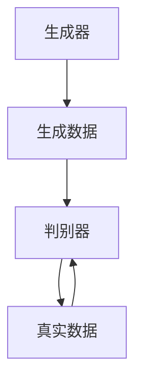

# 基于生成对抗网络的实时视频风格迁移系统设计

## 1.背景介绍

### 1.1 生成对抗网络简介

生成对抗网络（Generative Adversarial Networks，GANs）由Ian Goodfellow等人在2014年提出，是一种通过两个神经网络相互竞争来生成数据的深度学习模型。GANs由生成器（Generator）和判别器（Discriminator）组成，生成器负责生成数据，判别器则负责区分生成数据和真实数据。通过这种对抗训练，生成器能够生成越来越逼真的数据。

### 1.2 风格迁移的概念

风格迁移（Style Transfer）是一种将一种图像的风格应用到另一种图像上的技术。最早的风格迁移方法基于卷积神经网络（CNN），通过优化目标函数来实现风格迁移。近年来，GANs在风格迁移领域取得了显著进展，能够实现更高质量和更高效率的风格迁移。

### 1.3 实时视频风格迁移的需求

随着视频内容的爆炸性增长，实时视频风格迁移的需求也越来越大。无论是在电影制作、游戏开发还是社交媒体应用中，实时视频风格迁移都能带来丰富的视觉效果和用户体验。然而，实现实时视频风格迁移面临着计算复杂度高、延迟要求严格等挑战。

## 2.核心概念与联系

### 2.1 生成对抗网络的基本结构

生成对抗网络由生成器和判别器组成。生成器的目标是生成逼真的数据，使得判别器无法区分生成数据和真实数据。判别器的目标是尽可能准确地区分生成数据和真实数据。通过这种对抗训练，生成器和判别器相互提升，最终生成器能够生成高质量的数据。



### 2.2 风格迁移的基本原理

风格迁移的基本原理是通过神经网络提取图像的内容特征和风格特征，然后将风格特征应用到内容特征上。具体来说，风格迁移通常使用预训练的卷积神经网络（如VGG网络）来提取图像的特征，然后通过优化目标函数来实现风格迁移。

### 2.3 实时视频风格迁移的挑战

实时视频风格迁移面临的主要挑战包括：
- **计算复杂度高**：视频风格迁移需要对每一帧进行风格迁移，计算量巨大。
- **延迟要求严格**：实时视频风格迁移需要在极短的时间内完成风格迁移，以保证视频的流畅性。
- **一致性问题**：视频风格迁移需要保证相邻帧之间的风格一致性，以避免视觉上的不连续。

## 3.核心算法原理具体操作步骤

### 3.1 生成对抗网络的训练过程

生成对抗网络的训练过程包括以下步骤：
1. **初始化生成器和判别器**：随机初始化生成器和判别器的参数。
2. **生成假数据**：生成器根据随机噪声生成假数据。
3. **判别器训练**：使用真实数据和生成的假数据训练判别器，使其能够区分真实数据和假数据。
4. **生成器训练**：使用判别器的反馈训练生成器，使其生成的数据能够欺骗判别器。
5. **重复步骤2-4**：不断重复上述步骤，直到生成器生成的数据足够逼真。

### 3.2 风格迁移的实现步骤

风格迁移的实现步骤包括：
1. **特征提取**：使用预训练的卷积神经网络提取内容图像和风格图像的特征。
2. **定义损失函数**：定义内容损失和风格损失，内容损失用于保持内容图像的结构，风格损失用于应用风格图像的风格。
3. **优化目标函数**：通过优化目标函数，使得生成图像的内容特征接近内容图像的特征，风格特征接近风格图像的特征。

### 3.3 实时视频风格迁移的优化策略

为了实现实时视频风格迁移，可以采用以下优化策略：
1. **模型压缩**：通过模型剪枝、量化等技术减少模型的计算量。
2. **并行计算**：利用GPU等硬件加速进行并行计算，提高计算效率。
3. **帧间一致性**：通过引入时间一致性损失，保证相邻帧之间的风格一致性。

## 4.数学模型和公式详细讲解举例说明

### 4.1 生成对抗网络的数学模型

生成对抗网络的目标是通过对抗训练，使生成器生成的数据分布接近真实数据分布。其数学模型可以表示为：

$$
\min_G \max_D V(D, G) = \mathbb{E}_{x \sim p_{data}(x)}[\log D(x)] + \mathbb{E}_{z \sim p_z(z)}[\log(1 - D(G(z)))]
$$

其中，$G$ 是生成器，$D$ 是判别器，$p_{data}(x)$ 是真实数据分布，$p_z(z)$ 是噪声分布。

### 4.2 风格迁移的数学模型

风格迁移的目标是通过优化目标函数，使生成图像的内容特征接近内容图像的特征，风格特征接近风格图像的特征。其数学模型可以表示为：

$$
L_{total} = \alpha L_{content} + \beta L_{style}
$$

其中，$L_{content}$ 是内容损失，$L_{style}$ 是风格损失，$\alpha$ 和 $\beta$ 是权重参数。

内容损失可以表示为：

$$
L_{content} = \frac{1}{2} \sum_{i,j} (F_{ij}^G - F_{ij}^C)^2
$$

其中，$F_{ij}^G$ 是生成图像的特征，$F_{ij}^C$ 是内容图像的特征。

风格损失可以表示为：

$$
L_{style} = \sum_{l} w_l E_l
$$

其中，$E_l$ 是第 $l$ 层的风格损失，$w_l$ 是权重参数。

## 5.项目实践：代码实例和详细解释说明

### 5.1 环境配置

在开始项目实践之前，需要配置好开发环境。以下是所需的环境和工具：
- Python 3.7+
- TensorFlow 或 PyTorch
- OpenCV
- CUDA（用于GPU加速）

### 5.2 代码实例

以下是一个基于PyTorch的实时视频风格迁移代码示例：

```python
import cv2
import torch
import numpy as np
from torchvision import transforms
from model import StyleTransferModel  # 假设已经定义好的风格迁移模型

# 初始化模型
model = StyleTransferModel()
model.load_state_dict(torch.load('model.pth'))
model.eval()

# 视频捕捉
cap = cv2.VideoCapture(0)

# 图像预处理
preprocess = transforms.Compose([
    transforms.ToPILImage(),
    transforms.Resize((256, 256)),
    transforms.ToTensor(),
    transforms.Lambda(lambda x: x.mul(255))
])

# 实时视频风格迁移
while True:
    ret, frame = cap.read()
    if not ret:
        break

    # 图像预处理
    input_image = preprocess(frame).unsqueeze(0)

    # 风格迁移
    with torch.no_grad():
        output_image = model(input_image).squeeze(0).cpu().numpy()
    
    # 图像后处理
    output_image = output_image.transpose(1, 2, 0)
    output_image = np.clip(output_image, 0, 255).astype(np.uint8)

    # 显示结果
    cv2.imshow('Style Transfer', output_image)
    if cv2.waitKey(1) & 0xFF == ord('q'):
        break

cap.release()
cv2.destroyAllWindows()
```

### 5.3 代码解释

1. **环境配置**：首先需要安装所需的库和工具，如Python、PyTorch、OpenCV等。
2. **模型初始化**：加载预训练的风格迁移模型。
3. **视频捕捉**：使用OpenCV捕捉实时视频流。
4. **图像预处理**：将捕捉到的图像进行预处理，如调整大小、归一化等。
5. **风格迁移**：将预处理后的图像输入到风格迁移模型中，生成风格迁移后的图像。
6. **图像后处理**：将生成的图像进行后处理，如调整数据类型、裁剪等。
7. **显示结果**：使用OpenCV显示风格迁移后的图像。

## 6.实际应用场景

### 6.1 电影制作

在电影制作中，实时视频风格迁移可以用于生成特效和滤镜，使得电影画面更加丰富多彩。例如，可以将电影画面转换为油画风格、水彩风格等，增加视觉效果。

### 6.2 游戏开发

在游戏开发中，实时视频风格迁移可以用于生成游戏场景和角色的特效，使得游戏画面更加生动。例如，可以将游戏场景转换为卡通风格、科幻风格等，提升游戏体验。

### 6.3 社交媒体应用

在社交媒体应用中，实时视频风格迁移可以用于生成用户视频的特效和滤镜，使得用户视频更加有趣。例如，可以将用户视频转换为复古风格、黑白风格等，增加用户互动。

## 7.工具和资源推荐

### 7.1 开发工具

- **PyTorch**：一个开源的深度学习框架，支持动态计算图和GPU加速，适合用于实现生成对抗网络和风格迁移。
- **TensorFlow**：一个开源的深度学习框架，支持静态计算图和GPU加速，适合用于实现生成对抗网络和风格迁移。
- **OpenCV**：一个开源的计算机视觉库，支持图像和视频处理，适合用于实现实时视频风格迁移。

### 7.2 数据集

- **COCO**：一个大规模的图像数据集，包含多种类别的图像，适合用于训练生成对抗网络和风格迁移模型。
- **ImageNet**：一个大规模的图像数据集，包含多种类别的图像，适合用于训练生成对抗网络和风格迁移模型。

### 7.3 预训练模型

- **VGG**：一个预训练的卷积神经网络模型，适合用于提取图像的内容特征和风格特征。
- **ResNet**：一个预训练的卷积神经网络模型，适合用于提取图像的内容特征和风格特征。

## 8.总结：未来发展趋势与挑战

### 8.1 未来发展趋势

随着深度学习技术的不断发展，生成对抗网络和风格迁移技术也在不断进步。未来，实时视频风格迁移有望在以下几个方面取得突破：
- **更高的计算效率**：通过模型压缩、并行计算等技术，提高实时视频风格迁移的计算效率。
- **更高的风格迁移质量**：通过改进生成对抗网络和风格迁移算法，提高风格迁移的质量。
- **更多的应用场景**：实时视频风格迁移有望在更多的应用场景中得到应用，如虚拟现实、增强现实等。

### 8.2 面临的挑战

尽管实时视频风格迁移技术取得了显著进展，但仍面临一些挑战：
- **计算复杂度高**：实时视频风格迁移需要对每一帧进行风格迁移，计算量巨大。
- **延迟要求严格**：实时视频风格迁移需要在极短的时间内完成风格迁移，以保证视频的流畅性。
- **一致性问题**：视频风格迁移需要保证相邻帧之间的风格一致性，以避免视觉上的不连续。

## 9.附录：常见问题与解答

### 9.1 如何选择合适的生成对抗网络模型？

选择合适的生成对抗网络模型需要考虑以下几个因素：
- **数据集**：选择适合的数据集进行训练，如COCO、ImageNet等。
- **模型结构**：选择适合的模型结构，如DCGAN、WGAN等。
- **训练策略**：选择适合的训练策略，如学习率、优化器等。

### 9.2 如何提高风格迁移的质量？

提高风格迁移的质量可以从以下几个方面入手：
- **改进模型结构**：通过改进生成对抗网络和风格迁移算法，提高风格迁移的质量。
- **增加训练数据**：通过增加训练数据，提高模型的泛化能力。
- **优化目标函数**：通过优化目标函数，提高风格迁移的效果。

### 9.3 如何解决实时视频风格迁移中的一致性问题？

解决实时视频风格迁移中的一致性问题可以采用以下策略：
- **引入时间一致性损失**：通过引入时间一致性损失，保证相邻帧之间的风格一致性。
- **使用光流技术**：通过使用光流技术，保证相邻帧之间的运动一致性。

---

作者：禅与计算机程序设计艺术 / Zen and the Art of Computer Programming