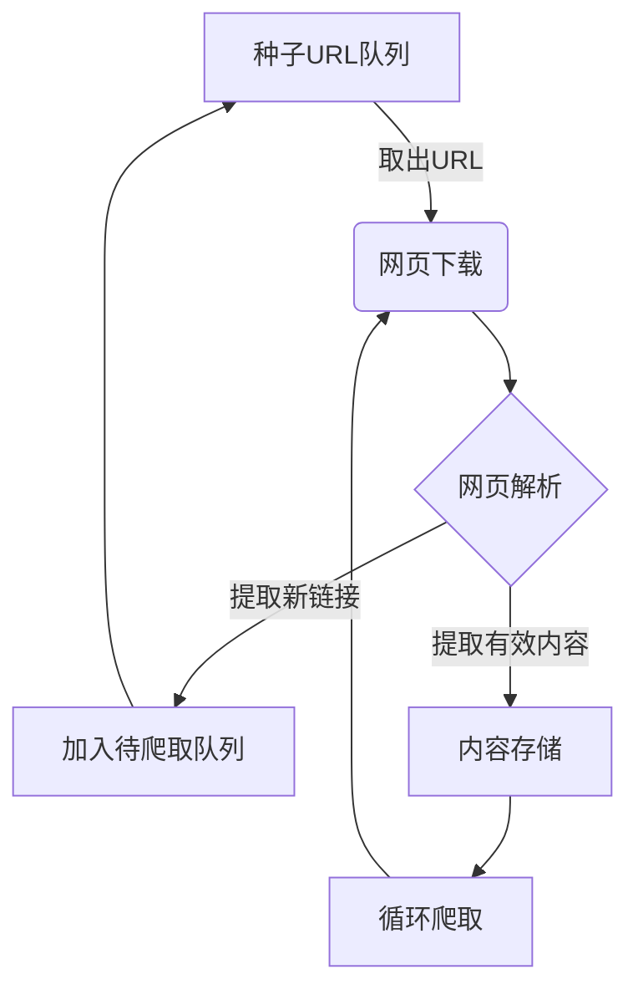
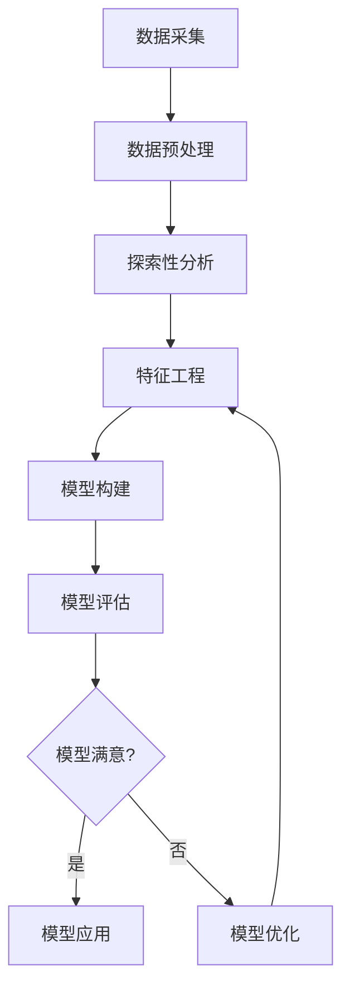

# 基于网络爬虫与数据分析的计算机岗位前景分析

## 1. 背景介绍

### 1.1 信息时代的到来

在当今时代,信息已经成为推动社会发展的核心动力。随着互联网、大数据和人工智能技术的迅猛发展,信息的获取、处理和利用变得前所未有的高效和广泛。这种信息爆炸式增长的趋势,为各行业带来了巨大的机遇和挑战。

### 1.2 人才需求与供给失衡

信息技术的快速发展,导致对计算机相关人才的需求与日俱增。然而,传统的教育模式和人才培养机制难以满足这种需求,造成了人才供给严重失衡的局面。这种失衡不仅影响企业的发展,也制约了整个社会的信息化进程。

### 1.3 数据分析在人才预测中的作用

为了解决这一问题,我们需要利用现有的数据资源,对未来的人才需求做出准确预测。通过对招聘信息、职位描述等数据进行深入分析,我们可以洞悉行业发展趋势,制定科学的人才培养策略。这就需要借助网络爬虫和数据分析等技术手段。

## 2. 核心概念与联系

### 2.1 网络爬虫

网络爬虫(Web Crawler)是一种自动化程序,它可以按照预定的规则,自动地遍历互联网上的网页,下载并存储网页内容。它是获取互联网上海量数据的重要工具。

#### 2.1.1 爬虫的工作原理

爬虫的工作原理可以概括为以下几个步骤:

1. **种子URL队列**: 爬虫程序从一个或多个初始URL开始,将这些URL放入待爬取队列中。
2. **网页下载**: 从队列中取出一个URL,使用HTTP协议下载该网页的内容。
3. **网页解析**: 对下载的网页进行解析,提取出新的URL链接,并将这些新链接加入待爬取队列。
4. **内容存储**: 根据需求,将下载的网页内容存储到本地或数据库中。
5. **循环爬取**: 重复步骤2-4,直到待爬取队列为空或达到预设的结束条件。



#### 2.1.2 爬虫分类

根据爬取策略的不同,网络爬虫可分为以下几种类型:

- **通用爬虫**: 旨在下载并存储尽可能多的网页,以建立大规模的网页库。
- **聚焦爬虫**: 针对特定主题或领域,只爬取与之相关的网页。
- **增量爬虫**: 周期性地重新爬取已存储的网页,以获取其中的更新内容。

### 2.2 数据分析

数据分析(Data Analysis)是从原始数据中获取有价值信息的过程。它包括数据预处理、探索性分析、模型构建和模型评估等步骤。

#### 2.2.1 数据分析流程

数据分析的一般流程如下:

1. **数据采集**: 从各种来源获取原始数据,如网络爬虫、传感器、日志文件等。
2. **数据预处理**: 对原始数据进行清洗、转换、集成等操作,使其符合分析需求。
3. **探索性分析**: 通过可视化和统计方法,初步了解数据的分布和特征。
4. **特征工程**: 根据分析目标,从原始数据中提取或构造有意义的特征。
5. **模型构建**: 使用机器学习或统计学方法,基于特征数据构建预测或解释模型。
6. **模型评估**: 通过一定的评估指标,检验模型的性能和泛化能力。
7. **模型优化**: 根据评估结果,调整模型参数或特征,以提高模型性能。
8. **模型应用**: 将优化后的模型应用于实际场景,获取有价值的分析结果。



#### 2.2.2 常用数据分析方法

常用的数据分析方法包括但不限于:

- **统计分析**: 描述性统计、推断统计、相关分析、回归分析等。
- **机器学习**: 监督学习(分类、回归)、无监督学习(聚类、降维)、强化学习等。
- **文本挖掘**: 文本预处理、主题模型、情感分析、命名实体识别等。
- **社交网络分析**: 中心性分析、社区发现、影响力分析等。
- **时间序列分析**: 趋势分析、周期性分析、异常检测等。

### 2.3 网络爬虫与数据分析的关系

网络爬虫和数据分析是相辅相成的技术:

- **数据来源**: 网络爬虫为数据分析提供了海量的原始数据来源。
- **数据预处理**: 爬虫下载的网页数据需要进行清洗、解析等预处理,为后续分析做准备。
- **特征提取**: 从网页文本、链接结构等方面提取特征,为模型构建奠定基础。
- **实时更新**: 增量爬虫可以持续获取最新数据,使分析结果保持动态更新。

通过有机结合网络爬虫和数据分析技术,我们可以从海量的网络数据中发现有价值的信息,为各种决策提供数据支持。

## 3. 核心算法原理具体操作步骤

### 3.1 网络爬虫核心算法

#### 3.1.1 广度优先爬取算法

广度优先爬取算法(BFS)是一种基本的爬虫策略,它按照发现的先后顺序来爬取网页。具体步骤如下:

1. 将种子URL放入队列。
2. 从队列中取出一个URL,下载并解析该网页。
3. 将该网页中的新链接加入队列尾部。
4. 重复步骤2-3,直到队列为空或达到结束条件。

```python
from collections import deque

def bfs_crawler(seed_urls, max_pages):
    visited = set()
    queue = deque(seed_urls)
    crawled = 0

    while queue and crawled < max_pages:
        url = queue.popleft()
        if url not in visited:
            visited.add(url)
            html = download(url)
            links = extract_links(html)
            queue.extend(link for link in links if link not in visited)
            crawled += 1

    return visited
```

广度优先爬取算法可以确保从种子URL出发,优先爬取距离较近的网页。但它也存在一些缺陷,如爬取深度有限、无法根据重要性排序等。

#### 3.1.2 优先级爬取算法

为了克服广度优先算法的缺陷,我们可以引入优先级队列,根据一定的评分规则对URL进行排序,优先爬取重要的网页。

```python
import heapq

def priority_crawler(seed_urls, max_pages, score_func):
    visited = set()
    queue = [(score_func(url), url) for url in seed_urls]
    heapq.heapify(queue)
    crawled = 0

    while queue and crawled < max_pages:
        score, url = heapq.heappop(queue)
        if url not in visited:
            visited.add(url)
            html = download(url)
            links = extract_links(html)
            for link in links:
                if link not in visited:
                    heapq.heappush(queue, (score_func(link), link))
            crawled += 1

    return visited
```

评分函数`score_func`可以根据具体需求设计,例如考虑网页的PageRank值、关键词匹配度等因素。通过优先级爬取算法,我们可以更有针对性地获取高质量网页数据。

#### 3.1.3 增量式爬取算法

对于需要持续跟踪更新的网站,我们可以采用增量式爬取算法,定期重新爬取已存储的网页,获取其中的更新内容。

```python
import hashlib

def incremental_crawler(seed_urls, revisit_interval):
    visited = {}
    queue = deque(seed_urls)

    while queue:
        url = queue.popleft()
        html = download(url)
        digest = hashlib.md5(html.encode('utf-8')).hexdigest()

        if url not in visited or visited[url] != digest:
            visited[url] = digest
            links = extract_links(html)
            queue.extend(link for link in links if link not in visited)
            store_page(url, html)

        if url in visited:
            queue.append((url, visited[url]['last_visit'] + revisit_interval))

    return visited
```

该算法会记录每个网页的MD5摘要,并与上次爬取时的摘要进行比较。如果发生变化,则重新存储该网页并提取新链接;否则,将该网页加入待revisit队列,在一定时间后再次爬取。

通过增量式爬取算法,我们可以有效地跟踪网站的更新情况,为动态数据分析提供支持。

### 3.2 数据分析核心算法

#### 3.2.1 文本预处理算法

对于从网页中获取的文本数据,我们通常需要进行一系列预处理操作,以提高后续分析的质量和效率。常用的文本预处理步骤包括:

1. **分词**: 将文本按照一定的规则分割成单词序列,是文本分析的基础步骤。
2. **去停用词**: 移除语料库中高频但无实际意义的词语,如"的"、"了"等。
3. **词性标注**: 为每个单词赋予相应的词性标记,有助于后续的特征提取。
4. **词形还原**: 将单词的不同形式归并为统一的词形,如"running"和"ran"都归并为"run"。
5. **语料库构建**: 将预处理后的文本数据构建成语料库,为后续的模型训练做准备。

以上步骤可以使用现有的自然语言处理工具库(如NLTK、jieba等)来实现。

#### 3.2.2 主题模型算法

主题模型是一种无监督学习算法,旨在从大规模文本语料库中自动发现潜在的主题结构。常用的主题模型算法包括:

- **潜在语义分析(LSA)**: 通过奇异值分解(SVD)将文档-词矩阵降维,发现潜在的语义主题。
- **概率潜在语义分析(PLSA)**: 使用概率模型描述文档-词的生成过程,发现潜在的主题分布。
- **潜在狄利克雷分布(LDA)**: 在PLSA基础上引入狄利克雷先验,提高了模型的泛化能力。

LDA模型是目前最为广泛使用的主题模型算法,它可以概括为以下生成过程:

1. 对于每个文档$d$,从狄利克雷分布$\alpha$中抽取一个主题分布$\theta_d$。
2. 对于每个主题$k$,从狄利克雷分布$\beta$中抽取一个词分布$\phi_k$。
3. 对于文档$d$中的每个词$w_{d,n}$:
    - 从$\theta_d$中抽取一个主题$z_{d,n}$。
    - 从$\phi_{z_{d,n}}$中抽取一个词$w_{d,n}$。

通过吉布斯采样或变分推断等方法,我们可以从观测数据(文档-词矩阵)中估计出隐含的主题-词分布和文档-主题分布,从而发现文本语料库中的潜在主题结构。

#### 3.2.3 分类算法

分类是监督学习中的一种常见任务,旨在根据输入特征将样本划分到预定的类别中。在招聘信息分析中,我们可以将职位描述文本作为输入特征,将其分类到不同的职业类别或工作领域。

常用的文本分类算法包括:

- **朴素贝叶斯分类器**: 基于贝叶斯定理,根据特征的条件独立假设计算后验概率。
- **决策树分类器**: 通过递归地构建决策树,将特征空间划分为若干区域。