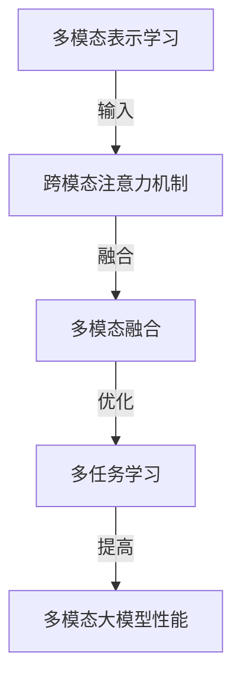

# 多模态大模型：技术原理与实战 其他部署方法介绍

## 1.背景介绍

### 1.1 人工智能的发展历程

人工智能(Artificial Intelligence, AI)是当代科技发展的重要领域之一,旨在模拟人类的认知能力,如学习、推理、感知、规划和问题解决等。自20世纪50年代AI概念被正式提出以来,经历了多个发展阶段。

- 早期阶段(1950s-1960s):专家系统、博弈论等理论研究为主。
- 知识驱动时期(1970s-1980s):发展知识库、机器学习等技术。
- 统计学习时期(1990s-2000s):贝叶斯网络、支持向量机等统计方法兴起。
- 深度学习时期(2010s-至今):受益于大数据、强算力,深度神经网络取得突破性进展。

### 1.2 大模型的兴起

随着数据量的激增和计算能力的飞速提高,训练大规模神经网络模型成为可能。2018年,谷歌发布Transformer模型,展现了大规模语言模型在自然语言处理任务上的卓越表现。此后,OpenAI的GPT、谷歌的BERT、Meta的OPT等大型语言模型相继问世,推动了AI领域的快速发展。

大模型具有参数量大(通常超过10亿)、泛化能力强、可迁移性好等优势,在自然语言处理、计算机视觉、多模态等领域表现出色。然而,大模型也面临着训练成本高昂、碳排放量大、隐私和安全风险等挑战。

### 1.3 多模态大模型的崛起

传统的大模型主要关注单一模态(如文本或图像)。然而,真实世界是多模态的,人类通过视觉、听觉、语言等多种方式获取信息。为了更好地模拟人类的认知过程,多模态大模型应运而生。

多模态大模型旨在融合不同模态的信息,如文本、图像、视频、音频等,实现跨模态的理解、推理和生成能力。代表性模型包括OpenAI的DALL-E、谷歌的Parti、Meta的Data2Vec等。这些模型展现了在多模态任务上的出色表现,如图像描述、视觉问答、多模态检索等,为人机交互、内容创作等领域带来新的机遇。

## 2.核心概念与联系

### 2.1 多模态表示学习

多模态表示学习(Multimodal Representation Learning)是多模态大模型的核心技术之一。其目标是学习一种统一的表示空间,将不同模态的输入(如文本、图像等)映射到该空间中,使得不同模态之间的相似性可以在统一空间中体现。

常见的多模态表示学习方法包括:

- 共享编码器(Shared Encoder):使用相同的编码器网络对不同模态的输入进行编码,得到统一的表示向量。
- 对比学习(Contrastive Learning):通过最大化正样本对之间的相似性,最小化正负样本对之间的相似性,学习模态之间的对应关系。
- 自监督学习(Self-Supervised Learning):利用大量无标注数据,通过设计预文本任务(如遮挡语言模型、图像重建等)进行预训练,获得有效的多模态表示。

### 2.2 跨模态注意力机制

注意力机制(Attention Mechanism)是深度学习中的关键技术之一,能够自动捕捉输入数据中的重要信息。在多模态大模型中,跨模态注意力机制(Cross-Modal Attention)用于建立不同模态之间的关联。

常见的跨模态注意力机制包括:

- 双向跨模态注意力(Bidirectional Cross-Modal Attention):在编码器和解码器之间引入跨模态注意力,实现模态之间的交互。
- 协同注意力(Co-Attention):同时计算两个模态之间的注意力,捕捉模态间的相关性。
- 层次注意力(Hierarchical Attention):在不同层次(如词级、句级等)上计算注意力,捕捉不同粒度的模态关联。

### 2.3 多模态融合

多模态融合(Multimodal Fusion)旨在将不同模态的表示有效地融合,以获得更加丰富和完整的信息。常见的融合策略包括:

- 特征级融合(Feature-Level Fusion):在特征提取阶段,将不同模态的特征拼接或加权求和。
- 决策级融合(Decision-Level Fusion):对每个模态单独进行决策,然后将各模态的决策结果进行融合。
- 模型级融合(Model-Level Fusion):使用单一的多模态模型,在模型内部实现模态融合。

### 2.4 多任务学习

多任务学习(Multi-Task Learning)是一种同时优化多个相关任务的训练范式,有助于提高模型的泛化能力和鲁棒性。在多模态大模型中,通常会结合不同模态的任务进行联合训练,如图像描述、视觉问答、图文检索等,以捕捉模态间的相关性。

### 2.5 核心概念关系图

以下是上述核心概念之间的关系图:

## 3.核心算法原理具体操作步骤

### 3.1 Transformer模型

Transformer是多模态大模型的核心架构之一,由编码器(Encoder)和解码器(Decoder)组成。编码器将输入序列编码为上下文表示,解码器根据上下文表示生成目标序列。

Transformer的关键是自注意力机制(Self-Attention),它能够捕捉序列中任意两个位置之间的依赖关系,解决了传统RNN结构的长期依赖问题。

1. **输入嵌入(Input Embedding)**:将输入序列(如文本或图像)映射为嵌入向量。
2. **位置编码(Positional Encoding)**:为每个位置添加位置信息,使模型能够捕捉序列的顺序信息。
3. **多头自注意力(Multi-Head Self-Attention)**:计算查询(Query)、键(Key)和值(Value)之间的注意力分数,捕捉序列内部的依赖关系。
4. **前馈神经网络(Feed-Forward Neural Network)**:对注意力输出进行非线性变换,提取高阶特征。
5. **残差连接(Residual Connection)**:将输入和变换后的特征相加,缓解梯度消失问题。
6. **层归一化(Layer Normalization)**:对每一层的输出进行归一化,加速收敛。

### 3.2 多模态Transformer

为了处理多模态输入,Transformer架构需要进行扩展。常见的多模态Transformer包括:

1. **双流Transformer**:为每种模态设置独立的编码器,在解码器处融合不同模态的表示。
2. **单流Transformer**:将不同模态的输入拼接,送入单一的Transformer编码器进行建模。
3. **交替Transformer**:在编码器和解码器之间交替处理不同模态的输入。

### 3.3 跨模态注意力机制

跨模态注意力机制是多模态Transformer的核心,用于捕捉不同模态之间的相关性。常见的跨模态注意力机制包括:

1. **双向跨模态注意力**:在编码器和解码器之间引入跨模态注意力,实现模态之间的交互。
2. **协同注意力**:同时计算两个模态之间的注意力,捕捉模态间的相关性。
3. **层次注意力**:在不同层次(如词级、句级等)上计算注意力,捕捉不同粒度的模态关联。

### 3.4 多模态融合策略

多模态融合旨在将不同模态的表示有效地融合,以获得更加丰富和完整的信息。常见的融合策略包括:

1. **特征级融合**:在特征提取阶段,将不同模态的特征拼接或加权求和。
2. **决策级融合**:对每个模态单独进行决策,然后将各模态的决策结果进行融合。
3. **模型级融合**:使用单一的多模态模型,在模型内部实现模态融合。

### 3.5 多任务学习

多任务学习是一种同时优化多个相关任务的训练范式,有助于提高模型的泛化能力和鲁棒性。在多模态大模型中,通常会结合不同模态的任务进行联合训练,如图像描述、视觉问答、图文检索等。

多任务学习的具体步骤如下:

1. **任务构建**:确定要联合训练的任务集合,这些任务应该具有一定的相关性。
2. **损失函数设计**:为每个任务设计相应的损失函数,并对所有损失函数进行加权求和。
3. **数据采样**:从不同任务的数据集中采样,构建每一个批次的训练数据。
4. **模型更新**:基于当前批次的数据,计算总损失函数,并通过反向传播更新模型参数。
5. **模型评估**:在验证集上评估模型在各个任务上的性能,调整任务权重或提前停止训练。

## 4.数学模型和公式详细讲解举例说明

### 4.1 自注意力机制

自注意力机制是Transformer的核心,它能够捕捉序列中任意两个位置之间的依赖关系。给定一个输入序列 $X = (x_1, x_2, \dots, x_n)$,自注意力机制的计算过程如下:

1. 计算查询(Query)、键(Key)和值(Value)矩阵:

$$
Q = XW^Q, K = XW^K, V = XW^V
$$

其中 $W^Q, W^K, W^V$ 是可学习的权重矩阵。

2. 计算注意力分数:

$$
\text{Attention}(Q, K, V) = \text{softmax}\left(\frac{QK^T}{\sqrt{d_k}}\right)V
$$

其中 $d_k$ 是缩放因子,用于防止内积过大导致梯度消失。

3. 多头注意力机制:

$$
\text{MultiHead}(Q, K, V) = \text{Concat}(head_1, \dots, head_h)W^O
$$

$$
head_i = \text{Attention}(QW_i^Q, KW_i^K, VW_i^V)
$$

其中 $W_i^Q, W_i^K, W_i^V$ 是第 $i$ 个注意力头的权重矩阵, $W^O$ 是可学习的输出权重矩阵。

多头注意力机制能够从不同的子空间捕捉序列的不同特征,提高了模型的表示能力。

### 4.2 跨模态注意力机制

跨模态注意力机制用于捕捉不同模态之间的相关性。假设我们有两个模态 $X$ 和 $Y$,其对应的表示为 $Q_X, K_X, V_X$ 和 $Q_Y, K_Y, V_Y$。跨模态注意力机制的计算过程如下:

1. 计算模态内注意力:

$$
O_X = \text{Attention}(Q_X, K_X, V_X)
$$

$$
O_Y = \text{Attention}(Q_Y, K_Y, V_Y)
$$

2. 计算跨模态注意力:

$$
\tilde{O}_X = \text{Attention}(O_X, K_Y, V_Y)
$$

$$
\tilde{O}_Y = \text{Attention}(O_Y, K_X, V_X)
$$

3. 融合模态表示:

$$
O = \text{FFN}([\tilde{O}_X; \tilde{O}_Y])
$$

其中 $\text{FFN}$ 是前馈神经网络, $[;]$ 表示拼接操作。

通过跨模态注意力机制,模型能够捕捉不同模态之间的相关性,并将这些信息融合到最终的表示中。

### 4.3 对比学习

对比学习是多模态表示学习的一种重要方法,它通过最大化正样本对之间的相似性,最小化正负样本对之间的相似性,学习模态之间的对应关系。

给定一个正样本对 $(x, y)$,其中 $x$ 和 $y$ 分别来自不同的模态,以及一组负样本 $\{y_1, y_2, \dots, y_K\}$,对比损失函数可以定义为:

$$
\mathcal{L}(x, y)