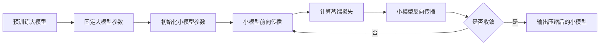
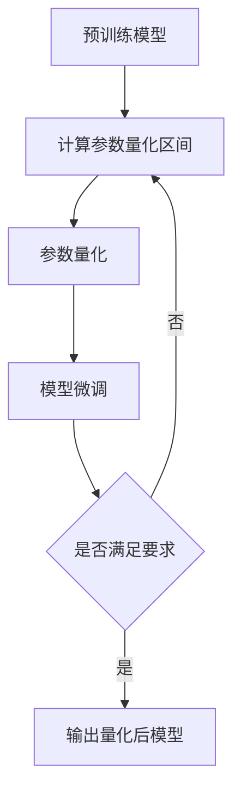
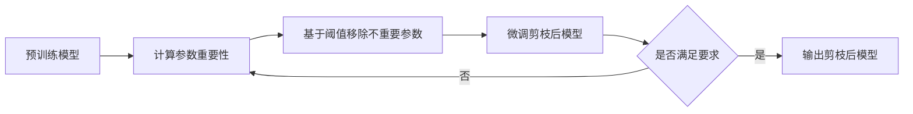
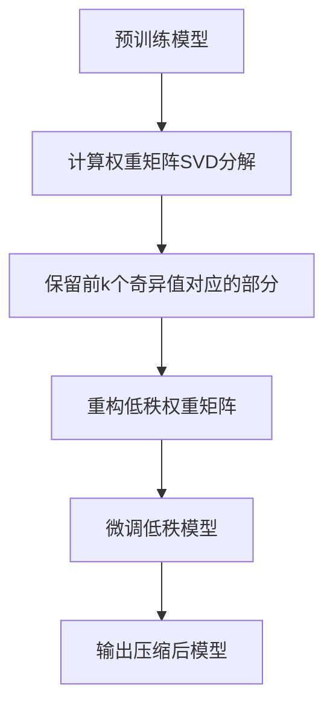
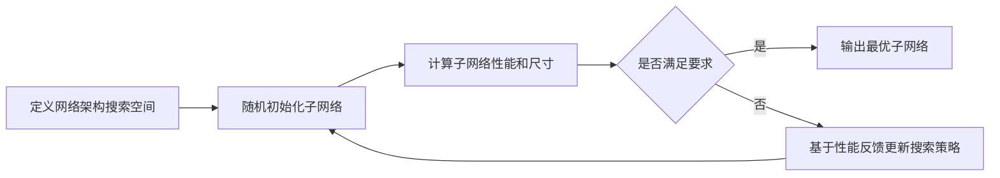

# 多模态大模型：技术原理与实战 模型压缩实战

## 1. 背景介绍

### 1.1 多模态大模型概述
多模态大模型是近年来人工智能领域的重要突破,它能够同时处理文本、图像、音频等多种模态的数据,实现跨模态的信息理解和生成。这种模型通常参数量巨大,需要海量的训练数据和计算资源。

### 1.2 模型压缩的意义
尽管多模态大模型展现出了强大的性能,但其巨大的模型尺寸也带来了诸多挑战,如推理速度慢、内存占用高、难以部署到资源受限的场景等。因此,如何在保持模型性能的同时压缩其尺寸,成为了一个重要的研究课题。

### 1.3 本文的主要内容
本文将重点介绍多模态大模型压缩的技术原理和实战案例。内容涵盖核心概念解析、压缩算法详解、实践代码演示、应用场景分析等多个方面,旨在为读者提供全面而深入的认识。

## 2. 核心概念与联系

### 2.1 知识蒸馏 (Knowledge Distillation)
知识蒸馏指的是使用一个大的教师模型(Teacher Model)去指导训练一个小的学生模型(Student Model),使学生模型能够学到教师模型的"知识"。这里的"知识"通常体现在教师模型的输出概率分布上。

### 2.2 参数量化 (Quantization) 
参数量化是一种常用的模型压缩技术,其核心思想是用低比特的离散值来表示原本32位浮点型的模型权重参数,从而减小模型尺寸。常见的量化位宽有8bit、4bit等。

### 2.3 剪枝 (Pruning)
剪枝是通过移除模型中冗余或不重要的部分(如权重、神经元、通道等)来压缩模型的一类方法。剪枝可以是非结构化的,即随机移除权重;也可以是结构化的,即有目的地移除整个神经元或卷积核。

### 2.4 低秩近似 (Low-rank Approximation)
低秩近似通过将大的矩阵或张量分解为若干个低秩的矩阵或张量的乘积来近似原始矩阵,从而减小存储和计算开销。常用的分解方法包括奇异值分解(SVD)、CP分解等。

### 2.5 架构搜索 (Architecture Search) 
架构搜索是利用搜索算法如强化学习、进化算法等,从一个预定义的网络架构空间中搜索出满足特定性能和尺寸要求的最优子网络。这种方法可以同时优化模型的精度和效率。

## 3. 核心算法原理具体操作步骤

### 3.1 知识蒸馏算法流程


### 3.2 参数量化算法流程


### 3.3 剪枝算法流程


### 3.4 低秩近似算法流程


### 3.5 架构搜索算法流程


## 4. 数学模型和公式详细讲解举例说明

### 4.1 知识蒸馏目标函数
知识蒸馏的核心是让学生模型去模仿教师模型的行为。通常使用KL散度来度量二者输出分布的差异:

$L_{KD} = \alpha T^2 \cdot D_{KL}(y_s||y_t) + (1-\alpha)L_{CE}(y_s, y_{true})$

其中 $y_s$ 和 $y_t$ 分别表示学生和教师模型的输出概率分布,$T$ 是温度系数,用于放大较小概率的差异。$L_{CE}$ 是学生模型和真实标签的交叉熵损失,$\alpha$ 是平衡两种损失的权重系数。

### 4.2 参数量化示例
以8bit对称均匀量化为例,对于给定的参数 $\theta$,其量化后的值 $Q(\theta)$ 为:

$Q(\theta) = round(\frac{\theta}{S}) \cdot S$

其中 $S$ 为量化步长,计算公式为:

$S = \frac{max(|\theta|)}{2^{b-1}-1}$

$round(\cdot)$ 表示四舍五入取整,$b$ 为量化位宽,这里取8。

### 4.3 剪枝示例
以基于 $L_1$ 范数的非结构化剪枝为例,首先计算每个权重的 $L_1$ 范数:

$s_i = \sum_j |W_{ij}|$

然后基于预设的稀疏度 $p$,保留前 $k = (1-p) \cdot N$ 个最大 $L_1$ 范数对应的权重,其余权重置零。$N$ 为总权重个数。

### 4.4 低秩近似示例
以SVD分解为例,对于权重矩阵 $W \in R^{m \times n}$,其SVD分解为:

$W = U\Sigma V^T$

其中 $U \in R^{m \times m}, \Sigma \in R^{m \times n}, V \in R^{n \times n}$。

取前 $k$ 个最大奇异值,然后重构近似矩阵:

$\hat{W} = U_k \Sigma_k V_k^T$

其中 $U_k \in R^{m \times k}, \Sigma_k \in R^{k \times k}, V_k \in R^{n \times k}$。原始矩阵可用 $\hat{W}$ 近似,且存储空间从 $mn$ 降为 $k(m+n+1)$。

## 5. 项目实践：代码实例和详细解释说明

### 5.1 知识蒸馏Pytorch代码示例

```python
import torch
import torch.nn as nn
import torch.nn.functional as F

# 定义教师模型和学生模型
class TeacherModel(nn.Module):
    def __init__(self):
        super().__init__()
        self.fc1 = nn.Linear(100, 50) 
        self.fc2 = nn.Linear(50, 10)
        
    def forward(self, x):
        x = F.relu(self.fc1(x))
        x = self.fc2(x)
        return x

class StudentModel(nn.Module): 
    def __init__(self):
        super().__init__()
        self.fc1 = nn.Linear(100, 20)
        self.fc2 = nn.Linear(20, 10)
        
    def forward(self, x):
        x = F.relu(self.fc1(x))
        x = self.fc2(x)
        return x
        
teacher = TeacherModel()
student = StudentModel()

# 定义蒸馏损失函数
def distillation_loss(y_student, y_teacher, labels, T=5, alpha=0.5):
    loss_ce = F.cross_entropy(y_student, labels)
    loss_kd = nn.KLDivLoss()(F.log_softmax(y_student/T, dim=1),
                             F.softmax(y_teacher/T, dim=1)) * (alpha * T * T)
    return loss_kd + (1. - alpha) * loss_ce

# 训练学生模型
optimizer = torch.optim.Adam(student.parameters(), lr=1e-3)
for epoch in range(epochs):
    for batch in dataloader:
        x, y = batch
        
        # 教师模型前向传播
        with torch.no_grad():
            y_teacher = teacher(x)
            
        # 学生模型前向传播
        y_student = student(x)
        
        # 计算蒸馏损失
        loss = distillation_loss(y_student, y_teacher, y)
        
        # 反向传播和优化
        optimizer.zero_grad()
        loss.backward()
        optimizer.step()
```

在这个示例中,我们定义了一个三层的教师模型和一个两层的学生模型。蒸馏损失函数由两部分组成:学生模型和教师模型输出的KL散度,以及学生模型和真实标签的交叉熵损失,并由 `alpha` 参数平衡两种损失的权重。在训练过程中,我们先用教师模型进行前向传播得到软标签,然后用学生模型进行前向传播并计算蒸馏损失,最后进行反向传播和优化。

### 5.2 参数量化Pytorch代码示例

```python
import torch
import torch.nn as nn

# 定义量化函数
def quantize(x, scale, bits=8):
    bound = 2**(bits-1) - 1
    x = x / scale
    x = torch.clamp(x, -bound, bound)
    x = torch.round(x)
    x = x * scale
    return x

# 定义量化卷积层
class QuantConv2d(nn.Conv2d):
    def __init__(self, in_channels, out_channels, kernel_size, stride=1,
                 padding=0, dilation=1, groups=1, bias=True, bits=8):
        super().__init__(in_channels, out_channels, kernel_size, stride, 
                         padding, dilation, groups, bias)
        self.bits = bits
        self.register_buffer('scale', torch.tensor(1.0))
        
    def forward(self, x):
        if self.training:
            # 在训练时更新量化比例因子
            max_val = self.weight.abs().max()
            self.scale = max_val / (2**(self.bits-1) - 1)
        
        # 量化权重
        weight_q = quantize(self.weight, self.scale, self.bits)
        
        # 量化输入(可选)
        #x_q = quantize(x, self.scale, self.bits)
        
        return F.conv2d(x, weight_q, self.bias, self.stride,
                        self.padding, self.dilation, self.groups)
                        
# 使用量化卷积层构建模型                        
class QuantModel(nn.Module):
    def __init__(self):
        super().__init__()
        self.conv1 = QuantConv2d(3, 16, 3, padding=1, bits=8)
        self.conv2 = QuantConv2d(16, 32, 3, padding=1, bits=8)
        self.fc = nn.Linear(32*8*8, 10)
     
    def forward(self, x):
        x = self.conv1(x)
        x = F.relu(x)
        x = F.max_pool2d(x, 2)
        x = self.conv2(x)
        x = F.relu(x)
        x = F.max_pool2d(x, 2)
        x = x.view(-1, 32*8*8)
        x = self.fc(x)
        return x

model = QuantModel()
```

在这个示例中,我们定义了一个量化函数 `quantize`,它接受一个张量 `x`,将其除以量化比例因子 `scale`,然后限制在量化范围内,取整并重新乘以 `scale`。我们继承 `nn.Conv2d` 实现了一个量化卷积层 `QuantConv2d`,在前向传播时动态计算量化比例因子并量化权重。最后我们用量化卷积层搭建了一个简单的卷积网络 `QuantModel`。在实际使用时,还需对量化后的模型进行微调以恢复性能。

## 6. 实际应用场景

### 6.1 移动端部署
多模态大模型压缩的一个主要应用场景是移动端部署。移动设备如智能手机、平板等通常内存和算力有限,直接部署原始的大模型会面临速度慢、内存超出等问题。模型压缩可以在保持模型性能的同时大幅减小模型尺寸