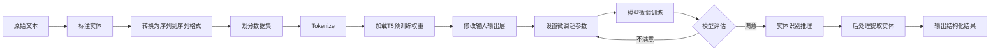

# 如何使用T5进行实体识别?

## 1.背景介绍
### 1.1 实体识别的定义与重要性
实体识别(Named Entity Recognition, NER)是自然语言处理(NLP)中的一项基础任务,旨在从非结构化文本中识别出具有特定意义的实体(如人名、地名、机构名、时间、数字等)并确定其类别。实体识别在信息抽取、知识图谱构建、问答系统、机器翻译等诸多NLP应用中扮演着重要角色。

### 1.2 传统的实体识别方法
传统的实体识别方法主要包括:
- 基于规则的方法:利用人工定义的规则和词典来识别实体,优点是可解释性强,缺点是构建规则费时费力,且泛化能力差。
- 基于统计机器学习的方法:将实体识别看作序列标注问题,使用条件随机场(CRF)、支持向量机(SVM)等算法进行建模,手工设计特征。优点是特征可控,缺点是特征工程复杂。
- 基于深度学习的方法:利用循环神经网络(RNN)、卷积神经网络(CNN)、注意力机制等对文本进行编码,端到端地学习实体识别。优点是自动学习特征,性能好,缺点是需要大量标注数据,可解释性差。

### 1.3 预训练语言模型用于实体识别
近年来,预训练语言模型(如BERT、RoBERTa、XLNet等)在NLP领域取得了巨大成功。它们通过在大规模无监督语料上进行自监督预训练,学习到了丰富的语言知识,可以方便地迁移到下游任务,极大地提升了模型性能。将预训练语言模型应用到实体识别任务中,可以减少对标注数据的依赖,提高泛化能力。

## 2.核心概念与联系
### 2.1 T5模型简介
T5(Text-to-Text Transfer Transformer)是Google在2020年提出的一个统一的文本到文本的转换框架。与BERT等以编码器为主的预训练模型不同,T5采用编码器-解码器结构,可以完成各种NLP任务,包括分类、序列标注、机器翻译、摘要、问答等。T5通过将所有任务转化为文本到文本的生成问题,实现了真正意义上的统一建模。

### 2.2 T5的预训练方式
T5采用了类似BERT的去噪自编码预训练方式,通过随机噪声损坏输入文本的一部分(如替换、删除等),然后训练模型来重构原始文本。与BERT只预测被mask的token不同,T5需要生成整个重构的句子。同时,T5还引入了前缀语言建模任务,通过随机选择输入文本的一部分作为前缀,预测剩余部分。预训练语料包括C4(Colossal Clean Crawled Corpus)等多个来源的无监督数据。

### 2.3 T5用于实体识别的优势
将T5应用于实体识别任务,具有以下优势:
- 强大的语言理解能力:T5在大规模语料上进行了充分预训练,学习到了丰富的语言知识和上下文信息,可以更好地理解文本语义。
- 统一的文本到文本建模:T5将实体识别问题转化为序列到序列的生成任务,输入原始文本,输出带有实体标签的文本。这种建模方式简洁灵活,易于实现和扩展。
- 少样本学习能力:得益于预训练的语言知识,T5可以在少量标注数据上进行微调,取得不错的效果,减轻了对大规模标注语料的依赖。
- 多任务学习:T5支持多任务训练,可以同时建模实体识别和其他相关任务(如关系抽取),实现知识的迁移和共享,提升泛化性能。

## 3.核心算法原理具体操作步骤
使用T5进行实体识别的核心步骤如下:

### 3.1 数据准备
- 收集和标注实体识别数据集,将原始文本和对应的实体标签转换为T5要求的序列到序列格式。常见的实体标注方案有BIO、BIOES等。
- 划分训练集、验证集和测试集,注意不同类别实体的分布要尽量均衡。
- 将文本和标签进行tokenize,T5采用的是SentencePiece分词,每个token对应一个id。

### 3.2 T5模型微调
- 加载预训练的T5模型权重,根据实体识别任务的输入输出格式,修改模型的输入embedding和输出层。
- 设置微调的超参数,如batch size、学习率、训练轮数等。T5建议使用AdaFactor优化器。
- 用训练集数据对模型进行微调训练,并在验证集上评估模型性能,根据需要调整超参数。

### 3.3 实体识别推理
- 使用微调后的T5模型对测试集或新文本进行实体识别推理。
- 将原始文本输入到T5的encoder中,解码生成带有预测实体标签的文本序列。
- 对生成的标签序列进行后处理,提取出实体的位置和类型,输出结构化的实体识别结果。

### 3.4 模型评估与优化
- 评估模型在测试集上的实体识别性能,常用指标有精确率、召回率、F1值等。
- 分析模型的错误情况,可能的优化方向包括:增加训练数据、调整超参数、引入领域知识、改进输入输出格式等。
- 不断迭代优化模型,直至达到满意的性能。



## 4.数学模型和公式详细讲解举例说明
T5的本质是一个基于Transformer的编码器-解码器模型,其数学原理可以用以下公式来表示:

编码器部分:
$$
\begin{aligned}
Q_i &= X W_i^Q \\
K_i &= X W_i^K \\
V_i &= X W_i^V \\
head_i &= \text{Attention}(Q_i, K_i, V_i) \\
\text{MultiHead}(X) &= \text{Concat}(head_1, \dots, head_h) W^O
\end{aligned}
$$

其中,$X$是输入序列的嵌入表示,$W_i^Q, W_i^K, W_i^V$是第$i$个注意力头的查询、键、值矩阵,$W^O$是输出投影矩阵。$\text{Attention}$计算如下:

$$
\text{Attention}(Q, K, V) = \text{softmax}(\frac{QK^T}{\sqrt{d_k}})V
$$

$d_k$是键向量的维度。多头注意力将不同头的结果拼接起来,线性变换得到最终的编码器输出。

解码器部分:
解码器也是堆叠的Transformer块,不同之处在于:
- 解码器的自注意力机制使用掩码,防止看到未来的信息。
- 在编码器-解码器注意力中,查询来自解码器,而键和值来自编码器输出。

生成部分:
T5将实体识别看作一个条件语言模型问题,给定输入文本$X$,生成带有实体标签的序列$Y$。用数学语言描述如下:

$$
P(Y|X) = \prod_{t=1}^T P(y_t | y_{<t}, X)
$$

其中,$y_t$是生成序列的第$t$个token,$y_{<t}$表示之前生成的token序列。T5通过最大化上述条件概率来训练模型的参数。在推理阶段,使用beam search等解码策略来生成实体标签序列。

举例说明:
输入文本:"John works at Google in New York."
标签序列:"[START] John [PERSON] works at Google [ORG] in New York [LOC] . [END]"

T5将输入文本传给编码器,提取特征表示,然后解码器根据编码器的输出和之前生成的标签序列,预测下一个标签。重复这个过程,直到生成[END]标记。最终得到预测的实体标签序列,经过后处理提取出实体及其类型:

John - PERSON
Google - ORG 
New York - LOC

## 5.项目实践：代码实例和详细解释说明
下面是使用PyTorch和Transformers库实现T5用于实体识别的示例代码:

```python
from transformers import T5Tokenizer, T5ForConditionalGeneration, AdamW

# 加载T5分词器和模型
tokenizer = T5Tokenizer.from_pretrained('t5-base')
model = T5ForConditionalGeneration.from_pretrained('t5-base')

# 准备训练数据
train_texts = [...]  # 训练文本列表
train_labels = [...]  # 训练标签列表

# 将文本和标签转换为模型输入格式
train_encodings = tokenizer(train_texts, padding=True, truncation=True, return_tensors='pt')
train_labels = tokenizer(train_labels, padding=True, truncation=True, return_tensors='pt').input_ids

# 设置优化器和训练参数
optimizer = AdamW(model.parameters(), lr=1e-4)
num_epochs = 10
batch_size = 8

# 模型微调训练
model.train()
for epoch in range(num_epochs):
    for i in range(0, len(train_encodings.input_ids), batch_size):
        batch_encodings = {k: v[i:i+batch_size] for k, v in train_encodings.items()}
        batch_labels = train_labels[i:i+batch_size]
        
        outputs = model(input_ids=batch_encodings['input_ids'],
                        attention_mask=batch_encodings['attention_mask'],
                        labels=batch_labels)
        
        loss = outputs.loss
        loss.backward()
        optimizer.step()
        optimizer.zero_grad()
        
    print(f'Epoch {epoch+1} loss: {loss.item():.4f}')

# 实体识别推理
model.eval()
test_texts = [...]  # 测试文本列表

for text in test_texts:
    input_ids = tokenizer(text, return_tensors='pt').input_ids
    outputs = model.generate(input_ids)
    predicted_labels = tokenizer.decode(outputs[0], skip_special_tokens=True)
    
    # 后处理提取实体
    entities = extract_entities(text, predicted_labels)
    print(f'Text: {text}')
    print(f'Entities: {entities}')
```

代码解释:
1. 加载预训练的T5分词器和模型,这里使用的是t5-base版本。
2. 准备训练数据,包括原始文本和对应的实体标签序列。
3. 使用分词器将文本和标签转换为模型所需的输入格式,即input_ids和attention_mask。
4. 设置AdamW优化器和训练超参数,如学习率、训练轮数和批大小。
5. 对模型进行微调训练,遍历训练数据,将每个批次的数据输入模型,计算损失并反向传播更新参数。
6. 训练完成后,使用微调的模型对测试文本进行实体识别推理。对每个测试文本,将其编码为模型输入,然后使用generate方法生成预测的实体标签序列。
7. 对生成的标签序列进行后处理,提取出实体及其类型(这里省略了具体实现)。

需要注意的是,这只是一个简化的示例代码,实际应用中还需要考虑更多细节,如数据划分、模型评估、超参数调优等。同时,T5还支持多任务学习、知识蒸馏等高阶技巧,可以进一步提升实体识别的性能。

## 6.实际应用场景
T5用于实体识别可以应用于多种实际场景,例如:

### 6.1 智能客服
在客服对话中,自动识别出用户提到的人名、地点、组织、产品等关键实体,可以帮助客服快速了解用户需求,提供个性化服务,提高响应效率。

### 6.2 金融风控
从金融文本(如新闻、公告、报告等)中抽取出公司、人物、金额、时间等关键实体,进行风险事件监测、关联分析,及早发现潜在风险,防范金融欺诈。

### 6.3 医疗健康
从医疗记录、病例报告中识别出症状、药物