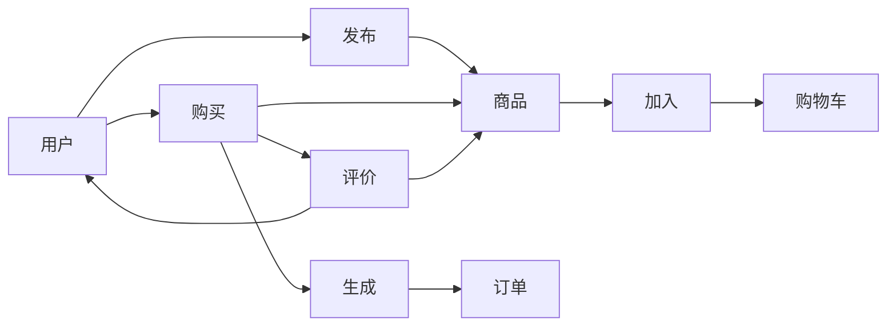

# 学生二手物品交易系统详细设计与具体代码实现

## 1. 背景介绍

### 1.1 学生二手物品交易的现状

随着高校学生人数的不断增加,学生的消费需求也日益增长。但由于学生经济能力有限,购买全新物品的成本较高。因此,越来越多的学生选择通过二手物品交易的方式来满足自己的需求。目前,学生二手物品交易主要通过线下交易和网上交易两种方式进行。

#### 1.1.1 线下交易

线下交易主要是通过学校内部的二手市场、跳蚤市场等进行,学生将不需要的物品拿到指定地点进行交易。这种方式的优点是可以当面看货议价,但交易受时间、地点的限制,且信息传播范围有限。

#### 1.1.2 网上交易

网上交易主要通过一些综合性的电商平台,如闲鱼、转转等。学生在平台上发布商品信息,有意向的买家可以在线下单并完成交易。网上交易打破了时空限制,信息传播范围广,但无法当面验货,存在一定的信任和安全隐患。

### 1.2 建设学生二手物品交易系统的意义

针对目前学生二手物品交易存在的问题,开发一个专门面向大学生的二手物品交易平台很有必要。这个系统可以整合线上线下的优势,为学生提供一个安全、便捷、高效的二手物品交易渠道。主要意义体现在以下几个方面:

#### 1.2.1 满足学生的实际需求

大学生经济能力有限,但又有较大的消费需求,通过二手物品交易可以以较低的价格购买到所需物品,节省开支。

#### 1.2.2 促进资源的合理配置

很多学生手中闲置的物品可以通过平台交易,物尽其用,减少浪费,实现资源的合理配置。

#### 1.2.3 培养学生的经济意识

参与二手物品交易可以锻炼学生的交易意识和经济头脑,培养他们的理财观念。

#### 1.2.4 增强学校凝聚力

专门的校园二手交易平台可以加强学生之间的交流,增强学校的凝聚力。

## 2. 核心概念与关系

在学生二手物品交易系统中,涉及到的核心概念主要包括:

### 2.1 用户

用户指注册并使用该系统的学生。用户可以在系统中浏览商品、发布商品、购买商品等。用户拥有自己的账号,可以管理个人信息。

### 2.2 商品

商品是用户在系统中发布的待出售的物品。每个商品都有自己的属性,如名称、类别、图片、价格、描述等。商品与发布者(卖家)关联。

### 2.3 订单

当买家购买商品后,系统会生成相应的订单。订单中包含交易的商品信息、交易金额、交易时间、买卖双方信息、订单状态等。

### 2.4 购物车

购物车是为了方便买家在购买之前收集中意商品而设计的。买家可以将想要购买的商品放入购物车,在提交订单时一次性购买。

### 2.5 评价

交易完成后,买家可以对卖家和商品进行评价,评价包括描述相符、物流服务等方面,评价会影响卖家的信用。

### 2.6 关系

用户与商品的关系:用户既可以是商品的发布者(卖家),也可以是商品的购买者(买家)。

用户与订单的关系:买家和卖家通过订单产生交易关系。

商品与订单的关系:一个订单对应一个或多个商品。

下面是系统核心概念及其关系的 Mermaid 图:



## 3. 核心算法原理与具体操作步骤

学生二手物品交易系统涉及的核心算法主要有:

### 3.1 商品推荐算法

#### 3.1.1 基于用户的协同过滤推荐

根据用户的历史行为(如浏览、购买、评价等)计算用户之间的相似度,然后给用户推荐相似用户喜欢的商品。

具体步骤如下:

1. 收集用户的历史行为数据,构建用户-商品矩阵。
2. 计算用户之间的相似度,常用的相似度计算方法有欧氏距离、皮尔逊相关系数等。
3. 根据用户相似度,找到与目标用户最相似的 K 个用户。
4. 将这 K 个用户喜欢的、目标用户没有交互过的商品推荐给目标用户。

#### 3.1.2 基于物品的协同过滤推荐

根据商品之间的相似度,给用户推荐与其历史上感兴趣商品相似的商品。

具体步骤如下:

1. 计算商品之间的相似度,常用的相似度计算方法有欧氏距离、皮尔逊相关系数等。
2. 根据用户的历史行为,找到用户感兴趣的商品。
3. 将与这些商品相似度较高的其他商品推荐给用户。

### 3.2 信用评估算法

在二手交易中,买卖双方的信用非常重要。系统需要对用户的信用进行评估,以提高交易的安全性。可以从以下几个维度来评估用户的信用:

1. 交易数量:完成的交易数量越多,信用越高。
2. 好评率:收到的好评数占总评价数的比例越高,信用越高。
3. 商品描述相符度:发布商品的描述与实际情况越相符,信用越高。
4. 交易纠纷处理:出现交易纠纷时,主动妥善处理的,信用越高。

信用评估可以采用加权平均的方法,对各个维度的指标进行加权,得到最终的信用分数。权重可以根据实际情况进行调整。

## 4. 数学模型与公式详解

### 4.1 协同过滤推荐的数学模型

协同过滤推荐通常基于以下假设:

1. 有相似兴趣的用户,对物品会有相似的评价。
2. 用户会对与他们过去喜欢的物品相似的物品感兴趣。

#### 4.1.1 用户相似度计算

常用的相似度计算方法有:

1. 欧氏距离:

$$
d(u,v) = \sqrt{\sum_{i=1}^{n}(x_{u,i}-x_{v,i})^2}
$$

其中,$x_{u,i}$和$x_{v,i}$分别表示用户$u$和$v$对物品$i$的评分。

2. 皮尔逊相关系数:

$$
sim(u,v) = \frac{\sum_{i=1}^{n}(x_{u,i}-\bar{x}_u)(x_{v,i}-\bar{x}_v)}{\sqrt{\sum_{i=1}^{n}(x_{u,i}-\bar{x}_u)^2}\sqrt{\sum_{i=1}^{n}(x_{v,i}-\bar{x}_v)^2}}
$$

其中,$\bar{x}_u$和$\bar{x}_v$分别表示用户$u$和$v$的平均评分。

#### 4.1.2 预测评分计算

根据用户相似度,可以预测目标用户对某个物品的评分:

$$
p_{u,i} = \bar{x}_u + \frac{\sum_{v=1}^{k}sim(u,v)(x_{v,i}-\bar{x}_v)}{\sum_{v=1}^{k}|sim(u,v)|}
$$

其中,$p_{u,i}$表示预测用户$u$对物品$i$的评分,$\bar{x}_u$表示用户$u$的平均评分,$k$表示与用户$u$最相似的$k$个用户。

### 4.2 信用评估的数学模型

假设评估用户信用的指标有$m$个,每个指标的权重为$w_j$,用户$u$在指标$j$上的得分为$s_{u,j}$,则用户$u$的信用分数为:

$$
credit_u = \sum_{j=1}^{m}w_js_{u,j}
$$

其中,$\sum_{j=1}^{m}w_j=1$。

## 5. 项目实践:代码实例与详解

下面是学生二手物品交易系统的部分核心代码实例。

### 5.1 用户相似度计算

```python
import numpy as np

def euclidean_distance(u, v):
    """
    计算用户u和v的欧氏距离
    """
    return np.sqrt(np.sum((u - v) ** 2))

def pearson_correlation(u, v):
    """
    计算用户u和v的皮尔逊相关系数
    """
    return np.corrcoef(u, v)[0, 1]

def user_similarity(ratings, method='pearson'):
    """
    计算用户相似度矩阵
    ratings: 用户-物品评分矩阵
    method: 相似度计算方法,可选'euclidean'或'pearson'
    """
    n_users = ratings.shape[0]
    similarity = np.zeros((n_users, n_users))
    for i in range(n_users):
        for j in range(i+1, n_users):
            u = ratings[i]
            v = ratings[j]
            if method == 'euclidean':
                similarity[i, j] = 1 / (1 + euclidean_distance(u, v))
            elif method == 'pearson':
                similarity[i, j] = pearson_correlation(u, v)
            similarity[j, i] = similarity[i, j]
    return similarity
```

这段代码实现了欧氏距离和皮尔逊相关系数两种相似度计算方法,并基于此计算用户相似度矩阵。

### 5.2 物品推荐

```python
def recommend_items(ratings, user_id, k=5, method='pearson'):
    """
    为用户user_id推荐k个物品
    ratings: 用户-物品评分矩阵
    user_id: 目标用户id
    k: 推荐物品数量
    method: 相似度计算方法,可选'euclidean'或'pearson'
    """
    similarity = user_similarity(ratings, method)
    n_users, n_items = ratings.shape
    not_rated_items = np.where(ratings[user_id] == 0)[0]
    item_scores = {}
    for item in not_rated_items:
        item_ratings = ratings[:, item]
        user_similarities = similarity[user_id]
        score = np.dot(item_ratings, user_similarities) / np.sum(user_similarities)
        item_scores[item] = score
    recommendations = sorted(item_scores, key=item_scores.get, reverse=True)[:k]
    return recommendations
```

这段代码实现了基于用户的协同过滤推荐。首先计算用户相似度矩阵,然后对目标用户没有评分的物品,根据相似用户的评分加权平均计算预测得分,最后返回得分最高的k个物品作为推荐结果。

### 5.3 信用评估

```python
def user_credit_score(user_data, weights):
    """
    计算用户信用分数
    user_data: 用户各维度数据
    weights: 各维度权重
    """
    return np.dot(user_data, weights)
```

这段代码根据各维度数据和权重,计算用户的信用分数。实际应用中,还需要对各维度数据进行归一化处理。

## 6. 实际应用场景

学生二手物品交易系统可以应用在以下场景:

### 6.1 校园二手市场

学校可以建立专门的校园二手交易平台,方便学生在校内进行二手物品交易。学生可以在平台上发布自己不需要的物品,如书籍、电子产品、生活用品等,也可以在平台上搜索并购买需要的二手物品。

### 6.2 毕业季二手交易

每年毕业季,大量毕业生需要处理自己的闲置物品。学校可以利用该系统组织毕业季二手交易活动,为毕业生提供一个方便、高效的二手交易渠道。

### 6.3 跨校交易

不同学校之间的学生也有二手交易的需求。该系统可以支持跨校交易,学生可以在系统上发布和购买其他学校学生的二手物品。

### 6.4 学生创业项目

该系统也可以作为学生创业项目,由学生自己运营管理。这不仅可以满足学生的二手交易需求,还