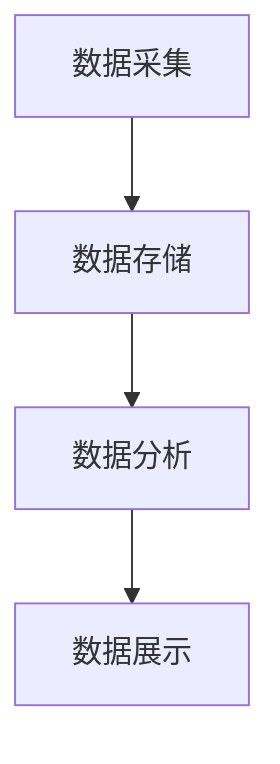

# 学生日常行为评分管理系统设计与实现

## 1.背景介绍

在现代教育体系中，学生的日常行为管理是学校管理的重要组成部分。传统的管理方式往往依赖于教师的主观判断和纸质记录，这不仅效率低下，而且容易出现误判和遗漏。随着信息技术的发展，构建一个高效、准确的学生日常行为评分管理系统成为可能。本文将详细介绍该系统的设计与实现，旨在为教育工作者提供一个科学、客观的学生行为管理工具。

## 2.核心概念与联系

### 2.1 学生日常行为评分

学生日常行为评分是指通过对学生在校期间的行为进行记录和评估，生成一个综合评分，用于反映学生的行为表现。评分标准通常包括出勤情况、课堂表现、课外活动参与度等。

### 2.2 行为管理系统

行为管理系统是一个集数据采集、存储、分析和展示于一体的软件系统。其核心功能是通过对学生行为数据的分析，生成行为评分，并提供相应的管理和决策支持。

### 2.3 数据采集与分析

数据采集是指通过各种手段（如传感器、手动输入等）获取学生的行为数据。数据分析则是通过算法对采集到的数据进行处理，生成有意义的评分和报告。

### 2.4 系统架构

系统架构是指系统各个组件之间的关系和交互方式。一个良好的系统架构能够提高系统的可维护性、扩展性和可靠性。

## 3.核心算法原理具体操作步骤

### 3.1 数据采集

数据采集是系统的基础，主要包括以下几个步骤：

1. **确定数据源**：如考勤记录、课堂表现记录、课外活动记录等。
2. **数据采集方式**：如RFID考勤、教师手动输入、学生自评等。
3. **数据预处理**：包括数据清洗、格式转换等。

### 3.2 数据存储

数据存储需要考虑数据的安全性、完整性和可扩展性。常用的存储方案包括关系型数据库（如MySQL）、NoSQL数据库（如MongoDB）等。

### 3.3 数据分析

数据分析是系统的核心，主要包括以下几个步骤：

1. **数据清洗**：去除无效数据，填补缺失数据。
2. **特征提取**：从原始数据中提取有用的特征，如出勤率、课堂参与度等。
3. **评分模型**：根据特征生成评分，常用的模型包括线性回归、决策树等。

### 3.4 数据展示

数据展示是系统的输出，主要包括以下几个步骤：

1. **确定展示方式**：如报表、图表、仪表盘等。
2. **数据可视化**：使用图表库（如D3.js、Chart.js）生成可视化图表。
3. **用户交互**：提供用户友好的交互界面，如筛选、排序等功能。

以下是系统的Mermaid流程图：



## 4.数学模型和公式详细讲解举例说明

### 4.1 数据清洗

数据清洗是数据分析的第一步，主要包括去除无效数据和填补缺失数据。假设我们有一个学生的出勤记录数据集，其中包含一些缺失值。我们可以使用均值填补法来处理这些缺失值。

$$
x_i = \frac{\sum_{j=1}^{n} x_j}{n}
$$

其中，$x_i$ 是缺失值，$x_j$ 是其他有效值，$n$ 是有效值的数量。

### 4.2 特征提取

特征提取是从原始数据中提取有用的特征。假设我们有一个学生的课堂表现记录数据集，我们可以计算学生的平均课堂参与度。

$$
P_{avg} = \frac{\sum_{i=1}^{n} P_i}{n}
$$

其中，$P_{avg}$ 是平均课堂参与度，$P_i$ 是每节课的参与度，$n$ 是总节数。

### 4.3 评分模型

评分模型是根据特征生成评分。假设我们使用线性回归模型来生成评分。

$$
S = \beta_0 + \beta_1 x_1 + \beta_2 x_2 + \cdots + \beta_n x_n
$$

其中，$S$ 是评分，$\beta_0$ 是截距，$\beta_i$ 是特征 $x_i$ 的系数。

### 4.4 实例说明

假设我们有以下数据：

- 出勤率：90%
- 课堂参与度：80%
- 课外活动参与度：70%

我们可以使用线性回归模型生成评分：

$$
S = 0.2 + 0.5 \times 0.9 + 0.3 \times 0.8 + 0.1 \times 0.7 = 0.2 + 0.45 + 0.24 + 0.07 = 0.96
$$

## 5.项目实践：代码实例和详细解释说明

### 5.1 数据采集

以下是一个简单的Python代码示例，用于采集学生的出勤记录：

```python
import pandas as pd

# 读取出勤记录数据
data = pd.read_csv('attendance.csv')

# 数据预处理
data = data.dropna()  # 去除缺失值
data['attendance_rate'] = data['present_days'] / data['total_days']  # 计算出勤率

print(data.head())
```

### 5.2 数据存储

以下是一个使用MySQL存储数据的示例：

```python
import mysql.connector

# 连接到MySQL数据库
conn = mysql.connector.connect(
    host='localhost',
    user='root',
    password='password',
    database='student_behavior'
)

cursor = conn.cursor()

# 创建表
cursor.execute('''
CREATE TABLE IF NOT EXISTS attendance (
    student_id INT,
    present_days INT,
    total_days INT,
    attendance_rate FLOAT
)
''')

# 插入数据
for index, row in data.iterrows():
    cursor.execute('''
    INSERT INTO attendance (student_id, present_days, total_days, attendance_rate)
    VALUES (%s, %s, %s, %s)
    ''', (row['student_id'], row['present_days'], row['total_days'], row['attendance_rate']))

conn.commit()
cursor.close()
conn.close()
```

### 5.3 数据分析

以下是一个使用线性回归模型生成评分的示例：

```python
import pandas as pd
from sklearn.linear_model import LinearRegression

# 读取数据
data = pd.read_csv('student_behavior.csv')

# 特征提取
X = data[['attendance_rate', 'class_participation', 'activity_participation']]
y = data['score']

# 训练模型
model = LinearRegression()
model.fit(X, y)

# 生成评分
data['predicted_score'] = model.predict(X)

print(data.head())
```

### 5.4 数据展示

以下是一个使用Matplotlib生成可视化图表的示例：

```python
import matplotlib.pyplot as plt

# 读取数据
data = pd.read_csv('student_behavior.csv')

# 生成柱状图
plt.bar(data['student_id'], data['predicted_score'])
plt.xlabel('Student ID')
plt.ylabel('Predicted Score')
plt.title('Student Behavior Scores')
plt.show()
```

## 6.实际应用场景

### 6.1 学校管理

学生日常行为评分管理系统可以帮助学校管理者更好地了解学生的行为表现，及时发现和解决问题，提高管理效率。

### 6.2 教师评估

教师可以通过系统了解学生的行为表现，针对性地进行教学和辅导，提高教学效果。

### 6.3 家长沟通

家长可以通过系统了解孩子在校的行为表现，及时与学校沟通，共同促进孩子的成长。

### 6.4 学