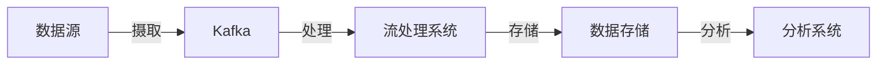

# 实战项目:基于Kafka的实时数据处理流水线

## 1. 背景介绍
在当今数据驱动的时代，实时数据处理已成为企业获取竞争优势的关键。Apache Kafka，作为一个高吞吐量、可扩展、分布式的消息系统，已经成为构建实时数据处理流水线的首选工具。它能够处理来自各种数据源的大量数据，并支持数据的实时分析和处理。

## 2. 核心概念与联系
### 2.1 Kafka基础
- **Broker**: Kafka集群中的服务器节点。
- **Topic**: 数据主题，是消息的分类名。
- **Partition**: Topic的分区，用于提高并发处理能力。
- **Producer**: 消息生产者，负责发布消息到Topic。
- **Consumer**: 消息消费者，订阅Topic并处理消息。
- **Consumer Group**: 一组Consumer，共同消费一个Topic的消息。

### 2.2 数据流水线架构
- **数据源**: 数据的起点，如数据库、日志文件等。
- **数据摄取**: 将数据源中的数据导入到Kafka。
- **数据处理**: 对流入Kafka的数据进行实时处理。
- **数据存储**: 处理后的数据存储到目标系统，如HDFS、数据库等。
- **数据分析**: 对存储的数据进行分析和可视化。

### 2.3 Kafka与其他组件的协同
- **Zookeeper**: Kafka集群的协调服务。
- **Kafka Connect**: 数据摄取和导出的框架。
- **Kafka Streams**: Kafka的流处理库。
- **KSQL**: 基于SQL的流处理引擎。

## 3. 核心算法原理具体操作步骤
### 3.1 Kafka内部算法
- **消息存储**: Kafka使用顺序写入磁盘的方式，提高了消息存储的效率。
- **消息分发**: 利用Partition和Replication机制保证消息的高可用和负载均衡。

### 3.2 数据处理流程


## 4. 数学模型和公式详细讲解举例说明
在Kafka的消息分发算法中，Partition的选择是关键。假设有 $ n $ 个Partition，消息的key为 $ k $，则Partition的选择公式为：

$$
Partition = hash(k) \mod n
$$

其中，$ hash(k) $ 是对消息key的哈希函数。

## 5. 项目实践：代码实例和详细解释说明
### 5.1 Kafka Producer示例
```java
Properties props = new Properties();
props.put("bootstrap.servers", "localhost:9092");
props.put("key.serializer", "org.apache.kafka.common.serialization.StringSerializer");
props.put("value.serializer", "org.apache.kafka.common.serialization.StringSerializer");

Producer<String, String> producer = new KafkaProducer<>(props);
producer.send(new ProducerRecord<String, String>("topic", "key", "value"));
producer.close();
```
这段代码初始化了一个Kafka生产者，并发送了一条消息到指定的Topic。

### 5.2 Kafka Consumer示例
```java
Properties props = new Properties();
props.put("bootstrap.servers", "localhost:9092");
props.put("group.id", "test");
props.put("key.deserializer", "org.apache.kafka.common.serialization.StringDeserializer");
props.put("value.deserializer", "org.apache.kafka.common.serialization.StringDeserializer");

Consumer<String, String> consumer = new KafkaConsumer<>(props);
consumer.subscribe(Arrays.asList("topic"));
while (true) {
    ConsumerRecords<String, String> records = consumer.poll(Duration.ofMillis(100));
    for (ConsumerRecord<String, String> record : records) {
        System.out.printf("offset = %d, key = %s, value = %s%n", record.offset(), record.key(), record.value());
    }
}
```
这段代码创建了一个Kafka消费者，订阅了一个Topic，并持续消费其中的消息。

## 6. 实际应用场景
Kafka在多个领域都有广泛应用，例如：
- **日志聚合**: 将分布式系统的日志集中处理。
- **事件源**: 存储和处理用户行为数据。
- **流处理**: 实时分析和处理数据流。

## 7. 工具和资源推荐
- **Apache Kafka**: https://kafka.apache.org/
- **Confluent Platform**: https://www.confluent.io/
- **Kafka Streams**: https://kafka.apache.org/documentation/streams/
- **KSQL**: https://www.confluent.io/product/ksql/

## 8. 总结：未来发展趋势与挑战
Kafka将继续在实时数据处理领域扮演重要角色。未来的发展趋势包括更强的流处理能力、更好的云服务集成和更高的安全性。同时，随着数据量的增长，如何保持高性能和可扩展性将是一个挑战。

## 9. 附录：常见问题与解答
- **Q: Kafka如何保证消息的顺序性？**
- **A**: Kafka通过Partition来保证同一个Key的消息顺序性。

- **Q: Kafka和传统消息队列的区别是什么？**
- **A**: Kafka设计用于处理高吞吐量的数据流，而传统消息队列更侧重于消息的可靠传递。

- **Q: 如何监控Kafka的性能？**
- **A**: 可以使用JMX工具或Kafka自带的监控指标。

作者：禅与计算机程序设计艺术 / Zen and the Art of Computer Programming