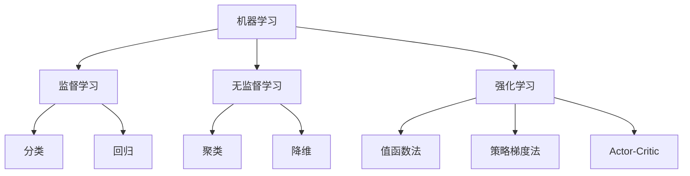

# 强化学习Reinforcement Learning与传统机器学习方法对比

## 1.背景介绍
### 1.1 人工智能的发展历程
### 1.2 机器学习的兴起 
### 1.3 强化学习的诞生

## 2.核心概念与联系
### 2.1 监督学习、无监督学习与强化学习
#### 2.1.1 监督学习
#### 2.1.2 无监督学习  
#### 2.1.3 强化学习
### 2.2 强化学习的马尔可夫决策过程
#### 2.2.1 状态空间、动作空间
#### 2.2.2 策略、价值函数
#### 2.2.3 回报函数、状态转移概率
### 2.3 强化学习与监督学习、无监督学习的区别与联系



## 3.核心算法原理具体操作步骤
### 3.1 值函数法 
#### 3.1.1 Q-Learning
#### 3.1.2 DQN
#### 3.1.3 Double DQN
### 3.2 策略梯度法
#### 3.2.1 REINFORCE 
#### 3.2.2 Actor-Critic
### 3.3 蒙特卡洛树搜索

## 4.数学模型和公式详细讲解举例说明
### 4.1 马尔可夫决策过程MDP
#### 4.1.1 MDP的数学定义
$MDP\langle S,A,P,R,\gamma \rangle$
其中，$S$表示状态空间，$A$表示动作空间，$P$表示状态转移概率，$R$表示回报函数，$\gamma$表示折扣因子。

#### 4.1.2 MDP的贝尔曼方程
$$V(s)=R(s)+\gamma \sum_{s'\in S}P(s'|s)V(s')$$
$$Q(s,a)=R(s,a)+\gamma \sum_{s'\in S}P(s'|s,a)V(s')$$

### 4.2 值函数与策略函数
#### 4.2.1 状态值函数与动作值函数
状态值函数：$V^\pi(s)=E[G_t|S_t=s]$
动作值函数：$Q^\pi(s,a)=E[G_t|S_t=s,A_t=a]$

#### 4.2.2 确定性策略与随机性策略
确定性策略：$a_t=\pi(s_t)$  
随机性策略：$\pi(a|s)=P[A_t=a|S_t=s]$

## 5.项目实践：代码实例和详细解释说明
### 5.1 基于OpenAI Gym环境的Q-Learning算法实现
```python
import numpy as np
import gym

env = gym.make('FrozenLake-v0')

Q = np.zeros([env.observation_space.n, env.action_space.n])
lr = .85
gamma = .99
episodes = 2000

for i in range(episodes):
    state = env.reset()
    done = False
    
    while not done:
        action = np.argmax(Q[state,:] + np.random.randn(1, env.action_space.n) * (1./(i+1)))
        new_state, reward, done, _ = env.step(action)
        Q[state, action] = (1-lr)*Q[state, action] + lr*(reward + gamma*np.max(Q[new_state,:]))
        state = new_state
        
print("Optimal Q-Values:", Q)
```

### 5.2 基于OpenAI Gym环境的DQN算法实现
```python
import random
import gym
import numpy as np
from collections import deque
from keras.models import Sequential
from keras.layers import Dense
from keras.optimizers import Adam

env = gym.make('CartPole-v0')
state_size = env.observation_space.shape[0]
action_size = env.action_space.n
batch_size = 32
n_episodes = 1000

class DQNAgent:
    def __init__(self, state_size, action_size):
        self.state_size = state_size
        self.action_size = action_size
        self.memory = deque(maxlen=2000)
        self.gamma = 0.95  
        self.epsilon = 1.0 
        self.epsilon_min = 0.01
        self.epsilon_decay = 0.995
        self.learning_rate = 0.001
        self.model = self._build_model()

    def _build_model(self):
        model = Sequential()
        model.add(Dense(24, input_dim=self.state_size, activation='relu'))
        model.add(Dense(24, activation='relu'))
        model.add(Dense(self.action_size, activation='linear'))
        model.compile(loss='mse', optimizer=Adam(lr=self.learning_rate))
        return model

    def remember(self, state, action, reward, next_state, done):
        self.memory.append((state, action, reward, next_state, done))

    def act(self, state):
        if np.random.rand() <= self.epsilon:
            return random.randrange(self.action_size)
        act_values = self.model.predict(state)
        return np.argmax(act_values[0])  

    def replay(self, batch_size):
        minibatch = random.sample(self.memory, batch_size)
        for state, action, reward, next_state, done in minibatch:
            target = reward
            if not done:
                target = (reward + self.gamma * np.amax(self.model.predict(next_state)[0]))
            target_f = self.model.predict(state)
            target_f[0][action] = target
            self.model.fit(state, target_f, epochs=1, verbose=0)
        if self.epsilon > self.epsilon_min:
            self.epsilon *= self.epsilon_decay

    def load(self, name):
        self.model.load_weights(name)

    def save(self, name):
        self.model.save_weights(name)

agent = DQNAgent(state_size, action_size)
done = False

for e in range(n_episodes):
    state = env.reset()
    state = np.reshape(state, [1, state_size])
    for time in range(5000):
        action = agent.act(state)
        next_state, reward, done, _ = env.step(action)
        reward = reward if not done else -10
        next_state = np.reshape(next_state, [1, state_size])
        agent.remember(state, action, reward, next_state, done)
        state = next_state
        if done:
            print("episode: {}/{}, score: {}, e: {:.2}".format(e, n_episodes, time, agent.epsilon))
            break
    if len(agent.memory) > batch_size:
        agent.replay(batch_size)

```

## 6.实际应用场景
### 6.1 游戏AI
#### 6.1.1 AlphaGo
#### 6.1.2 Atari游戏
### 6.2 机器人控制
#### 6.2.1 机器人运动规划
#### 6.2.2 机器人对抗
### 6.3 自动驾驶
#### 6.3.1 端到端学习
#### 6.3.2 决策规划

## 7.工具和资源推荐
### 7.1 开源框架
- OpenAI Baselines
- Stable Baselines
- Ray RLlib
- TensorFlow Agents
### 7.2 学习资料
- 《Reinforcement Learning: An Introduction》
- David Silver 强化学习公开课
- 莫烦 Python 强化学习教程
- 台大李宏毅教授《Deep Reinforcement Learning》课程

## 8.总结：未来发展趋势与挑战
### 8.1 基于模型的强化学习
### 8.2 分层强化学习
### 8.3 多智能体强化学习
### 8.4 强化学习的可解释性
### 8.5 强化学习的泛化能力
### 8.6 强化学习的样本效率

## 9.附录：常见问题与解答
### 9.1 强化学习和监督学习的区别是什么？
强化学习通过智能体与环境的交互来学习最优策略，而监督学习是通过标注数据来学习映射关系。强化学习面临着时序性、奖励稀疏等挑战。

### 9.2 强化学习能否结合深度学习？ 
可以，将深度神经网络作为值函数、策略函数的近似，就得到了深度强化学习(Deep Reinforcement Learning)。代表性算法有DQN、DDPG、PPO等。

### 9.3 强化学习的应用有哪些？
强化学习在游戏AI、机器人控制、自动驾驶、推荐系统等领域有广泛应用。AlphaGo就是一个成功的典型。

### 9.4 强化学习面临的挑战有哪些？
主要挑战包括：样本效率低、难以泛化、奖励稀疏、探索-利用困境等。目前强化学习的研究重点是提高样本效率和泛化能力。

### 9.5 如何选择值函数法和策略梯度法？
值函数法适合状态和动作空间都比较小的情况，策略梯度法适合连续动作空间的问题。实践中可以将两者结合起来，即Actor-Critic架构。

作者：禅与计算机程序设计艺术 / Zen and the Art of Computer Programming