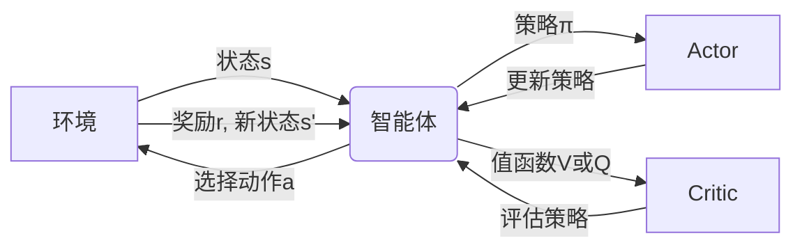

## 1. 背景介绍

强化学习是机器学习的一个重要分支，它使得智能体能够在与环境的交互中学习如何做出最优决策。在众多强化学习算法中，Actor-Critic方法因其结合了值函数和策略梯度的优点而备受关注。它不仅能够评估当前策略的好坏，还能直接在策略空间中进行搜索，从而更有效地进行学习。

## 2. 核心概念与联系

### 2.1 强化学习基础

- **智能体(Agent)**: 在环境中执行动作的实体。
- **环境(Environment)**: 智能体所处的外部世界，能够反馈状态和奖励。
- **状态(State)**: 环境的描述，智能体依据状态做出决策。
- **动作(Action)**: 智能体对环境采取的行为。
- **奖励(Reward)**: 环境对智能体动作的即时反馈。
- **策略(Policy)**: 从状态到动作的映射，决定智能体的行为模式。

### 2.2 Actor-Critic架构

- **Actor**: 负责生成策略，即在给定状态下选择动作。
- **Critic**: 评估Actor的策略，即计算状态或状态-动作对的值函数。

### 2.3 Actor-Critic交互流程



## 3. 核心算法原理具体操作步骤

1. **初始化**: 随机初始化Actor和Critic的参数。
2. **采样**: 智能体根据当前策略在环境中采样数据。
3. **评估**: Critic根据采样数据评估当前策略的值函数。
4. **优化**: Actor根据Critic的评估结果更新策略参数。
5. **迭代**: 重复步骤2-4直到策略收敛。

## 4. 数学模型和公式详细讲解举例说明

### 4.1 值函数

- **状态值函数** $V^\pi(s)$: 在策略$\pi$下，从状态$s$开始的预期回报。
- **动作值函数** $Q^\pi(s, a)$: 在策略$\pi$下，从状态$s$开始采取动作$a$的预期回报。

### 4.2 策略梯度

策略$\pi_\theta$参数化为$\theta$，策略梯度定理告诉我们如何更新参数$\theta$以提高预期回报：

$$
\nabla_\theta J(\theta) = \mathbb{E}_{\pi_\theta}[\nabla_\theta \log \pi_\theta(a|s) Q^\pi(s, a)]
$$

### 4.3 Actor-Critic更新

Actor更新策略参数$\theta$，Critic更新值函数参数$w$：

$$
\theta_{t+1} = \theta_t + \alpha \nabla_\theta \log \pi_\theta(a_t|s_t) A(s_t, a_t)
$$

$$
w_{t+1} = w_t + \beta \delta_t \nabla_w V_w(s_t)
$$

其中，$A(s_t, a_t)$是优势函数，$\delta_t$是TD误差。

## 5. 项目实践：代码实例和详细解释说明

```python
# 伪代码示例
class ActorCriticAgent:
    def __init__(self, actor_model, critic_model):
        self.actor = actor_model
        self.critic = critic_model
    
    def train(self, state, action, reward, next_state, done):
        # Critic评估当前状态的值
        value = self.critic(state)
        # Critic评估下一个状态的值
        next_value = self.critic(next_state)
        
        # 计算TD误差
        target = reward + (1 - done) * gamma * next_value
        delta = target - value
        
        # 更新Critic
        critic_loss = delta**2
        critic_loss.backward()
        update(critic_model.parameters())
        
        # 更新Actor
        log_prob = self.actor.log_prob(state, action)
        actor_loss = -log_prob * delta
        actor_loss.backward()
        update(actor_model.parameters())
```

## 6. 实际应用场景

Actor-Critic算法在多个领域都有应用，包括但不限于：

- 游戏AI
- 机器人控制
- 自然语言处理
- 股票交易

## 7. 工具和资源推荐

- **OpenAI Gym**: 提供多种环境进行强化学习实验。
- **TensorFlow Agents**: TensorFlow的强化学习库。
- **PyTorch**: 适合进行动态图计算和自动微分的深度学习框架。

## 8. 总结：未来发展趋势与挑战

Actor-Critic算法的研究和应用仍在不断进步，未来的发展趋势包括算法的稳定性和效率提升，以及在更复杂环境中的应用。挑战包括如何处理高维状态空间、如何平衡探索与利用等。

## 9. 附录：常见问题与解答

- **Q**: Actor-Critic算法与Q学习有何不同？
- **A**: Actor-Critic同时学习策略和值函数，而Q学习只学习值函数。

- **Q**: 如何选择Actor和Critic的结构？
- **A**: 通常基于问题的复杂性和数据的维度来选择，可以从简单的线性模型开始，逐渐增加复杂性。

- **Q**: Actor-Critic算法如何处理连续动作空间？
- **A**: 通过使用策略梯度方法，如确定性策略梯度(DPG)或深度确定性策略梯度(DDPG)。

作者：禅与计算机程序设计艺术 / Zen and the Art of Computer Programming