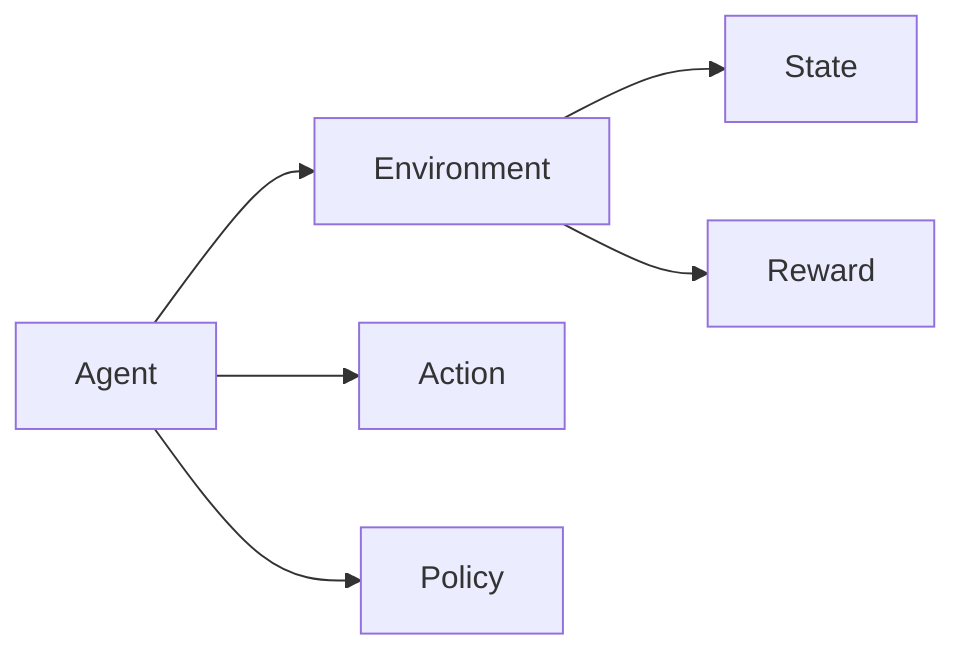
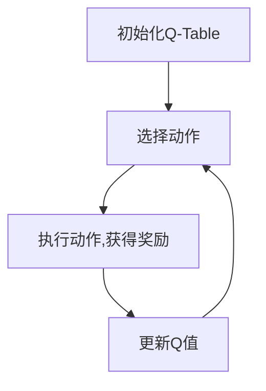

# 强化学习：在边缘计算中的应用

## 1. 背景介绍
### 1.1 边缘计算的兴起
#### 1.1.1 物联网时代的数据爆炸
#### 1.1.2 云计算面临的挑战
#### 1.1.3 边缘计算的优势

### 1.2 强化学习的发展
#### 1.2.1 强化学习的基本概念
#### 1.2.2 强化学习的发展历程  
#### 1.2.3 强化学习在各领域的应用

### 1.3 强化学习与边缘计算的结合
#### 1.3.1 边缘计算中的智能决策需求
#### 1.3.2 强化学习在边缘计算中的应用前景
#### 1.3.3 面临的挑战与机遇

## 2. 核心概念与联系
### 2.1 强化学习的核心要素
#### 2.1.1 Agent（智能体）
#### 2.1.2 Environment（环境）
#### 2.1.3 State（状态）
#### 2.1.4 Action（动作）  
#### 2.1.5 Reward（奖励）
#### 2.1.6 Policy（策略）

### 2.2 边缘计算的关键特征
#### 2.2.1 分布式计算
#### 2.2.2 低延迟
#### 2.2.3 本地数据处理
#### 2.2.4 资源受限
#### 2.2.5 异构性

### 2.3 强化学习与边缘计算的融合
#### 2.3.1 边缘节点作为强化学习的Agent
#### 2.3.2 边缘环境作为强化学习的Environment
#### 2.3.3 状态、动作与奖励的定义
#### 2.3.4 分布式强化学习在边缘计算中的应用



## 3. 核心算法原理具体操作步骤
### 3.1 Q-Learning算法
#### 3.1.1 Q-Table的构建
#### 3.1.2 状态-动作值函数的更新
#### 3.1.3 ε-greedy策略的应用
#### 3.1.4 Q-Learning在边缘计算中的应用

### 3.2 Deep Q-Network (DQN)
#### 3.2.1 神经网络作为Q函数近似
#### 3.2.2 Experience Replay机制
#### 3.2.3 Target Network的引入
#### 3.2.4 DQN在边缘计算中的应用

### 3.3 策略梯度算法 
#### 3.3.1 策略函数的参数化
#### 3.3.2 策略梯度定理
#### 3.3.3 REINFORCE算法
#### 3.3.4 Actor-Critic算法
#### 3.3.5 策略梯度算法在边缘计算中的应用



## 4. 数学模型和公式详细讲解举例说明
### 4.1 马尔可夫决策过程 (MDP)
#### 4.1.1 MDP的定义与组成
#### 4.1.2 状态转移概率与奖励函数
#### 4.1.3 最优价值函数与贝尔曼方程
#### 4.1.4 MDP在边缘计算场景中的应用

MDP可以用一个五元组 $(S,A,P,R,\gamma)$ 来表示:
- $S$ 是有限的状态集合
- $A$ 是有限的动作集合  
- $P$ 是状态转移概率矩阵, $P_{ss'}^a=P[S_{t+1}=s'|S_t=s,A_t=a]$
- $R$ 是奖励函数, $R_s^a=E[R_{t+1}|S_t=s,A_t=a]$
- $\gamma$ 是折扣因子, $\gamma \in [0,1]$

最优价值函数 $V^*(s)$ 满足贝尔曼最优方程:

$$V^*(s)=\max_a \sum_{s'} P_{ss'}^a [R_s^a + \gamma V^*(s')]$$

### 4.2 时间差分学习 (TD Learning)
#### 4.2.1 TD误差的定义
#### 4.2.2 Sarsa算法与Q-Learning算法
#### 4.2.3 TD(λ)算法
#### 4.2.4 TD Learning在边缘计算中的应用

对于Q-Learning算法, Q值的更新公式为:

$$Q(S_t,A_t) \leftarrow Q(S_t,A_t) + \alpha [R_{t+1} + \gamma \max_a Q(S_{t+1},a) - Q(S_t,A_t)]$$

其中 $\alpha$ 是学习率, $\gamma$ 是折扣因子.

### 4.3 函数近似与深度强化学习  
#### 4.3.1 函数近似的必要性
#### 4.3.2 线性函数近似
#### 4.3.3 非线性函数近似与神经网络
#### 4.3.4 深度强化学习在边缘计算中的应用

在DQN算法中, 我们使用神经网络 $Q(s,a;\theta)$ 来近似Q函数, 其中 $\theta$ 为网络参数. 网络的训练目标是最小化时序差分误差:

$$L(\theta)=E[(r+\gamma \max_{a'}Q(s',a';\theta^-)-Q(s,a;\theta))^2]$$

其中 $\theta^-$ 为目标网络的参数.

## 5. 项目实践：代码实例和详细解释说明
### 5.1 基于Q-Learning的边缘缓存管理
#### 5.1.1 问题定义与环境建模
#### 5.1.2 Q-Learning算法的实现
#### 5.1.3 仿真实验与结果分析
#### 5.1.4 代码实例与解释

```python
import numpy as np

# 初始化Q-Table
Q = np.zeros([STATE_SIZE, ACTION_SIZE])

# 训练过程
for episode in range(EPISODES):
    state = env.reset()
    done = False
    
    while not done:
        # ε-greedy策略选择动作
        if np.random.uniform(0, 1) < EPSILON:
            action = env.action_space.sample()
        else:
            action = np.argmax(Q[state, :])
        
        # 执行动作, 获得下一状态和奖励
        next_state, reward, done, _ = env.step(action)
        
        # 更新Q值
        Q[state, action] += ALPHA * (reward + GAMMA * np.max(Q[next_state, :]) - Q[state, action])
        
        state = next_state

# 测试过程
state = env.reset()
done = False

while not done:
    action = np.argmax(Q[state, :])  # 贪婪策略选择动作
    next_state, reward, done, _ = env.step(action)
    state = next_state
```

### 5.2 基于DQN的边缘计算任务卸载
#### 5.2.1 问题定义与环境建模
#### 5.2.2 DQN算法的实现
#### 5.2.3 仿真实验与结果分析 
#### 5.2.4 代码实例与解释

```python
import torch
import torch.nn as nn
import torch.optim as optim

# 定义Q网络
class DQN(nn.Module):
    def __init__(self, state_size, action_size):
        super(DQN, self).__init__()
        self.fc1 = nn.Linear(state_size, 64)
        self.fc2 = nn.Linear(64, 64)
        self.fc3 = nn.Linear(64, action_size)
        
    def forward(self, x):
        x = torch.relu(self.fc1(x))
        x = torch.relu(self.fc2(x))
        x = self.fc3(x)
        return x

# 初始化网络和优化器    
policy_net = DQN(state_size, action_size)
target_net = DQN(state_size, action_size)
target_net.load_state_dict(policy_net.state_dict())
optimizer = optim.Adam(policy_net.parameters())

# 训练过程
for episode in range(EPISODES):
    state = env.reset()
    done = False
    
    while not done:
        state_tensor = torch.FloatTensor(state).unsqueeze(0)
        q_values = policy_net(state_tensor)
        action = torch.argmax(q_values).item()
        
        next_state, reward, done, _ = env.step(action)
        
        # 存储经验到Replay Buffer
        replay_buffer.push(state, action, next_state, reward, done)
        
        # 从Replay Buffer中采样训练数据
        if len(replay_buffer) > BATCH_SIZE:
            batch = replay_buffer.sample(BATCH_SIZE)
            states, actions, next_states, rewards, dones = zip(*batch)
            
            states_tensor = torch.FloatTensor(states)
            actions_tensor = torch.LongTensor(actions).unsqueeze(1)
            next_states_tensor = torch.FloatTensor(next_states) 
            rewards_tensor = torch.FloatTensor(rewards).unsqueeze(1)
            dones_tensor = torch.FloatTensor(dones).unsqueeze(1)
            
            # 计算当前状态的Q值
            q_values = policy_net(states_tensor).gather(1, actions_tensor)
            
            # 计算下一状态的最大Q值
            next_q_values = target_net(next_states_tensor).max(1)[0].detach().unsqueeze(1)
            
            # 计算目标Q值
            target_q_values = rewards_tensor + (1 - dones_tensor) * GAMMA * next_q_values
            
            # 计算损失并更新网络
            loss = nn.MSELoss()(q_values, target_q_values)
            optimizer.zero_grad()
            loss.backward()
            optimizer.step()
        
        state = next_state
        
    # 定期更新目标网络
    if episode % TARGET_UPDATE == 0:
        target_net.load_state_dict(policy_net.state_dict())
```

### 5.3 基于Actor-Critic的边缘资源管理
#### 5.3.1 问题定义与环境建模
#### 5.3.2 Actor-Critic算法的实现  
#### 5.3.3 仿真实验与结果分析
#### 5.3.4 代码实例与解释

```python
import torch
import torch.nn as nn
import torch.optim as optim

# 定义Actor网络
class Actor(nn.Module):
    def __init__(self, state_size, action_size):
        super(Actor, self).__init__()
        self.fc1 = nn.Linear(state_size, 64)
        self.fc2 = nn.Linear(64, 64)
        self.fc3 = nn.Linear(64, action_size)
        
    def forward(self, x):
        x = torch.relu(self.fc1(x))
        x = torch.relu(self.fc2(x))
        x = torch.softmax(self.fc3(x), dim=-1)
        return x

# 定义Critic网络        
class Critic(nn.Module):
    def __init__(self, state_size):
        super(Critic, self).__init__()
        self.fc1 = nn.Linear(state_size, 64)
        self.fc2 = nn.Linear(64, 64)
        self.fc3 = nn.Linear(64, 1)
        
    def forward(self, x):
        x = torch.relu(self.fc1(x))
        x = torch.relu(self.fc2(x))
        x = self.fc3(x)
        return x

# 初始化网络和优化器        
actor = Actor(state_size, action_size)
critic = Critic(state_size)
actor_optimizer = optim.Adam(actor.parameters())  
critic_optimizer = optim.Adam(critic.parameters())

# 训练过程
for episode in range(EPISODES):
    state = env.reset()
    done = False
    
    while not done:
        state_tensor = torch.FloatTensor(state).unsqueeze(0)
        
        # Actor选择动作
        action_probs = actor(state_tensor)
        action_dist = torch.distributions.Categorical(action_probs)
        action = action_dist.sample().item()
        
        next_state, reward, done, _ = env.step(action)
        
        # Critic计算状态值
        state_value = critic(state_tensor)
        next_state_tensor = torch.FloatTensor(next_state).unsqueeze(0)
        next_state_value = critic(next_state_tensor)
        
        # 计算TD误差
        td_error = reward + GAMMA * next_state_value * (1 - done) - state_value
        
        # 更新Critic网络
        critic_loss = td_error.pow(2).mean()
        critic_optimizer.zero_grad()
        critic_loss.backward()
        critic_optimizer.step()
        
        # 更新Actor网络
        actor_loss = -action_dist.log_prob(torch.tensor(action)) * td_error.detach()
        actor_optimizer.zero_grad()
        actor_loss.backward()
        actor_optimizer.step()
        
        state = next_state
```

## 6. 实际应用场景
### 6.1 智能交通中的信号控制
#### 6.1.1 问题背景与挑战
#### 6.1.2 基于强化学习的信号控制方法
#### 6.1.3 边缘计算在智能交通中的应用
#### 6.1.4 案例分析与效果评估

### 6.2 智慧城市中的资源调度
#### 6.2.1 问题