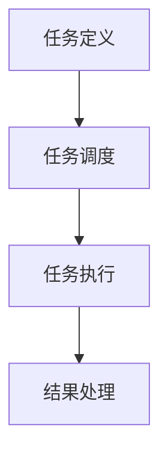

# 批处理 原理与代码实例讲解

## 1.背景介绍

批处理（Batch Processing）是一种计算机处理方式，允许系统在无人干预的情况下处理大量数据或任务。批处理的历史可以追溯到早期的计算机时代，当时计算资源有限，批处理成为了高效利用资源的主要手段。随着计算机技术的发展，批处理在现代计算环境中依然扮演着重要角色，特别是在数据处理、大规模计算和自动化任务中。

## 2.核心概念与联系

### 2.1 批处理的定义

批处理是一种将多个任务或数据集成批次处理的方式。与交互式处理不同，批处理不需要用户实时干预，通常在后台运行，适用于需要处理大量数据或执行重复性任务的场景。

### 2.2 批处理与实时处理的区别

批处理和实时处理是两种不同的处理方式。批处理适用于非实时任务，通常在预定时间或条件下执行；而实时处理则需要在任务触发时立即响应，适用于需要即时反馈的应用场景。

### 2.3 批处理的优势

- **高效利用资源**：批处理可以在系统空闲时间执行，最大化资源利用率。
- **自动化**：批处理任务可以预先定义和调度，减少人工干预。
- **可扩展性**：批处理系统可以处理大规模数据，适应不断增长的业务需求。

### 2.4 批处理的应用领域

批处理广泛应用于数据分析、报表生成、文件转换、数据库维护、科学计算等领域。它在企业级应用中尤为重要，如财务报表生成、数据仓库更新和大数据处理。

## 3.核心算法原理具体操作步骤

### 3.1 批处理的基本流程

批处理的基本流程包括任务定义、任务调度、任务执行和结果处理。以下是一个典型的批处理流程图：



### 3.2 任务定义

任务定义是批处理的第一步，涉及确定要处理的数据和任务的具体操作。任务定义通常包括以下内容：

- 数据源：要处理的数据来源，如数据库、文件系统等。
- 处理逻辑：数据处理的具体步骤和算法。
- 输出目标：处理结果的存储位置，如数据库、文件等。

### 3.3 任务调度

任务调度是批处理的核心环节，负责确定任务的执行时间和顺序。常见的调度策略包括：

- **时间驱动调度**：在预定时间执行任务，如每天凌晨2点。
- **事件驱动调度**：在特定事件发生时执行任务，如文件上传完成。
- **依赖关系调度**：根据任务之间的依赖关系确定执行顺序。

### 3.4 任务执行

任务执行是批处理的实际操作阶段，系统按照预定的处理逻辑对数据进行处理。任务执行通常在后台进行，不需要用户干预。

### 3.5 结果处理

结果处理是批处理的最后一步，涉及将处理结果存储到指定位置，并生成相应的报告或通知。结果处理可以包括数据存储、日志记录、通知发送等操作。

## 4.数学模型和公式详细讲解举例说明

### 4.1 批处理的数学模型

批处理可以用数学模型来描述，常见的模型包括队列模型和调度模型。以下是一个简单的批处理队列模型：

$$
Q(t) = \lambda t - \mu \int_0^t S(u) du
$$

其中：
- $Q(t)$ 表示时间 $t$ 时刻的队列长度。
- $\lambda$ 表示任务到达率。
- $\mu$ 表示任务处理率。
- $S(u)$ 表示时间 $u$ 时刻的服务状态。

### 4.2 任务调度的优化

任务调度的优化是批处理系统的重要研究方向，常见的优化目标包括最小化总执行时间、最大化资源利用率和最小化任务等待时间。以下是一个简单的调度优化公式：

$$
\min \sum_{i=1}^n C_i
$$

其中：
- $C_i$ 表示第 $i$ 个任务的完成时间。
- $n$ 表示任务总数。

### 4.3 举例说明

假设有三个任务 $T_1, T_2, T_3$，其到达时间和处理时间如下表所示：

| 任务 | 到达时间 | 处理时间 |
|------|----------|----------|
| $T_1$ | 0        | 3        |
| $T_2$ | 2        | 6        |
| $T_3$ | 4        | 4        |

我们可以使用最短处理时间优先（Shortest Job First, SJF）调度算法来优化任务调度。调度结果如下：

- $T_1$ 在时间 0 开始执行，时间 3 完成。
- $T_3$ 在时间 3 开始执行，时间 7 完成。
- $T_2$ 在时间 7 开始执行，时间 13 完成。

总完成时间为 $3 + 7 + 13 = 23$。

## 5.项目实践：代码实例和详细解释说明

### 5.1 项目背景

假设我们需要处理一个大型日志文件，将其按日期分割并生成每日的访问统计报告。我们将使用 Python 编写一个简单的批处理程序来实现这一任务。

### 5.2 代码实例

以下是一个简单的 Python 批处理程序示例：

```python
import os
import datetime
from collections import defaultdict

# 定义日志文件路径
log_file_path = 'access.log'

# 定义输出目录
output_dir = 'reports'

# 创建输出目录
if not os.path.exists(output_dir):
    os.makedirs(output_dir)

# 读取日志文件
with open(log_file_path, 'r') as log_file:
    logs = log_file.readlines()

# 按日期分割日志
logs_by_date = defaultdict(list)
for log in logs:
    date_str = log.split()[0]
    date = datetime.datetime.strptime(date_str, '%Y-%m-%d').date()
    logs_by_date[date].append(log)

# 生成每日访问统计报告
for date, logs in logs_by_date.items():
    report_file_path = os.path.join(output_dir, f'{date}.txt')
    with open(report_file_path, 'w') as report_file:
        report_file.write(f'访问日期: {date}\n')
        report_file.write(f'访问次数: {len(logs)}\n')
        report_file.write('\n'.join(logs))

print('批处理任务完成！')
```

### 5.3 详细解释

- **日志文件路径**：定义要处理的日志文件路径。
- **输出目录**：定义生成报告的输出目录，并创建该